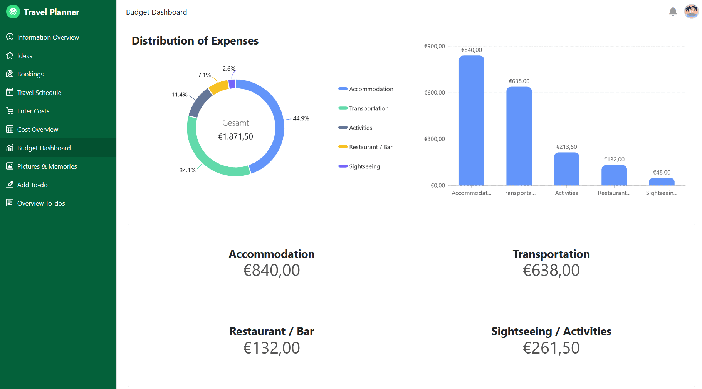

The summer vacations are just around the corner and for many vacationers that means it's time to pack their **suitcases**! But when exactly is the right time to pack your suitcase? Are you one of those people who quickly gather everything together the night before departure and throw it into the next best travel bag? Or do you prefer to plan weeks in advance what will make it onto your **vacation checklist**?

This article gives you a comprehensive insight into what you need for your next vacation trip and how best to organize it without forgetting essentials. Whether you are a last-minute booker or a forward planner, here you will find a detailed checklist for your vacation and valuable tips to prepare your trip efficiently and stress-free.

Find out about the climate of your destination so that you can prepare accordingly.

## The right time to pack your suitcase

Who hasn't experienced this? Shortly before departure, there's a hectic rush because packing has once again been put off until the last minute. At times like this, you wish you had started earlier. To avoid this chaos, you should start **two weeks** in advance with a detailed checklist for your vacation.

A travel checklist like this allows you to plan and add everything you need at your leisure. Things that don't come to mind immediately can be done in good time and there is enough time to get any missing items. This structured approach reduces stress and ensures that you don't forget anything important.

Ideally, you should only pack your suitcase **two to three days** before departure. This way, you can take the current weather forecast into account and adjust your clothing accordingly. On **the day of departure**, all that's left to do is pack the things you'll need until the end, such as your cell phone charging cable or toothbrush.

A packing list provides a structured approach to packing.

## The benefits of a well-thought-out checklist for your vacation

If you take the time to create a detailed vacation checklist before your trip, you can benefit from numerous advantages. Especially if you are one of those people who like to pack their suitcases at the last minute, the biggest advantage of such a checklist for your trip is a **stress-free** start to your vacation.

A well-organized vacation checklist not only helps you to avoid unnecessary stress, but also ensures that you **forget fewer essential items**. By packing early and in a targeted manner, you can also **save** valuable **time** and make your travel preparations **more efficient**.

Even for those who like to plan in advance and already use a travel checklist, there is always room for improvement. Careful travel preparation is essential for a stress-free and relaxing vacation. By regularly updating and **optimizing** your travel checklist, you can ensure that you think of everything and can enjoy your trip carefree.

Vacations should be a relaxing and enjoyable experience, and good preparation helps to minimize stress.

## What you should not forget on your vacation checklist

Thorough preparation for your vacation involves more than just the vacation checklist. Here are some important steps you should take in advance to make your trip smooth and relaxed:

- **Travel documents and visa:** You will need a valid passport and possibly a visa to travel to distant countries. Check the validity of your passport in good time and find out about the visa requirements for your destination.
- **Vaccinations and health:** If you are planning an adventure vacation in exotic regions, you should check your vaccination record in good time and have any necessary vaccinations against diseases that are rare in Europe updated. Find out about recommended or mandatory vaccinations for your destination.
- **Foreign travel insurance:** Travel insurance is essential to be covered in the event of illness or other emergencies. Compare different offers and choose an insurance policy that meets your needs.

Travel insurance that covers medical care abroad and trip interruption for health reasons is important.

### Clarify this on the checklist as your vacation approaches

- **Finances and currency:** When traveling to countries with foreign currency, you should clarify in advance whether you can pay by credit card locally or whether you need cash. Research the exchange rates so that you can estimate the local prices and, if necessary, order cash from your bank so that you are well prepared.
- **Entry regulations and security:** Find out about the entry regulations and any security risks in your destination country from the [Federal Foreign Office](https://www.auswaertiges-amt.de/de). It is important to know all the necessary information in order to avoid bad experiences.
- **Local laws and driving license:** Check whether you need an international driving license in your destination country and familiarize yourself with the local laws. Some countries have stricter regulations (e.g. rules of conduct in public places) that you must observe.
- **Travel preparations on site:** Little things like booking a parking space at the airport or ensuring mobile accessibility abroad can have a significant impact on your vacation mood. Make sure that everything is well organized.

Decide how you will get around (rental car, public transport, etc.) and book in advance if necessary.

### Final preparations on the day of departure

The day of departure has finally arrived and you are ready to go on vacation with your suitcases packed. Now there are still a few things you should do to avoid any unpleasant surprises after your vacation.

- Empty the refrigerator, dishwasher and garbage to prevent mold growth and unpleasant odors.
- Check that all windows and doors are securely locked.
- Switch off the water, heating, lamps and electrical appliances.
- Make sure that important documents and valuables are stowed away.
- Inform a trusted person (e.g. neighbors, friends) of your absence and give them a key so that they can check on you in an emergency. If previously agreed, this person can also water your plants or feed small animals.

## Must-haves that belong on your vacation checklist

Imagine your long-awaited vacation is just around the corner and you have a perfectly prepared checklist for your trip. No panic, no forgotten things - just anticipation of a relaxed travel adventure. Here are the essential items that should not be missing from this vacation packing list:

### Documents

Spacer

- Passport
- Identity card
- Driver's license
- Vaccination certificate
- Visa

Spacer

- Health insurance card
- International health insurance
- Credit/EC card and cash
- Flight tickets
- Hotel/rental car documents

You can copy important documents before your vacation so that you are covered in case something gets lost.

### Clothing

Spacer

- Sweater
- Jacket
- Pants
- T-shirts
- Depending on your vacation, swimwear, ski clothing, etc.

Spacer

- Caps/Caps
- Pyjamas
- Socks and underwear
- Shoes
- Dresses/skirts

Check what the weather will be like at your destination before you travel.

### Hygiene

Spacer

- Hairbrush or comb
- Deodorant
- Shampoo and shower gel
- Shaver
- Toothbrush and toothpaste

Spacer

- Make-up utensils
- Feminine hygiene articles
- Contraceptives
- Disinfectant
- Towels

Find out in advance whether towels and other toiletries are included to save space.

### Drug

Spacer

- Painkillers
- Diarrhea medication
- Fever reducer
- Travel tablets
- Sun cream

Spacer

- (Blister) plaster
- Mosquito repellent
- Tick card
- Personal medication

To be prepared for anything on vacation, you should think about a small first-aid kit.

### Electronics

Spacer

- Cell phone
- Headphones
- Laptop

Spacer

- Charging cable
- Camera

Make sure you store electronic devices safely so that nothing can break.

### Miscellaneous

Spacer

- key
- Sleep mask
- Earplugs

Spacer

- (Sunglasses) glasses or contact lenses
- Travel provisions
- Book

You can make long flights more comfortable with sleep masks and earplugs.

## Adapt the checklist to your vacation

As every trip has different requirements, it is important that your checklist can be flexibly adapted to your vacation. On a **summer vacation**, you will need light clothing, sun protection and swimwear, while warm clothing and snow gear are important on **a winter vacation**. The type of accommodation also influences the packing list: Fewer basics are needed in **hotels**, while basic food and kitchen utensils are useful in **vacation apartments**.

The type of vacation also plays a decisive role. For a **city break**, comfortable shoes and a practical rucksack for **day trips** are essential, while a **wellness vacation** requires relaxed clothing and swimwear for the spa area. Adventure travelers should also include outdoor equipment on their vacation checklist.

A flexible checklist for your vacation also allows you to react to last-minute changes. Unpredictable changes in the weather or spontaneous changes in plans are easier to deal with if you are well organized in advance and don't become unnecessarily stressed.

Whether beach utensils or winter sports equipment - you need different things depending on your vacation.

## The best tips for packing your suitcase

If your checklist for your vacation is extensive, it can be a challenge to fit everything in - especially if you are flying and the size of your suitcase is limited or additional pieces of luggage are expensive. But don't worry: with the right tips and tricks, you can pack your suitcase efficiently and save space. Here are some tried and tested strategies to help you optimize your packing:

- **Pack strategically:** Place heavy items such as shoes and toiletry bags at the bottom of the suitcase and lighter, crease-prone clothing on top. Use the space in the shoes for smaller items such as socks or chargers.
- **Use packing cubes:** These small, lightweight bags help organize your clothes and accessories and make the most of the space in your suitcase.
- **Rolling instead of folding:** Rolling clothes not only saves space, but also reduces creases so your clothes stay smooth.
- **Prepare for the way back:** Also think about the way back and leave some space for souvenirs and other things you buy during your vacation.
- **Keep essentials to hand:** Keep important documents, charging cables and a small first aid kit in an easily accessible compartment. This means you have everything you need to hand immediately.

Use travel sizes for toiletries to save space and comply with fluid restrictions on flights.

## Conclusion: Relaxed on vacation with your checklist

Whether you were a last-minute packer in the past or a forward-thinking planner - in future you can start your vacation without unnecessary stress and with all the essentials in your luggage. SeaTable's [free template]() will save you valuable time and make your travel preparations for your upcoming vacation efficient and stress-free.

In the template you will not only find a flexibly customizable vacation checklist with all to-dos, but also other useful functions: Collect all the ideas and places you want to visit, create a clear schedule and visualize all the locations of your planned activities on a map. You can also capture all the wonderful memories during your trip, add photos and note where and when these special moments took place.

An app is also available to simplify travel planning. You can use it to enter ideas, costs and to-dos via form pages, the information for which is then automatically saved in the corresponding tables. Your entire vacation planning can be called up in clear tables, which you can group and sort as you wish. Clear statistics, such as in the budget dashboard, also make it easier for you to keep track:

[Register]() for free today to benefit from these practical functions and organize your next trip stress-free. You can then use the [template]() in your personal SeaTable workspace, fill it with your own data and share it with your fellow travelers via the app.
