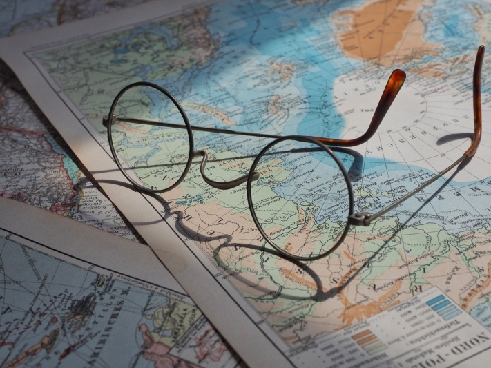
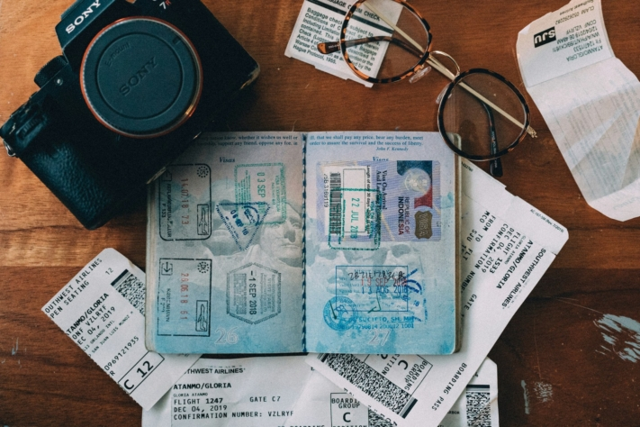
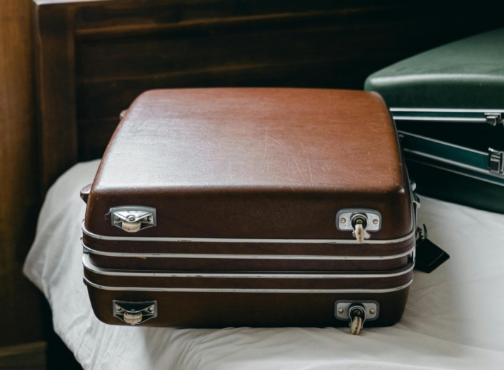
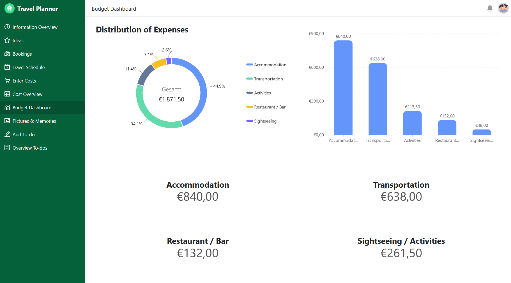

Las vacaciones de verano están a la vuelta de la esquina y, para muchos veraneantes, eso significa que ha llegado el momento de hacer las **maletas**. Pero, ¿cuándo es exactamente el momento de hacer la maleta? ¿Es usted una de esas personas que reúnen todo rápidamente la noche antes de partir y lo meten en la mejor bolsa de viaje? ¿O prefiere planificar con semanas de antelación lo que incluirá en su **lista de vacaciones**?

Este artículo le ofrece una visión completa de lo que necesita para su próximo viaje de vacaciones y la mejor manera de organizarlo sin olvidar lo esencial. Tanto si es de los que reservan en el último minuto como de los que planifican con antelación, aquí encontrará una lista de comprobación detallada para sus vacaciones y valiosos consejos para preparar su viaje de forma eficaz y sin estrés.

Infórmese sobre el clima de su destino para prepararse en consecuencia.

## El momento de hacer la maleta

¿A quién no le ha pasado alguna vez? Poco antes de partir, el ajetreo se apodera de uno porque, una vez más, se ha dejado la maleta para el último momento. En momentos así, uno desearía haber empezado antes. Para evitar este caos, debería empezar **dos semanas** antes con una lista de comprobación detallada de sus vacaciones.

Una lista de viaje como ésta le permite planificar y añadir todo lo que necesita con tranquilidad. Las cosas que no le vengan a la mente de inmediato puede hacerlas con tiempo suficiente para comprar lo que le falte. Este enfoque estructurado reduce el estrés y garantiza que no se olvide nada importante.

Lo ideal es hacer la maleta sólo **dos o tres días** antes del viaje. Así podrá tener en cuenta las previsiones meteorológicas del momento y ajustar su ropa en consecuencia. El día **de la salida**, sólo queda meter en la maleta las cosas que necesitará hasta el final, como el cable de carga del móvil o el cepillo de dientes.

Una lista de equipaje proporciona un enfoque estructurado del mismo.

## Las ventajas de una lista de control bien pensada para sus vacaciones

Si se toma el tiempo necesario para crear una lista de comprobación detallada de las vacaciones antes de su viaje, podrá beneficiarse de numerosas ventajas. Sobre todo si eres de esas personas a las que les gusta hacer las maletas en el último momento, la mayor ventaja de esa lista de comprobación para tu viaje es un comienzo de vacaciones **sin estrés**.

Una lista de comprobación de las vacaciones bien organizada no sólo le ayuda a evitar el estrés innecesario, sino que también garantiza que **olvide menos artículos esenciales**. Si hace la maleta con antelación, **ahorrará un tiempo** valioso y los preparativos de las vacaciones serán más **eficaces**.

Incluso para aquellos a los que les gusta planificar con antelación y ya utilizan una lista de viaje, siempre hay margen de mejora. Una preparación cuidadosa del viaje es esencial para disfrutar de unas vacaciones relajadas y sin estrés. Si actualiza y **optimiza** periódicamente su lista de viaje, se asegurará de tenerlo todo en cuenta y podrá disfrutar de su viaje sin preocupaciones.

Las vacaciones deben ser una experiencia relajante y agradable, y una buena preparación ayuda a minimizar el estrés.

## Lo que no debe olvidar en su lista de vacaciones

Preparar las vacaciones a conciencia implica algo más que una lista de comprobación. He aquí algunos pasos importantes que debe dar de antemano para que su viaje sea tranquilo y relajado:

- **Documentos de viaje y visado:** Necesitarás un pasaporte válido y posiblemente un visado para viajar a países lejanos. Comprueba con tiempo la validez de tu pasaporte e infórmate de los requisitos de visado para tu destino.
- **Vacunas y salud:** Si está planeando unas vacaciones de aventura en regiones exóticas, debe comprobar con tiempo su cartilla de vacunación y tener al día las vacunas necesarias contra enfermedades poco frecuentes en Europa. Infórmese sobre las vacunas recomendadas u obligatorias en su destino.
- **Seguro de viaje internacional:** El seguro de viaje es esencial para estar cubierto en caso de enfermedad u otras emergencias. Compara distintas ofertas y elige un seguro que se adapte a tus necesidades.

Es importante tener un seguro de viaje que cubra la asistencia médica en el extranjero y las cancelaciones de viaje por motivos de salud.

### Aclárelo en la lista de comprobación a medida que se acerquen sus vacaciones

- **Finanzas y moneda:** Cuando viajes a países con moneda extranjera, debes aclarar de antemano si puedes pagar con tarjeta de crédito o necesitas efectivo. Investiga los tipos de cambio para poder estimar los precios locales y, si es necesario, pide efectivo a tu banco para estar bien preparado.
- **Requisitos de entrada y seguridad:** Infórmese en el Ministerio [Federal de Asuntos](https://www.auswaertiges-amt.de/de) Exteriores sobre las normas de entrada y los posibles riesgos de seguridad en su país de destino. Es importante conocer toda la información necesaria para evitar malas experiencias.
- **Legislación local y permiso de conducir:** Comprueba si necesitas un permiso de conducir internacional en el país de destino y familiarízate con la legislación local. Algunos países tienen normativas más estrictas (por ejemplo, normas de comportamiento en lugares públicos) que debes respetar.
- **Preparativos de viaje in situ:** Pequeños detalles, como reservar una plaza de aparcamiento en el aeropuerto o garantizar la accesibilidad del móvil en el extranjero, pueden influir mucho en el estado de ánimo durante las vacaciones. Asegúrate de que todo está bien organizado.

Decida cómo va a desplazarse (coche de alquiler, transporte público, etc.) y reserve con antelación si es necesario.

### Últimos preparativos el día de la salida

Por fin ha llegado el día de partir y ya está listo para sus vacaciones con las maletas hechas. Ahora bien, aún quedan algunas cosas por hacer para evitar sorpresas desagradables después de las vacaciones.

- Vacía el frigorífico, el lavavajillas y la basura para evitar la aparición de moho y malos olores.
- Comprueba que todas las ventanas y puertas estén bien cerradas.
- Desconecta el agua, la calefacción, las lámparas y los aparatos eléctricos.
- Asegúrate de que los documentos importantes y los objetos de valor están bien guardados.
- Informa de tu ausencia a una persona de confianza (por ejemplo, vecinos, amigos) y dale una llave para que pueda comprobar las instalaciones en caso de emergencia. Si se ha acordado previamente, esta persona también puede regar tus plantas o dar de comer a los animales pequeños.

## Imprescindibles en su lista de vacaciones

Imagine que sus esperadas vacaciones están a la vuelta de la esquina y que tiene una lista de comprobación perfectamente preparada para su viaje. Nada de pánico, nada de cosas olvidadas: sólo la anticipación de una relajada aventura viajera. He aquí los artículos esenciales que no deben faltar en la lista de equipaje para las vacaciones:

### Documentos

Espaciador

- Pasaporte
- Documento de identidad
- Permiso de conducir
- Certificado de vacunación
- Visa

Espaciador

- Tarjeta sanitaria
- Seguro médico internacional
- Tarjeta de crédito/CE y efectivo
- Billetes de avión
- Documentos de hotel/alquiler de coches

Puede copiar los documentos importantes antes de sus vacaciones para estar cubierto en caso de que se pierda algo.

### Ropa

Espaciador

- Puente
- Chaqueta
- Pantalones
- Camisetas
- En función de sus vacaciones, bañadores, ropa de esquí, etc.

Espaciador

- Tapas
- Pijama
- Calcetines y ropa interior
- Zapatos
- Vestidos/faldas

Compruebe el tiempo que hará en su destino antes de viajar.

### Higiene

Espaciador

- Cepillo o peine
- Desodorante
- Champú y gel de ducha
- Afeitadora
- Cepillo y pasta de dientes

Espaciador

- Utensilios de maquillaje
- Productos de higiene femenina
- Anticonceptivos
- Desinfectante
- Toallas

Averigua con antelación si se incluyen toallas y otros artículos de aseo para ahorrar espacio.

### Medicamento

Espaciador

- Analgésicos
- Medicamentos contra la diarrea
- Reductor de la fiebre
- Tabletas de viaje
- Crema solar

Espaciador

- Tiritas (para ampollas)
- Repelente de mosquitos
- Tarjeta Tick
- Medicación personal

Para estar preparado para cualquier cosa en vacaciones, deberías pensar en un pequeño botiquín de primeros auxilios.

### Electrónica

Espaciador

- Teléfono móvil
- Auriculares
- Portátil

Espaciador

- Cable de carga
- Cámara

Asegúrate de guardar los dispositivos electrónicos de forma segura para que no se rompa nada.

### Varios

Espaciador

- clave
- Antifaz para dormir
- Tapones para los oídos

Espaciador

- (Gafas de sol) gafas o lentillas
- Disposiciones de viaje
- Reserve

Puede hacer más cómodos los vuelos largos con antifaces y tapones para los oídos.

## Adapte la lista de comprobación a sus vacaciones

Como cada viaje tiene requisitos diferentes, es importante que su lista de comprobación pueda adaptarse con flexibilidad a sus vacaciones. En unas vacaciones de **verano** necesitará ropa ligera, protección solar y bañador, mientras que en **unas vacaciones de invierno** son importantes la ropa de abrigo y el equipo para la nieve. El tipo de alojamiento también influye en la lista: En los **hoteles** se necesitan menos cosas básicas, mientras que en **los pisos de** vacaciones son útiles los alimentos básicos y los utensilios de cocina.

El tipo de vacaciones también juega un papel decisivo. Un calzado cómodo y una mochila práctica para las **excursiones de un día** son esenciales para una **escapada urbana**, mientras que unas **vacaciones de bienestar** requieren ropa relajada y bañadores para la zona de spa. Los aventureros también deben incluir el equipamiento para actividades al aire libre en su lista de vacaciones.

Una lista flexible para sus vacaciones también le permite reaccionar ante cambios de última hora. Los cambios imprevisibles del tiempo o los cambios espontáneos de planes son más fáciles de afrontar si se organiza bien de antemano y no se estresa innecesariamente.

Ya sean utensilios de playa o equipamiento para deportes de invierno, según las vacaciones necesitarás cosas distintas.

## Los mejores consejos para hacer la maleta

Si su lista de vacaciones es extensa, puede ser un reto meterlo todo, sobre todo si viaja en avión y el tamaño de su maleta es limitado o las piezas de equipaje adicionales son caras. Pero no se preocupe: con los consejos y trucos adecuados, puede hacer la maleta de forma eficiente y ahorrar espacio. He aquí algunas estrategias de eficacia probada que le ayudarán a optimizar su equipaje:

- **Empaque estratégicamente:** Coloque los artículos pesados, como zapatos y neceseres, en el fondo de la maleta, y la ropa más ligera y propensa a arrugarse, en la parte superior. Utiliza el espacio de los zapatos para objetos más pequeños, como calcetines o cargadores.
- **Utiliza cubos de embalaje:** Estas bolsas pequeñas y ligeras te ayudan a organizar la ropa y los accesorios y a aprovechar al máximo el espacio de la maleta.
- **Enrollar en lugar de doblar:** Enrollar la ropa no solo ahorra espacio, sino que también reduce las arrugas para que la ropa quede lisa.
- **Prepara el viaje de vuelta:** Piensa también en el camino de vuelta y deja algo de espacio para los recuerdos y otras cosas que compres durante las vacaciones.
- **Tenga lo esencial a mano:** Guarda documentos importantes, cables de carga y un pequeño botiquín de primeros auxilios en un compartimento de fácil acceso. Así tendrás todo lo que necesitas a mano de inmediato.

Utilice tamaños de viaje para los artículos de aseo, para ahorrar espacio y cumplir con las restricciones de líquidos en los vuelos.

## Conclusión: Relájese en vacaciones con su lista de control

Tanto si en el pasado era usted de los que hacían la maleta en el último momento como de los que planifican con visión de futuro, en el futuro podrá empezar sus vacaciones sin estrés innecesario y con todo lo esencial en su equipaje. La [plantilla gratuita]() de SeaTable le ahorrará un tiempo valioso y hará que los preparativos de sus próximas vacaciones sean eficientes y sin estrés.

En la plantilla no sólo encontrará una lista de comprobación de vacaciones personalizable de forma flexible con todas las tareas pendientes, sino también otras funciones útiles: Recopile todas las ideas y lugares que desea visitar, cree un calendario claro y visualice en un mapa todos los lugares de las actividades previstas. También puede capturar todos los recuerdos maravillosos durante su viaje, añadir fotos y anotar dónde y cuándo tuvieron lugar esos momentos especiales.

También hay disponible una aplicación para simplificar la planificación del viaje. Con ella puedes introducir ideas, costes y tareas pendientes a través de páginas de formularios, cuya información se guarda automáticamente en las tablas correspondientes. Toda la planificación de sus vacaciones puede consultarse en tablas claras, que puede agrupar y ordenar como desee. Las estadísticas claras, como las del panel de presupuesto, también te facilitan la visión de conjunto:

[Regístrese]() gratis hoy mismo para beneficiarse de estas prácticas funciones y organizar su próximo viaje sin estrés. Después podrás utilizar la [plantilla]() en tu espacio de trabajo personal de SeaTable, rellenarla con tus propios datos y compartirla con tus compañeros de viaje a través de la app.
