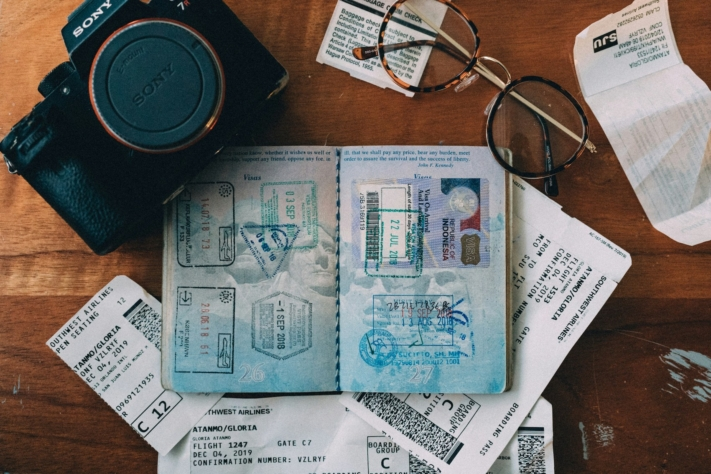
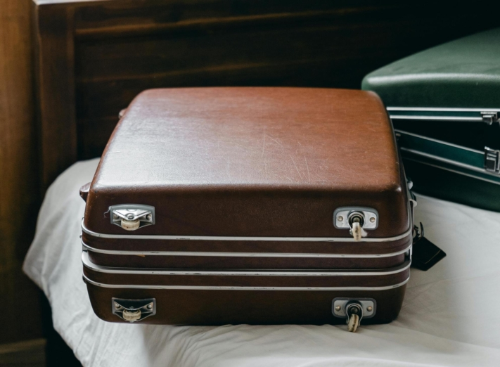

Les vacances d'été approchent et pour de nombreux vacanciers, cela signifie qu'il est temps de **faire ses valises**! Mais quel est exactement le bon moment pour faire sa valise ? Faites-vous partie de ceux qui, la nuit précédant le départ, rassemblent rapidement tout ce qu'il faut et le jettent dans le premier sac de voyage venu ? Ou préférez-vous planifier des semaines à l'avance ce qui doit figurer sur votre **check-list pour les vacances**?

Cet article vous donne un aperçu complet de ce dont vous avez besoin pour votre prochain voyage de vacances et vous explique comment l'organiser au mieux sans oublier les choses essentielles. Que vous soyez un voyageur de dernière minute ou un planificateur prévoyant, vous trouverez ici une check-list détaillée pour vos vacances et de précieux conseils pour préparer votre voyage efficacement et sans stress.

Renseignez-vous sur le climat de votre destination afin de vous préparer en conséquence.

## Le bon moment pour faire ses valises

Qui n'a jamais connu ça ? Juste avant le départ, c'est l'effervescence parce que les valises ont été une fois de plus repoussées à la dernière minute. Dans ces moments-là, on regrette de ne pas avoir commencé plus tôt. Pour éviter ce chaos, il faut commencer **deux semaines** à l'avance avec une check-list détaillée pour les vacances.

Une telle check-list pour les voyages vous permet de planifier et de compléter tout ce qui est nécessaire en toute tranquillité. Vous pouvez faire à temps les choses qui ne vous viennent pas immédiatement à l'esprit et il vous reste suffisamment de temps pour vous procurer les articles manquants. Cette approche structurée réduit le stress et vous permet de ne rien oublier d'important.

Dans l'idéal, la préparation des valises proprement dite ne devrait avoir lieu que **deux ou trois jours** avant le départ. De cette manière, vous pouvez tenir compte des prévisions météorologiques actuelles et adapter vos vêtements en conséquence. Le **jour du départ**, il ne vous restera plus qu'à emballer les objets dont vous aurez besoin jusqu'au bout, comme le câble de recharge de votre téléphone portable ou votre brosse à dents.

Une liste de colisage permet de structurer la procédure d'emballage.

## Les avantages d'une check-list bien conçue pour vos vacances

Si vous prenez le temps d'établir une check-list détaillée de vos vacances avant de partir, vous pourrez bénéficier de nombreux avantages. Surtout si vous faites partie de ceux qui aiment faire leurs valises à la dernière minute, le plus grand avantage d'une telle check-list pour votre voyage est de commencer vos vacances **sans stress**.

Une check-list de vacances bien organisée vous permet non seulement d'éviter toute agitation inutile, mais aussi d'**oublier moins de choses essentielles**. En faisant vos bagages à l'avance et de manière ciblée, vous pouvez en outre **gagner un temps** précieux et organiser **plus efficacement** vos préparatifs de voyage.

Même pour ceux qui aiment planifier à l'avance et qui utilisent déjà une check-list pour les voyages, il y a toujours une marge d'amélioration. Une préparation minutieuse du voyage est essentielle pour des vacances reposantes et sans stress. En mettant régulièrement à jour et **en optimisant** votre check-list de voyage, vous pouvez être sûr de penser à tout et de profiter de votre voyage sans souci.

Les vacances doivent être une expérience relaxante et agréable, et une bonne préparation permet de minimiser le stress.

## Ce que vous ne devez pas oublier dans la check-list de vos vacances

Une préparation minutieuse de vos vacances implique bien plus qu'une simple check-list de vacances. Voici quelques étapes importantes à réaliser à l'avance pour que votre voyage se déroule en douceur et en toute sérénité :

- **Documents de voyage et visa :** Pour voyager dans des pays lointains, vous avez besoin d'un passeport en cours de validité et éventuellement d'un visa. Vérifiez à temps la validité de votre passeport et renseignez-vous sur les conditions de visa de votre destination.
- **Vaccins et santé :** Si vous prévoyez des vacances d'aventure dans des régions exotiques, vérifiez votre carnet de vaccination à l'avance et faites mettre à jour les vaccins nécessaires contre les maladies rares en Europe. Renseignez-vous sur les vaccins recommandés ou obligatoires pour votre destination.
- **Assurance à l'étranger :** Une assurance voyage est indispensable pour être couvert en cas de maladie ou d'autres urgences. Comparez différentes offres et choisissez une assurance qui correspond à vos besoins.

Il est important d'avoir une assurance voyage qui couvre les soins médicaux à l'étranger et les interruptions de voyage pour des raisons de santé.

### Clarifiez-le sur la check-list à l'approche de vos vacances

- **Finances et monnaie :** Lorsque vous voyagez dans des pays où la monnaie est étrangère, vérifiez à l'avance si vous pouvez payer par carte de crédit ou si vous avez besoin d'argent liquide sur place. Faites des recherches sur les taux de change afin de pouvoir estimer les prix sur place et, le cas échéant, commandez de l'argent liquide auprès de votre banque afin d'être bien préparé.
- **Conditions d'entrée et sécurité :** Renseignez-vous auprès du [ministère des Affaires étrangères](https://www.auswaertiges-amt.de/de) sur les conditions d'entrée et les éventuels risques pour la sécurité dans votre pays de destination. Il est important de connaître toutes les informations nécessaires afin d'éviter les mauvaises expériences.
- **Lois locales et permis de conduire :** Vérifiez si vous avez besoin d'un permis de conduire international dans votre pays de destination et familiarisez-vous avec les lois locales. Certains pays ont des réglementations plus strictes (par exemple, les règles de conduite dans les lieux publics) que vous devez respecter.
- **Préparer son voyage sur place :** Des détails comme la réservation d'une place de parking à l'aéroport ou la garantie d'être joignable en mobile à l'étranger peuvent avoir une influence considérable sur votre humeur de vacances. Veillez à ce que tout soit bien organisé.

Décidez comment vous allez vous déplacer (location de voiture, transports en commun, etc.) et réservez à l'avance si nécessaire.

### Derniers préparatifs le jour du départ

Le jour du départ est enfin arrivé et vous êtes prêt à partir, les valises faites, prêt à partir en vacances. Il vous reste maintenant quelques détails à régler pour ne pas avoir de mauvaises surprises après les vacances.

- Videz le réfrigérateur, le lave-vaisselle et la poubelle afin d'éviter la formation de moisissures et d'odeurs désagréables.
- Vérifier que toutes les fenêtres et portes sont bien fermées.
- Éteignez l'eau, le chauffage, les lampes et les appareils électriques.
- Assurez-vous que les documents importants et les objets de valeur sont bien rangés.
- Informez une personne de confiance (par exemple un voisin ou un ami) de votre absence et donnez-lui une clé pour qu'elle puisse se rendre sur place en cas d'urgence. Si vous en avez convenu au préalable, cette personne peut également arroser vos plantes ou nourrir vos petits animaux.

## Les incontournables à ajouter à votre check-list de vacances

Imaginez que les vacances tant attendues approchent et que vous ayez à portée de main une check-list parfaitement préparée pour votre voyage. Pas de panique, pas de choses oubliées - seulement l'anticipation d'une aventure de voyage détendue. Voici les points essentiels qui ne doivent pas manquer sur cette liste de bagages de vacances :

### Documents

Entretoise

- Passeport
- Carte d'identité
- Permis de conduire
- Carnet de vaccination
- Visa

Entretoise

- Carte d'assurance maladie
- Assurance maladie à l'étranger
- Carte de crédit/débit et argent liquide
- Billets d'avion
- Dossier d'hôtel/de location de voiture

Vous pouvez photocopier les documents importants avant de partir en vacances afin d'être couvert en cas de perte.

### Vêtements

Entretoise

- Pull-over
- Veste
- Pantalons
- T-shirts
- Selon les vacances, maillots de bain, vêtements de ski, etc.

Entretoise

- Casquettes/bonnets
- Pyjama
- Chaussettes et sous-vêtements
- Chaussures
- Robes/jupes

Avant de partir, vérifiez le temps qu'il fera sur votre lieu de voyage.

### Hygiène

Entretoise

- Brosse à cheveux ou peigne
- Déodorant
- Shampoing et gel douche
- Rasoir
- Brosse à dents et dentifrice

Entretoise

- Matériel de maquillage
- Articles d'hygiène féminine
- Contraceptifs
- Désinfectant
- Serviettes de bain

Renseignez-vous à l'avance pour savoir si les serviettes et autres articles de toilette sont inclus afin de gagner de la place.

### Médicament

Entretoise

- Antidouleurs
- Médicaments contre la diarrhée
- Antipyrétique
- Comprimés de voyage
- Crème solaire

Entretoise

- Pansements (pour ampoules)
- Anti-moustiques
- Carte à tiques
- Médicaments personnels

Pour être paré à toute éventualité en vacances, pensez à une petite pharmacie de voyage.

### Électronique

Entretoise

- Téléphone portable
- Casque d'écoute
- Ordinateur portable

Entretoise

- Câble de recharge
- Caméra

Veillez à ranger les appareils électroniques de manière sûre, de sorte que rien ne puisse se casser.

### Autres

Entretoise

- Clé
- Masque de sommeil
- Bouchons d'oreilles

Entretoise

- lunettes (de soleil) ou lentilles de contact
- Provisions de voyage
- Livre

Les longs voyages en avion peuvent être rendus plus agréables grâce à des masques de sommeil et des bouchons d'oreille.

## Adapter la check-list à vos vacances

Étant donné que chaque voyage a des exigences différentes, il est important que votre check-list de vacances soit adaptable de manière flexible. En **vacances d'été**, vous aurez besoin de vêtements légers, de protection solaire et de maillots de bain, tandis qu'en **vacances d'hiver**, des vêtements chauds et un équipement pour la neige sont essentiels. Le type d'hébergement influe également sur la liste de bagages : Dans les **hôtels**, moins de choses de base sont nécessaires, tandis que dans les **appartements de vacances**, les aliments de base et les ustensiles de cuisine sont utiles.

Le type de vacances joue également un rôle décisif. Pour un **voyage en ville**, des chaussures confortables et un sac à dos pratique sont indispensables pour les **excursions d'une journée**, tandis qu'un **séjour bien-être** nécessite des vêtements décontractés et des maillots de bain pour le spa. Les vacanciers qui partent à l'aventure devraient également ajouter des équipements de plein air à leur check-list de vacances.

Une check-list flexible pour vos vacances vous permet également de réagir aux changements de dernière minute. Il est plus facile de faire face aux changements imprévisibles de la météo ou aux modifications spontanées des plans si vous êtes déjà parfaitement organisé à l'avance et que vous ne tombez pas dans un stress inutile.

Que ce soit des ustensiles de plage ou des équipements de sports d'hiver, vous n'avez pas besoin des mêmes choses selon vos vacances.

## Les meilleurs conseils pour faire sa valise

Si votre check-list pour les vacances est longue, cela peut être un défi de tout faire tenir, surtout si vous prenez l'avion et que la taille de votre valise est limitée ou que des bagages supplémentaires sont coûteux. Mais ne vous inquiétez pas : avec les bons conseils et astuces, vous pouvez préparer votre valise efficacement et en économisant de l'espace. Voici quelques stratégies éprouvées qui vous aideront à optimiser vos bagages :

- **Faites vos bagages de manière stratégique :** Placez les objets lourds tels que les chaussures et la trousse de toilette au fond de la valise et les vêtements plus légers, susceptibles de se froisser, sur le dessus. Utilisez l'espace dans les chaussures pour les petits objets comme les chaussettes ou les chargeurs.
- **Utilisez des cubes de rangement :** Ces petits sacs légers permettent d'organiser vos vêtements et accessoires et d'optimiser l'espace dans votre valise.
- **Rouler au lieu de plier :** Rouler les vêtements permet non seulement de gagner de la place, mais aussi de réduire les plis, de sorte que vos vêtements restent lisses.
- **Préparer le chemin du retour :** Pensez aussi au retour et laissez un peu de place pour les souvenirs et autres choses que vous achèterez pendant vos vacances.
- **Garder les essentiels à portée de main :** Rangez les documents importants, les câbles de chargement et une petite trousse de premiers secours dans un compartiment facilement accessible. Vous aurez ainsi tout ce qui est important à portée de main.

Utilisez des formats de voyage pour les produits d'hygiène afin de gagner de la place et de respecter les restrictions de liquides en vol.

## Conclusion : partir en vacances en toute sérénité avec votre check-list

Que vous ayez été un préparateur de dernière minute ou un planificateur prévoyant, vous pourrez désormais partir en vacances sans stress inutile et avec tous les éléments essentiels dans vos bagages. Le [modèle gratuit](https://seatable.io/fr/modele/axq_85kkrjsriagmqpxehw/) de SeaTable vous fera gagner un temps précieux et vous permettra de préparer efficacement et sans stress vos vacances à venir.

Dans le modèle, vous trouverez non seulement une check-list de vacances adaptable de manière flexible avec toutes les choses à faire, mais aussi d'autres fonctions utiles : Rassemblez toutes les idées et les lieux que vous souhaitez visiter, créez un calendrier clair et visualisez tous les emplacements de vos activités prévues sur une carte. Vous pouvez également conserver tous les merveilleux souvenirs que vous avez eus pendant votre voyage, ajouter des photos et noter où et quand ces moments particuliers ont eu lieu.

Une application est également disponible pour simplifier la planification des voyages. Celle-ci vous permet de saisir des idées, des coûts et des choses à faire via des pages de formulaire, dont les informations sont ensuite automatiquement enregistrées dans les tableaux correspondants. L'ensemble de votre planification de vacances peut être consulté dans des tableaux clairs que vous pouvez regrouper et trier à votre guise. Des statistiques claires, comme par exemple dans le tableau de bord budgétaire, vous facilitent en outre la vue d'ensemble :

[Inscrivez-vous](https://seatable.io/fr/enregistrement/) gratuitement dès aujourd'hui pour profiter de ces fonctions pratiques et organiser votre prochain voyage sans stress. Vous pourrez ensuite utiliser le [modèle](https://seatable.io/fr/modele/axq_85kkrjsriagmqpxehw/) dans votre espace de travail personnel SeaTable, le remplir avec vos propres données et le partager avec vos compagnons de voyage via l'application.
