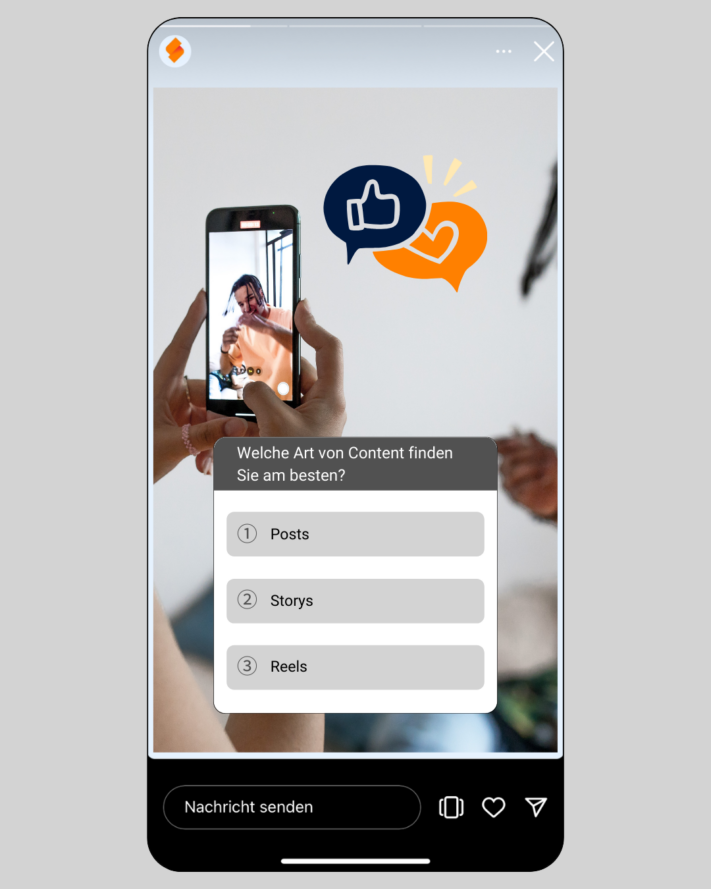
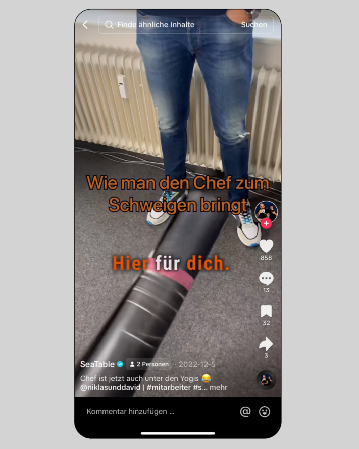
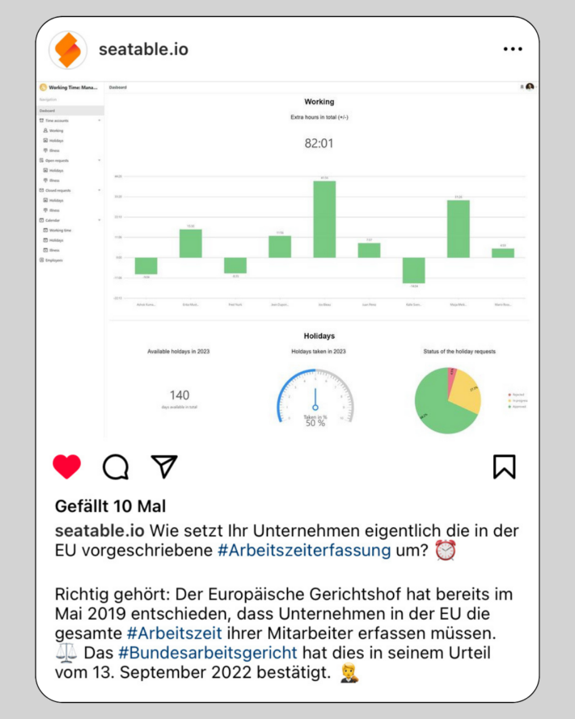

Für einen erfolgreichen Auftritt in den sozialen Medien ist besonders eines wichtig: **regelmäßiges Posten** von Inhalten. Die Algorithmen von [Instagram](http://www.instagram.com) und Co. bestrafen Inaktivität sofort und schränken die Sichtbarkeit von Accounts ein, was durchaus fatal für Ihre **Reichweite** sein kann. Daher ist es wichtig, den Algorithmus regelmäßig zu füttern und Content-Ideen für Instagram, TikTok etc. zu sammeln.

Dafür braucht es manchmal keine tiefgründigen Themen oder aufwändige Texte. Manchmal reicht es auch, wenn Sie Ihre Follower mit einer kleinen Information oder Ähnlichem up to date halten. Mit regelmäßigen Posts können Sie das **Markenbewusstsein** Ihrer Follower gegenüber Ihrem Unternehmen stärken und den **Traffic** von Social Media auf Ihre eigene Website erhöhen.

Damit trotz eines gut durchdachten [Social-Media-Plans]() nicht der Stoff für Posts ausgeht, haben wir einige Content-Ideen, die Sie auf Social Media schnell und ohne großen Aufwand umsetzen können. So gelingt Ihnen auch an stressigen Tagen das Pflegen der Social-Media-Kanäle.

## 1\. Behind the Scenes

Nehmen Sie Ihre Follower mit in Ihren Alltag und zeigen Sie Ihnen mehr von Ihrem Unternehmen und Ihren **täglichen Aufgaben**. Einfach das Smartphone zücken und ein paar Storys aufnehmen – und schon werden Sie Ihre Follower auf Instagram mit interessantem Content aus dem Alltag abholen! Das bietet sich besonders bei Events, Tagungen oder Ähnlichem an, wenn spannende Dinge abseits des klassischen Büroalltags passieren.

Ein Behind-the-Scenes-Video lässt sich hervorragend als Story oder TikTok veröffentlichen.

## 2\. Vorstellung des Teams

Die Vorstellung einzelner Mitarbeiter macht die Beziehung zwischen Follower und Unternehmen nahbarer. Mitmachen sollte natürlich nur, wer will! Durch den **persönlichen Einblick in das Team** bekommen Ihre Kunden und die, die es werden sollen, eine Idee von Ihrem Teamspirit und behalten Ihr Unternehmen positiv und vor allem als menschlich in Erinnerung. Oftmals hilft es einfach, die Menschen hinter den Kulissen zu sehen.

Indem Sie Ihr Team vorstellen, wirken Sie authentischer.

## 3\. Umfragen

Werden Sie interaktiv und beziehen Sie Ihre Follower mit ein. Dabei ist egal, ob aus reinem Vergnügen, zu Forschungszwecken oder um Ihre Follower **in eine Entscheidung einzubeziehen**. Finden Sie mit dieser Content-Idee auf unterhaltsame Weise die Meinung Ihrer Follower heraus und fördern Sie den Dialog.

Fragen Sie doch Ihre Follower direkt, was sie gerne sehen möchten.

## 4\. FAQ’s

Ein FAQ (= Frequently Asked Questions) gibt Ihnen die Möglichkeit, **häufig gestellte Fragen** Ihrer Follower zu beantworten oder Ihnen generell einen Überblick über Ihr Produkt zu geben. So können Sie auch Nice-to-know-Fakten sinnvoll verpacken.

Durch FAQs können Sie nicht nur offene Fragen klären, sondern auch die Interaktion Ihrer Follower erhöhen.

## 5\. Produktvorstellung

Ihre Content-Ideen für Instagram, TikTok und Social Media allgemein sollten sich aus einem guten Mix verschiedener Themen ergeben. Neben Themen, die nichts mit Ihrem Tagesgeschäft zu tun haben, sollten Sie – wenn möglich – ab und an ein **Produkt Ihrer Firma vorstellen** und Ihren Followern zeigen, was genau daran so besonders ist. Ihre Follower sollten schließlich auch wissen, was Sie eigentlich anbieten.

Neben unterhaltsamem Content ist es auch wichtig, dass Sie Ihre Produkte vorstellen.

## 6\. Lustige Videos

Wie schon erwähnt, macht’s die Mischung. Sie sollten nicht nur unternehmensbezogene Inhalte posten, sondern auch **lustigen Content**. Videos bieten dabei eine willkommene Abwechslung zu Story und Posts. Lassen Sie sich einfach durch [TikTok](http://www.tiktok.com) oder Instagram-Trends inspirieren und stöbern Sie durch die Reels. Sie werden sicher etwas Geeignetes finden, das Sie mit Ihren Mitarbeitern umsetzen können und Ihre Follower zum Schmunzeln bringt!

Durch lustige Videos erhöhen Sie leichter Ihre Reichweite.

## 7\. (Team-)Events

Events sind eine super Gelegenheit, um Ihre Follower mit an Bord zu holen. Sie eignen sich nicht nur für ein Follow-me-around, sondern können auch als Aufruf für Ihre Follower gepostet werden, wenn es sich um öffentliche Veranstaltungen handelt. Mit dieser Content-Idee **zeigen Sie sich aktiv** und sprechen Ihre Follower direkt an.

## 8\. Alltag-Hacks und Tipps

Themen, die Nutzer besonders interessieren, sind Themen, die einen **Bezug zu ihrem Leben und Alltag** haben. Geben Sie etwa Tipps für mehr Produktivität im Homeoffice oder richten Sie Ihre Life-Hacks auf aktuelle oder saisonale Themen aus (wie etwa: Die besten Badeseen, die unser Team kennt). Lassen Sie Ihrer Kreativität freien Lauf und überlegen Sie sich, was Sie selbst gern lesen würden!

Teilen Sie auch privatere Einblicke – zum Beispiel die Lieblingsfilme Ihrer Kollegen.

## 9\. Memes

Memes sind kreative Inhalte, meist in Form von Bildern oder Videos. Sie verbreiten sich rasend schnell im Internet und werden von Nutzern regelmäßig abgewandelt. Ob **lustig**, **sarkastisch** oder **gesellschaftskritisch** – diese Content-Ideen tragen zu mehr Viralität auf Social Media bei. Verwenden Sie einfach aktuelle Memes und passen Sie diese individuell an.

Nutzen Sie bekannte Memes, wie BWL-Justus, für Ihre Postings.

## 10\. Tools vorstellen

Für den ein oder anderen kann es sehr interessant sein, mit welchen Tools Unternehmen in ihrem Alltag arbeiten. Mit der **Vorstellung von Tools und Programmen** können Sie sogar eine Posting-Serie starten und jede Woche ein neues Tool vorstellen, das Ihren (Arbeits-)Alltag erleichtert.

Stellen Sie Anwendungen vor, die Ihren Alltag leichter machen.

## 11\. Stellenausschreibungen

Unter Ihren Followern tummeln sich nicht nur Kunden – auch Arbeitnehmer aus Ihrer Branche schauen sich häufig den Content anderer Unternehmen an. Warum also nicht Stellenausschreibungen posten und damit **Fachkräfte**, die auf der Suche nach einer neuen Stelle sind, **auf Sie aufmerksam machen**? Dadurch schlagen Sie zwei Fliegen mit einer Klappe: gute Content-Ideen und neues Personal.

Egal ob Post, Story oder Video – suchen Sie auch auf Social Media nach neuen Mitarbeitern.

## 12\. Gewinnspiele

Viele Influencer nutzen Gewinnspiele auf Social-Media um das **Engagement** Ihrer Follower zu erhöhen und damit Ihre **Reichweite** zu steigern. Als Unternehmen können Sie diese Content-Idee auch nutzen. Wenn Sie dabei Ihre eigenen Produkte verlosen, haben Sie sogar die Möglichkeit, potenzielle Kunden davon zu überzeugen. Achten Sie bei der Umsetzung dieser Content-Idee unbedingt auf die Richtlinien der jeweiligen Plattformen.

Von Gewinnspielen profitieren nicht nur die Gewinner, sondern auch Sie.

## 13\. Infoposts

Haben Sie interessante Insights aus Ihrer Branche? Wurde vielleicht gerade ein neues Gesetz verabschiedet? Oder ändert sich zukünftig etwas für Ihre Kunden? Halten Sie Ihre Follower mit **aktuellen Nachrichten** auf dem Laufenden. Verwenden Sie dabei gerne Grafiken, um die Information visuell ansprechend zu verpacken.

Teilen Sie wissenswerte News mit Ihren Followern.

## 14\. Serie starten

Durch Content-Serien schaffen Sie einen **roten Faden**, der sich durch Ihren Kanal zieht. Das zieht neue Follower an und führt dazu, dass bereits bestehende Follower regelmäßig Ihr Profil besuchen. Dieser Content wird in regelmäßigen Abständen gepostet, bestenfalls an bestimmten Tagen wie der **#throwbackthursday** oder der **#FollowFriday**.

Posten Sie beispielsweise unter dem Hashtag #throwbackthursday vergangene Erfolge Ihres Unternehmens.

## Nutzen Sie SeaTable, um Ihre Content-Ideen zu planen

Mit SeaTable haben Sie die Möglichkeit, Ihre Content-Ideen perfekt zu planen. Unser [Social-Media-Plan]() kann Ihnen als Inspiration für Ihre Content-Planung dienen. Füllen Sie die Pipeline für Ihren Social-Media-Auftritt, sodass Ihnen nie die Posts für Instagram, TikTok und Co. ausgehen.

In dieser Vorlage können Sie die 14 Content-Ideen aus diesem Blogartikel zum Beispiel als wiederkehrende Formate mit unterschiedlichen Themenschwerpunkten anlegen. Passen Sie den Plan an Ihren individuellen Bedarf an, um Ihre Content-Ideen für dein [Social-Media-Management]() zu sammeln und anschließend umzusetzen.

Mit SeaTable erstellen Sie intuitiv Übersichten, Tabellen, Pläne und vieles mehr und sparen damit wertvolle Zeit. Probieren Sie’s aus!
