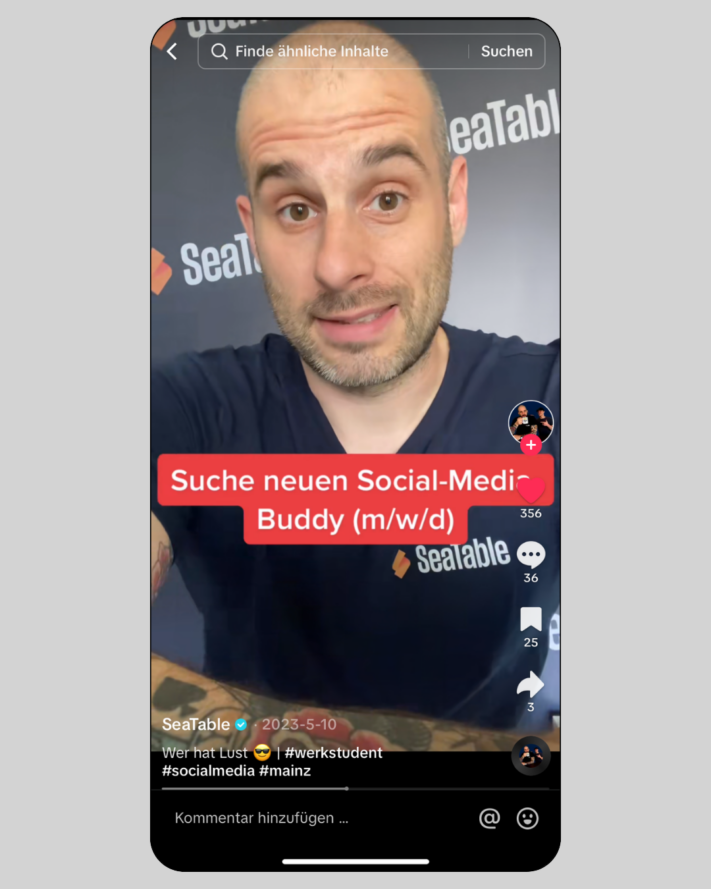

One thing is particularly important for a successful social media presence: **posting** content **regularly**. The algorithms of [Instagram](http://www.instagram.com) and the like immediately penalize inactivity and limit the visibility of accounts, which can be fatal for your **reach**. It is therefore important to feed the algorithm regularly and collect content ideas for Instagram, TikTok etc.

Sometimes this does not require in-depth topics or elaborate texts. Sometimes it is enough to keep your followers up to date with a small piece of information or something similar. With regular posts, you can strengthen your followers' **brand awareness** of your company and increase **traffic** from social media to your own website.

To ensure that you don't run out of material for posts despite having a well-thought-out [social media plan](https://seatable.io/en/content-ideen/#Nutzen_Sie_SeaTable_um_Ihre_Content-Ideen_zu_planen), we have some content ideas that you can implement quickly and easily on social media. This will help you maintain your social media channels even on stressful days.

## 1\. behind the scenes

Take your followers with you into your everyday life and show them more about your company and your **daily tasks**. Simply pull out your smartphone and record a few stories - and you'll pick up your followers on Instagram with interesting content from everyday life! This is particularly useful at events, conferences or similar, when exciting things happen away from the traditional office routine.

A behind-the-scenes video is ideal for publishing as a story or TikTok.

## 2\. introduction of the team

Introducing individual employees makes the relationship between followers and the company more approachable. Of course, only those who want to should take part! By gaining a **personal insight into the team**, your customers and those who want to become part of it get an idea of your team spirit and remember your company positively and, above all, as human. Often it simply helps to see the people behind the scenes.

By introducing your team, you appear more authentic.

## 3\. surveys

Become interactive and involve your followers. It doesn't matter whether it's purely for fun, for research purposes or to **involve** your followers **in a decision**. Use this content idea to find out what your followers think in an entertaining way and encourage dialog.

Ask your followers directly what they would like to see.

## 4\. FAQ's

A FAQ (= Frequently Asked Questions) gives you the opportunity to answer **frequently asked questions** from your followers or to give them a general overview of your product. You can also usefully package nice-to-know facts in this way.

FAQs not only allow you to clarify open questions, but also increase the interaction of your followers.

## 5\. product presentation

Your content ideas for Instagram, TikTok and social media in general should be a good mix of different topics. In addition to topics that have nothing to do with your day-to-day business, you should - if possible - occasionally present a **product from your company** and show your followers what exactly is so special about it. After all, your followers should also know what you actually offer.

In addition to entertaining content, it is also important that you present your products.

## 6\. funny videos

As already mentioned, it's the mix that counts. You should not only post company-related content, but also **funny content**. Videos offer a welcome change from stories and posts. Just let yourself be inspired by [TikTok](http://www.tiktok.com) or Instagram trends and browse through the reels. You're sure to find something suitable that you can implement with your employees and make your followers smile!

Fun videos make it easier to increase your reach.

## 7\. (Team) events

Events are a great opportunity to get your followers on board. They are not only suitable for a follow-me-around, but can also be posted as an appeal for your followers if they are public events. This content idea allows **you to be active** and address your followers directly.

## 8\. everyday hacks and tips

Topics that users are particularly interested in are topics that **relate to their lives and everyday life**. For example, give tips for more productivity in the home office or focus your life hacks on current or seasonal topics (such as: The best swimming lakes our team knows). Let your creativity run wild and think about what you would like to read yourself!

Also share more private insights - for example, your colleagues' favorite films.

## 9\. memes

Memes are creative content, usually in the form of images or videos. They spread rapidly on the internet and are regularly modified by users. Whether **funny**, **sarcastic** or **socially critical** - these content ideas contribute to more virality on social media. Simply use the latest memes and customize them.

Use well-known memes, such as BWL-Justus, for your postings.

## 10\. present tools

It can be very interesting for some people to find out which tools companies use in their everyday work. By **introducing tools and programs**, you can even start a series of posts and introduce a new tool every week that makes your everyday (working) life easier.

Introduce applications that make your everyday life easier.

## 11\. job advertisements

Your followers are not just customers - employees from your industry also often look at the content of other companies. So why not post job advertisements and draw the attention of **professionals** who are looking for a new job **to you**? This kills two birds with one stone: good content ideas and new staff.

Whether it's a post, story or video - look for new employees on social media too.

## 12\. competitions

Many influencers use competitions on social media to increase the **engagement** of their followers and thus increase their **reach**. As a company, you can also use this content idea. If you give away your own products, you even have the opportunity to convince potential customers. When implementing this content idea, be sure to observe the guidelines of the respective platforms.

Not only do the winners benefit from competitions, but you do too.

## 13\. infoposts

Do you have any interesting insights from your industry? Has a new law perhaps just been passed? Or will something change for your customers in the future? Keep your followers up to date with the **latest news**. Feel free to use graphics to package the information in a visually appealing way.

Share interesting news with your followers.

## 14\. start series

Content series create a **common thread** that runs through your channel. This attracts new followers and encourages existing followers to visit your profile regularly. This content is posted at regular intervals, ideally on specific days such as **#throwbackthursday** or **#FollowFriday**.

For example, post past successes of your company under the hashtag #throwbackthursday.

## Use SeaTable to plan your content ideas

SeaTable gives you the opportunity to plan your content ideas perfectly. Our [social media plan]() can serve as inspiration for your content planning. Fill the pipeline for your social media presence so that you never run out of posts for Instagram, TikTok and co.

In this template, you can create the 14 content ideas from this blog article as recurring formats with different thematic focuses, for example. Adapt the plan to your individual needs to collect your content ideas for social media and then implement them.

With SeaTable you can intuitively create overviews, tables, plans and much more, saving you valuable time. Try it out for yourself!
