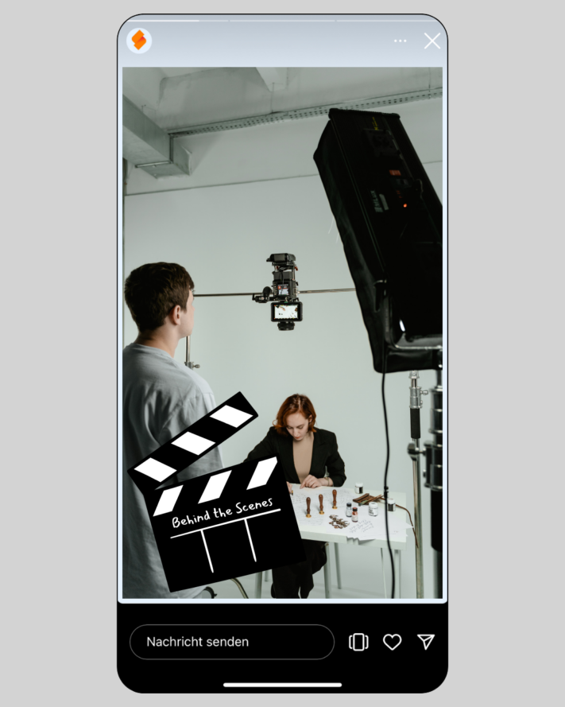
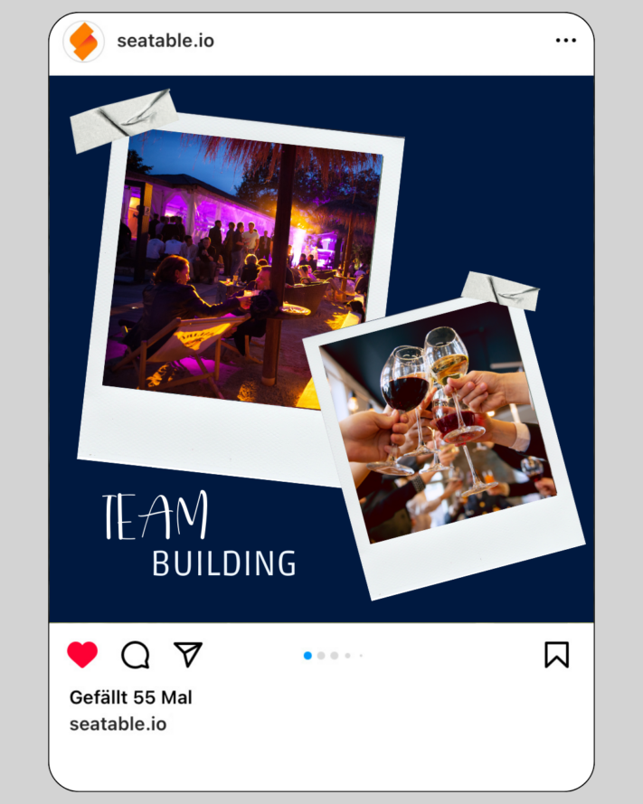

## ¿Cómo encontrar las ideas adecuadas para sus publicaciones en las redes sociales?

La creación de un [plan editorial para medios sociales]() requiere una planificación cuidadosa y un conocimiento preciso de su estrategia de contenidos y de las plataformas que desea utilizar. Porque [Reddit](https://www.reddit.com/r/SeaTable/),Tiktok, [LinkedIn](https://www.linkedin.com/company/seatable/) y compañía trabajan cada una según sus propias reglas con **grupos objetivo y formatos de medios** diferentes. No obstante, las ideas de contenidos para Instagram o LinkedIn, por ejemplo, pueden funcionar fácilmente en otros canales. El contenido y el formato adecuados dependen en gran medida de su grupo objetivo. Dependiendo de los criterios demográficos -edad, nivel educativo, ingresos-, las personas reaccionan de forma diferente a los diseños gráficos y a las formulaciones de los textos.

Como siempre en marketing, la clave del éxito es por tanto la **información más precisa posible sobre su grupo objetivo**, que habrá determinado como parte de su [estrategia de marketing](), unida a la creatividad. Utilice los resultados de su [herramienta de gestión de marketing](). Sus contenidos para las redes sociales no tienen por qué consistir siempre en memes o en contenidos en profundidad. Más bien, una buena mezcla es crucial. La variedad es uno de los factores de éxito de los contenidos en los medios sociales. Otro es la regularidad, porque sólo con publicaciones regulares puede reforzar la **conciencia de marca** de sus seguidores hacia su empresa y aumentar el tráfico desde los medios sociales hacia su propio sitio web. Para asegurarse de que no se queda sin material para los posts a pesar de tener un [plan de medios sociales]() bien pensado, tenemos algunas ideas de contenidos que puede poner en práctica en los medios sociales **rápidamente y sin mucho esfuerzo**. Esto le ayudará a mantener sus canales de medios sociales incluso en los días estresantes.

## Consejo 1: Entre bastidores

Lleve a sus seguidores con usted a su vida cotidiana y muéstreles más sobre su empresa y sus tareas diarias. Basta con que saque su smartphone y grabe algunas historias, ¡y captará a sus seguidores en [Instagram](https://www.instagram.com/seatable_com/) con contenidos interesantes de la vida cotidiana! Esto resulta especialmente útil en eventos, conferencias o similares, cuando suceden cosas emocionantes fuera de la rutina clásica de la oficina.

## Consejo 2: Presentar al equipo

Presentar a cada uno de los empleados hace que la relación entre los seguidores y la empresa sea más cercana. Por supuesto, ¡sólo deben participar aquellos que lo deseen! La **presentación personal del equipo** da a sus clientes y a los que quieren serlo una idea de su espíritu de equipo y recordarán a su empresa de forma positiva y, sobre todo, como humana. A menudo ayuda ver a las personas entre bastidores. Estas imágenes son muy adecuadas como ideas para Instagram para publicar historias cortas, por ejemplo, pero también para LinkedIn.

## Consejo 3: Encuestas

Las encuestas pertenecen definitivamente a todo plan de contenidos para las redes sociales. Implican activamente a sus seguidores y les dan la oportunidad de participar de una forma muy concreta. No importa realmente si realiza una encuesta por pura diversión, con fines de investigación o para implicar a sus seguidores en una decisión. Las publicaciones en los medios sociales de este tipo le ayudan a conocer la opinión de sus seguidores sobre un tema concreto de forma entretenida y **fomentan el diálogo**.

## Consejo 4: Comparta las opiniones de los clientes
Las opiniones positivas de los clientes satisfechos son la **mejor publicidad para su empresa y su producto**. Utilice estos comentarios para sus publicaciones en las redes sociales y publique testimonios y opiniones de clientes. Sin embargo, debe asegurarse de que su feed no consista únicamente en comentarios excesivamente buenos de los clientes.

## Consejo 5: Preguntas frecuentes

Otro tipo de contenido social que siempre funciona bien son las FAQ (= preguntas más frecuentes). Esto le da la oportunidad de responder a las preguntas más frecuentes de sus seguidores o, en general, darles una visión general de su producto. Los hechos agradables de conocer también pueden empaquetarse de forma útil de esta manera.

## Consejo 6: Presentación del producto

Sus ideas de contenido para Instagram, TikTok y las redes sociales en general deberían ser una buena mezcla de temas diferentes. Además de temas que no tengan nada que ver con su negocio diario, debería -si es posible- presentar de vez en cuando un **producto de su empresa** y mostrar a sus seguidores qué tiene exactamente de especial. Al fin y al cabo, sus seguidores también deben saber lo que usted ofrece realmente.

## Consejo 7: Vídeos divertidos

Una buena mezcla de contenidos también incluye publicaciones divertidas de vez en cuando. **Los vídeos son un gran contenido social** y ofrecen un cambio bienvenido con respecto a las historias y los posts. Seguro que encuentra algo adecuado que pueda poner en práctica con sus empleados y hacer sonreír a sus seguidores.

## Consejo 8: Eventos (en equipo)

Los eventos son una gran oportunidad para conseguir el apoyo de sus seguidores. No sólo son adecuados para seguirlos, sino que también pueden publicarse como una llamada a la acción para sus seguidores si se trata de eventos públicos. Esta idea de contenido le permite ser activo y dirigirse directamente a sus seguidores.

## Consejo 9: Trucos y consejos cotidianos

Los temas que interesan especialmente a los usuarios son los que tienen una **relación con sus vidas y su día a día**. Por ejemplo, dé consejos para aumentar la productividad en la oficina doméstica o centre sus life hacks en temas de actualidad o estacionales (como: Los mejores lagos para nadar que conoce nuestro equipo). Deje volar su creatividad y piense en lo que le gustaría leer a usted mismo para crear contenidos atractivos para las redes sociales.

## Consejo 10: Memes

Otro tipo de contenido social muy popular son los memes, es decir, contenidos creativos en forma de imágenes o vídeos. Se difunden rápidamente en Internet y son modificados regularmente por los usuarios. Ya sean divertidos, sarcásticos o socialmente críticos, estas ideas de contenido contribuyen a aumentar la viralidad en las redes sociales. Simplemente utilice los memes más recientes y personalícelos.

## Consejo 11: Introduzca herramientas

Para algunas personas puede resultar muy interesante descubrir qué herramientas utilizan las empresas en su trabajo diario. Introduciendo herramientas y programas, puede incluso iniciar una serie de posts y presentar cada semana una nueva herramienta que le facilite la vida (laboral) diaria.

## Consejo 12: Anuncios de empleo

Sus seguidores no son sólo clientes: los empleados de su sector también suelen mirar contenidos de otras empresas. Así que, ¿por qué no publica anuncios de empleo y atrae hacia usted la atención de los profesionales que buscan un nuevo trabajo? Así matará dos pájaros de un tiro: buenas ideas de contenido y nuevo personal.

## Consejo 13: Concursos

Muchas personas influyentes utilizan concursos en las redes sociales para aumentar el **compromiso** de sus seguidores y aumentar así su **alcance**. Como empresa, también puede utilizar este tipo de contenidos en los medios sociales. Si regala sus propios productos, tendrá incluso la oportunidad de convencer a clientes potenciales. Al poner en práctica esta idea de contenido, asegúrese de respetar las directrices de las respectivas plataformas.

## Consejo 14: Infoposts

¿Tiene alguna información interesante de su sector? ¿Quizá se acaba de aprobar una nueva ley? ¿O va a cambiar algo para sus clientes en el futuro? Mantenga al día a sus seguidores con **noticias actualizadas**. No dude en utilizar gráficos para presentar la información de forma visualmente atractiva.

## Consejo 15: Inicie una serie

Las series de contenidos crean un **hilo conductor** que recorre su canal. Esto atrae a nuevos seguidores y anima a los ya existentes a visitar su perfil con regularidad. Este contenido se publica a intervalos regulares, idealmente en días específicos como **#throwbackthursday** o **#FollowFriday**.

## Consejo 16: Comparta éxitos e hitos

Considere a sus seguidores de las redes sociales como una comunidad y celebre con ellos los acontecimientos importantes. La x. cliente, una nueva sucursal, la actualización de un nuevo producto: usted decide qué éxito merece la pena compartir en sus canales.

## Consejo 17: Desmonte mitos y conceptos erróneos
Hay mitos en todos los sectores y seguro que también hay **conceptos erróneos y juicios equivocados** sobre su industria. Aclárelos, preferiblemente de forma encantadora y con un guiño.

## Consejo 18: Infografía
Las infografías también son un contenido social muy bueno que **funciona en todas las plataformas**. Puede utilizarlas para presentar temas complejos de forma breve, concisa y visualmente atractiva, o simplemente para entretener.

## Consejo 19: Comparta una entrada de blog
Si tiene un blog, los canales de las redes sociales son ideales para utilizarlos de forma secundaria. Comparta los nuevos artículos del blog o cree infografías o historias a partir de los artículos (esto también se aplica a los podcasts o a un [canal de YouTube](https://www.youtube.com/@SeaTable), por supuesto). También es una buena oportunidad para incluir un enlace a su sitio web.

## Consejo 20: Proporcione datos y cifras
Aunque los medios sociales funcionan principalmente a través de imágenes y emociones, también puede publicar datos y cifras concretos. Las cifras son especialmente adecuadas en combinación con la comunicación de hitos importantes. Sin embargo, tenga cuidado de no publicar simplemente cifras en el vacío, sino de explicar a qué se refieren y **qué significa esta cifra para sus seguidores y clientes**.

## De la idea a la realización: crear contenidos para los medios sociales

Con nuestros 20 consejos, no deberían faltarle ideas de contenidos populares para las redes sociales. Y hay muchos más formatos de contenidos estupendos y prometedores. Pero antes de ponerse manos a la obra y empezar a crear publicaciones en las redes sociales como un loco, le recomendamos que primero piense en cómo pueden utilizar usted y su empresa cada uno de los formatos y cree un plan de campaña. Lo mejor es hacer una preselección de cuatro o cinco formatos e ideas que quiera probar primero. Fíjese bien en lo que funciona bien o muy bien entre su público y optimícelo regularmente.



Con la [plataforma AI no-code SeaTable]() tiene la oportunidad de planificar perfectamente sus ideas de contenidos para los medios sociales. Nuestro [plan de medios sociales]() puede servirle de inspiración para su planificación de contenidos. Llene el pipeline de su presencia en los medios sociales para que nunca se quede sin posts para Instagram, TikTok, Reddit y compañía. En esta plantilla, puede crear las 20 ideas de contenidos de este artículo de blog como formatos recurrentes con diferentes enfoques temáticos, por ejemplo. Adapte el plan a sus necesidades individuales para recopilar ideas de contenidos para su [gestión de medios sociales]() y, a continuación, póngalas en práctica.

## FAQ - Ideas de contenidos para Instagram, LinkedIn y co,


No existe una respuesta general a esta pregunta, ya que la respuesta depende en gran medida del canal respectivo y de su grupo objetivo. Es importante que no considere sus actividades en los medios sociales por separado del resto de sus medidas de marketing, sino como parte de una estrategia holística.



Tampoco existe una respuesta general a esta pregunta. Sin embargo, existen marcos que pueden ayudarle a encontrar la mezcla adecuada para usted. La regla 50/30/20 establece, por ejemplo, que el 50% de su contenido debe abordar los intereses y las necesidades de su grupo objetivo, el 30% debe centrarse en su marca y sólo el 20% debe utilizarse realmente para la publicidad de productos con una llamada a la acción específica.



En principio, sí, si tiene en cuenta algunas cosas y, por ejemplo, adapta el diseño visual y el enfoque al canal y al grupo objetivo correspondiente. Por regla general, tendrá contenidos adecuados para todos sus canales de medios sociales y contenidos que sólo son relevantes para plataformas individuales.
