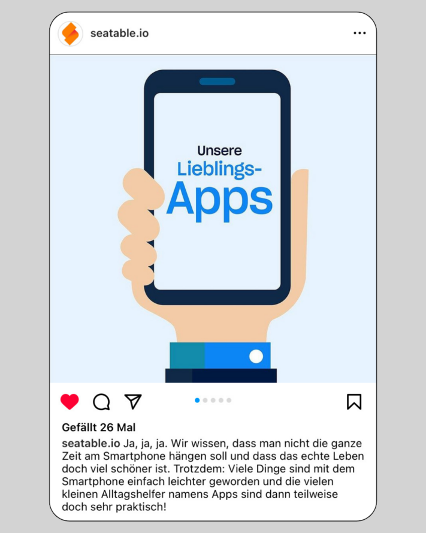

Para tener éxito en las redes sociales, hay algo especialmente importante: **publicar contenido de forma regular**. Los algoritmos de [Instagram](http://www.instagram.com) y otras plataformas penalizan la inactividad de inmediato y limitan la visibilidad de las cuentas, lo que puede ser fatal para tu **alcance**. Por eso es fundamental alimentar el algoritmo constantemente y recopilar ideas de contenido para Instagram, TikTok, etc.

A veces, no se necesitan temas profundos ni textos elaborados. Basta con mantener a tus seguidores informados con un dato o algo sencillo. Con publicaciones regulares, puedes fortalecer el **reconocimiento de marca** entre tus seguidores y aumentar el **tráfico** de las redes sociales hacia tu propio sitio web.

Para que nunca te falten ideas de publicaciones, incluso con un [plan de redes sociales]() bien pensado, aquí tienes algunas ideas de contenido que puedes implementar rápida y fácilmente en las redes sociales. Así, incluso en días ajetreados, podrás mantener tus canales actualizados.

## 1\. Detrás de cámaras

Lleva a tus seguidores a tu día a día y muéstrales más sobre tu empresa y tus **tareas diarias**. Solo tienes que sacar tu smartphone y grabar algunas historias: así ofrecerás contenido interesante sobre la vida cotidiana en Instagram. Esto es ideal en eventos, congresos o situaciones fuera de la rutina de oficina.

Un video detrás de cámaras es perfecto para publicar como historia o en TikTok.

## 2\. Presentación del equipo

Presentar a los miembros del equipo hace que la relación entre los seguidores y la empresa sea más cercana. ¡Por supuesto, solo participa quien quiera! A través de una **mirada personal al equipo**, tus clientes y potenciales clientes pueden conocer el espíritu de tu equipo y recordar tu empresa de manera positiva y humana. A menudo, ayuda ver a las personas detrás de escena.

Presentar a tu equipo te hace ver más auténtico.

## 3\. Encuestas

Haz que tu contenido sea interactivo e involucra a tus seguidores. No importa si es solo por diversión, para investigación o para **incluir a tus seguidores en una decisión**. Con esta idea de contenido, puedes conocer de manera entretenida la opinión de tus seguidores y fomentar el diálogo.

Pregunta directamente a tus seguidores qué les gustaría ver.

## 4\. Preguntas frecuentes (FAQ)

Un FAQ (Preguntas Frecuentes) te permite responder a las **preguntas más comunes** de tus seguidores o darles una visión general de tu producto. Así también puedes compartir datos interesantes de forma atractiva.

Con los FAQs no solo resuelves dudas, sino que también aumentas la interacción de tus seguidores.

## 5\. Presentación de productos

Tus ideas de contenido para Instagram, TikTok y redes sociales en general deben ser una buena mezcla de diferentes temas. Además de temas ajenos a tu actividad principal, deberías –si es posible– **presentar de vez en cuando algún producto de tu empresa** y mostrar a tus seguidores qué lo hace especial. Al fin y al cabo, tus seguidores deben saber qué ofreces.

Además de contenido entretenido, también es importante mostrar tus productos.

## 6\. Videos divertidos

Como ya se mencionó, la clave está en la variedad. No solo publiques contenido corporativo, sino también **contenido divertido**. Los videos son un cambio bienvenido frente a historias y publicaciones. Déjate inspirar por tendencias de [TikTok](http://www.tiktok.com) o Instagram y explora los Reels. Seguro que encuentras algo que puedas hacer con tu equipo y que saque una sonrisa a tus seguidores.

Con videos divertidos, es más fácil aumentar tu alcance.

## 7\. Eventos (de equipo)

Los eventos son una excelente oportunidad para involucrar a tus seguidores. No solo sirven para un "sígueme durante el evento", sino que también puedes usarlos para invitar a tus seguidores si se trata de eventos públicos. Con esta idea de contenido, **te muestras activo** y hablas directamente a tus seguidores.

## 8\. Hacks y consejos para el día a día

Los temas que más interesan a los usuarios son los que **se relacionan con su vida cotidiana**. Da consejos para ser más productivo en el home office o comparte trucos de vida adaptados a temas actuales o de temporada (por ejemplo: los mejores lagos para nadar que conoce tu equipo). Deja volar tu creatividad y piensa qué te gustaría leer a ti.

Comparte también aspectos más personales, como las películas favoritas de tus colegas.

## 9\. Memes

Los memes son contenidos creativos, generalmente en forma de imágenes o videos. Se difunden rápidamente en Internet y los usuarios los adaptan constantemente. Ya sean **divertidos**, **sarcásticos** o **críticos**, estas ideas de contenido ayudan a aumentar la viralidad en redes sociales. Usa memes actuales y adáptalos a tu estilo.

Aprovecha memes conocidos, como BWL-Justus, para tus publicaciones.

## 10\. Presentar herramientas

Para algunos, puede ser muy interesante saber qué herramientas utiliza una empresa en su día a día. Con la **presentación de herramientas y programas**, incluso puedes crear una serie de publicaciones y presentar cada semana una nueva herramienta que facilite tu trabajo.

Presenta aplicaciones que faciliten tu día a día.

## 11\. Ofertas de empleo

Entre tus seguidores no solo hay clientes: también hay profesionales de tu sector que suelen ver el contenido de otras empresas. ¿Por qué no publicar ofertas de empleo y así **llamar la atención de profesionales** que buscan nuevas oportunidades? Así matas dos pájaros de un tiro: buenas ideas de contenido y nuevo personal.

No importa si es publicación, historia o video: busca también nuevos empleados en redes sociales.

## 12\. Sorteos

Muchos influencers utilizan sorteos en redes sociales para **aumentar el engagement** de sus seguidores y así incrementar su **alcance**. Como empresa, también puedes aprovechar esta idea de contenido. Si sorteas tus propios productos, incluso puedes convencer a potenciales clientes. Asegúrate de cumplir las normas de cada plataforma.

Los sorteos benefician tanto a los ganadores como a ti.

## 13\. Publicaciones informativas

¿Tienes datos interesantes de tu sector? ¿Se acaba de aprobar una nueva ley? ¿O habrá cambios para tus clientes? Mantén a tus seguidores informados con **noticias actuales**. Usa gráficos para presentar la información de forma atractiva.

Comparte noticias relevantes con tus seguidores.

## 14\. Iniciar una serie

Con las series de contenido creas un **hilo conductor** en tu canal. Esto atrae a nuevos seguidores y hace que los actuales visiten tu perfil regularmente. Este tipo de contenido se publica de forma periódica, idealmente en días específicos como **#throwbackthursday** o **#FollowFriday**.

Por ejemplo, publica bajo el hashtag #throwbackthursday los logros pasados de tu empresa.

## Usa SeaTable para planificar tus ideas de contenido

Con SeaTable, puedes planificar perfectamente tus ideas de contenido. Nuestro [plan de redes sociales]() puede servirte de inspiración para tu planificación de contenido. Llena tu pipeline de publicaciones para Instagram, TikTok y demás, y nunca te quedarás sin ideas.

En esta plantilla, puedes registrar las 14 ideas de contenido de este artículo como formatos recurrentes con diferentes enfoques temáticos. Adapta el plan a tus necesidades para recopilar y luego implementar tus ideas de contenido para redes sociales.

Con SeaTable, creas de forma intuitiva resúmenes, tablas, planes y mucho más, ahorrando un tiempo valioso. ¡Pruébalo!
