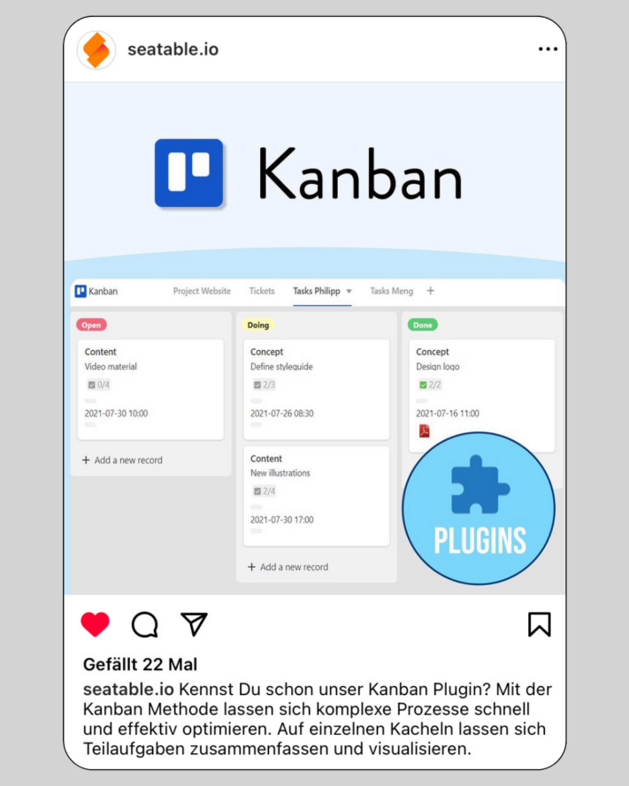
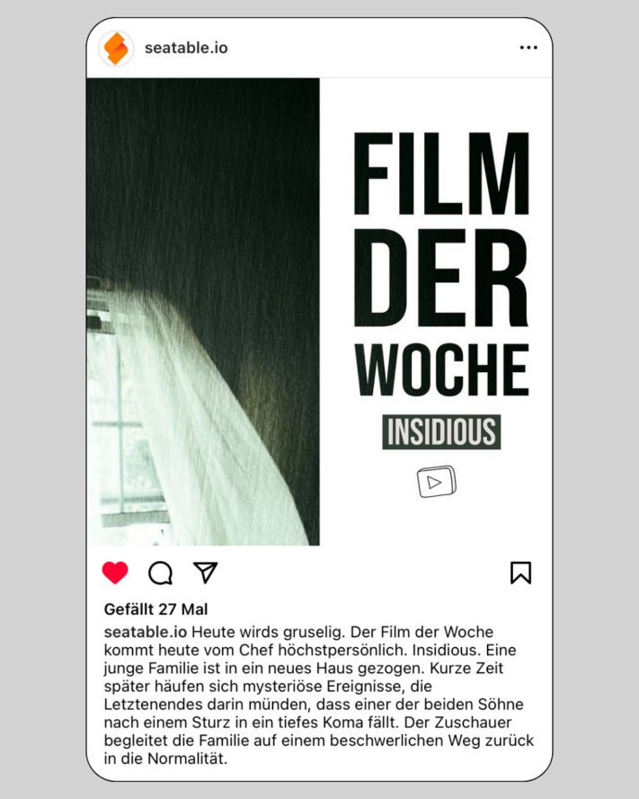

Uma coisa é particularmente importante para uma presença bem sucedida nas redes sociais: **publicar** conteúdos **regularmente**. Os algoritmos do [Instagram](http://www.instagram.com) e similares penalizam imediatamente a inatividade e limitam a visibilidade das contas, o que pode ser fatal para o seu **alcance**. Por conseguinte, é importante alimentar o algoritmo regularmente e recolher ideias de conteúdos para o Instagram, TikTok, etc.

Por vezes, isto não requer tópicos aprofundados ou textos elaborados. Por vezes, é suficiente manter os seus seguidores actualizados com uma pequena informação ou algo semelhante. Com publicações regulares, pode reforçar o **conhecimento da marca** da sua empresa por parte dos seus seguidores e aumentar **o tráfego** das redes sociais para o seu próprio sítio Web.

Para garantir que não fica sem material para publicações, apesar de ter um [plano]() bem pensado para as redes sociais, temos algumas ideias de conteúdos que pode implementar rápida e facilmente nas redes sociais. Isto ajudá-lo-á a manter os seus canais nas redes sociais mesmo em dias de stress.

## 1\. nos bastidores

Leve os seus seguidores consigo para a sua vida quotidiana e mostre-lhes mais sobre a sua empresa e as suas **tarefas diárias**. Basta pegar no seu smartphone e gravar algumas histórias - e irá captar os seus seguidores no Instagram com conteúdos interessantes da vida quotidiana! Isto é particularmente útil em eventos, conferências ou similares, quando acontecem coisas interessantes fora da rotina tradicional do escritório.

Um vídeo dos bastidores é ideal para publicar como uma história ou TikTok.

## 2\. apresentação da equipa

A apresentação de funcionários individuais torna a relação entre os seguidores e a empresa mais acessível. Naturalmente, só deve participar quem quiser! Ao obter uma **visão pessoal da equipa**, os seus clientes e aqueles que querem fazer parte da sua equipa ficam com uma ideia do seu espírito de equipa e recordam a sua empresa de uma forma positiva e, acima de tudo, humana. Muitas vezes ajuda ver as pessoas que estão por detrás das cenas.

Ao apresentar a sua equipa, parece mais autêntico.

## 3\. inquéritos

Torne-se interativo e envolva os seus seguidores. Não importa se é apenas por diversão, para fins de pesquisa ou para **envolver** os seus seguidores **numa decisão**. Utilize esta ideia de conteúdo para descobrir a opinião dos seus seguidores de uma forma divertida e incentivar o diálogo.

Por que não perguntar diretamente aos seus seguidores o que gostariam de ver?

## 4\. perguntas frequentes

Uma FAQ (= Frequently Asked Questions) dá-lhe a oportunidade de responder a **perguntas frequentes** dos seus seguidores ou de lhes dar uma visão geral do seu produto. Também é possível agrupar factos interessantes desta forma.

As FAQ não só permitem esclarecer questões em aberto, como também aumentam a interação dos seus seguidores.

## 5\. apresentação do produto

As suas ideias de conteúdo para o Instagram, TikTok e redes sociais em geral devem ser uma boa mistura de diferentes tópicos. Para além dos tópicos que não têm nada a ver com o seu negócio diário, deve - se possível - apresentar ocasionalmente um **produto da sua empresa** e mostrar aos seus seguidores o que tem de tão especial. Afinal de contas, os seus seguidores também devem saber o que realmente oferece.

Para além do conteúdo de entretenimento, é também importante apresentar os seus produtos.

## 6\. vídeos engraçados

Como já foi referido, o que conta é a mistura. Não deve publicar apenas conteúdos relacionados com a empresa, mas também **conteúdos divertidos**. Os vídeos oferecem uma mudança bem-vinda em relação às histórias e publicações. Basta deixar-se inspirar pelas tendências [do TikTok](http://www.tiktok.com) ou do Instagram e navegar pelos rolos. De certeza que vai encontrar algo adequado que pode implementar com os seus empregados e fazer os seus seguidores sorrir!

Os vídeos divertidos facilitam o aumento do seu alcance.

## 7\. eventos (de equipa)

Os eventos são uma óptima oportunidade para envolver os seus seguidores. Não só são adequados para um follow-me-around, como também podem ser publicados como um apelo aos seus seguidores se forem eventos públicos. Esta ideia de conteúdo **permite-lhe ser ativo** e dirigir-se diretamente aos seus seguidores.

## 8\. dicas e truques do dia a dia

Os tópicos que interessam particularmente aos utilizadores são os que se **relacionam com as suas vidas e o seu quo** tidiano. Por exemplo, dê dicas para aumentar a produtividade no escritório em casa ou concentre os seus truques de vida em tópicos actuais ou sazonais (como: Os melhores lagos para nadar que a nossa equipa conhece). Dê largas à sua criatividade e pense no que gostaria de ler!

Partilhe também informações mais privadas - por exemplo, os filmes preferidos dos seus colegas.

## 9\. memes

Os memes são conteúdos criativos, geralmente sob a forma de imagens ou vídeos. Espalham-se rapidamente na Internet e são regularmente modificados pelos utilizadores. Quer sejam **engraçados**, **sarcásticos** ou **socialmente críticos** - estas ideias de conteúdos contribuem para uma maior viralidade nas redes sociais. Basta utilizar os memes mais recentes e personalizá-los.

Utilize memes bem conhecidos, como BWL-Justus, para as suas mensagens.

## 10\. ferramentas actuais

Pode ser muito interessante para algumas pessoas descobrir quais as ferramentas que as empresas utilizam no seu trabalho quotidiano. Ao **apresentar ferramentas e programas**, pode até iniciar uma série de publicações e apresentar todas as semanas uma nova ferramenta que facilite a sua vida quotidiana (profissional).

Introduzir aplicações que facilitem a sua vida quotidiana.

## 11\. anúncios de emprego

Os seus seguidores não são apenas clientes - os funcionários do seu sector também olham frequentemente para o conteúdo de outras empresas. Por isso, porque não publicar anúncios de emprego e chamar a atenção dos **profissionais** que estão à procura de um novo emprego **para si**? Isto mata dois coelhos com uma cajadada só: boas ideias de conteúdo e novos funcionários.

Quer se trate de uma publicação, história ou vídeo - procure novos empregados também nas redes sociais.

## 12\. concursos

Muitos influenciadores utilizam concursos nas redes sociais para aumentar o **envolvimento** dos seus seguidores e, assim, aumentar o seu **alcance**. Como empresa, também pode utilizar esta ideia de conteúdo. Se oferecer os seus próprios produtos, tem até a oportunidade de convencer potenciais clientes. Ao implementar esta ideia de conteúdo, não se esqueça de observar as directrizes das respectivas plataformas.

Não são apenas os vencedores que beneficiam dos concursos, mas também o utilizador.

## 13\. infoposts

Tem alguma informação interessante sobre o seu sector? Porventura acabou de ser aprovada uma nova lei? Ou será que algo vai mudar para os seus clientes no futuro? Mantenha os seus seguidores actualizados com as **últimas notícias**. Não hesite em utilizar gráficos para apresentar as informações de uma forma visualmente apelativa.

Partilhe notícias interessantes com os seus seguidores.

## 14\. iniciar séries

As séries de conteúdos criam um **fio condutor comum** que percorre o seu canal. Isto atrai novos seguidores e incentiva os seguidores existentes a visitarem o seu perfil regularmente. Este conteúdo é publicado em intervalos regulares, idealmente em dias específicos, como **#throwbackthursday** ou **#FollowFriday**.

Por exemplo, publique sucessos passados da sua empresa com o hashtag #throwbackthursday.

## Utilize o SeaTable para planear as suas ideias de conteúdos

O SeaTable dá-lhe a oportunidade de planear perfeitamente as suas ideias de conteúdo. O nosso [plano para as]() redes sociais pode servir de inspiração para o seu planeamento de conteúdos. Preencha o pipeline da sua presença nas redes sociais para que nunca fique sem publicações no Instagram, TikTok e outros.

Neste modelo, pode criar as 14 ideias de conteúdo deste artigo do blogue como formatos recorrentes com diferentes focos temáticos, por exemplo. Personalize o plano de acordo com as suas necessidades individuais, a fim de recolher e implementar as suas ideias de conteúdo para as redes sociais.

O SeaTable permite-lhe criar intuitivamente visões gerais, tabelas, planos e muito mais, poupando-lhe tempo valioso. Experimente-o você mesmo!
