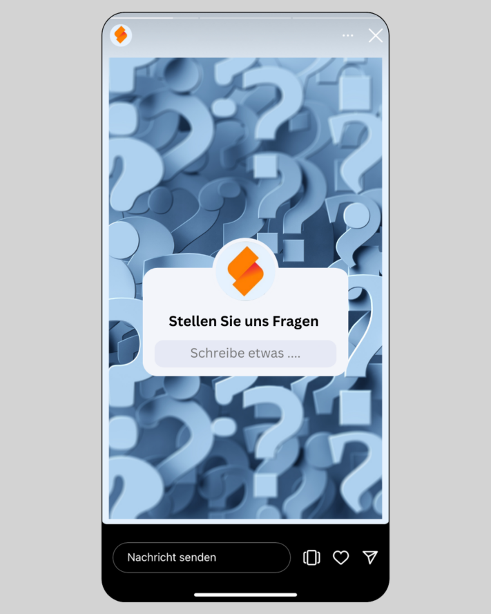

## Как Вы находите правильные идеи для своих постов в социальных сетях?

Создание [редакционного плана для социальных сетей]() требует тщательного планирования и точного знания Вашей контент-стратегии и платформ, которые Вы хотите использовать. Ведь [Reddit](https://www.reddit.com/r/SeaTable/), Tiktok, [LinkedIn](https://www.linkedin.com/company/seatable/) и др. работают по своим собственным правилам с **различными целевыми группами и медиа-форматами**. Тем не менее, идеи контента для Instagram или LinkedIn, например, могут легко работать и на других каналах. Правильный контент и правильный формат во многом зависят от Вашей целевой группы. В зависимости от демографических критериев - возраста, уровня образования, дохода - люди по-разному реагируют на графический дизайн и текстовые формулировки.

Поэтому, как и всегда в маркетинге, ключом к успеху является максимально **точная информация о Вашей целевой группе**, которую Вы определили в рамках Вашей [маркетинговой стратегии](), в сочетании с креативностью. Используйте результаты, полученные с помощью Вашего [инструмента управления маркетингом](). Ваш контент для социальных сетей не всегда должен состоять из мемов или глубоких материалов. Напротив, очень важно хорошее сочетание. Разнообразие - один из факторов успеха успешного контента в социальных сетях. Другой фактор - регулярность, потому что только регулярные посты могут укрепить **брендовую осведомленность** Ваших подписчиков о Вашей компании и увеличить трафик из социальных сетей на Ваш собственный сайт. Чтобы у Вас не закончился материал для постов, несмотря на наличие хорошо продуманного [плана социальных медиа](), мы предлагаем Вам несколько идей контента, которые Вы можете реализовать в социальных медиа **быстро и без особых усилий**. Это поможет Вам поддерживать свои каналы в социальных сетях даже в напряженные дни.

## Совет 1: За кулисами

Захватите своих подписчиков с собой в свою повседневную жизнь и покажите им больше о своей компании и своих ежедневных делах. Просто достаньте свой смартфон и запишите несколько историй - и Вы привлечете своих подписчиков на [Instagram](https://www.instagram.com/seatable_com/) интересным контентом из повседневной жизни! Это особенно полезно на мероприятиях, конференциях и т.п., когда интересные события происходят вдали от традиционной офисной рутины.

## Совет 2: Представляем команду

Представление отдельных сотрудников делает отношения между подписчиками и компанией более близкими. Разумеется, участвовать должны только те, кто хочет! **Личное знакомство с командой** дает Вашим клиентам и тем, кто хочет стать клиентами, представление о духе Вашей команды, и они будут вспоминать о Вашей компании с позитивом и, прежде всего, как о человеке. Это часто помогает увидеть людей за кулисами. Такие изображения хорошо подходят в качестве идей для Instagram, например, для публикации коротких историй, а также для LinkedIn.

## Совет 3: Опросы

Опросы определенно должны быть в каждом контент-плане для социальных сетей. Они активно вовлекают Ваших подписчиков и дают им возможность принять самое непосредственное участие. Неважно, проводите ли Вы опрос просто для развлечения, в исследовательских целях или для того, чтобы привлечь своих подписчиков к принятию решения. Подобные посты в социальных сетях помогут Вам выяснить мнение Ваших подписчиков по определенной теме в занимательной форме и **побудят к диалогу**.

## Совет 4: Делитесь отзывами клиентов
Положительные отзывы довольных клиентов - это **лучшая реклама для Вашей компании и Вашего продукта**. Используйте эти отзывы для своих постов в социальных сетях и публикуйте отзывы и рекомендации клиентов. Однако Вы должны следить за тем, чтобы Ваша лента состояла не только из чрезмерно хороших отзывов клиентов.

## Совет 5: Вопросы и ответы

Еще один тип социального контента, который всегда хорошо работает, - это FAQ (= часто задаваемые вопросы). Это дает Вам возможность ответить на часто задаваемые вопросы Ваших подписчиков или в целом дать им обзор Вашего продукта. Приятные факты также могут быть с пользой упакованы таким образом.

## Совет 6: Презентация продукта

Ваши идеи контента для Instagram, TikTok и социальных сетей в целом должны представлять собой хорошую смесь различных тем. Помимо тем, которые не имеют отношения к Вашей повседневной деятельности, Вы должны - если это возможно - время от времени представлять **продукт Вашей компании** и показывать своим подписчикам, что именно в нем особенного. В конце концов, Ваши подписчики должны знать, что Вы предлагаете на самом деле.

## Совет 7: Смешные видео

Хороший микс контента также включает в себя время от времени смешные посты. **Видеоролики - это отличный социальный контент**, и они предлагают приятное изменение по сравнению с историями и постами. Вы обязательно найдете что-то подходящее, что Вы можете использовать вместе со своими сотрудниками и заставить своих подписчиков улыбнуться!

## Совет 8: (Командные) мероприятия

Мероприятия - это отличная возможность привлечь Ваших подписчиков. Они не только подходят для фолловеров, но и могут быть опубликованы в качестве призыва к действию для Ваших подписчиков, если это публичные мероприятия. Эта идея контента позволяет Вам быть активным и обращаться к своим подписчикам напрямую.

## Совет 9: Повседневные хаки и советы

Темы, которые особенно интересуют пользователей, - это темы, которые **относятся к их жизни и быту**. Например, дайте советы по повышению продуктивности домашнего офиса или сфокусируйте свои лайфхаки на актуальных или сезонных темах (например: Лучшие озера для плавания, которые знает наша команда). Дайте волю своему творчеству и подумайте о том, что бы Вы сами хотели прочитать, чтобы создать привлекательный контент для социальных сетей.

## Совет 10: Мемы

Еще один очень популярный тип социального контента - мемы, т.е. креативный контент в виде изображений или видео. Они быстро распространяются в Интернете и регулярно изменяются пользователями. Смешные, саркастичные или социально критические - эти идеи контента способствуют большей вирусности в социальных сетях. Просто используйте новейшие мемы и адаптируйте их.

## Совет 11: Внедряйте инструменты

Некоторым людям может быть очень интересно узнать, какие инструменты используют компании в своей повседневной работе. Представляя инструменты и программы, Вы можете даже начать серию постов и каждую неделю представлять новый инструмент, который облегчает Вашу повседневную (рабочую) жизнь.

## Совет 12: Объявления о работе

Ваши подписчики - это не только клиенты: сотрудники Вашей отрасли также часто просматривают контент других компаний. Так почему бы не разместить объявления о работе и не привлечь к Вам внимание профессионалов, которые ищут новую работу? Таким образом, Вы убьете двух зайцев одним выстрелом: идеи хорошего контента и новые сотрудники.

## Совет 13: Конкурсы

Многие авторитетные люди используют конкурсы в социальных сетях, чтобы повысить **вовлеченность** своих подписчиков и, таким образом, увеличить **охват**. Как компания, Вы также можете использовать подобный контент в социальных сетях. Если Вы будете раздавать свои собственные продукты, у Вас даже появится возможность убедить потенциальных клиентов. При реализации этой идеи контента обязательно соблюдайте правила соответствующих платформ.

## Совет 14: Инфопосты

У Вас есть интересные факты из Вашей отрасли? Возможно, только что был принят новый закон? Или что-то изменится для Ваших клиентов в будущем? Держите своих подписчиков в курсе **актуальных новостей**. Не стесняйтесь использовать графику, чтобы представить информацию в визуально привлекательном виде.

## Совет 15: Начните серию

Серии контента создают **красную нить**, проходящую через Ваш канал. Это привлекает новых подписчиков и побуждает существующих подписчиков регулярно посещать Ваш профиль. Этот контент публикуется через регулярные промежутки времени, в идеале - в определенные дни, такие как **#throwbackthursday** или **#FollowFriday**.

## Совет 16: Делитесь успехами и важными событиями

Рассматривайте своих подписчиков в социальных сетях как сообщество и отмечайте важные события вместе с ними. x. клиент, новый филиал, обновление продукта: Вы сами решаете, каким успехом стоит поделиться на своих каналах.

## Совет 17: Развенчивайте мифы и заблуждения
В каждой отрасли существуют свои мифы, и в Вашей отрасли тоже наверняка есть **нарочитые или возмутительные заблуждения и ошибочные суждения**. Развенчайте их, желательно в очаровательной манере и с подмигиванием.

## Совет 18: Инфографика
Инфографика - это также очень хороший социальный контент, который **работает на всех платформах**. С их помощью Вы можете представить сложные темы в кратком, сжатом и визуально привлекательном виде - или просто развлечь.

## Совет 19: Поделитесь записью в блоге
Если Вы ведете блог, то каналы социальных сетей идеально подходят для его вторичного использования. Делитесь новыми статьями блога или создавайте инфографику или истории на основе статей (это, конечно же, относится и к подкастам или [YouTube-каналу](https://www.youtube.com/@SeaTable)). Это также хорошая возможность включить ссылку на Ваш сайт.

## Совет 20: Приводите факты и цифры
Даже если социальные сети работают в основном через изображения и эмоции, Вы также можете публиковать убедительные факты и цифры. Цифры особенно уместны в сочетании с сообщением о важных вехах. Однако будьте осторожны и не публикуйте цифры в вакууме, а объясните, о чем идет речь и **что эта цифра значит для Ваших последователей и клиентов**.

## От идеи до воплощения: создание контента для социальных сетей

Благодаря нашим 20 советам у Вас не должно быть недостатка в популярных идеях социального контента. И есть еще много отличных, перспективных форматов контента. Но прежде чем Вы приступите к работе и начнете как сумасшедший создавать посты в социальных сетях, мы рекомендуем Вам сначала подумать о том, как Вы и Ваша компания можете использовать те или иные форматы, и составить план кампании. Лучше всего составить короткий список из четырех или пяти форматов и идей, которые Вы хотите опробовать в первую очередь. Присмотритесь к тому, что хорошо или очень хорошо воспринимается Вашей аудиторией, и регулярно оптимизируйте.



С помощью [ИИ no-code платформы SeaTable]() у Вас есть возможность идеально спланировать свои идеи контента для социальных сетей. Наш [план социальных медиа]() может послужить вдохновением для планирования Вашего контента. Заполните контентный план для Ваших социальных сетей, чтобы у Вас никогда не заканчивались посты для Instagram, TikTok, Reddit и т.д. В этом шаблоне Вы можете создать 20 идей контента из этой статьи блога в виде повторяющихся форматов с различными тематическими фокусами, например. Адаптируйте этот план к Вашим индивидуальным потребностям, чтобы собрать идеи контента для Вашего [управления социальными медиа]() и затем реализовать их.

## FAQ - Идеи контента для Instagram, LinkedIn и др,


Общего ответа на этот вопрос не существует, поскольку ответ во многом зависит от соответствующего канала и Вашей целевой группы. Важно, чтобы Вы рассматривали свою деятельность в социальных сетях не отдельно от других маркетинговых мероприятий, а как часть целостной стратегии.



На этот вопрос также нет общего ответа. Однако существуют рамки, которые могут помочь Вам найти подходящее сочетание. Например, правило 50/30/20 гласит, что 50% Вашего контента должно отвечать интересам и потребностям Вашей целевой группы, 30% должно быть посвящено Вашему бренду и только 20% должно использоваться для рекламы товара с конкретным призывом к действию.



В принципе, да, если Вы не будете забывать о некоторых вещах и, например, адаптируете визуальный дизайн и подход к каналу и соответствующей целевой группе. Как правило, у Вас будет контент, который подходит для всех Ваших каналов социальных сетей, и контент, который актуален только для отдельных платформ.
