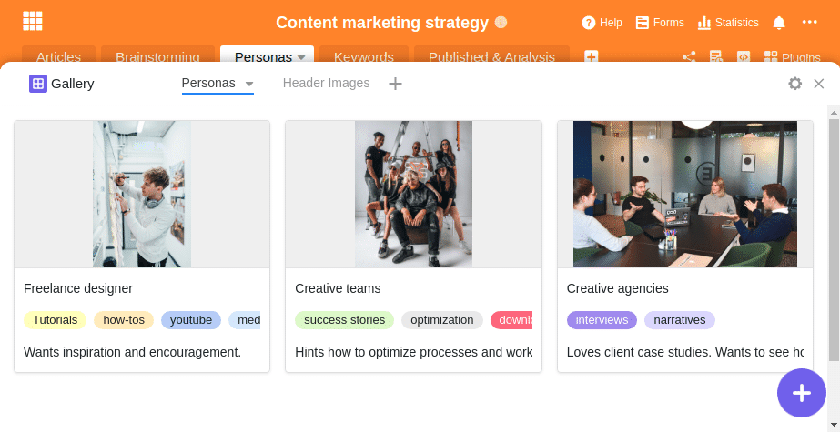
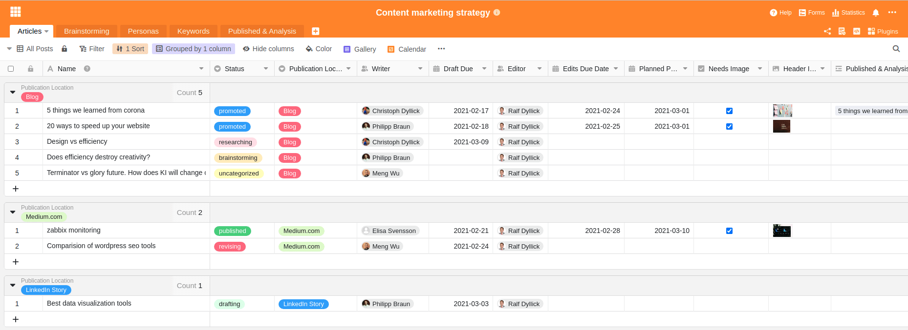
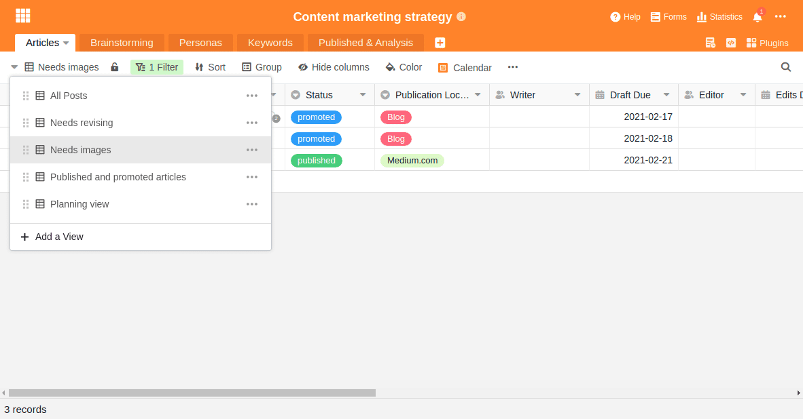
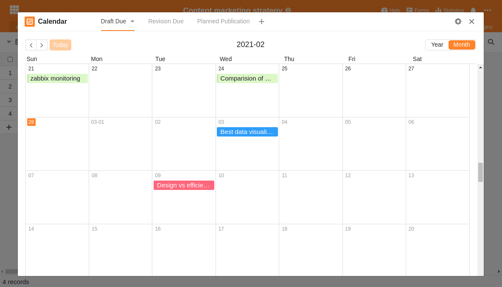
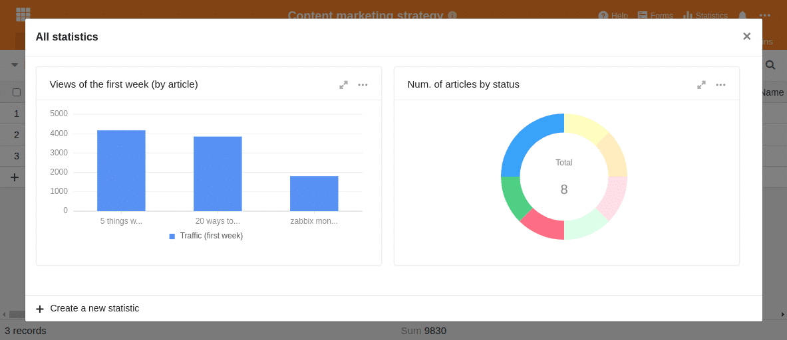

Content Marketing ist ein beliebter Marketingansatz, um die eigenen Produkte bei den Kunden und potenziellen Interessenten zu platzieren. Der grundsätzliche Gedanke hinter Content Marketing ist dabei denkbar einfach: Man erstellt Inhalte für seine Zielgruppe, publiziert diese und begeistert seine Kunden.

So einfach es auf den ersten Blick klingen mag – Content Marketing funktioniert nur, wenn Sie qualitativ hochwertige Inhalte bieten, die den Kunden interessieren; und wenn Sie eine passende Struktur und die passenden Werkzeuge für die Planung, Umsetzung und Learnings haben. Denn eine Content Marketing Strategie zielt nicht auf kurzfristige Effekte ab, wie es z. B. bei bezahlter Werbung wäre, sondern stellt einen langfristigen, organischen Vertriebs- und Kommunikationsansatz heutiger Unternehmen dar.

Um eine eigene Content Marketing Strategie aufbauen und ein geeignetes Tool auswählen zu können, ist es erst einmal wichtig zu verstehen, was Content Marketing genau ist und wie die einzelnen Teile miteinander zusammenhängen.

## Welche Vorteile hat Content Marketing?

Jede Art von Marketing zielt darauf ab, die Aufmerksamkeit von Menschen oder Kunden zu gewinnen. Doch während Werbung typischerweise versucht Menschen zu einer unmittelbaren Aktion zu verleiten, will Content Marketing Menschen schon weit vor dem eigentlichen Produktinteresse ansprechen. Man möchte durch spannende Geschichten und Inhalte Menschen in jedem Abschnitt der [Customer Journey](https://de.wikipedia.org/wiki/Customer_Journey) erreichen und für das eigene Unternehmen und die eigenen Produkte sensibilisieren.

Natürlich können Sie eine Content Marketing Strategie auch so ausrichten, dass der Verkauf von Produkten im Vordergrund steht. Normalerweise ist aber beabsichtigt, Interesse zu wecken, eine Marke bekannt zu machen oder eine positive Assoziation mit einer Marke oder einem Produkt zu erzielen.

Gerade wenn Sie erklärungsbedürftige Produkte entwickeln oder es nicht den _einen_ Kaufmoment gibt, verspricht Content Marketing langfristig erfolgreicher und wirkungsvoller zu sein als bezahlte Werbung, die große Streuverluste mit sich bringen kann. Wenn Ihre Firma den Content sinnvoll auf eine zukünftige Zielgruppe zuschneidet, wird sich der potenzielle Kunde im entsprechenden Moment an Ihre Marke erinnern und sich für das entsprechende Produkte entscheiden.

### Die Vorteile von Content Marketing im Überblick

- richtet sich an eine Zielgruppe und möchte einen Nutzen stiften
- funktioniert in allen Phasen der Customer Journey
- ist weniger aufdringlich und wird tendenziell weniger als Werbung wahrgenommen
- kann sich über virale Effekte selbst verstärken
- harmoniert mit SEO, PR und Social Media Marketing

**Gleichzeitig hat Content Marketing auch Schwächen**

- sorgt nicht für unmittelbare Verkäufe
- ist eine langfristig angelegte Strategie
- besteht zum großen Teil aus Fleiß, Ausdauer und konstantem Lernen

Diese Schwächen bestätigt auch eine [Untersuchung aus dem Jahre 2016](https://www.forbes.com/sites/sujanpatel/2016/01/03/what-your-2016-content-marketing-strategy-should-look-like/#69c6a60a342e), welche deutlich das zentrale Problem des Content Marketings zeigt: Obwohl 76 Prozent der befragten Unternehmer mit einer Content Marketing Strategie arbeiten und davon überzeugt sind, dass Content Marketing funktioniert, sagen nur 37 Prozent, dass sie mit ihrer Strategie erfolgreich sind.

Die Autoren der Studie kommen zu dem Schluss, dass Content Marketing zwar ein erfolgreiches Marketing-Instrument ist, aber eben nur, wenn man nicht wahllos irgendwelche Inhalte und Beiträge erzeugt. Der entscheidende Unterschied besteht darin, das eigene Vorgehen zu planen, einen Prozess und eine Struktur zu etablieren und ein Tool zu verwenden, welches sich den eigenen Bedürfnissen anpasst und dem Team hilft, alle Informationen im Blick zu behalten.

Worauf kommt es also bei einer Content Marketing Strategie an? Was muss eine Softwarelösung können, damit sie den Prozess zur Content-Erstellung optimal unterstützt?

## Die drei P’s des Content Marketings

Es gibt verschiedene Definitionen von Content Marketing, aber die Beschreibung mit den drei P’s trifft es am besten. Diese stehen für die drei englischen Begriffe: _Preparation_, _Production_ und _Publication_. Teilweise liest man auch von _Produce_, _Publish_ und _Promote_. Am Ende geht es aber immer um die zielgerichtete Erarbeitung von kundenrelevantem Content.

**Preparation** umfasst die strategische Planung und Vorbereitung der eigenen Content Strategie. Hierbei sollten Sie die Zielgruppe oder fiktive [Personas](<https://en.wikipedia.org/wiki/Persona_(user_experience)>) auswählen, die richtigen Kanäle und SEO-Begriffe identifizieren und daraus einen Plan für den richtigen Content entwickeln.

**Production** besteht aus allen notwendigen Schritten, um die Inhalte zum Leben zu erwecken und deren Entstehung zu überwachen. Dafür legen Sie fest, wer die Inhalte bis wann erstellt, was die genauen Keywords und Überschriften sein sollen, wer die Informationen zuliefert und später die Inhalte redigiert etc.

**Publication** ist der dritte und letzte Schritt im Content Marketing und umfasst die Veröffentlichung, das Bewerben der Inhalte, die Auswertung der Zugriffe und eine konstante Rückkopplung zur Verbesserung des Prozesses.

## Warum reine Kanban- und Prozessmanagement-Tools nicht für das Content Marketing geeignet sind

Es ist wichtig zu verstehen, dass Content Marketing üblicherweise aus vielen kleinen Puzzleteilen besteht und dass nicht ein einziger guter Artikel den gewünschten Erfolgt bringt. Beispielsweise erstellt die SEO-Agentur _Content Marketing Star_ selbst bei kleinen Projekten eine Content Pipeline mit Dutzenden, wenn nicht sogar Hunderten Suchbegriffen, und erstellt dann den passenden Content.

Content Marketing erfordert ein Tool, das den Überblick über diese Masse an Informationen ermöglicht und eine zielgerichtete Veröffentlichung von geplanten Inhalten erlaubt.

Typische Kanban- und Projektmanagement-Tools wie Trello oder Asana sind mit dieser großen Menge an Informationen schnell überfordert. Wenn man z. B. eine Google Keywordrecherche mit Hunderten von SEO-Begriffen in so eine Software importiert, hat man praktisch schon die notwendige Übersicht verloren.

Gehen wir also die Schritte durch, die notwendig sind, um eine Content Marketing Strategie aufzubauen, und wie ein geeignetes Content Marketing Tool aussieht.

## 1\. Definition der Persona / Zielgruppe

Im Marketing geht man davon aus, dass man seinen Kunden kennen sollte, um diesem ein passendes Angebot zu machen. Typischerweise gibt es hier zwei Konzepte, wie man dabei vorgeht: Entweder Sie definieren eine Zielgruppe oder nutzen eine sogenannte Persona.

Mit einer Zielgruppe bezeichnen Sie alle Menschen, die Sie mit einer Marketingkampagne ansprechen wollen. Eine Zielgruppe ist somit eine Teilmenge Ihres Gesamtmarkts und wird typischerweise aus einer Marktsegmentierung gebildet. Diese Segmentierung kann z. B. anhand des Alters, des Geschlechts, des Wohnortes, der persönlichen Vorlieben etc. erfolgen.

Eine Zielgruppe ist in sich nicht homogen, sondern die Individuen innerhalb der Zielgruppe sind mit Ausnahme der definierten Kriterien unterschiedlich.

Aus diesem Grund wurde das Konzept der Persona entwickelt. Dieses beschreibt, im Gegensatz zur Zielgruppe, eine fiktive Person, die einen typischen Kunden repräsentiert. Dabei versucht man so genau wie möglich diese fiktive Person in all ihren Facetten zu beschreiben, um damit die Bedürfnisse, Herausforderungen und Handlungen dieses potenziellen Kunden besser zu verstehen. Auf diese Weise können Sie die Inhalte noch besser und individueller auf Ihre Kunden zuschneiden.

### Wer sind Ihre potenziellen Kunden?

Wenn Sie also eine Pipeline mit qualitativ hochwertigen Inhalten aufbauen möchten, ist es wichtig, Klarheit darüber zu erlangen, wer Ihre Kunden wirklich sind und welche Inhalte diese lesen möchten. Deshalb wird im Content Marketing häufiger mit Personas gearbeitet.

Je genauer Sie Ihre Persona beschreiben, desto einfacher wird es Ihnen fallen, ihre Erwartungen und ihr Verhalten in Bezug auf Ihren Content vorherzusagen. Und genau das wollen Sie ja mit Content Marketing erreichen. Sie möchten Inhalte gestalten und produzieren, die als hilfreich angesehen werden und die Ihre zukünftigen Kunden gerne lesen.

Versuchen Sie Ihre Personas so genau wie möglich zu beschreiben:

- Welchen Beruf haben sie?
- In welcher Position arbeiten sie?
- Welche Herausforderungen haben sie?
- Welche Inhalte erwarten sie und was hilft ihnen weiter?
- …

Angenommen Ihre Firma hat die folgenden drei Kundensegmente:

- Selbstständige Designer
- Kreative Teams
- Kreativagenturen

Dann wäre Ihre erste Aufgabe, alles über diese Kundensegmente und damit über Ihre Personas herauszufinden. Überlegen Sie es sich nicht nur, sondern dokumentieren Sie Ihre Ergebnisse.

Beispielhafte Beschreibung der Personas in SeaTable

### Erstellen Sie zielgerichteten Content für Ihre Kunden

Selbstständige Designer lesen z. B. sehr gerne Artikel auf [medium.com](https://medium.com/@seatable). Sie nutzen vorwiegend Apple Geräte und fahren eher Fahrrad als einen Porsche. Sie lieben es, Bilder als Inspirationsquelle präsentiert zu bekommen. Zudem freuen Sie sich über konkrete Tutorials, How-tos und Inhalte, die Sie unmittelbar in Ihrer Arbeit weiterbringen. Um diese Persona für ein Produkt zu begeistern, benötigen Sie normalerweise nur etwas Motivationshilfe. Ein grundsätzliches Interesse ist in jedem Fall gegeben. Liefern Sie deshalb konkrete Tipps und praktische Hilfestellungen. Das passende Format könnten kurze YouTube-Videos und passende Blog-Artikel auf medium.com oder dem Firmenblog sein.

Kreative Teams verlangen nach Empfehlungen für neue Tools und nach effizienzsteigernden Prozessverbesserungen. Ein solches Team kennt vielleicht schon Ihr Produkt und benötigt ein paar Success Stories von anderen Kunden, um sich für eine Probeversion zu registrieren oder ein Testprodukt zu bestellen.

Kreativagenturen arbeiten hingegen bereits deutlicher formalisierter. Einzelne Mitarbeiter lassen sich wahrscheinlich schnell für ein neues Tool begeistern, aber gleichzeitig müssen diese ihre Geschäftsführung von dem konkreten Nutzen überzeugen. Helfen Sie diesen Personen mit Hinweisen zur Effizienzsteigerung oder den konkreten Vorteilen Ihrer Lösung. Das geht am besten mit Success Stories, Presseberichten und Whitepapers.

Ausgestattet mit diesem Wissen über Ihre Kunden und deren Bedürfnisse können Sie nun zur Produktionsphase übergehen.

## 2\. Die Produktion des Contents für Ihr Content Marketing

Die entscheidenden Herausforderungen bei der Content-Erstellung sind die Überwachung des Fortschritts und die Zuweisung der Verantwortlichkeit. Vergessen Sie Kanban- oder umfangreiche Projektmanagement-Tools, mit denen Sie schon bei einer Handvoll Einträgen die Übersicht verlieren.

Legen Sie bei jedem Blog-Beitrag, bei jedem Video, bei jeder Online-Erwähnung fest, wer im Team die Verantwortung dafür trägt und bis wann dieser Inhalt fertig sein soll. Selbst wenn fremde Inhalte zugeliefert werden müssen oder zeitliche Abhängigkeiten bestehen, lassen Sie sich davon nicht beirren. Nur wenn Sie klare Verantwortlichkeiten definieren, kann die Content-Erstellung zu einer effizienten Pipeline werden.

### Bringen Sie Ordnung in Ihre Content Pipeline

In der folgenden Tabelle sehen Sie eine Grundstruktur, die Sie beliebig an Ihre Bedürfnisse anpassen können. Für jeden Inhalt sollten die folgenden Informationen erfasst werden:

- Titel der Publikation
- Status (von Brainstorming bis Publiziert)
- Verantwortlicher Autor
- Veröffentlichungsdatum
- Publikationskanal
- Persona (für wen der Artikel relevant ist)
- Content-Idee (woher die Idee kam)

Diese Tabelle unseres [Content Marketing Strategy Templates]() wirkt zwar auf den ersten Blick ziemlich umfangreich, ist aber für eine durchschnittliche Content Pipeline das Minimum, um die notwendige Übersicht zu behalten. Gewöhnen Sie sich vom ersten Tag an diese Daten zu erfassen und Sie werden keine Probleme haben, zu jedem Zeitpunkt den Überblick zu behalten.

### Ermöglichen Sie einen individuellen Blick auf die Daten

Ein weiteres Highlight dieses Templates sind die verschiedenen Ansichten mit vordefinierten Filtern und Gruppierungen. So können Sie sicher sein, dass die verschiedenen Mitarbeiter immer den perfekten Überblick bekommen. Gleichzeitig sind diese Ansichten ideal geeignet, um die persönliche Verantwortlichkeit sicherzustellen.

Grafiker werden sich nur für die Artikel interessieren, die überhaupt eine Grafik erfordern und die bereits fertig geschrieben sind, während die Autoren nur nach den noch offenen Arbeiten Ausschau halten werden. Für jeden dieser Mitarbeiter gibt es eine eigene Ansicht, um nur die Daten angezeigt zu bekommen, die man gerade benötigt.

Individuelle Ansichten für jeden Mitarbeiter

Jeder Mitarbeiter weiß genau, bei wem die Aufgabe gerade liegt und wer als nächstes daran arbeiten muss. So vermeiden Sie Wartezeiten und Verwirrung. Sobald ein Autor seinen Draft geschrieben hat, ändert er den Status des Artikels und übergibt diesen zur Qualitätskontrolle an den nächsten Mitarbeiter. Sollte eine Abstimmung zwischen den Mitarbeitern notwendig sein, kann dies ganz einfach über die [Kommentarfunktion](https://seatable.io/docs/handbuch/zusammenarbeit/kommentare/) innerhalb von SeaTable erledigt werden.

So muss niemand per E-Mail oder Slack nach einem Update fragen. Man fügt einfach den entsprechenden Kollegen in den Kommentaren hinzu oder verändert den Status des Artikels. Auf Wunsch verschickt SeaTable auch eine E-Mail-Benachrichtigung.

Als Autor oder Redakteur möchten Sie vielleicht die geplanten Veröffentlichungsdaten in einer Kalenderansicht angezeigt bekommen. Dort können Sie die Artikel bequem per Drag & Drop verschieben, um die Fristen neu zu ordnen und sicherzustellen, dass konstant guter Content veröffentlicht wird.

Redaktionsplanung per Drag & Drop in SeaTable

Jede dieser unterschiedlichen Ansichten hebt bestimmte Aspekte der Content Pipeline hervor, während andere versteckt oder ausgeblendet werden. So erhält jeder im Team genau die richtige Menge an Informationen, die er für seine Arbeit benötigt.

### Sorgen Sie für beständig neue Ideen

Sorgen Sie auch dafür, dass Ihnen nicht vorzeitig die Ideen ausgehen. Fragen Sie Ihre Mitarbeiter und Ihre Kunden nach Ideen oder nach Themen, die Sie interessieren. Mit SeaTable erzeugen Sie einen entsprechenden Fragebogen in wenigen Minuten und können diesen dann verteilen.

Ihr Ziel sollte es sein, beständig im Austausch mit Ihren Kunden zu stehen und die Hürden zum Melden solcher Ideen so gering wie möglich zu halten. Sie werden sehen: Der beste Weg, um in regelmäßigen Abständen guten Content zu veröffentlichen, besteht darin, einen konstanten Strom hochwertiger Ideen zu erhalten.

## 3\. Veröffentlichung und Analyse

Eine gute Strategie und guter Content alleine reichen aber noch nicht, um das volle Potenzial von Content Marketing auszuschöpfen. Unternehmen, die mit Content Marketing wirklich erfolgreich sind, arbeiten konsequent daran, aus ihren Fehlern zu Lernen und etablieren einen konstante Feedbackschleife.

Sie hören zu, was die Leute über die Artikel sagen, und überlegen, was sie davon in kommenden Artikeln verwenden können. Gleichzeitig überarbeiten sie ihre Personas und beobachten, auf welche Artikel ihre Community besonders gut reagiert hat und bei welchem Keyword die meiste Interaktion aufgetreten ist.

Richten Sie auf Ihrer Webseite einen Feedback-Bereich ein und erlauben Sie Ihren Kunden, Ihnen direkt über ein Formular ihre Gedanken mitzuteilen. Dieses Feedback können Sie unmittelbar nutzen, um Ihre kommenden Artikel besser an den Wünschen Ihrer Kunden auszurichten.

Diese Art von Analyse zur Verbesserung der eigenen Content Marketing Strategie ist wahrlich keine Raketenwissenschaft, sondern hauptsächlich das Ergebnis einfacher, checklistenähnlicher Aktionen, die in den meisten Fällen einfach nur vergessen werden oder denen man keine Priorität einräumt.

Machen Sie nicht den gleichen Fehler und etablieren Sie von Anfang an solche Feedback- und Analyseprozesse. SeaTable liefert Ihnen alle notwendigen Fähigkeiten, die Sie benötigen.

### Machen Sie sich eine Feedback-Checkliste

Achten Sie darauf, dass Ihre Artikel immer einer Ihrer Personas zugeordnet sind. Nur so haben Sie die Möglichkeit, Ihren Content nach der Veröffentlichung zu überprüfen und diesen im Laufe der Zeit kontinuierlich zu verbessern. Schreiben Sie Inhalte gemäß der Annahmen über die Wünsche Ihrer Kunden und verfeinern Sie diese Erkenntnisse fortlaufend.

Zwingen Sie sich, auf diese strukturierte Weise über Inhalte nachzudenken, um wirklich Herr über Ihre strategischen Entscheidungen zu sein.

### Überwachen Sie die tatsächlichen Zugriffszahlen

Sie werden schnell feststellen, dass Sie bei guten Artikeln schon nach wenigen Wochen einen Zuwachs an organischem Traffic auf Ihrer Webseite beobachten können. Machen Sie sich die Mühe und speichern Sie die Zugriffszahlen Ihrer Artikel regelmäßig. Anfangs sollten Sie die Zahlen noch manuell aus [Google Analytics](https://analytics.google.com/analytics/web/) übernehmen, später können Sie eine automatische Datenerfassung, z. B. mit [Zapier](https://zapier.com/apps/google-analytics/integrations/seatable) oder der [SeaTable API](https://api.seatable.com), einrichten.

Sie werden sehen, dass es sich lohnt, diese Auswertungen in SeaTable zu erfassen, um sich die Zahlen anschließend als Statistik in einem Balken-, Linien- oder Kuchendiagramm anzeigen zu lassen.

Statistische Auswertungen der Zugriffszahlen und der geplanten Postings mit SeaTable

Das Analysieren Ihrer Inhalte und Zugriffszahlen kann in der Hektik der nächsten Veröffentlichungen leicht untergehen. Natürlich ist es wichtig, dass Sie regelmäßig neuen Content veröffentlichen. Trotzdem sollten Sie sich die Zeit nehmen, bei jedem Artikel, den Sie veröffentlichen, eine kurze Erwähnung auf Facebook, Twitter oder LinkedIn zu posten. Auch für diesen Schritt können Sie SeaTable zur Planung nutzen oder das Posting direkt per Zapier absetzen. Sie werden begeistert sein, wie viel sich in Ihrem Content Marketing Prozess optimieren lässt, wenn Sie sich etwas Zeit nehmen und über Verbesserungen nachdenken.

## Ein Redaktionsplan zur Organisation Ihrer Content Marketing Strategie

Es fragt sich, warum so viele Unternehmer das Gefühl haben, dass ihr Content Marketing nicht funktioniert. Wahrscheinlich liegt es daran, dass die Unternehmen entweder keine Strategie oder das falsche Tool haben.

Überzeugen Sie sich selbst davon, dass Content Marketing ein wirksames Mittel ist und entscheidend zu Ihrem Unternehmenserfolg beitragen kann. Wenn Sie Erfolg haben wollen, dann verzichten Sie auf austauschbare Inhalte und unübersichtliche Projektmanagement-Tools.

Verwenden Sie SeaTable, um Ihre Personas, Ziele und Inhalte festzulegen und deren Erarbeitung genauestens zu überwachen. Etablieren Sie einen sich selbst verbessernden Prozess und Sie werden sehen, wie sich der Erfolg einstellen wird. Starten Sie jetzt mit unseren [Marketing-Templates]() und passen Sie diese an Ihre Bedürfnisse an.
