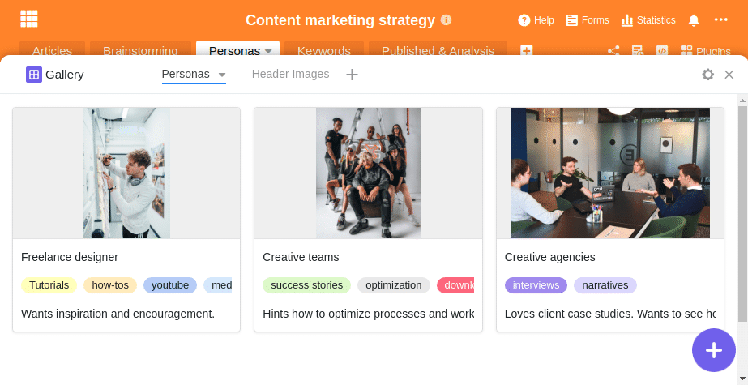
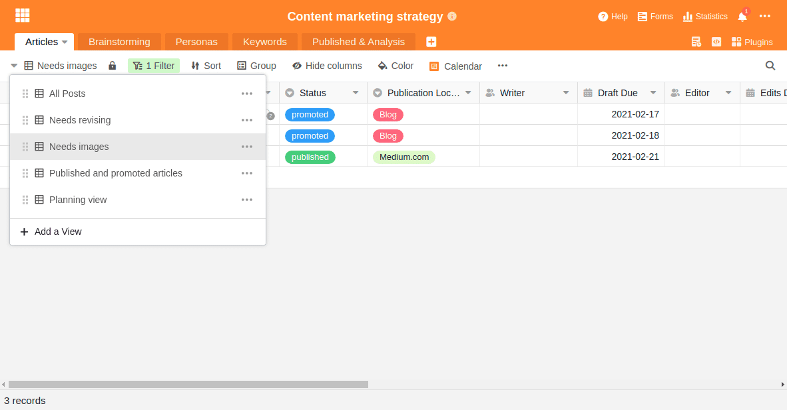
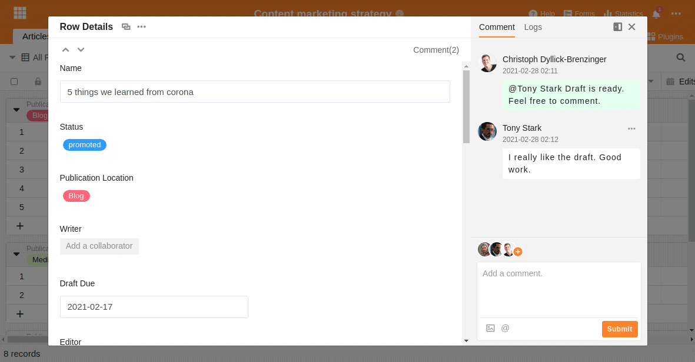
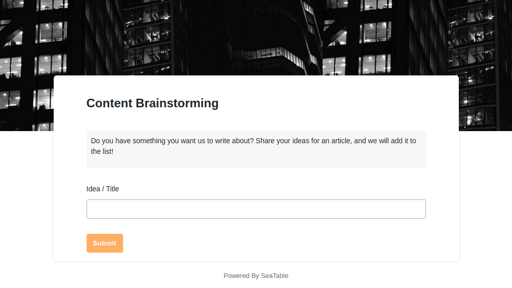
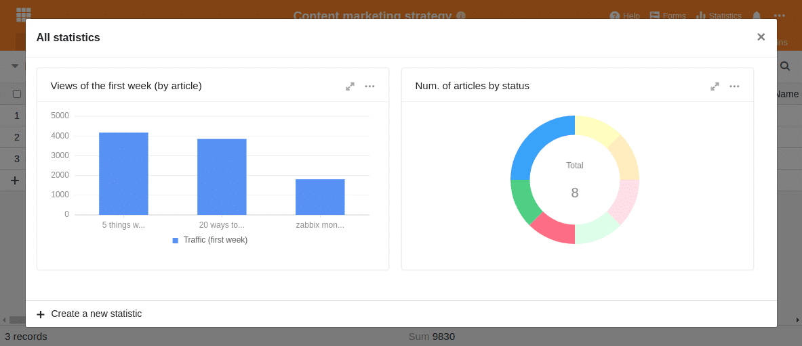

Content marketing is a popular marketing approach to place one's own products with customers and potential prospects. The basic idea behind content marketing is very simple: you create content for your target group, publish it and inspire your customers.

As simple as it may sound at first glance - content marketing only works if you offer high-quality content that interests the customer; and if you have a suitable structure and the right tools for planning, implementation and learnings. Because a content marketing strategy is not aimed at short-term effects, as it would be with paid advertising, for example, but represents a long-term, organic sales and communication approach of today's companies.

In order to build your own content marketing strategy and select a suitable tool, it is first important to understand what content marketing is exactly and how the individual parts are interrelated.

## What are the advantages of content marketing?

Every type of marketing aims to capture the attention of people or customers. But while advertising typically tries to entice people to take an immediate action, content marketing aims to engage people well before they are actually interested in the product. You want to use exciting stories and content to engage people at every stage of the [Customer Journey](https://de.wikipedia.org/wiki/Customer_Journey) and raise awareness for their own company and products.

Of course, you can also align a content marketing strategy to focus on selling products. But usually the intention is to generate interest, make a brand known, or create a positive association with a brand or product.

Especially if you are developing products that require explanation or there is no _one_ moment to buy, content marketing promises to be more successful and effective in the long run than paid advertising, which can involve large wastage. If your company tailors the content sensibly to a future target group, the potential customer will remember your brand at the appropriate moment and decide in favor of the corresponding product.

### The advantages of content marketing at a glance

- is aimed at a target group and wants to provide a benefit
- Works in all phases of the customer journey
- Is less intrusive and tends to be perceived less as advertising
- Can be self-reinforcing via viral effects
- harmonizes with SEO, PR and social media marketing

**At the same time, content marketing also has weaknesses**

- Does not ensure immediate sales
- is a long-term strategy
- consists largely of diligence, perseverance and constant learning

These weaknesses are also confirmed by a [2016 study](https://www.forbes.com/sites/sujanpatel/2016/01/03/what-your-2016-content-marketing-strategy-should-look-like/#69c6a60a342e), which clearly shows the central problem of content marketing: although 76 percent of the entrepreneurs surveyed work with a content marketing strategy and are convinced that content marketing works, only 37 percent say they are successful with their strategy.

The authors of the study conclude that content marketing is a successful marketing tool, but only if you don't randomly create content and posts. The key difference is to plan your approach, establish a process and structure, and use a tool that adapts to your needs and helps your team keep track of all the information.

So what is important in a content marketing strategy? What must a software solution be able to do in order to optimally support the content creation process?

## The three P's of content marketing

There are various definitions of content marketing, but the description with the three P's sums it up best. These stand for the three English terms: _Preparation_, _Production_ and _Publication_. Partly one reads also from _Produce_, _Publish_ and _Promote_. In the end, however, it is always about the targeted development of customer-relevant content.

**Preparation** includes the strategic planning and preparation of your own content strategy. Here you should consider the target group or fictitious [Personas](<https://en.wikipedia.org/wiki/Persona_(user_experience)>) select, identify the right channels and SEO terms, and from that develop a plan for the right content.

**Production** consists of all the necessary steps to bring the content to life and monitor its creation. For this purpose, you define who will create the content and by when, what the exact keywords and headlines should be, who will supply the information and later edit the content, etc.

**Publication** is the third and final step in content marketing and includes publishing, promoting the content, evaluating the hits and constant feedback to improve the process.

## Why pure kanban and process management tools are not suitable for content marketing

It is important to understand that content marketing usually consists of many small puzzle pieces and that not one good article will bring the desired success. For example, the SEO agency creates [Content Marketing Star](/content-marketing-star/) even for small projects, a content pipeline with dozens, if not hundreds, of search terms, and then creates the appropriate content.

Content marketing requires a tool that provides an overview of this mass of information and allows targeted publication of planned content.

Typical Kanban and project management tools like Trello or Asana are quickly overwhelmed with this large amount of information. For example, if you import a Google keyword research with hundreds of SEO terms into such a software, you have practically already lost the necessary overview.

So let's go through the steps necessary to build a content marketing strategy and what a suitable content marketing tool looks like.

## 1\. definition of the persona / target group

In marketing, it is assumed that you should know your customer in order to make him a suitable offer. Typically, there are two concepts how to proceed: Either you define a target group or use a so-called persona.

You use a target group to refer to all the people you want to address with a marketing campaign. A target group is thus a subset of your total market and is typically formed from market segmentation. This segmentation can be based on, for example, age, gender, location, personal preferences, etc.

A target group is not homogeneous in itself, but the individuals within the target group are different except for the defined criteria.

For this reason, the concept of the persona was developed. In contrast to the target group, this describes a fictitious person who represents a typical customer. The aim is to describe this fictitious person as accurately as possible in all their facets in order to better understand the needs, challenges and actions of this potential customer. In this way, you can tailor the content even better and more individually to your customers.

### Who are your potential customers?

So if you want to build a pipeline of high-quality content, it's important to get clarity on who your customers really are and what content they want to read. That's why content marketing more often works with personas.

The more precisely you describe your persona, the easier it will be for you to predict their expectations and behavior in relation to your content. And that's exactly what you want to achieve with content marketing. You want to design and produce content that is seen as helpful and that your future customers will enjoy reading.

Try to describe your personas as accurately as possible:

- What is their profession?
- In which position do they work?
- What challenges do they have?
- What content do they expect and what helps them?
- …

Suppose your company has the following three customer segments:

- Independent designers
- Creative teams
- Creative agencies

Then your first task would be to find out everything you can about these customer segments and thus about your personas. Don't just think about it, document your findings.

Example description of the personas in SeaTable

### Create targeted content for your customers

Self-employed designers, for example, love reading articles on [medium.com](https://medium.com/@seatable). They mainly use Apple devices and would rather ride a bike than a Porsche. You love to be presented with images as a source of inspiration. You also enjoy concrete tutorials, how-tos, and content that directly helps you in your work. To get this persona excited about a product, you usually just need some motivational help. A basic interest is given in any case. Therefore, deliver concrete tips and practical assistance. The appropriate format could be short YouTube videos and suitable blog articles on medium.com or the company blog.

Creative teams are asking for recommendations for new tools and efficiency-boosting process improvements. Such a team may already know your product and need a few [success stories](/en/success-stories/) from other customers to sign up for a trial or order a test product.

Creative agencies, on the other hand, already work in a much more formalized way. Individual employees can probably be quickly enthused about a new tool, but at the same time they have to convince their management of the concrete benefits. Help these individuals with hints on how to increase efficiency or the concrete benefits of your solution. The best way to do this is with success stories, press releases, and white papers.

Equipped with this knowledge about your customers and their needs, you can now move on to the production phase.

## 2\. the production of the content for your content marketing

The key challenges in content creation are monitoring progress and assigning accountability. Forget Kanban or comprehensive project management tools, which can make you lose track of just a handful of entries.

For every blog post, every video, every online mention, define who in the team is responsible for it and by when that content should be ready. Even if external content has to be supplied or there are time dependencies, don't let this put you off. Only if you define clear responsibilities can content creation become an efficient pipeline.

### Bring order to your content pipeline

The following table shows a basic structure that you can adapt to your needs as you wish. The following information should be recorded for each content:

- Publication title
- Status (from brainstorming to published)
- Responsible author
- Publication date
- Publication channel
- Persona (for whom the article is relevant)
- Content idea (where the idea came from)

This table of our [Content Marketing Strategy Template](https://seatable.io/en/vorlage/akpem7oksykcemvai5eblq/) seems quite extensive at first sight, but it is the minimum for an average content pipeline to keep the necessary overview. Get into the habit of collecting this data from day one and you will have no problems keeping track at any point in time.

### Allow an individual view of the data

Another highlight of this template are the different views with predefined filters and groupings. This way you can be sure that the different employees always get the perfect overview. At the same time, these views are ideal for ensuring personal accountability.

Graphic designers will only be interested in the articles that require graphics at all and that are already written, while authors will only look for the work that is still open. For each of these collaborators there is a separate view to display only the data one needs at the moment.

Individual views for each employee

Every employee knows exactly who has the task at hand and who has to work on it next. This helps you avoid waiting times and confusion. As soon as an author has written his draft, he changes the status of the article and passes it on to the next employee for quality control. If coordination between collaborators is necessary, this can easily be done via the [comment function](https://seatable.io/en/docs/handbuch/zusammenarbeit/kommentare/) within SeaTable.

This way, no one has to ask for an update via email or Slack. You simply add the corresponding colleague in the comments or change the status of the article. If desired, SeaTable also sends an email notification.

As an author or editor, you may want to see scheduled publication dates in a calendar view. There, you can conveniently drag and drop articles to rearrange deadlines and ensure consistently good content is published.

Editorial planning via drag & drop in SeaTable

Each of these different views highlights certain aspects of the content pipeline, while hiding or masking others. This way, everyone on the team gets exactly the right amount of information they need to do their job.

### Ensure constant new ideas

Also make sure that you don't run out of ideas prematurely. Ask your employees and your customers for ideas or for topics that interest you. With SeaTable you can create a questionnaire in minutes and distribute it.

Your goal should be to be in constant exchange with your customers and to keep the barriers to reporting such ideas as low as possible. You'll see: The best way to publish good content at regular intervals is to maintain a constant stream of high-quality ideas.

## 3\. publication and analysis

However, a good strategy and good content alone are not enough to exploit the full potential of content marketing. Companies that are truly successful with content marketing work consistently to learn from their mistakes and establish a constant feedback loop.

They listen to what people are saying about the articles and consider what they can use from them in upcoming articles. At the same time, they revise their personas and observe which articles their community has responded particularly well to and which keyword has seen the most interaction.

Set up a feedback section on your website and allow your customers to give you their thoughts directly via a form. You can immediately use this feedback to better align your upcoming articles with your customers' wishes.

This kind of analysis to improve one's content marketing strategy is truly not rocket science, but mainly the result of simple, checklist-like actions that in most cases are simply forgotten or not given priority.

Don't make the same mistake and establish such feedback and analysis processes from the beginning. SeaTable provides you with all the necessary capabilities you need.

### Make yourself a feedback checklist

Make sure that your articles are always assigned to one of your personas. Only then will you have the opportunity to review your content after publication and continuously improve it over time. Write content according to assumptions about what your customers want and continually refine these insights.

Force yourself to think about content in this structured way to truly be the master of your strategic decisions.

### Monitor the actual access figures

You will quickly notice that with good articles you can observe an increase in organic traffic to your website after just a few weeks. Make the effort and save the access figures of your articles regularly. In the beginning you should still take the numbers manually from [Google Analytics](https://analytics.google.com/analytics/web/), later you can set up automatic data collection, e.g. with [Zapier](https://zapier.com/apps/google-analytics/integrations/seatable) or the [SeaTable API](https://api.seatable.io).

You will see that it is worthwhile to record these evaluations in SeaTable in order to subsequently display the figures as statistics in a bar, line or pie chart.

Statistical evaluations of access figures and scheduled postings with SeaTable

Analyzing your content and traffic numbers can easily get lost in the hustle and bustle of your next release. Of course, it's important that you publish new content regularly. However, you should still take the time to post a quick mention on Facebook, Twitter, or LinkedIn for every article you publish. You can use SeaTable to schedule this step as well, or Zapier the post directly. You'll be amazed at how much can be optimized in your content marketing process if you take some time to think about improvements.

## An editorial plan to organise your content marketing strategy

It makes you wonder why so many business owners feel that their content marketing isn't working. It's probably because businesses either don't have a strategy or have the wrong tool.

Convince yourself that content marketing is an effective tool and can make a decisive contribution to your company's success. If you want to be successful, do away with interchangeable content and confusing project management tools.

Use SeaTable to set your personas, goals and content and closely monitor their development. Establish a self-improving process and you will see how success will come. Get started now with our [marketing templates](https://seatable.io/en/vorlage/akpem7oksykcemvai5eblq/) and customize them to fit your needs.
