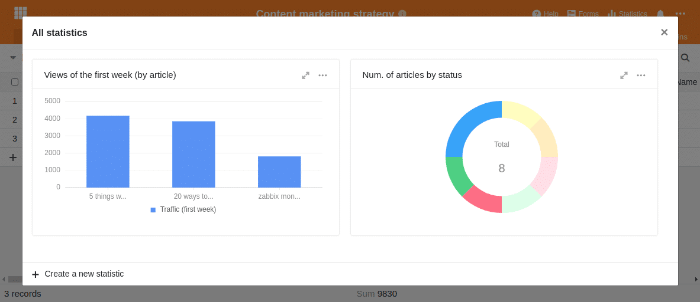

Le marketing de contenu est une approche marketing très appréciée pour placer ses produits auprès des clients et des prospects potentiels. L'idée de base du marketing de contenu est très simple : on crée des contenus pour son groupe cible, on les publie et on enthousiasme ses clients.

Aussi simple que cela puisse paraître à première vue, le marketing de contenu ne fonctionne que si vous proposez un contenu de qualité qui intéresse le client ; et si vous disposez d'une structure et d'outils appropriés pour la planification, la mise en œuvre et les apprentissages. En effet, une stratégie de marketing de contenu ne vise pas des effets à court terme, comme ce serait par exemple le cas avec la publicité payante, mais représente une approche de vente et de communication organique à long terme des entreprises actuelles.

Pour pouvoir mettre en place sa propre stratégie de marketing de contenu et choisir un outil approprié, il est tout d'abord important de comprendre ce qu'est exactement le marketing de contenu et comment les différentes parties sont liées entre elles.

## Quels sont les avantages du marketing de contenu ?

Tout type de marketing vise à attirer l'attention des gens ou des clients. Mais alors que la publicité tente typiquement d'inciter les gens à une action immédiate, le marketing de contenu vise à attirer les gens bien avant qu'ils ne s'intéressent réellement au produit. On souhaite, par le biais d'histoires et de contenus passionnants, toucher les gens à chaque étape de leur vie. [Customer Journey](https://de.wikipedia.org/wiki/Customer_Journey) atteindre et sensibiliser à leur propre entreprise et à leurs propres produits.

Il est bien sûr possible d'orienter une stratégie de marketing de contenu de manière à ce que la vente de produits soit au premier plan. Mais l'objectif est généralement d'éveiller l'intérêt, de faire connaître une marque ou de créer une association positive avec une marque ou un produit.

C'est justement lorsque vous développez des produits nécessitant des explications ou qu'il n'y a pas _un seul_ moment d'achat que le content marketing promet d'être plus efficace et plus réussi à long terme que la publicité payante, qui peut entraîner de grandes pertes de diffusion. Si votre entreprise adapte judicieusement le contenu à un futur groupe cible, le client potentiel se souviendra de votre marque au moment approprié et se décidera pour le produit correspondant.

### Aperçu des avantages du marketing de contenu

- s'adresse à un groupe cible et veut apporter un bénéfice
- fonctionne à toutes les étapes du parcours client
- est moins intrusif et a tendance à être moins perçu comme une publicité
- peut s'auto-amplifier par des effets viraux
- s'harmonise avec le SEO, les RP et le marketing des médias sociaux

**En même temps, le marketing de contenu a aussi des faiblesses**

- n'assure pas de ventes immédiates
- est une stratégie à long terme
- se compose en grande partie d'assiduité, de persévérance et d'apprentissage constant

Ces faiblesses sont également confirmées par une [étude de 2016](https://www.forbes.com/sites/sujanpatel/2016/01/03/what-your-2016-content-marketing-strategy-should-look-like/#69c6a60a342e), qui montre clairement le problème central du marketing de contenu : bien que 76% des entrepreneurs interrogés travaillent avec une stratégie de marketing de contenu et soient convaincus que le marketing de contenu fonctionne, seuls 37% affirment que leur stratégie est couronnée de succès.

Les auteurs de l'étude concluent que le marketing de contenu est certes un instrument de marketing efficace, mais seulement si l'on ne crée pas n'importe quel contenu et contribution au hasard. La différence décisive consiste à planifier sa propre démarche, à établir un processus et une structure et à utiliser un outil qui s'adapte à ses besoins et qui aide l'équipe à garder toutes les informations en vue.

Qu'est-ce qui est important dans une stratégie de marketing de contenu ? Que doit faire une solution logicielle pour soutenir de manière optimale le processus de création de contenu ?

## Les trois P du marketing de contenu

Il existe différentes définitions du marketing de contenu, mais la description avec les trois P est celle qui correspond le mieux. Ceux-ci représentent les trois termes anglais : _Preparation_, _Production_ et _Publication_. On lit aussi parfois _Produce_, _Publish_ et _Promote_. Mais au final, il s'agit toujours d'élaborer de manière ciblée un contenu pertinent pour le client.

**Preparation** comprend la planification stratégique et la préparation de votre propre stratégie de contenu. Pour ce faire, il convient de définir le groupe cible ou des [Personas](<https://en.wikipedia.org/wiki/Persona_(user_experience)>) sélectionner, identifier les bons canaux et les termes SEO et, à partir de là, élaborer un plan pour le bon contenu.

**Production** consiste en toutes les étapes nécessaires pour donner vie aux contenus et surveiller leur création. Pour cela, vous déterminez qui doit créer le contenu et quand, quels doivent être les mots-clés et les titres exacts, qui doit fournir les informations et qui doit ensuite rédiger le contenu, etc.

**Publication** est la troisième et dernière étape du marketing de contenu et comprend la publication, la promotion du contenu, l'évaluation du trafic et un retour d'information constant pour améliorer le processus.

## Pourquoi les outils purement Kanban et de gestion des processus ne sont pas adaptés au marketing de contenu

Il est important de comprendre que le marketing de contenu se compose généralement de nombreuses petites pièces de puzzle et qu'un seul bon article ne permet pas d'obtenir le résultat escompté. Par exemple, l'agence de référencement crée _Content Marketing Star_ même pour les petits projets, un pipeline de contenu avec des dizaines, voire des centaines de termes de recherche, et crée ensuite le contenu approprié.

Le marketing de contenu nécessite un outil qui permette d'avoir une vue d'ensemble de cette masse d'informations et de publier de manière ciblée les contenus prévus.

Les outils typiques de gestion de projet et de kanban comme Trello ou Asana sont rapidement dépassés par cette grande quantité d'informations. Si l'on importe par exemple une recherche de mots-clés Google avec des centaines de termes SEO dans un tel logiciel, on a pratiquement déjà perdu la vue d'ensemble nécessaire.

Passons donc en revue les étapes nécessaires à la mise en place d'une stratégie de marketing de contenu et à quoi ressemble un outil de marketing de contenu approprié.

## 1\. définition du persona / groupe cible

En marketing, on part du principe qu'il faut connaître son client pour lui proposer une offre adaptée. Il existe typiquement deux approches pour ce faire : soit vous définissez un groupe cible, soit vous utilisez ce que l'on appelle un persona.

Par groupe cible, vous désignez toutes les personnes que vous souhaitez atteindre avec une campagne de marketing. Un groupe cible est donc un sous-ensemble de votre marché global et est typiquement formé à partir d'une segmentation du marché. Cette segmentation peut se faire par exemple sur la base de l'âge, du sexe, du lieu de résidence, des préférences personnelles, etc.

Un groupe cible n'est pas homogène en soi, mais les individus qui le composent sont différents, à l'exception des critères définis.

C'est pourquoi le concept de persona a été développé. Celui-ci décrit, contrairement au groupe cible, une personne fictive qui représente un client typique. On essaie de décrire le plus précisément possible cette personne fictive sous toutes ses facettes afin de mieux comprendre les besoins, les défis et les actions de ce client potentiel. De cette manière, il est possible d'adapter encore mieux et de manière plus personnalisée le contenu à vos clients.

### Qui sont vos clients potentiels ?

Par conséquent, si vous souhaitez créer un pipeline de contenus de haute qualité, il est important d'être clair sur qui sont réellement vos clients et quels contenus ils souhaitent lire. C'est pourquoi on travaille plus souvent avec des personas en content marketing.

Plus vous décrivez votre persona avec précision, plus il vous sera facile de prédire ses attentes et son comportement par rapport à votre contenu. Et c'est précisément ce que vous voulez obtenir avec le marketing de contenu. Vous voulez concevoir et produire des contenus qui seront considérés comme utiles et que vos futurs clients auront envie de lire.

Essayez de décrire vos personas le plus précisément possible :

- Quelle est leur profession ?
- Dans quelle position travaillent-ils ?
- Quels sont leurs défis ?
- Quels sont les contenus qu'ils attendent et qu'est-ce qui les aide à avancer ?
- …

Supposons que votre entreprise ait les trois segments de clientèle suivants :

- Concepteurs indépendants
- Des équipes créatives
- Agences créatives

Votre première tâche serait alors de tout découvrir sur ces segments de clientèle et donc sur vos personas. Ne vous contentez pas d'y réfléchir, mais documentez vos résultats.

Exemple de description des personas dans SeaTable

### Créez un contenu ciblé pour vos clients

Les designers indépendants, par exemple, aiment beaucoup lire des articles sur [medium.com](https://medium.com/@seatable). Ils utilisent principalement des appareils Apple et préfèrent faire du vélo plutôt que de conduire une Porsche. Ils aiment qu'on leur présente des images comme source d'inspiration. En outre, ils apprécient les tutoriels concrets, les how-tos et les contenus qui les font directement progresser dans leur travail. Pour intéresser cette persona à un produit, vous n'avez généralement besoin que d'un peu d'aide pour la motiver. Un intérêt de base est dans tous les cas présent. Fournissez donc des conseils concrets et une aide pratique. Le format approprié pourrait être de courtes vidéos YouTube et des articles de blog appropriés sur medium.com ou sur le blog de l'entreprise.

Les équipes créatives demandent des recommandations pour de nouveaux outils et des améliorations de processus qui augmentent l'efficacité. Une telle équipe connaît peut-être déjà votre produit et a besoin de quelques success stories d'autres clients pour s'inscrire à une version d'essai ou commander un produit d'essai.

Les agences créatives, quant à elles, travaillent déjà de manière plus formelle. Il est probable que les collaborateurs individuels s'enthousiasment rapidement pour un nouvel outil, mais ils doivent en même temps convaincre leur direction des avantages concrets. Aidez ces personnes en leur donnant des indications sur l'augmentation de l'efficacité ou les avantages concrets de votre solution. Le meilleur moyen d'y parvenir est d'utiliser des success stories, des articles de presse et des livres blancs.

Muni de cette connaissance de vos clients et de leurs besoins, vous pouvez maintenant passer à la phase de production.

## 2\. la production du contenu pour votre marketing de contenu

Les principaux défis de la création de contenu sont le suivi de l'avancement et l'attribution des responsabilités. Oubliez les outils Kanban ou les outils de gestion de projet complets qui vous font perdre la vue d'ensemble dès qu'il y a une poignée d'entrées.

Pour chaque contribution au blog, pour chaque vidéo, pour chaque mention en ligne, déterminez qui, au sein de l'équipe, en assume la responsabilité et à quelle date ce contenu doit être terminé. Même si des contenus étrangers doivent être fournis ou s'il existe des dépendances temporelles, ne vous laissez pas décourager. Ce n'est que si vous définissez clairement les responsabilités que la création de contenu peut devenir un pipeline efficace.

### Mettez de l'ordre dans votre pipeline de contenu

Le tableau suivant présente une structure de base que vous pouvez adapter à vos besoins. Pour chaque contenu, les informations suivantes doivent être saisies :

- Titre de la publication
- Statut (de brainstorming à publié)
- Auteur responsable
- Date de publication
- Canal de publication
- Persona (pour qui l'article est pertinent)
- Idée de contenu (d'où vient l'idée)

Ce tableau de notre [modèle de stratégie de marketing de contenu]() semble certes assez volumineux au premier abord, mais il s'agit du minimum nécessaire pour un pipeline de contenu moyen afin de conserver la vue d'ensemble nécessaire. Prenez l'habitude de saisir ces données dès le premier jour et vous n'aurez aucun problème à garder une vue d'ensemble à tout moment.

### Permettez un regard individuel sur les données

Un autre point fort de ce modèle sont les différentes vues avec des filtres et des regroupements prédéfinis. Vous pouvez ainsi être sûr que les différents collaborateurs auront toujours une vue d'ensemble parfaite. En même temps, ces vues sont idéales pour garantir la responsabilité personnelle.

Les graphistes ne s'intéresseront qu'aux articles qui nécessitent un quelconque graphisme et dont la rédaction est déjà terminée, tandis que les auteurs ne chercheront que les travaux encore en cours. Pour chacun de ces collaborateurs, il y a une vue séparée afin de n'afficher que les données dont on a besoin à un moment donné.

Des vues individuelles pour chaque employé

Chaque collaborateur sait exactement à qui la tâche est confiée et qui doit y travailler ensuite. Vous évitez ainsi les temps d'attente et la confusion. Dès qu'un auteur a rédigé son brouillon, il modifie le statut de l'article et le transmet au collaborateur suivant pour un contrôle de qualité. Si une coordination entre les collaborateurs est nécessaire, elle peut être facilement effectuée via la [fonction de commentaire](https://seatable.io/fr/docs/handbuch/zusammenarbeit/kommentare/) au sein de SeaTable.

Ainsi, personne ne doit demander une mise à jour par e-mail ou par Slack. Il suffit d'ajouter le collègue concerné dans les commentaires ou de modifier le statut de l'article. Si on le souhaite, SeaTable envoie également une notification par e-mail.

En tant qu'auteur ou rédacteur, vous souhaitez peut-être que les dates de publication prévues soient affichées dans un calendrier. Vous pouvez y déplacer facilement les articles par glisser-déposer afin de réorganiser les délais et de garantir la publication constante d'un contenu de qualité.

Planification éditoriale par glisser-déposer dans SeaTable

Chacune de ces différentes vues met en évidence certains aspects du pipeline de contenu, tandis que d'autres sont cachés ou masqués. Ainsi, chaque membre de l'équipe reçoit exactement la bonne quantité d'informations dont il a besoin pour son travail.

### Faites en sorte d'avoir constamment de nouvelles idées

Veillez également à ne pas être à court d'idées prématurément. Demandez à vos collaborateurs et à vos clients des idées ou des sujets qui vous intéressent. Avec SeaTable, vous générez un questionnaire correspondant en quelques minutes et pouvez ensuite le distribuer.

Votre objectif doit être d'être en contact permanent avec vos clients et de réduire au maximum les obstacles à la communication de ces idées. Vous verrez : Le meilleur moyen de publier régulièrement du contenu de qualité est d'obtenir un flux constant d'idées de qualité.

## 3\. publication et analyse

Une bonne stratégie et un bon contenu ne suffisent toutefois pas pour exploiter pleinement le potentiel du marketing de contenu. Les entreprises qui réussissent vraiment avec le marketing de contenu s'efforcent systématiquement d'apprendre de leurs erreurs et établissent une boucle de feedback constante.

Ils écoutent ce que les gens ont à dire sur les articles et réfléchissent à ce qu'ils peuvent utiliser dans les prochains articles. En même temps, ils révisent leurs personas et observent les articles auxquels leur communauté a particulièrement bien réagi et les mots-clés qui ont suscité le plus d'interaction.

Créez une zone de feedback sur votre site web et permettez à vos clients de vous faire part de leurs réflexions directement via un formulaire. Vous pouvez utiliser immédiatement ce feedback pour mieux adapter vos prochains articles aux souhaits de vos clients.

Ce type d'analyse visant à améliorer sa propre stratégie de marketing de contenu n'est vraiment pas une science fulgurante, mais résulte principalement d'actions simples, semblables à des check-lists, qui, dans la plupart des cas, sont simplement oubliées ou auxquelles on n'accorde pas la priorité.

Ne faites pas la même erreur et établissez dès le départ de tels processus de feedback et d'analyse. SeaTable vous fournit toutes les compétences dont vous avez besoin.

### Faites une check-list de feedback

Veillez à ce que vos articles soient toujours attribués à l'un de vos personas. Ce n'est qu'ainsi que vous aurez la possibilité de vérifier votre contenu après sa publication et de l'améliorer continuellement au fil du temps. Rédigez des contenus en fonction des hypothèses concernant les souhaits de vos clients et affinez ces connaissances en permanence.

Obligez-vous à réfléchir au contenu de cette manière structurée pour être vraiment maître de vos décisions stratégiques.

### Surveiller le nombre réel d'accès

Vous constaterez rapidement qu'avec de bons articles, vous pouvez observer une augmentation du trafic organique sur votre site web après quelques semaines seulement. Prenez la peine d'enregistrer régulièrement le nombre de visites de vos articles. Au début, reprenez manuellement les chiffres de [Google Analytics](https://analytics.google.com/analytics/web/), mais plus tard, vous pourrez mettre en place une collecte automatique des données, par exemple avec [Zapier](https://zapier.com/apps/google-analytics/integrations/seatable) ou l'[API SeaTable](https://api.seatable.com).

Vous verrez qu'il vaut la peine de saisir ces évaluations dans SeaTable pour ensuite afficher les chiffres sous forme de statistiques dans un graphique à barres, linéaire ou en camembert.

Évaluations statistiques du nombre de visites et de publications prévues avec SeaTable

L'analyse de vos contenus et des chiffres de fréquentation peut facilement être noyée dans la frénésie des prochaines publications. Bien sûr, il est important que vous publiiez régulièrement de nouveaux contenus. Néanmoins, vous devriez prendre le temps de poster une brève mention sur Facebook, Twitter ou LinkedIn pour chaque article que vous publiez. Pour cette étape également, vous pouvez utiliser SeaTable pour planifier ou envoyer directement le post par Zapier. Vous serez étonné de voir à quel point il est possible d'optimiser votre processus de marketing de contenu si vous prenez le temps de réfléchir à des améliorations.

## Un plan éditorial pour organiser votre stratégie de marketing de contenu

On peut se demander pourquoi tant d'entrepreneurs ont l'impression que leur marketing de contenu ne fonctionne pas. C'est probablement parce qu'ils n'ont soit pas de stratégie, soit pas le bon outil.

Convainquez-vous que le content marketing est un moyen efficace et qu'il peut contribuer de manière décisive au succès de votre entreprise. Si vous voulez réussir, renoncez aux contenus interchangeables et aux outils de gestion de projet confus.

Utilisez SeaTable pour définir vos personas, vos objectifs et votre contenu et suivez de près leur élaboration. Mettez en place un processus d'auto-amélioration et vous verrez comment le succès sera au rendez-vous. Commencez dès maintenant avec nos [modèles de marketing]() et adaptez-les à vos besoins.
