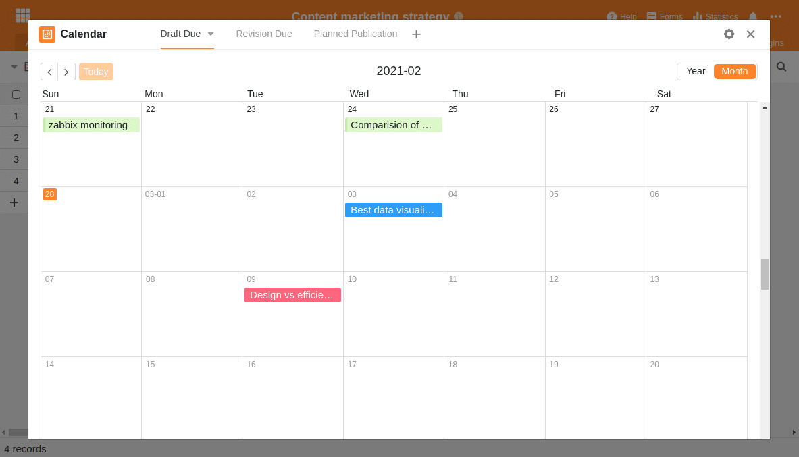

Контент-маркетинг - это популярный маркетинговый подход к размещению собственной продукции среди клиентов и потенциальных заинтересованных лиц. Основная идея контент-маркетинга очень проста: вы создаете контент для своей целевой группы, публикуете его и вдохновляете своих клиентов.

Как бы просто это ни звучало на первый взгляд - контент-маркетинг работает только в том случае, если вы предлагаете высококачественный контент, который интересует клиента; и если у вас есть подходящая структура и правильные инструменты для планирования, реализации и обучения. Потому что стратегия контент-маркетинга не нацелена на краткосрочный эффект, как это было бы, например, с платной рекламой, а представляет собой долгосрочный, органичный подход к продажам и коммуникации современных компаний.

Для того чтобы построить собственную стратегию контент-маркетинга и выбрать подходящий инструмент, сначала важно понять, что именно представляет собой контент-маркетинг и как взаимосвязаны его отдельные части.

## Каковы преимущества контент-маркетинга?

Любой вид маркетинга направлен на привлечение внимания людей или клиентов. Но если реклама обычно пытается побудить людей к немедленному действию, то контент-маркетинг нацелен на привлечение людей задолго до того, как они действительно заинтересуются продуктом. С помощью захватывающих историй и контента человек стремится привлечь людей на каждом этапе [Customer Journey](https://de.wikipedia.org/wiki/Customer_Journey) и повысить осведомленность о своей компании и продукции.

Конечно, можно выстроить стратегию контент-маркетинга таким образом, что основной упор будет сделан на продажу продукции. Однако обычно цель состоит в том, чтобы вызвать интерес, сделать бренд известным или добиться положительной ассоциации с брендом или продуктом.

Особенно если вы разрабатываете продукты, которые требуют объяснения или нет _единого_ момента для покупки, контент-маркетинг обещает быть более успешным и эффективным в долгосрочной перспективе, чем платная реклама, которая может быть связана с большими растратами. Если ваша компания подберет контент с учетом особенностей будущей целевой группы, потенциальный клиент в нужный момент вспомнит о вашем бренде и примет решение в пользу соответствующего продукта.

### Преимущества контент-маркетинга с первого взгляда

- направлена на целевую группу и хочет предоставить выгоду
- Работает на всех этапах пути клиента
- Является менее навязчивым и воспринимается как реклама
- Может самоподкрепляться за счет вирусных эффектов
- гармонично сочетается с SEO, PR и маркетингом в социальных сетях

**В то же время у контент-маркетинга есть и слабые стороны**

- Не обеспечивает немедленных продаж
- это долгосрочная стратегия
- состоит в основном из трудолюбия, настойчивости и постоянного обучения

Эти слабые стороны также подтверждаются [исследованием 2016 года](https://www.forbes.com/sites/sujanpatel/2016/01/03/what-your-2016-content-marketing-strategy-should-look-like/#69c6a60a342e), которое четко показывает центральную проблему контент-маркетинга: хотя 76 процентов опрошенных предпринимателей работают со стратегией контент-маркетинга и убеждены, что контент-маркетинг работает, только 37 процентов говорят, что их стратегия успешна.

Авторы исследования приходят к выводу, что контент-маркетинг является успешным маркетинговым инструментом, но только если вы не создаете контент и посты наугад. Решающее отличие заключается в планировании собственного подхода, создании процесса и структуры и использовании инструмента, который адаптируется к собственным потребностям и помогает команде отслеживать всю информацию.

Так что же важно в стратегии контент-маркетинга? Что должно уметь программное решение, чтобы оптимально поддерживать процесс создания контента?

## Три "П" контент-маркетинга

Существуют различные определения контент-маркетинга, но описание с тремя "П" лучше всего подводит итог. Они означают три английских термина: _Preparation_, _Production_ и _Publication_. Иногда вы также читаете о _Produce_, _Publish_ и _Promote_. В конечном итоге, однако, речь всегда идет о целенаправленной разработке релевантного для клиента контента.

**Preparation** включает в себя стратегическое планирование и подготовку собственной контент-стратегии. Здесь вы должны определить целевую группу или вымышленную [Personas](<https://en.wikipedia.org/wiki/Persona_(user_experience)>) выбрать, определить правильные каналы и SEO-термины и на основе этого разработать план для правильного контента.

**Production** состоит из всех необходимых шагов по воплощению контента в жизнь и контролю за его созданием. Для этого вы определяете, кто и когда создает контент, какими должны быть точные ключевые слова и заголовки, кто поставляет информацию и впоследствии редактирует контент и т.д.

**Publication** это третий и последний этап контент-маркетинга, который включает в себя публикацию, продвижение контента, оценку просмотров и постоянную обратную связь для улучшения процесса.

## Почему чистый Канбан и инструменты управления процессами не подходят для контент-маркетинга

Важно понимать, что контент-маркетинг обычно состоит из множества маленьких кусочков головоломки и что не одна хорошая статья принесет желаемый успех. Например, SEO-агентство создает _Content Marketing Star_ даже для небольших проектов, конвейер контента с десятками, если не сотнями поисковых терминов, а затем создает соответствующий контент.

Контент-маркетинг требует инструмента, который обеспечивает обзор этой массы информации и позволяет целенаправленно публиковать запланированный контент.

Типичные инструменты Kanban и управления проектами, такие как Trello или Asana, быстро перегружаются таким большим объемом информации. Если, например, вы импортируете в такое программное обеспечение поиск ключевых слов Google с сотнями SEO-терминов, вы практически уже потеряли необходимый обзор.

Итак, давайте рассмотрим шаги, необходимые для построения стратегии контент-маркетинга, и то, как выглядит подходящий инструмент контент-маркетинга.

## 1\. определение персоны / целевой группы

В маркетинге предполагается, что вы должны знать своих клиентов, чтобы сделать им подходящее предложение. Как правило, существует две концепции того, как действовать: либо вы определяете целевую группу, либо используете так называемую персону.

Целевая группа - это все люди, к которым вы хотите обратиться с помощью маркетинговой кампании. Таким образом, целевая группа - это подмножество вашего общего рынка, которое обычно формируется на основе сегментации рынка. Такая сегментация может быть проведена, например, на основе возраста, пола, места жительства, личных предпочтений и т.д.

Целевая группа сама по себе не является однородной, но индивиды внутри целевой группы отличаются друг от друга, за исключением определенных критериев.

По этой причине была разработана концепция персоны. В отличие от целевой группы, здесь описывается вымышленный человек, который представляет собой типичного клиента. Вы стараетесь как можно точнее описать эту вымышленную личность во всех ее проявлениях, чтобы лучше понять потребности, проблемы и действия этого потенциального клиента. Таким образом, вы можете еще лучше и более индивидуально адаптировать контент для ваших клиентов.

### Кто ваши потенциальные клиенты?

Поэтому, если вы хотите создать конвейер качественного контента, важно получить четкое представление о том, кто на самом деле ваши клиенты и какой контент они хотят читать. Именно поэтому в контент-маркетинге чаще всего используются персоны.

Чем точнее вы опишите свою персону, тем легче вам будет предсказать ее ожидания и поведение по отношению к вашему контенту. А это именно то, чего вы хотите добиться с помощью контент-маркетинга. Вы хотите разрабатывать и производить контент, который будет восприниматься как полезный и который ваши будущие клиенты будут читать с удовольствием.

Постарайтесь как можно точнее описать свои персоны:

- Какова их профессия?
- На какой должности они работают?
- С какими трудностями они сталкиваются?
- Какой контент они ожидают и что им помогает?
- …

Предположим, что ваша компания имеет следующие три сегмента потребителей:

- Независимые дизайнеры
- Творческие коллективы
- Креативные агентства

Тогда вашей первой задачей будет выяснить все, что вы можете, об этих сегментах потребителей и, следовательно, о ваших персонах. Не просто думайте об этом, а документируйте свои выводы.

Пример описания персон в SeaTable

### Создавайте целевой контент для своих клиентов

Например, самозанятые дизайнеры любят читать статьи на сайте [medium.com](https://medium.com/@seatable). Они в основном пользуются устройствами Apple и предпочитают ездить на велосипеде, а не на Porsche. Им нравится, когда изображения служат для них источником вдохновения. Им также нравятся конкретные учебники, инструкции и материалы, которые непосредственно помогают им в работе. Чтобы заинтересовать эту группу людей продуктом, обычно требуется лишь небольшая мотивационная помощь. Базовый интерес проявляется в любом случае. Поэтому давайте конкретные советы и практическую помощь. Подходящим форматом могут быть короткие видеоролики на YouTube и подходящие статьи в блоге на medium.com или в блоге компании.

Творческие команды просят дать рекомендации по новым инструментам и повысить эффективность процессов. Возможно, такая команда уже знакома с вашим продуктом, и ей нужно несколько историй успеха от других клиентов, чтобы подписаться на пробную версию или заказать тестовый продукт.

Креативные агентства, с другой стороны, уже работают гораздо более формализованно. Отдельные сотрудники, вероятно, могут быстро увлечься новым инструментом, но в то же время они должны убедить свое руководство в конкретных преимуществах. Помогите этим людям подсказками о том, как повысить эффективность или о конкретных преимуществах вашего решения. Лучший способ сделать это - истории успеха, отчеты в прессе и белые книги.

Вооружившись этими знаниями о своих клиентах и их потребностях, вы можете переходить к этапу производства.

## 2\. производство контента для вашего контент-маркетинга

Основные проблемы при создании контента - это контроль за ходом работы и распределение ответственности. Забудьте о Kanban или комплексных инструментах управления проектами, которые могут заставить вас потерять контроль всего лишь над несколькими записями.

Для каждой записи в блоге, каждого видеоролика, каждого упоминания в Интернете определите, кто в команде отвечает за это и к какому времени этот контент должен быть готов. Даже если необходимо предоставить контент извне или есть временные зависимости, не позволяйте этому сбить вас с толку. Только если вы четко определите обязанности, создание контента станет эффективным процессом.

### Внесите порядок в свой конвейер контента

В следующей таблице показана базовая структура, которую вы можете адаптировать к своим потребностям по своему усмотрению. Следующая информация должна быть записана для каждого содержания:

- Название публикации
- Состояние (от мозгового штурма до публикации)
- Ответственный автор
- Дата публикации
- Канал публикации
- Персона (для кого актуальна статья)
- Идея содержания (откуда взялась идея)

Эта таблица нашего [шаблона стратегии контент-маркетинга]() может показаться на первый взгляд довольно обширной, но это минимум для среднего контент-конвейера, чтобы вести необходимый обзор. Возьмите за привычку записывать эти данные с первого дня, и у вас не будет проблем с отслеживанием в любое время.

### Обеспечить индивидуальный взгляд на данные

Еще одной изюминкой этого шаблона являются различные представления с предопределенными фильтрами и группировками. Таким образом, вы можете быть уверены, что различные сотрудники всегда получат идеальный обзор. В то же время, эти представления идеально подходят для обеспечения персональной ответственности.

Графические дизайнеры будут заинтересованы только в тех статьях, которые вообще требуют графики и которые уже написаны, в то время как авторы будут искать только те работы, которые еще открыты. Для каждого из этих коллабораторов существует отдельное представление для отображения только тех данных, которые нужны в данный момент.

Индивидуальные представления для каждого сотрудника

Каждый сотрудник точно знает, у кого есть текущая задача и кто должен работать над ней следующим. Таким образом, вы избежите ожидания и путаницы. Как только автор написал свой черновик, он меняет статус статьи и передает ее следующему сотруднику для контроля качества. Если необходима координация между сотрудниками, это можно легко сделать с помощью [функции комментариев](https://seatable.io/ru/docs/handbuch/zusammenarbeit/kommentare/) в SeaTable.

Таким образом, никому не придется запрашивать обновления по электронной почте или в Slack. Вы просто добавляете соответствующего коллегу в комментарии или изменяете статус статьи. При желании SeaTable также отправляет уведомление по электронной почте.

Как автор или редактор, вы можете захотеть, чтобы запланированные даты публикации отображались в виде календаря. Там вы можете легко перетаскивать статьи, чтобы изменить сроки и обеспечить постоянную публикацию хорошего контента.

Редакционное планирование с помощью перетаскивания в SeaTable

Каждое из этих различных представлений подчеркивает определенные аспекты конвейера контента, скрывая или маскируя другие. Таким образом, каждый член команды получает именно тот объем информации, который необходим ему для работы.

### Обеспечение постоянных новых идей

Также следите за тем, чтобы идеи не иссякли раньше времени. Попросите своих сотрудников и клиентов предложить идеи или темы, которые вас интересуют. С помощью SeaTable вы можете за считанные минуты создать анкету и распространить ее.

Ваша цель должна заключаться в постоянном обмене мнениями с клиентами и в том, чтобы барьеры для сообщения таких идей были как можно ниже. Вы увидите: Лучший способ регулярно публиковать хороший контент - это поддерживать постоянный поток высококачественных идей.

## 3\. публикация и анализ

Но одной хорошей стратегии и хорошего контента недостаточно, чтобы полностью реализовать потенциал контент-маркетинга. Компании, которые действительно добились успеха в контент-маркетинге, постоянно работают над тем, чтобы учиться на своих ошибках и установить постоянную обратную связь.

Они слушают, что люди говорят о статьях, и думают о том, что можно использовать в будущих статьях. В то же время они пересматривают свои персоны и наблюдают, на какие статьи их сообщество отреагировало особенно хорошо и какое ключевое слово вызвало наибольшее взаимодействие.

Создайте на своем сайте раздел обратной связи и позвольте своим клиентам высказать свои мысли непосредственно через форму. Вы можете использовать эту обратную связь, чтобы лучше согласовать ваши будущие статьи с пожеланиями ваших клиентов.

Подобный анализ для улучшения стратегии контент-маркетинга - это действительно не ракетостроение, а в основном результат простых, похожих на контрольный список действий, о которых в большинстве случаев просто забывают или не придают им значения.

Не повторяйте эту ошибку и с самого начала установите такие процессы обратной связи и анализа. SeaTable предоставляет вам все необходимые возможности.

### Составьте для себя контрольный список отзывов

Следите за тем, чтобы ваши статьи всегда относились к одной из ваших персон. Только в этом случае у вас будет возможность проанализировать свой контент после публикации и постоянно улучшать его со временем. Пишите контент в соответствии с предположениями о том, чего хотят ваши клиенты, и постоянно уточняйте эти предположения.

Заставьте себя думать о контенте таким структурированным образом, чтобы действительно контролировать свои стратегические решения.

### Мониторинг фактических показателей доступа

Вы быстро заметите, что при наличии хороших статей вы можете наблюдать увеличение органического трафика на вашем сайте уже через несколько недель. Приложите усилия и регулярно сохраняйте показатели посещаемости ваших статей. На первых порах вам все еще следует получать цифры вручную из [Google Analytics](https://analytics.google.com/analytics/web/), позже вы можете настроить автоматический сбор данных, например, с помощью [Zapier](https://zapier.com/apps/google-analytics/integrations/seatable) или [API SeaTable](https://api.seatable.com).

Вы увидите, что стоит записывать эти оценки в SeaTable, чтобы затем отобразить цифры в виде статистики на столбчатой, линейной или круговой диаграмме.

Статистические оценки показателей доступа и запланированных размещений с помощью SeaTable

Анализ вашего контента и показателей доступа может легко затеряться в спешке очередных релизов. Конечно, важно, чтобы вы регулярно публиковали новый контент. Тем не менее, вы должны найти время, чтобы разместить короткое упоминание в Facebook, Twitter или LinkedIn для каждой опубликованной вами статьи. Вы можете использовать SeaTable для планирования этого шага или Zapier для непосредственного размещения. Вы будете поражены тем, как много можно оптимизировать в вашем процессе маркетинга контента, если вы уделите немного времени на обдумывание улучшений.

## Редакционный план для организации вашей стратегии маркетинга контента

Вопрос в том, почему так много предпринимателей считают, что их контент-маркетинг не работает. Возможно, потому, что у них либо нет стратегии, либо они используют не тот инструмент.

Убедите себя в том, что контент-маркетинг является эффективным инструментом и может внести решающий вклад в успех вашей компании. Если вы хотите добиться успеха, обойдитесь без взаимозаменяемого контента и запутанных инструментов управления проектами.

Используйте SeaTable для определения ваших персон, целей и контента и внимательно следите за их развитием. Установите процесс самосовершенствования, и вы увидите, как придет успех. Начните прямо сейчас с наших [маркетинговых шаблонов]() и адаптируйте их к своим потребностям.
