Jedes Unternehmen, das seine Kunden effizienter erfassen und nachhalten möchte, kommt um ein gutes Customer Relationship Management (CRM) bzw. genauer gesagt um ein CRM-System nicht herum.

Ein CRM-Tool soll Ihnen und Ihrem Unternehmen dabei helfen, die Geschäftsbeziehungen zu Ihren Kunden zu verbessern, den damit verbundenen Umsatz Ihrer Kunden zu steigern und die internen Prozesse in Ihrem Unternehmen zu optimieren.

CRM-Softwareanbieter gibt es auf dem Markt mehr als genug. Die wohl derzeit bekanntesten CRM-Softwarelösungen sind [SAP-Hybris](https://www.sap.com/acquired-brands/what-is-hybris.html), [Salesforce](https://www.salesforce.com/), [Nimble](https://www.nimble.com/), [Zoho](https://www.zoho.com/), [Pipedrive](https://www.pipedrive.com/), [Base](https://www.zendesk.com/), [Highrise](https://highrisehq.com/), [CentralStationCRM](https://centralstationcrm.de/) und [SugarCRM](https://www.sugarcrm.com/). Dabei kann es gerade für kleinere und mittlere Unternehmen sehr schnell teuer werden, wenn es um die Einführung eines neuen und namhaften CRM-Systems geht. Das muss jedoch nicht unbedingt sein. Eine optimale und zugleich günstige Lösung stellt [SeaTable]() dar.

## Was ist CRM überhaupt?

Das Customer Relationship Management (CRM) soll Ihnen dabei helfen, neue und bestehende Kundenbeziehungen zu pflegen und zu optimieren. All Informationen rund um den Kunden fließen direkt in Ihr CRM. Customer Relationship Management kann dabei sowohl als Technologie, Strategie und Prozess betrachtet werden.

Als Technologie bezeichnet man unter anderem das Erfassen, das Analysieren und das Auswerten sämtlicher Interaktionen zwischen dem eigenen Unternehmen und den Nutzern. Hierbei wird oft von einem CRM-System oder einer CRM-Lösung gesprochen.

Die klassische CRM-Strategie ist die unternehmensweite Fokussierung auf die kontinuierliche Verbesserung der Kundenbeziehung als wichtigster Treiber für mehr Umsatz. Nur wenn ein Mitarbeiter sämtliche Informationen wie Bestellungen, Angebote und Reklamationen im Überblick hat, kann er zielgerichtet an der Verbesserung der Kundenbeziehung arbeiten.

Unter CRM-Prozess versteht man den festgelegten Ablauf, wie die Kundenbeziehung und Kundenpflege zu Bestands- und Neukunden in Ihrem Unternehmen ablaufen soll. Dies umfasst z. B. die Art und Weise, wie Angebote erstellt werden oder wann die Zufriedenheit eines Kunden oder Lieferanten abgefragt wird.

Vertriebsteams können Ihre Vertriebspipeline optimieren, Ihr Marketingteam kann das CRM-System dazu nutzen, um genauere Prognosen zu treffen und den jeweiligen Kunden genau im richtigen Moment mit Angeboten zu kontaktieren und Ihr Kundenserviceteam kann sämtliche Konversationen, die mit dem Kunden getätigt wurden, verfolgen, analysieren und im Notfall auch direkt einlenken. Darüber hinaus können auch weitere Abteilungen, wie z. B. die Personal-, Einkaufs- oder Finanzabteilung bequem an Ihr CRM angebunden werden.

## Ein CRM stellt den Kunden in den Mittelpunkt

Ein CRM-Tool erfasst alle wichtigen Kundendaten, wie den Namen des Kunden, die Anschrift, den oder die direkten Ansprechpartner, die E-Mail-Adresse, die Unternehmenswebseite, das geschätzte Umsatzpotenzial und vieles mehr. Des Weiteren können Sie Ihr CRM-System automatisch mit weiteren Informationen und Daten anreichern bzw. ergänzen lassen.

So ist es Ihnen beispielsweise möglich, auch die Kaufhistorie jedes einzelnen Kunden auf Produktebene mit Ihrem CRM-System zu verknüpfen. Darüber hinaus sollte es Ihnen möglich sein, innerhalb weniger Klicks eine Auswertung in Form von [Statistiken]() über Ihre Kunden und deren Umsatz erstellen.

Hierzu bietet Ihnen SeaTable viele Möglichkeiten, um kostengünstig, lukrativ und intuitiv sämtliche Kundendaten an einem Ort zu sammeln. Die für Sie relevanten Abteilungen und Mitarbeiter können sofort loslegen, zusammen im Team zu arbeiten. Teilen Sie beispielsweise Lese- und oder Schreibrechte Ihrem [Vertrieb](), Ihrem [Marketing](), Ihrem Einkauf oder Kundendienst im Handumdrehen zu.

Der Vorteil eines CRM in SeaTable: Sie haben immer einen zentralen Sammelpunkt, an dem alle Informationen sämtlicher Abteilungen zusammenlaufen und somit immer alle Kundendaten, Vertriebsphasen und vieles mehr auf einen Blick. Dadurch müssen Sie sich nicht mehr die Informationen durch einzelne Abteilungen selber zusammenstellen. Dies spart Ihnen viel Zeit und vor allem auch Nerven. Weiterhin passt sich SeaTable flexibel an alle Ihre Anforderungen an.

[Hier geht es direkt zu unserem Template CRM Angebotsmanagement]()

## Neue Kundendaten erfassen

Um mit der Erfassung der eigentlichen Kundendaten zu starten, steht Ihnen bei unserem [CRM-Template]() ein vordefiniertes [Webformular]() zur Verfügung, das Sie nach Belieben an Ihr Design und an Ihre Wünsche anpassen können. Hiermit erfassen Sie alle relevanten Informationen, die für Ihr CRM wichtig sind, wie z. B. den Kundennamen, die Anschrift des Kunden, den Ansprechpartner, die Telefonnummer, die E-Mail-Adresse, das Umsatzpotenzial, wichtige Dateianhänge und vieles mehr.

Diese Daten wandern im Anschluss in Ihr persönliches CRM-System bzw. in die SeaTable Tabelle „Customer Data“ und werden dort direkt nach Umsatzpotenzial farblich gekennzeichnet.

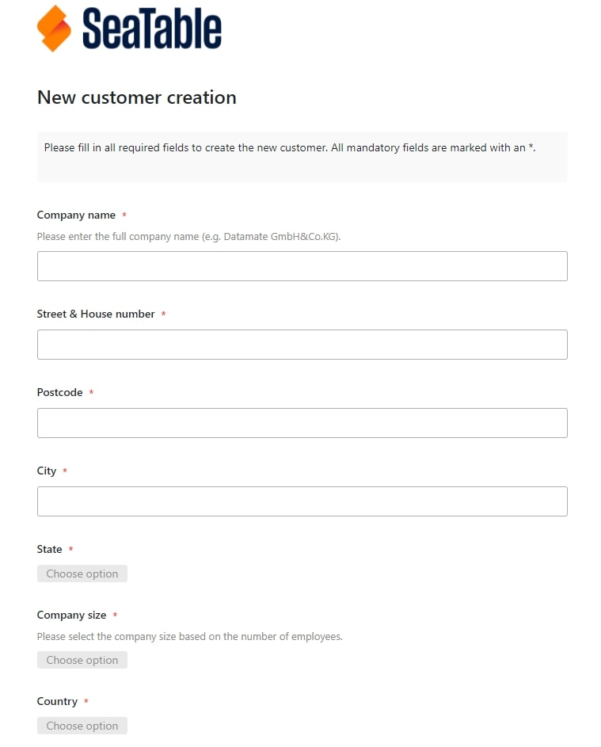

Erfassung neuer Kunden via Webformular in SeaTable

Mit nur einem Blick auf die Zeile, wissen Sie genau in welche Umsatzkategorie der eingetragene Kunde fällt. Das soll Ihnen zusätzlich dabei helfen, schnell und effektiv den Kunden anhand des Umsatzpotenzials einem Ihrer Mitarbeiter zuzuweisen. Besonders hilfreich ist hierbei auch die [Benachrichtigungsregel](), die gesetzt wurde. Falls Sie nun nachträglich manuell das Umsatzpotenzial des Kunden ändern, wird der Vorgesetzte des jeweiligen Verkaufsteams direkt kontaktiert und gebeten, den vorhandenen Kunden einem seiner Mitarbeiter zuzuweisen.

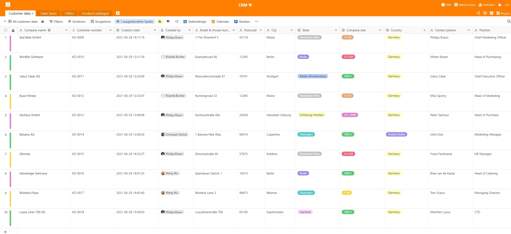

Das CRM-System von SeaTable

Weiterhin sorgen die [verschiedene Ansichten]() für die einzelnen Mitarbeiter oder Abteilungen in Ihrem Unternehmen dafür, dass jeder die für ihn oder sie relevanten Informationen sieht und bearbeiten kann. Dies geschieht ganz einfach per [Filterfunktion](). So sieht Ihre Marketing-Abteilung beispielsweise nur alle Kontakte, die ein eindeutiges Opt-in, also eine Zustimmung zur Kontaktaufnahme in Form von Newslettern, Telefonanrufen usw. gegeben haben und Ihre Mitarbeiter im Verkaufsteam nur die für ihn oder sie zugeordneten Kunden. Wichtig: Die Freigabe von einzelnen Ansichten ist den kostenpflichtigen Cloud-Abos von SeaTable vorbehalten. Mit SeaTable Free können nur ganze Bases an andere Personen freigegeben werden.

## Zuweisung eines Ansprechpartners

Um Ihrem Kunden einen Mitarbeiter aus Ihrem Sales Team zuweisen zu können, müssen Sie vorab die Tabelle „Sales Team“ gepflegt haben. Hier finden Sie den Namen Ihres Mitarbeiters, die Personalnummer, die sich in diesem Template automatisch ergibt, die Position des Mitarbeiters und das zuständige Umsatzpotenzial. Zudem sehen Sie auch alle Kunden ein, die jedem einzelnen Mitarbeiter zugewiesen wurden.

Eine [Gruppierungsfunktion]() und farbliche Kennzeichnung der Zeilen nach Position des Mitarbeiters sollen Ihnen zusätzliche klare Kundenstrukturen Ihrer Mitarbeiter aufzeigen.

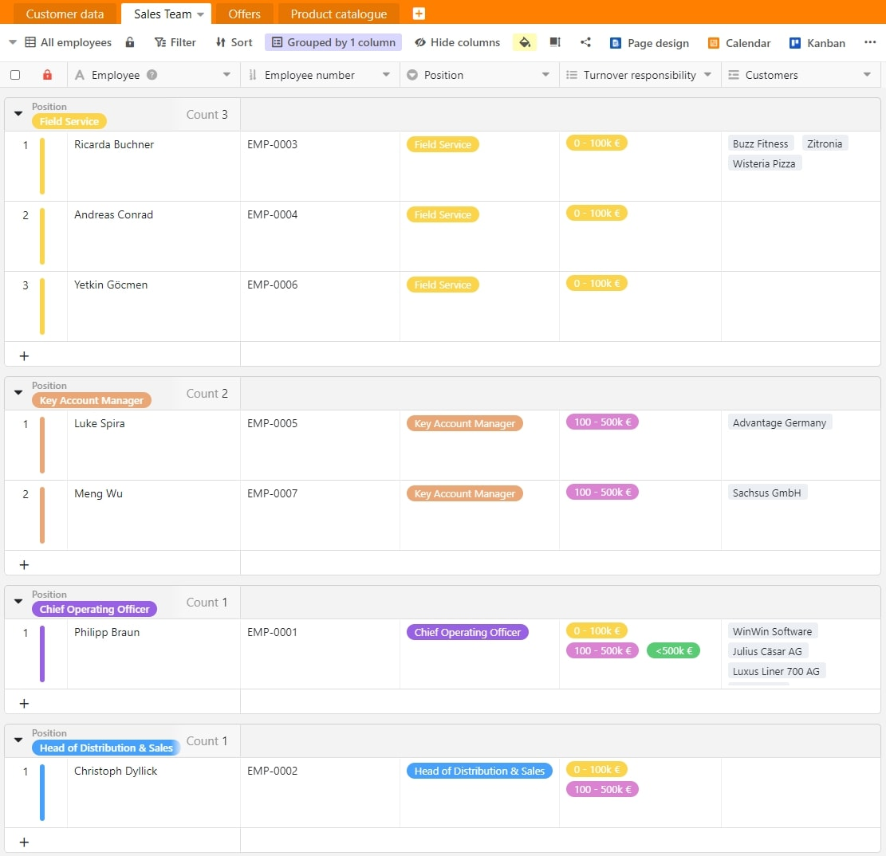

Ihr Salesteam in SeaTable

Nun können Sie ganz einfach mit nur einem Klick in die Spalte „Responsible employee“ in der Tabelle „Customer data“ den Kunden einen Ihrer verantwortlichen Mitarbeiter zuweisen. Das Ganze erfolgt im Hintergrund mit einer Verknüpfung auf die Tabelle „Sales Team“.

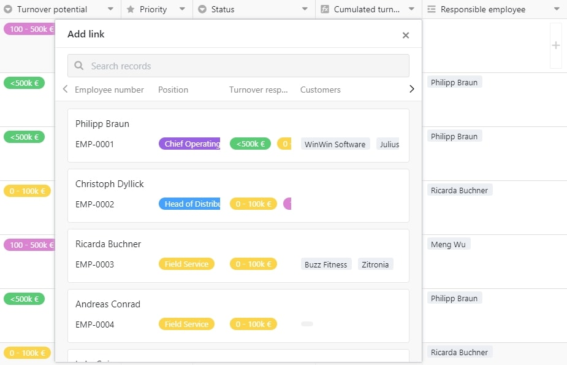

Kundenzuweisung in SeaTable

## Individuelle Angebote in Sekunden erstellen

In nur wenigen Sekunden haben Sie Ihr ganz persönliches Angebot für Ihren Kunden erstellt. Bevor Sie jedoch starten können, ist es wichtig, dass Sie Ihren Produktkatalog gepflegt haben. Sobald Sie alle Ihre Produkte mit Produktnamen und Preis erfasst haben, können Sie direkt loslegen mit der Angebotserstellung.

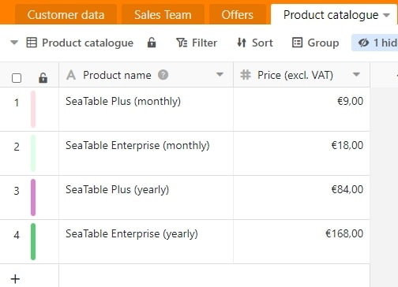

Ihr Produktkatalog in SeaTable

Hierzu erstellen Sie in Ihrer Tabelle „Offers“ einfach einen neuen Eintrag. Die Angebotsnummer, die fortlaufend ist, das dazugehörige Angebotsdatum inklusive Uhrzeit und der Angebotsersteller werden automatisch vorausgefüllt. Wählen Sie nun in der „Customer Spalte“ Ihren gewünschten Kunden aus, dem Sie gerne ein Angebot unterbreiten möchten. Die restlichen fehlenden Kundendaten wie Kundennummer, Kontaktperson, Straße, Hausnummer, Postleitzahl, Stadt und Land werden automatisch per Verknüpfungsspalte aus der Tabelle „Customer data“ übertragen.

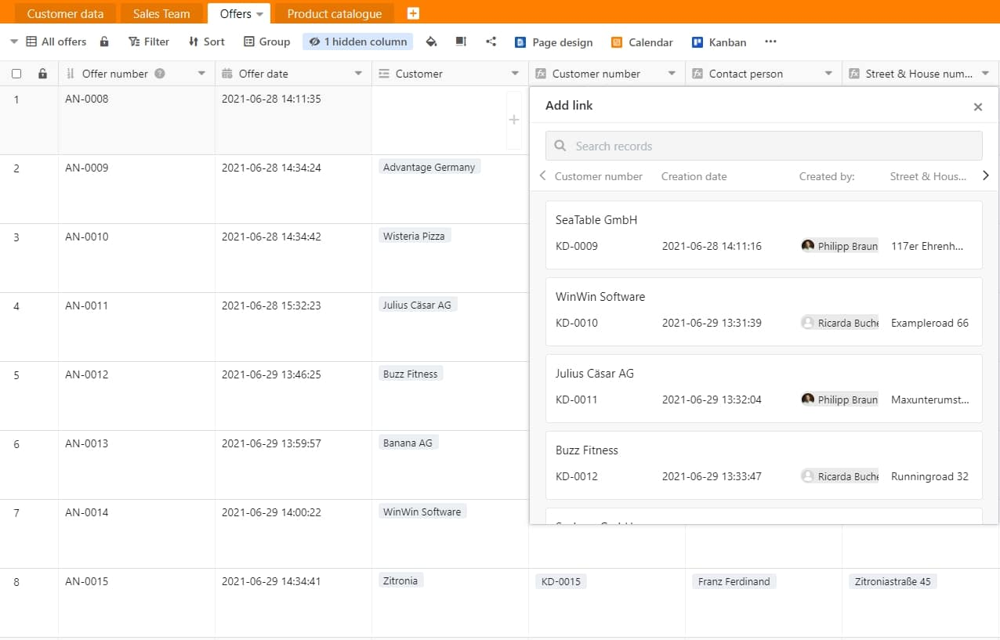

Angebotserstellung in SeaTable

Im Anschluss können Sie nun bequem Ihr angebotenes Produkt in der Spalte „Product“ auswählen. Der Einzelpreis wird wieder per Verknüpfungsspalte automatisch aus Ihrer Tabelle „Product catalogue“ ergänzt. Nun geben Sie unter „Quantity“ einfach die angebotene Menge an und der Angebotspreis errechnet sich anhand der Formel Einzelpreis x Menge automatisch.

Produktauswahl in SeaTable

Um Ihr Angebot nun final ausdrucken oder als PDF-Datei speichern zu können, wählen Sie nun das Plug-in Seitendesign aus und klicken Sie der folgenden Übersichtsseite auf „Offer“. Die Angebotsdatei erfasst voll automatisch alle wichtigen Daten, wie die Anschrift Ihres Unternehmens, die Anschrift des Kunden, das Angebotsdatum, die Kundennummer, die Angebotsnummer, den Angebotsersteller, ein kurzes vordefiniertes Anschreiben und das Angebot selbst mit Produktname, Menge, Einzelpreis und Angebotspreis.

Mit nur einem Klick auf „Drucken“ können Sie dies nun ausdrucken oder als PDF-Dokument speichern und im Anschluss postalisch oder per E-Mail an Ihren Kunden versenden.

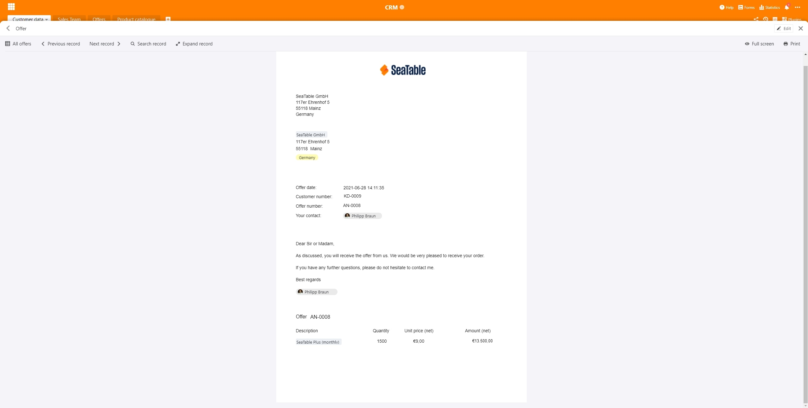

Ihr fertiges Angebot in SeaTable

Sollte Ihr Kunde das Angebot akzeptiert und bezahlt haben, so können Sie einfach bei „Paid“ das Häkchen setzen und das dazugehörige Bezahldatum erfassen. Sobald beide Infos erfasst wurden, wird der getätigte Umsatz in Ihre Statistiken einlaufen und wandert zudem automatisch und kumuliert in Ihr zentrales Tabellenblatt „Customer data“. Die Umsätze finden Sie dann in der Spalte „Cumulated turnover“ wieder.

## Zusätzliche Darstellungen

Neben der Tabellenansicht bietet SeaTable eine Reihe weiterer Plug-ins, um Ihre Daten anders darzustellen. Diese zusätzlichen Darstellungen und Automationen können Sie nutzen, um einen anderen Blickwinkel auf Ihre Kunden zu bekommen und um zielgerichtet Aktivitäten daraus abzuleiten. Das Kalender-Plug-in liefert Ihnen einen wichtigen Überblick aller in Ihrem Team anstehenden Kundentermine. Zudem werden die Kunden anhand des Umsatzpotenzials in Ihrem Kalender gekennzeichnet. Damit auch keine Kundentermine vergessen werden, wird zwei Tage vor dem anstehenden Termin des zuständigen Mitarbeiters oder der zuständigen Mitarbeiterin mithilfe einer Benachrichtigungsregel automatisch an den Termin erinnert.

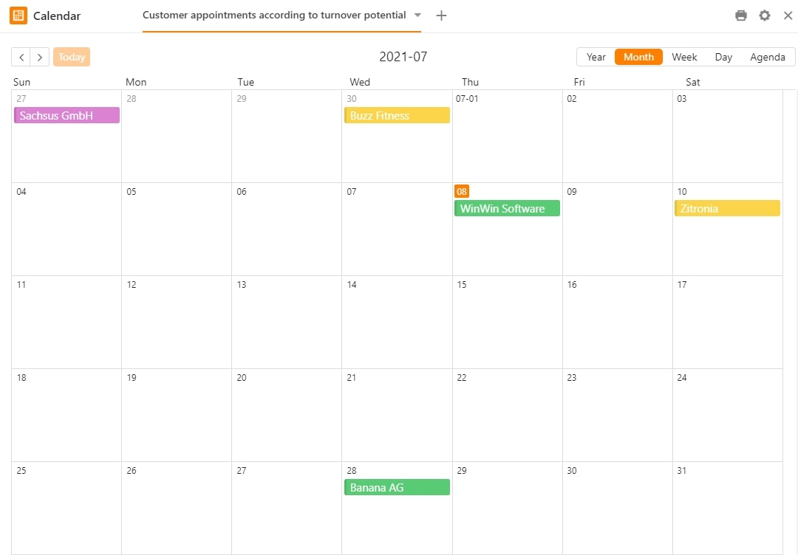

Kalenderansicht in SeaTable

Das Map-Plug-in hingegen soll Ihnen Ihre Kundenverteilung darstellen und Ihnen anhand des Umsatzpotenzials farblich aufzeigen, wo Ihre wichtigsten Kunden zu Hause sind. Mit dem „Mouse-Over-Effekt“ auf die einzelne Stecknadel in der Kartenansicht erhalten Sie weitere wichtige Infos zu dem eigentlichen Kunden, der sich hinter der Markierung verbirgt.

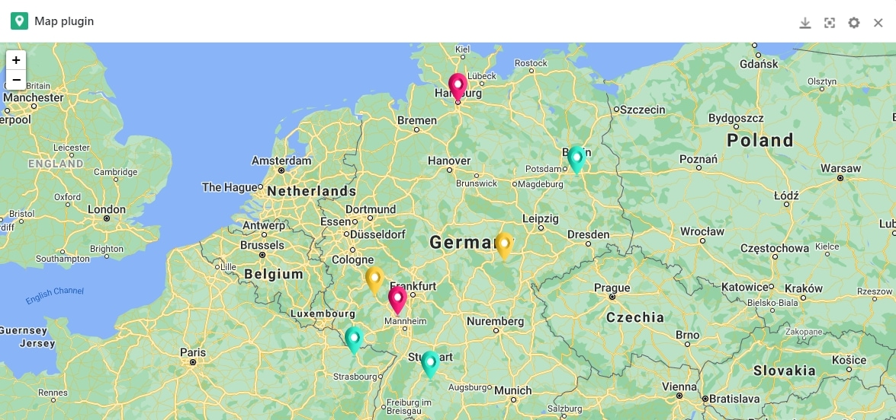

Kartenansicht in SeaTable

Abgerundet wird Ihr SeaTable-CRM-System mit dem Kanban-Plug-in. Dieses zeigt Ihnen, wie die genaue Verteilung anhand des Umsatzpotenzials Ihrer Kunden aussieht und zum anderen, in welchen Vertriebsphasen sich Ihre Mitarbeiter im Außendienst gerade befinden. Diese Ansicht wird auch gerne als Vertriebspipeline bezeichnet und lässt Sie die wichtigsten Kunden nicht aus dem Auge verlieren.

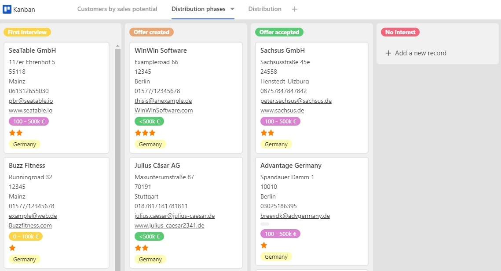

Kanbanansicht in SeaTable

## Dashboard für 360° Blick auf den Kunden

Um präzise Aussagen über Ihren Vertriebserfolg treffen zu können, ist es wichtig, dass in Ihrem CRM-System alle relevanten Informationen auf einen Blick zur Verfügung stehen. SeaTable ermöglicht es Ihnen, im Handumdrehen Ihre ganz individuellen Auswertungen Mithilfe von [Statistiken]() zu erstellen. So erhalten Sie Ihre ganz persönliche und individuelle Dashboard-Ansicht, die Ihrem SeaTable-CRM den letzten Feinschliff verleiht.

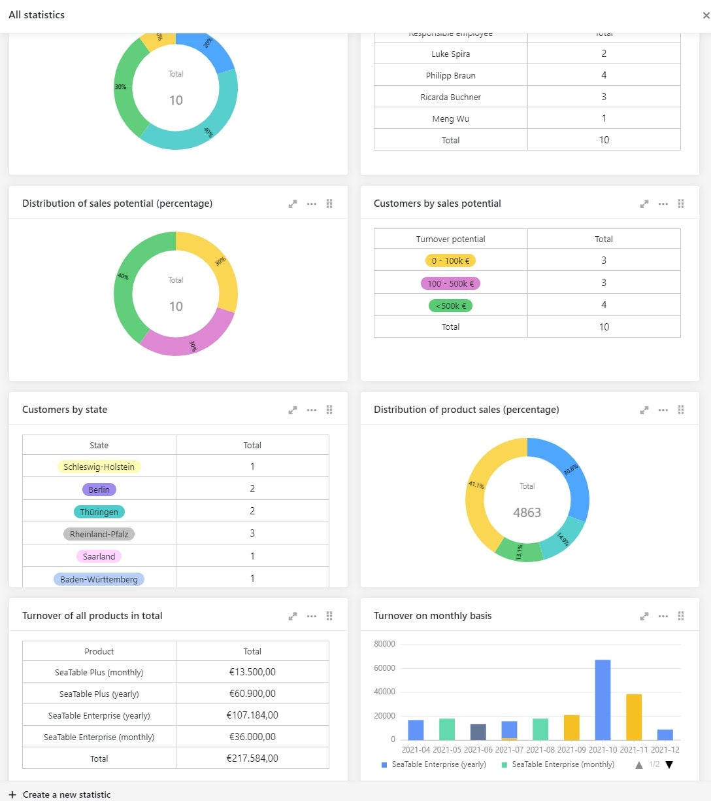

Statistiken in SeaTable

Somit haben Sie die Verteilung der Kunden je Mitarbeiter, das Umsatzpotenzial der Kunden, die Verteilung der Kunden nach Bundesländern, die Verteilung und den dazugehörigen Umsatz Ihrer verkauften Produkte sowie den kumulierten Umsatz auf Monatsebene stets im Blick. Wenn Sie weitere [Statistiken]() benötigen, so können Sie diese in wenigen Minuten ganz einfach ergänzen.

## Eine flexible CRM-Lösung muss nicht teuer sein

Es muss also nicht immer gleich bei teuren CRM-Lösungen wie bei beispielsweise [SAP-Hybris](https://www.sap.com/acquired-brands/what-is-hybris.html) und [Salesforce](https://www.salesforce.com/) enden. SeaTable bietet Ihnen viele Möglichkeiten, um ein erfolgreiches CRM betreiben zu können.

Dieser Artikel sollte Ihnen verdeutlicht haben, wie leistungsstark und flexibel SeaTable eingesetzt werden kann. Wenn Sie sich auf SeaTable einlassen, werden Sie mit einem perfekt auf Sie zugeschnittenem CRM-System belohnt. Ein wirklich leistungsstarkes CRM-Tool, das Sie nach Belieben weiter ausbauen und täglich durch neue Funktionen, Spalten und weitere Abteilungen ergänzen können.

Zudem brauchen Sie nicht für jeden einzelnen Aufgabenbereich eine separate Lösung, sondern können mit SeaTable abteilungsübergreifende Prozesse effektiv und effizient abbilden. SeaTable lässt Ihnen wirklich keine Wünsche offen und passt sich ganz an Ihre persönlichen Bedürfnisse an. Worauf warten Sie noch? Verzichten Sie auf teure CRM-Softwareanbieter und starten Sie noch heute mit Ihrem SeaTable-CRM-System durch.

[Zum Template „CRM-Angebotsmanagement“]()  
[Jetzt SeaTable kostenlos in der Cloud ausprobieren]()  
[Oder lieber SeaTable Enterprise im eigenen Rechenzentrum betreiben]()
