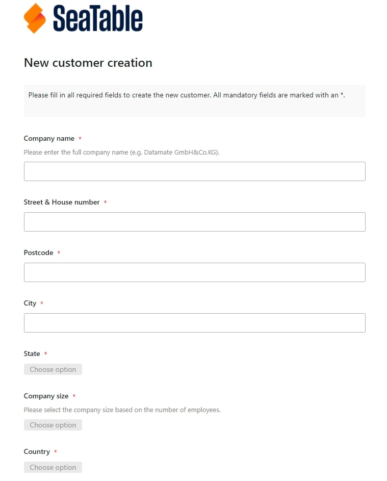
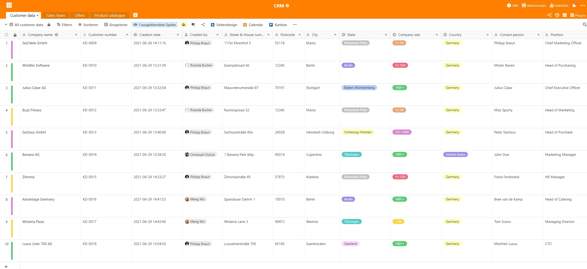
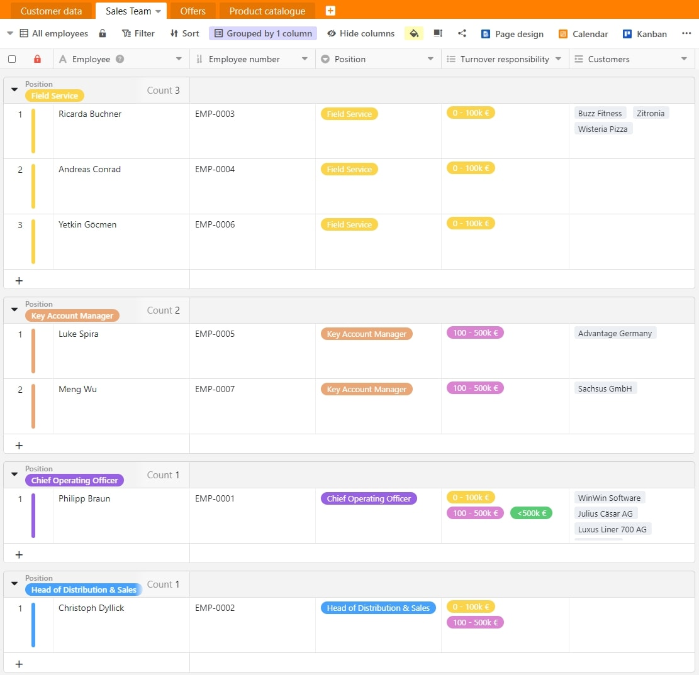
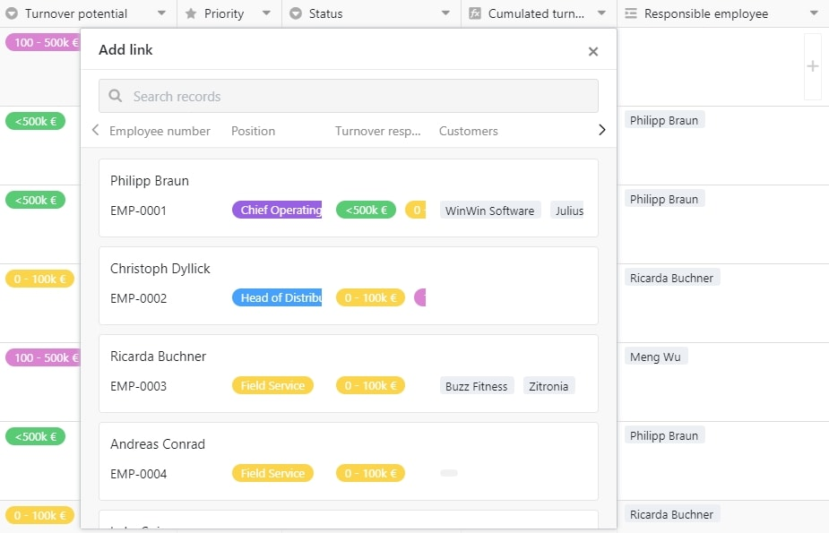
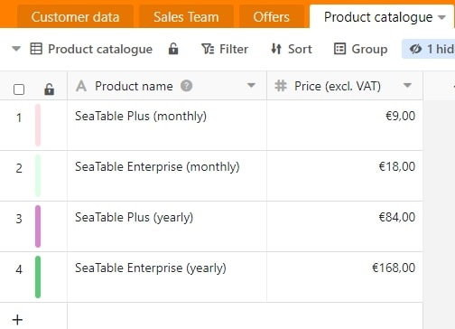
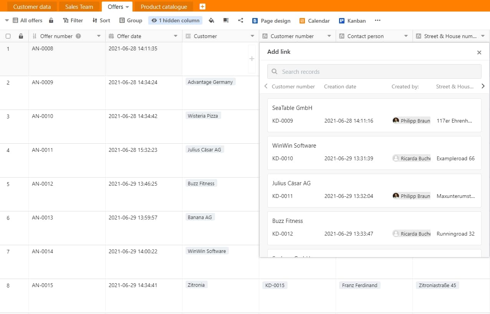
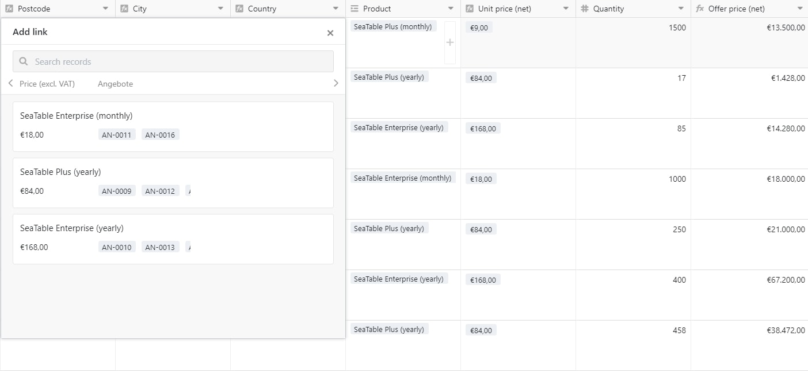
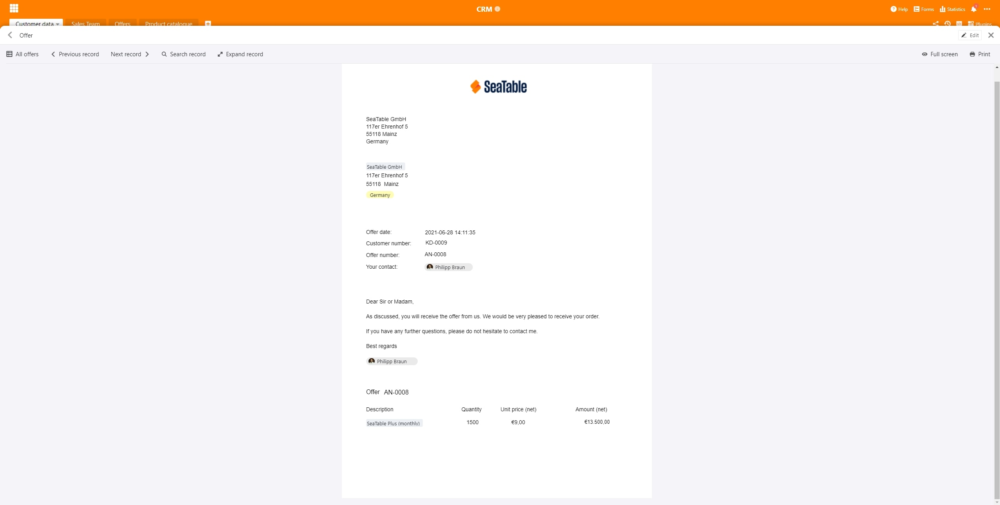
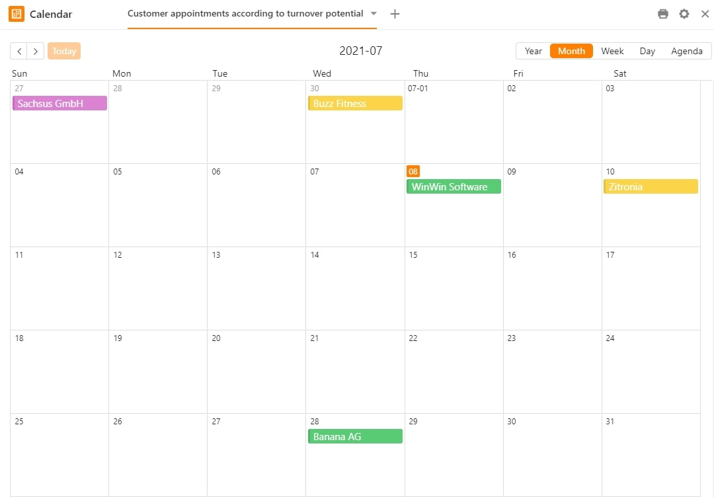
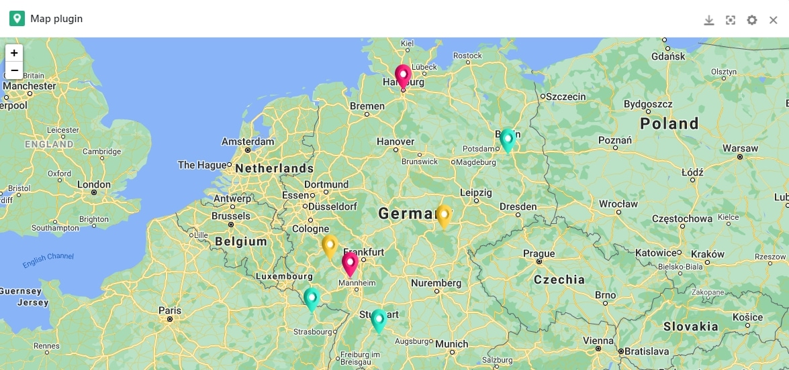

Any company that wants to record and track its customers more efficiently cannot do without good customer relationship management (CRM) or, more precisely, a CRM system.

A CRM tool should help you and your company to improve the business relationships with your customers, to increase the associated turnover of your customers and to optimise the internal processes in your company.

There are more than enough CRM software providers on the market. The best-known CRM software solutions are probably [SAP-Hybris](https://www.sap.com/acquired-brands/what-is-hybris.html), [Salesforce](https://www.salesforce.com/), [Nimble](https://www.nimble.com/), [Zoho](https://www.zoho.com/), [Pipedrive](https://www.pipedrive.com/), [Base](https://www.zendesk.com/), [Highrise](https://highrisehq.com/), [CentralStationCRM](https://centralstationcrm.de/) and [SugarCRM](https://www.sugarcrm.com/). It can quickly become expensive, especially for small and medium-sized companies, to introduce a new and well-known CRM system. However, this does not necessarily have to be the case. [SeaTable]() is an optimal and at the same time affordable solution.

## What is CRM anyway?

Customer Relationship Management (CRM) is designed to help you maintain and optimise new and existing customer relationships. All information about the customer flows directly into your CRM. Customer Relationship Management can be seen as technology, strategy and process.

Among other things, technology refers to the recording, analysis and evaluation of all interactions between one's own company and the users. This is often referred to as a CRM system or a CRM solution.

The classic CRM strategy is the company-wide focus on the continuous improvement of the customer relationship as the most important driver for more turnover. Only when an employee has an overview of all information such as orders, offers and complaints can he or she work in a targeted manner on improving the customer relationship.

The CRM process is the defined procedure of how the customer relationship and customer care with existing and new customers should proceed in your company. This includes z. B. the way in which way in which quotations are prepared or when the satisfaction of a customer or supplier is queried.

Sales teams can optimise your sales pipeline, your marketing team can use the CRM system to make more accurate forecasts and contact the respective customer with offers at exactly the right moment, and your customer service team can track all conversations that have taken place with the customer, analyse them and also directly intervene in case of emergency. In addition, other departments such as human resources, purchasing or finance can also be conveniently connected to your CRM.

## A CRM puts the customer at the centre

A CRM tool records all important customer data, such as the name of the customer, the address, the direct contact person(s), the e-mail address, the company website, the estimated sales potential and much more. Furthermore, you can have your CRM system automatically enriched or supplemented with further information and data.

For example, it is also possible for you to link the purchase history of each individual customer at product level with your CRM system. Furthermore, you should be able to create an evaluation in the form of [statistics](https://seatable.io/en/docs/handbuch/datenmanagement/statistiken/?lang=auto) about your customers and their turnover within a few clicks.

For this, SeaTable offers you many possibilities to collect all customer data in one place in a cost-effective, lucrative and intuitive way. The departments and employees relevant to you can immediately start working together as a team. For example, assign read and/or write rights to your [sales](https://seatable.io/en/vertrieb/), [marketing](https://seatable.io/en/marketing/), purchasing or customer service departments in no time at all.

The advantage of a CRM in SeaTable: You always have a central collection point where all information from all departments converge and thus always have all customer data, sales phases and much more at a glance. This means that you no longer have to compile the information yourself through individual departments. This saves you a lot of time and, above all, nerves. Furthermore, SeaTable adapts flexibly to all your requirements.

[Click here to go directly to our template CRM offer management](https://seatable.io/en/vorlage/GNx7Mg0DQKeJp6P4e5c6-w/)

## Enter new customer data

To start recording the actual customer data, our [CRM template](https://seatable.io/en/vorlage/GNx7Mg0DQKeJp6P4e5c6-w/) provides you with a predefined [web form](https://seatable.io/en/docs/handbuch/datenmanagement/webformulare/?lang=auto) that you can adapt to your design and your wishes. With this, you enter all relevant information that is important for your CRM, such as the customer's name, address, contact person, telephone number, e-mail address, sales potential, important file attachments and much more.

This data then moves into your personal CRM system or into the SeaTable table "Customer Data" and is directly colour-coded there according to sales potential.

Capture new customers via web form in SeaTable

With just one look at row, you know exactly which turnover category the registered customer falls into. This should also help you to quickly and effectively assign the customer to one of your employees based on the turnover potential. The [notification rule that](https://seatable.io/en/docs/handbuch/zusammenarbeit/benachrichtigungen/?lang=auto) has been set is also particularly helpful here. If you subsequently change the turnover potential of the customer manually, the supervisor of the respective sales team is contacted directly and asked to assign the existing customer to one of his employees.

The CRM system from SeaTable

Furthermore, the [different views](https://seatable.io/en/docs/handbuch/datenmanagement/ansichten/) for the individual employees or departments in your company ensure that everyone can see and edit the information that is relevant to him or her. This is easily done using the [filter function](https://seatable.io/en/docs/handbuch/datenmanagement/gruppierung-sortierung-filter/?lang=auto). For example, your marketing department only sees all contacts who have given a clear opt-in, i.e. consent to be contacted in the form of newsletters, phone calls, etc., and your employees in the sales team only see the customers assigned to him or her. Important: Sharing individual views is reserved for SeaTable's paid cloud subscriptions. With SeaTable Free, only entire bases can be shared with others.

## Assignment of a contact person

In order to be able to assign an employee from your sales team to your customer, you must first have maintained the table "Sales Team". Here you will find the name of your employee, the personnel number, which automatically results in this template, the position of the employee and the responsible sales potential. In addition, you can also see all the customers that have been assigned to each individual employee.

A [grouping function](https://seatable.io/en/docs/handbuch/datenmanagement/gruppierung-sortierung-filter/?lang=auto) and colour coding of rows according to the employee's position are intended to show you additional clear customer structures of your employees.

Your sales team in SeaTable

Now you can easily assign one of your responsible employees to the customer with just one click in the column "Responsible employee" in the table "Customer data". The whole thing is done in the background with a link to the table "Sales Team".

Customer assignment in SeaTable

## Create individual offers in seconds

In just a few seconds you have created your very own personal offer for your customer. However, before you can start, it is important that you have maintained your product catalogue. As soon as you have entered all your products with product names and prices, you can start creating your offer straight away.

Your product catalogue in SeaTable

To do this, simply create a new entry in your "Offers" table. The offer number, which is consecutive, the corresponding offer date including time and the offer creator are automatically pre-filled. Now select your desired customer in the "Customer column" to whom you would like to submit an offer. The remaining missing customer data such as customer number, contact person, street, house number, postcode, city and country are automatically transferred from the "Customer data" table via the link column.

Quotation creation in SeaTable

You can then easily select the product you are offering in the "Product" column. The unit price is again automatically added from your "Product catalogue" table via a link column. Now simply enter the quantity offered under "Quantity" and the offer price will be calculated automatically using the formula unit price x quantity.

Product selection in SeaTable

In order to be able to finally print out your offer or save it as a PDF file, now select the Page Design plug-in and click on "Offer" on the following overview page. The offer file automatically records all important data, such as the address of your company, the address of the customer, the date of the offer, the customer number, the offer number, the offer creator, a short predefined cover letter and the offer itself with product name, quantity, unit price and offer price.

With just one click on "Print", you can now print this out or save it as a PDF document and then send it to your customer by post or e-mail.

Your finished offer in SeaTable

If your customer has accepted the offer and paid, you can simply tick the "Paid" box and enter the corresponding payment date. As soon as both pieces of information have been recorded, the turnover will be entered into your statistics and will also be automatically cumulated in your central spreadsheet "Customer data". You will then find the turnover in the column "Cumulated turnover".

## Additional representations

In addition to the table view, SeaTable offers offers a number of other plug-insto display your data differently. You can use these additional displays and automations to use them to get a different perspective on your customers and to derive targeted activities from it. The calendar plug-in provides you with an important overview of all customer appointments that are due to take place in your team. In addition, customers are marked in your calendar according to their turnover potential. To ensure that no customer appointments are forgotten, the responsible employee is automatically reminded of the appointment two days before it is due to take place by means of a notification rule.

Calendar view in SeaTable

The map plug-in, on the other hand, is designed to show you your customer distribution and, based on the turnover potential, to show you in colour where your most important customers are at home. With the "mouse-over effect" on the individual pin in the map view, you receive further important information on the actual customer hidden behind the marker.

Map view in SeaTable

Your SeaTable CRM system is rounded off with the Kanban plug-in. This shows you the exact distribution based on the sales potential of your customers and, on the other hand, in which sales phases your field staff are currently located. This view is also known as the sales pipeline and allows you to keep an eye on the most important customers.

Kanban view in SeaTable

## Dashboard for 360° view of the customer

In order to be able to make precise statements about your sales success, it is important that all relevant information is available in your CRM system at a glance. SeaTable enables you to create your own individual evaluations in no time at all with the help of [statistics](https://seatable.io/en/docs/handbuch/datenmanagement/statistiken/?lang=auto). This gives you your very own personal and individual dashboard view that gives your SeaTable CRM the finishing touch.

Statistics in SeaTable

In this way, you always have an overview of the distribution of customers per employee, the turnover potential of the customers, the distribution of customers by federal state, the distribution and the corresponding turnover of your sold products as well as the cumulative turnover on a monthly level. If you need further [statistics](https://seatable.io/en/docs/handbuch/datenmanagement/statistiken/?lang=auto) , you can easily add them in a few minutes.

## A flexible CRM solution does not have to be expensive

So it doesn't always have to end with expensive CRM solutions such as [SAP-Hybris](https://www.sap.com/acquired-brands/what-is-hybris.html) and [Salesforce](https://www.salesforce.com/). SeaTable offers you many possibilities to run a successful CRM.

This article should have made it clear to you how powerful and flexible SeaTable can be. If you get involved with SeaTable, you will be rewarded with a CRM system that is perfectly tailored to you. A truly powerful CRM tool that you can expand at will and add new features, columns and departments on a daily basis.

In addition, you do not need a separate solution for each individual task area, but can map cross-departmental processes effectively and efficiently with SeaTable. SeaTable really leaves nothing to be desired and adapts completely to your personal needs. What are you waiting for? Do away with expensive CRM software providers and get started with your SeaTable CRM system today.

[To the "CRM offer management" template](https://seatable.io/en/vorlage/GNx7Mg0DQKeJp6P4e5c6-w/)  
[Try SeaTable in the cloud for free now]()  
[Or prefer to run SeaTable Enterprise in your own data centre](/en/get-enterprise-server/)
