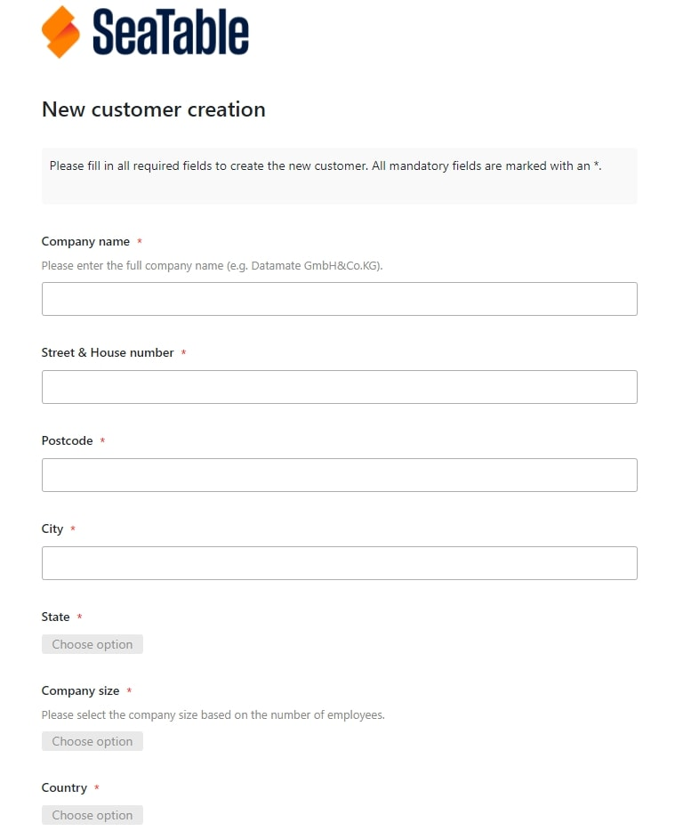
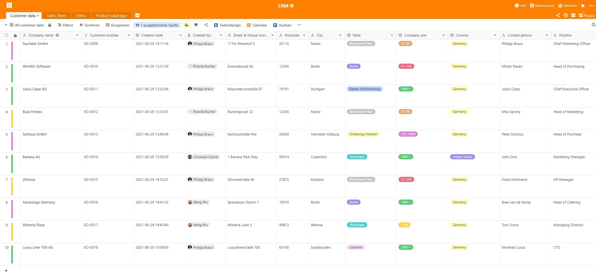
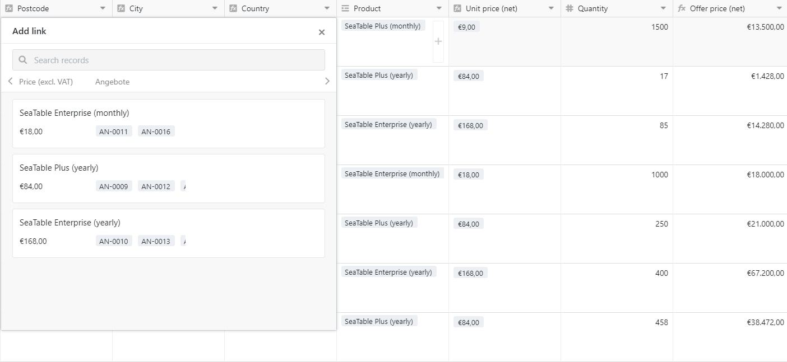
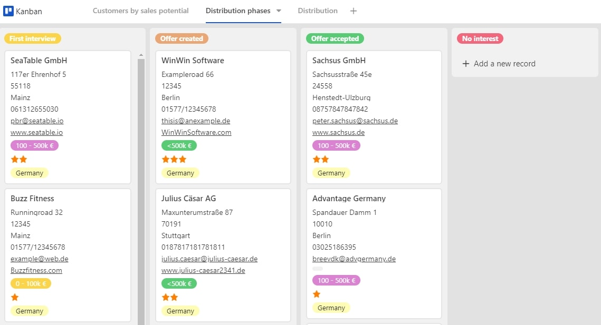
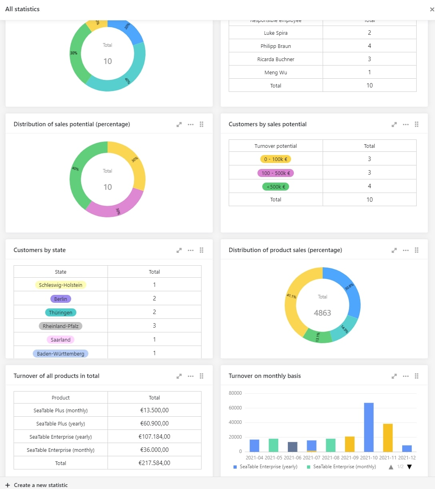

Toute entreprise qui souhaite enregistrer et suivre ses clients plus efficacement ne peut se passer d'une bonne gestion de la relation client (CRM) ou, plus précisément, d'un système CRM.

Un outil CRM devrait vous aider, vous et votre entreprise, à améliorer les relations commerciales avec vos clients, à augmenter le chiffre d'affaires associé à vos clients et à optimiser les processus internes de votre entreprise.

Il y a plus qu'assez de fournisseurs de logiciels CRM sur le marché. Les solutions logicielles CRM les plus connues sont probablement [SAP-Hybris](https://www.sap.com/acquired-brands/what-is-hybris.html), [Salesforce](https://www.salesforce.com/), [Nimble](https://www.nimble.com/), [Zoho](https://www.zoho.com/), [Pipedrive](https://www.pipedrive.com/), [Base](https://www.zendesk.com/), [Highrise](https://highrisehq.com/), [CentralStationCRM](https://centralstationcrm.de/) et [SugarCRM](https://www.sugarcrm.com/). Il peut rapidement devenir coûteux, surtout pour les petites et moyennes entreprises, d'introduire un nouveau système CRM bien connu. Toutefois, cela ne doit pas nécessairement être le cas. [SeaTable]() est une solution optimale et en même temps abordable.

## Qu'est-ce que la CRM ?

La gestion de la relation client (CRM) est conçue pour vous aider à maintenir et à optimiser les relations avec les clients, nouveaux ou existants. Toutes les informations concernant le client sont directement transmises à votre CRM. La gestion de la relation client peut être considérée comme une technologie, une stratégie et un processus.

La technologie désigne, entre autres, l'enregistrement, l'analyse et l'évaluation de toutes les interactions entre sa propre entreprise et les utilisateurs. On parle souvent de système ou de solution CRM.

La stratégie classique de gestion de la relation client (CRM) consiste à mettre l'accent, à l'échelle de l'entreprise, sur l'amélioration continue de la relation client en tant que principal moteur de l'augmentation du chiffre d'affaires. Ce n'est que lorsqu'un employé a une vue d'ensemble de toutes les informations telles que les commandes, les offres et les plaintes qu'il peut travailler de manière ciblée à l'amélioration de la relation avec le client.

Le processus de gestion de la relation client (CRM) est la procédure définie pour le déroulement de la relation et de la prise en charge des clients existants et nouveaux au sein de votre entreprise. Cela comprend z. B. la manière dont la manière dont les devis sont préparés ou lorsque la satisfaction d'un client ou d'un fournisseur est mise en doute.

Les équipes de vente peuvent optimiser votre pipeline de vente, votre équipe de marketing peut utiliser le système CRM pour faire des prévisions plus précises et contacter le client respectif avec des offres au bon moment, et votre équipe de service clientèle peut suivre toutes les conversations qui ont eu lieu avec le client, les analyser et aussi intervenir directement en cas d'urgence. En outre, d'autres départements tels que les ressources humaines, les achats ou les finances peuvent également être connectés à votre CRM de manière pratique.

## Un CRM place le client au centre

Un outil de CRM enregistre toutes les données importantes sur les clients, telles que le nom du client, son adresse, la ou les personnes de contact directes, l'adresse électronique, le site web de l'entreprise, le potentiel de vente estimé et bien d'autres choses encore. En outre, vous pouvez faire en sorte que votre système CRM soit automatiquement enrichi ou complété par d'autres informations et données.

Par exemple, il vous est également possible de relier l'historique des achats de chaque client au niveau des produits avec votre système CRM. En outre, vous devez pouvoir créer en quelques clics une évaluation sous forme de [statistiques]() sur vos clients et leur chiffre d'affaires.

SeaTable vous offre de nombreuses possibilités pour rassembler toutes les données clients en un seul endroit, de manière économique, lucrative et intuitive. Les services et les collaborateurs qui vous intéressent peuvent immédiatement commencer à travailler ensemble en équipe. Par exemple, vous pouvez attribuer des droits de lecture ou d'écriture à vos équipes de vente, de [marketing](), d'achat ou de service clientèle en un clin d'œil.

L'avantage d'un CRM dans SeaTable : vous disposez toujours d'un point de collecte central où convergent toutes les informations de tous les départements et vous avez donc toujours toutes les données sur les clients, les phases de vente et bien plus encore, en un coup d'œil. Cela signifie que vous ne devez plus compiler vous-même les informations par l'intermédiaire des différents services. Cela vous permet de gagner beaucoup de temps et, surtout, d'économiser vos nerfs. En outre, SeaTable s'adapte de manière flexible à toutes vos exigences.

[Cliquez ici pour accéder directement à notre modèle de gestion des offres CRM]()

## Saisir les données des nouveaux clients

Pour commencer à enregistrer les données réelles des clients, notre [modèle CRM]() vous fournit un [formulaire web]() prédéfini que vous pouvez adapter à votre design et à vos souhaits. Vous pouvez ainsi saisir toutes les informations importantes pour votre CRM, telles que le nom du client, son adresse, son interlocuteur, son numéro de téléphone, son adresse électronique, son potentiel de vente, les pièces jointes importantes et bien d'autres choses encore.

Ces données sont ensuite transférées dans votre système CRM personnel ou dans le tableau "Données clients" de SeaTable, où elles sont directement codées par couleur en fonction du potentiel de vente.

Saisie de nouveaux clients via un formulaire web dans SeaTable

D'un seul coup d'œil sur la ligne, vous savez exactement à quelle catégorie de chiffre d'affaires appartient le client saisi. Cela devrait également vous permettre d'attribuer rapidement et efficacement le client à l'un de vos employés en fonction de son potentiel de rotation. La [règle de notification]() qui a été définie est également particulièrement utile ici. Si, par la suite, vous modifiez manuellement le potentiel de rotation du client, le superviseur de l'équipe de vente concernée est directement contacté et invité à affecter le client existant à l'un de ses employés.

Le système CRM de SeaTable

En outre, les [différentes vues]() pour les différents collaborateurs ou départements de votre entreprise permettent à chacun de voir et de traiter les informations qui le concernent. Cela se fait très facilement grâce à [la fonction de filtrage](). Par exemple, votre service marketing ne voit que tous les contacts qui ont donné un "opt-in" clair, c'est-à-dire une autorisation de prise de contact sous forme de newsletters, d'appels téléphoniques, etc. et vos collaborateurs de l'équipe de vente ne voient que les clients qui leur sont attribués. Important : le partage de vues individuelles est réservé aux abonnements payants au cloud de SeaTable. Avec SeaTable Free, seules des bases entières peuvent être partagées avec d'autres personnes.

## Attribution d'une personne de contact

Afin de pouvoir affecter un employé de votre équipe de vente à votre client, vous devez d'abord avoir géré la table "Équipe de vente". Vous y trouverez le nom de votre employé, le numéro de personnel, qui résulte automatiquement dans ce modèle, le poste de l'employé et le potentiel de vente responsable. En outre, vous pouvez également voir tous les clients qui ont été affectés à chaque employé.

Une [fonction de regroupement]() et un code couleur des lignes en fonction de la position de l'employé sont destinés à vous montrer des structures de clientèle claires supplémentaires de vos employés.

Votre équipe de vente à SeaTable

Maintenant, vous pouvez facilement affecter l'un de vos employés responsables au client en un seul clic dans la colonne "Employé responsable" du tableau "Données client". Le tout se fait en arrière-plan avec un lien vers la table "Sales Team".

Affectation des clients à SeaTable

## Créez des offres individuelles en quelques secondes

En quelques secondes seulement, vous avez créé votre offre personnelle pour votre client. Toutefois, avant de commencer, il est important que vous ayez mis à jour votre catalogue de produits. Dès que vous avez saisi tous vos produits avec leur nom et leur prix, vous pouvez commencer à créer votre offre immédiatement.

Votre catalogue de produits dans SeaTable

Pour ce faire, il suffit de créer une nouvelle entrée dans votre tableau "Offres". Le numéro de l'offre, qui est consécutif, la date et l'heure de l'offre correspondante et le créateur de l'offre sont automatiquement préremplis. Sélectionnez maintenant le client souhaité dans la "colonne Client", auquel vous souhaitez soumettre une offre. Les autres données client manquantes, telles que le numéro de client, la personne de contact, la rue, le numéro de maison, le code postal, la ville et le pays, sont automatiquement transférées de la table "Données client" via la colonne de liaison.

Création de citations dans SeaTable

Vous pouvez ensuite facilement sélectionner le produit que vous proposez dans la colonne "Produit". Le prix unitaire est à nouveau automatiquement ajouté à partir de votre tableau "Catalogue de produits" via une colonne de liaison. Il suffit maintenant de saisir la quantité offerte sous "Quantité" et le prix de l'offre sera calculé automatiquement à l'aide de la formule prix unitaire x quantité.

Sélection de produits dans SeaTable

Pour pouvoir enfin imprimer votre offre ou l'enregistrer en tant que fichier PDF, sélectionnez maintenant le plug-in Page Design et cliquez sur "Offre" sur la page d'aperçu suivante. Le fichier d'offres enregistre automatiquement toutes les données importantes, telles que l'adresse de votre entreprise, l'adresse du client, la date de l'offre, le numéro du client, le numéro de l'offre, le créateur de l'offre, une courte lettre d'accompagnement prédéfinie et l'offre elle-même avec le nom du produit, la quantité, le prix unitaire et le prix de l'offre.

D'un seul clic sur "Imprimer", vous pouvez maintenant l'imprimer ou l'enregistrer en tant que document PDF, puis l'envoyer à votre client par courrier ou par e-mail.

Votre offre finalisée à SeaTable

Si votre client a accepté l'offre et payé, il vous suffit de cocher la case "Payé" et de saisir la date de paiement correspondante. Dès que les deux informations ont été enregistrées, le chiffre d'affaires sera introduit dans vos statistiques et sera également cumulé automatiquement dans votre feuille de calcul centrale "Données clients". Vous trouverez ensuite le chiffre d'affaires dans la colonne "Chiffre d'affaires cumulé".

## Représentations supplémentaires

En plus de la vue de la table, SeaTable offre offre un certain nombre d'autres plug-inspour afficher vos données différemment. Vous pouvez utiliser ces affichages et automatisations supplémentaires pour les utiliser pour d'obtenir une perspective différente sur vos clients et d'en tirer des activités ciblées. Le site plug-in de calendrier vous donne un aperçu important de tous les rendez-vous clients à venir dans votre équipe. En outre, les clients sont marqués dans votre calendrier en fonction de leur potentiel de chiffre d'affaires. Pour s'assurer qu'aucun rendez-vous client n'est oublié, l'employé responsable se voit automatiquement rappeler le rendez-vous deux jours avant qu'il n'ait lieu au moyen d'une règle de notification.

Vue du calendrier dans SeaTable

Le plug-in carte, quant à lui, est conçu pour vous montrer la répartition de votre clientèle et, sur la base du potentiel de chiffre d'affaires, pour vous indiquer en couleur où se trouvent vos principaux clients à domicile. Grâce à l'effet "mouse-over" sur chaque épingle dans la vue cartographique, vous obtenez d'autres informations importantes sur le client réel caché derrière le marqueur.

Vue de la carte dans SeaTable

Votre système CRM SeaTable est complété par le plug-in Kanban. Cela vous montre la répartition exacte en fonction du potentiel de vente de vos clients et, d'autre part, dans quelles phases de vente se trouve actuellement votre personnel de terrain. Cette vue est également connue sous le nom de "pipeline de vente" et vous permet de garder un œil sur les clients les plus importants.

Vue kanban dans SeaTable

## Tableau de bord pour une vue à 360° du client

Pour pouvoir faire des déclarations précises sur votre succès commercial, il est important que toutes les informations pertinentes soient disponibles dans votre système CRM en un clin d'œil. SeaTable vous permet de créer vos propres évaluations individuelles en un rien de temps à l'aide de [statistiques](). Vous disposez ainsi d'une vue personnelle et individuelle du tableau de bord qui donne à votre CRM SeaTable la touche finale.

Statistiques dans SeaTable

Ainsi, vous avez toujours un aperçu de la répartition des clients par employé, du potentiel de chiffre d'affaires des clients, de la répartition des clients par état fédéral, de la répartition et du chiffre d'affaires correspondant de vos produits vendus ainsi que du chiffre d'affaires cumulé au niveau mensuel. Si vous avez besoin de [statistiques]() supplémentaires, vous pouvez facilement les ajouter en quelques minutes.

## Une solution de gestion de la relation client flexible ne doit pas nécessairement être coûteuse

Il n'est donc pas nécessaire d'opter pour des solutions CRM coûteuses telles que [SAP-Hybris](https://www.sap.com/acquired-brands/what-is-hybris.html) et [Salesforce](https://www.salesforce.com/). SeaTable vous offre de nombreuses possibilités pour gérer un CRM avec succès.

Cet article devrait vous avoir fait comprendre à quel point SeaTable peut être puissant et flexible. Si vous vous engagez avec SeaTable, vous serez récompensé par un système CRM parfaitement adapté à vos besoins. Un outil de gestion de la relation client (CRM) véritablement puissant que vous pouvez développer à volonté et auquel vous pouvez ajouter quotidiennement de nouvelles fonctionnalités, colonnes et départements.

En outre, vous n'avez pas besoin d'une solution distincte pour chaque domaine de tâches individuelles, mais vous pouvez cartographier les processus interdépartementaux de manière efficace et efficiente avec SeaTable. SeaTable ne laisse vraiment rien à désirer et s'adapte complètement à vos besoins personnels. Qu'est-ce que vous attendez ? Oubliez les fournisseurs de logiciels CRM coûteux et démarrez dès aujourd'hui avec votre système CRM SeaTable.

[Vers le modèle "Gestion des offres CRM]()  
[Essayez SeaTable dans le nuage gratuitement maintenant](/fr/enregistrement/)  
[Ou vous préférez utiliser SeaTable Enterprise dans votre propre centre de données.]()
