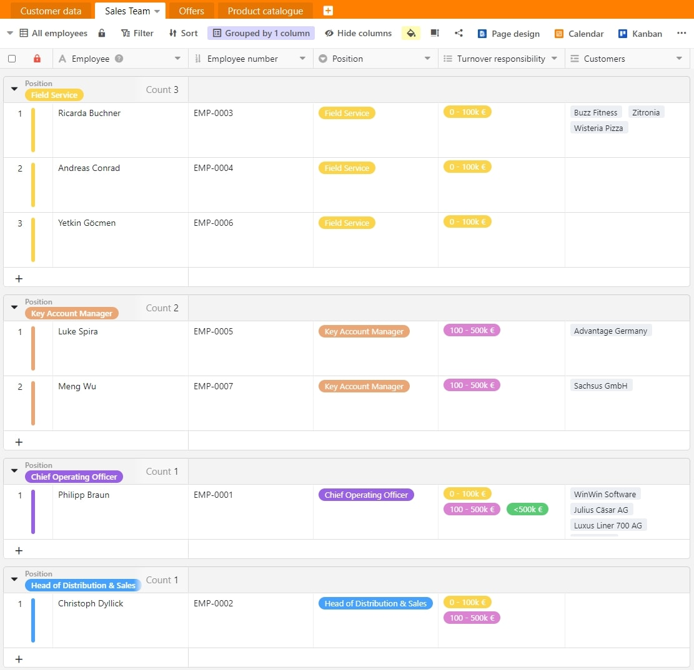
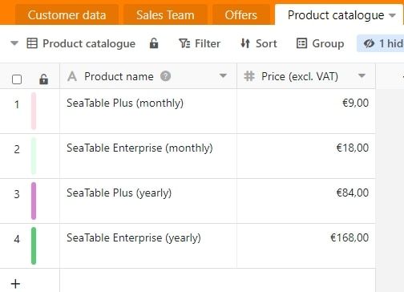
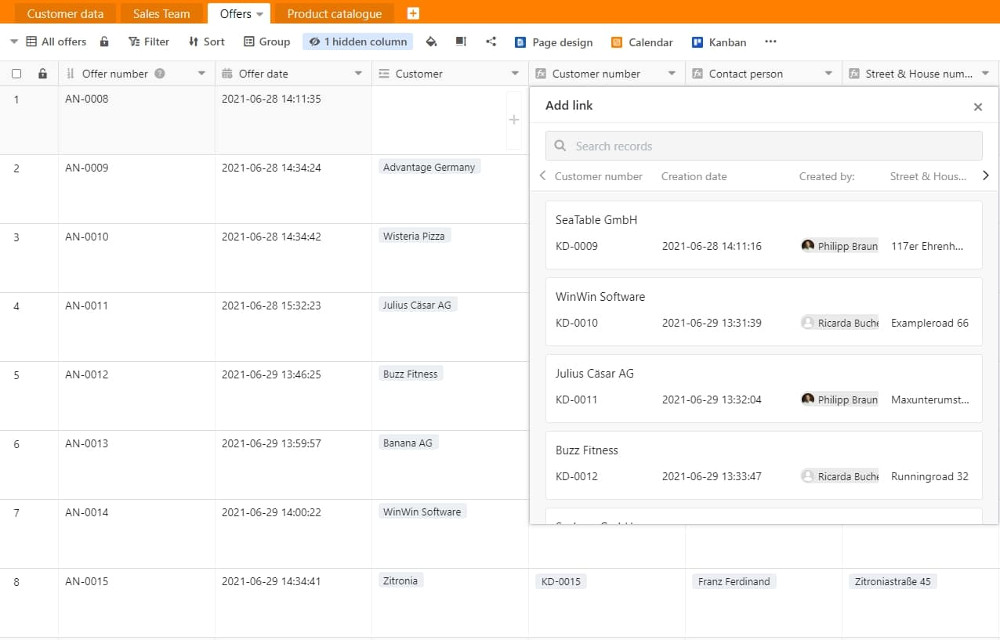
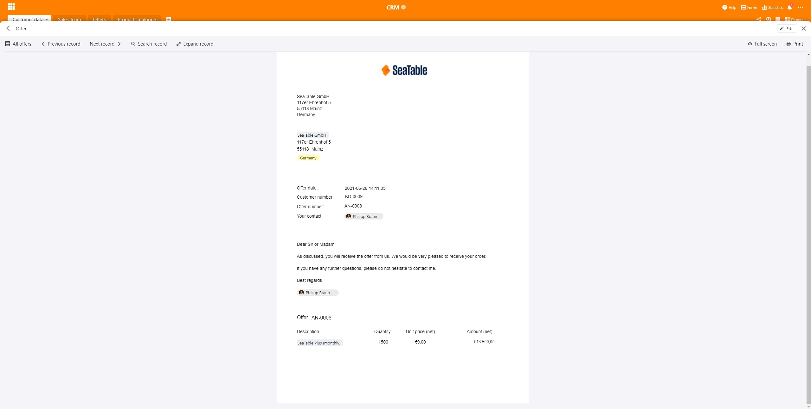
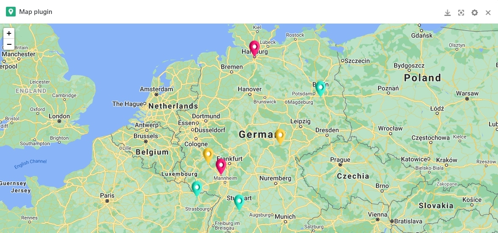

Qualquer empresa que queira registar e acompanhar os seus clientes de forma mais eficiente não pode prescindir de uma boa gestão da relação com o cliente (CRM) ou, mais precisamente, de um sistema CRM.

Uma ferramenta CRM deve ajudá-lo e à sua empresa a melhorar as relações comerciais com os seus clientes, a aumentar o volume de negócios associado dos seus clientes e a optimizar os processos internos da sua empresa.

Existem mais do que suficientes fornecedores de software de CRM no mercado. As soluções de software CRM mais conhecidas são provavelmente [SAP-Hybris](https://www.sap.com/acquired-brands/what-is-hybris.html), [Salesforce](https://www.salesforce.com/), [Nimble](https://www.nimble.com/), [Zoho](https://www.zoho.com/), [Pipedrive](https://www.pipedrive.com/), [Base](https://www.zendesk.com/), [Highrise](https://highrisehq.com/), [CentralStationCRM](https://centralstationcrm.de/) e [SugarCRM](https://www.sugarcrm.com/). Pode tornar-se rapidamente caro, especialmente para pequenas e médias empresas, introduzir um novo e bem conhecido sistema de CRM. Contudo, este não tem necessariamente de ser o caso. [SeaTable]() é uma solução óptima e, ao mesmo tempo, acessível.

## Afinal, o que é CRM?

A Customer Relationship Management (CRM) foi concebida para ajudar a manter e optimizar as relações com os clientes novos e existentes. Toda a informação sobre o cliente flui directamente para o seu CRM. A Gestão da Relação com o Cliente pode ser vista como tecnologia, estratégia e processo.

Entre outras coisas, a tecnologia refere-se à gravação, análise e avaliação de todas as interacções entre a sua própria empresa e os utilizadores. Isto é frequentemente referido como um sistema CRM ou uma solução CRM.

A estratégia clássica de CRM é o foco de toda a empresa na melhoria contínua da relação com o cliente como o mais importante motor para uma maior rotatividade. Só quando um empregado tem uma visão geral de todas as informações, tais como encomendas, ofertas e reclamações, pode trabalhar de uma forma orientada para a melhoria da relação com o cliente.

O processo CRM é o procedimento definido de como a relação e o atendimento ao cliente com os clientes existentes e novos clientes deve proceder na sua empresa. Isto inclui z. B. a forma como forma em que As cotações são preparadas ou quando a satisfação de um cliente ou fornecedor é questionada.

As equipas de vendas podem optimizar o seu pipeline de vendas, a sua equipa de marketing pode utilizar o sistema CRM para fazer previsões mais precisas e contactar o respectivo cliente com ofertas exactamente no momento certo, e a sua equipa de serviço ao cliente pode acompanhar todas as conversas que tiveram lugar com o cliente, analisá-las e também intervir directamente em caso de emergência. Além disso, outros departamentos tais como recursos humanos, compras ou finanças podem também ser convenientemente ligados ao seu CRM.

## Um CRM coloca o cliente no centro

Uma ferramenta CRM regista todos os dados importantes do cliente, tais como o nome do cliente, o endereço, a(s) pessoa(s) de contacto directo, o endereço electrónico, o website da empresa, o potencial de vendas estimado e muito mais. Além disso, pode ter o seu sistema CRM automaticamente enriquecido ou complementado com mais informações e dados.

Por exemplo, também é possível ligar o histórico de compras de cada cliente individual a nível do produto com o seu sistema CRM. Além disso, deverá poder criar uma avaliação sob a forma de [estatísticas]() sobre os seus clientes e o seu volume de negócios em apenas alguns cliques.

Para isso, SeaTable oferece-lhe muitas possibilidades de recolher todos os dados de clientes num único local de uma forma rentável, lucrativa e intuitiva. Os departamentos e funcionários relevantes para si podem começar imediatamente a trabalhar em equipa. Por exemplo, atribua direitos de leitura e/ou escrita aos seus departamentos de [vendas](https://seatable.io/pt/vertrieb/), [marketing](), compras ou serviço ao cliente em nenhum momento.

A vantagem de um CRM em SeaTable: Tem sempre um ponto de recolha central onde convergem todas as informações de todos os departamentos e, portanto, tem sempre todos os dados dos clientes, fases de vendas e muito mais num relance. Isto significa que já não tem de compilar a informação por si próprio através de departamentos individuais. Isto poupa-lhe muito tempo e, acima de tudo, nervos. Além disso, SeaTable adapta-se de forma flexível a todas as suas necessidades.

[Clique aqui para ir directamente para o nosso modelo de gestão de ofertas CRM]()

## Introduzir novos dados de clientes

Para começar a registar os dados reais do cliente, o nosso [modelo CRM]() fornece-lhe um [formulário web]() predefinido que pode adaptar ao seu desenho e aos seus desejos. Com isto, introduz todas as informações relevantes que são importantes para o seu CRM, tais como o nome do cliente, endereço, pessoa de contacto, número de telefone, endereço electrónico, potencial de vendas, anexos importantes de ficheiros e muito mais.

Estes dados passam então para o seu sistema de CRM pessoal ou para a tabela SeaTable "Dados do Cliente" e são aí directamente codificados por cores de acordo com o potencial de vendas.

Registo de novos clientes através do formulário web em SeaTable

Com apenas um olhar para a linha, sabe-se exactamente em que categoria de volume de negócios o cliente entrado se enquadra. Isto também deverá ajudar a atribuir rápida e eficazmente o cliente a um dos seus empregados, com base no potencial de rotatividade. A [regra de notificação]() que foi estabelecida é também particularmente útil aqui. Se posteriormente alterar manualmente o potencial de rotação do cliente, o supervisor da respectiva equipa de vendas é contactado directamente e é-lhe pedido que atribua o cliente existente a um dos seus empregados.

O sistema CRM da SeaTable

Além disso, os [diferentes pontos de vista]() dos funcionários ou departamentos individuais da sua empresa asseguram que todos possam ver e editar a informação que lhe é relevante. Isto é feito simplesmente usando a [função de filtro](). Por exemplo, o seu departamento de marketing só vê todos os contactos que deram uma clara opção de inclusão, ou seja, consente em ser contactado sob a forma de boletins informativos, chamadas telefónicas, etc., e os seus empregados da equipa de vendas só vêem os clientes que lhe foram atribuídos. Importante: A partilha de pontos de vista individuais é reservada às subscrições pagas da SeaTable em nuvem. Com o SeaTable Free, apenas bases inteiras podem ser partilhadas com outros.

## Atribuição de uma pessoa de contacto

Para poder designar um funcionário da sua equipa de vendas para o seu cliente, deve ter primeiro mantido a tabela "Equipa de Vendas". Aqui encontrará o nome do seu empregado, o número de pessoal, que resulta automaticamente neste modelo, a posição do empregado e o potencial de vendas responsável. Além disso, também se podem ver todos os clientes que foram atribuídos a cada empregado individual.

Uma [função de agrupamento]() e um código de cores das linhas de acordo com a posição do empregado destinam-se a mostrar-lhe estruturas claras adicionais de clientes dos seus empregados.

A sua equipa de vendas em SeaTable

Agora pode facilmente atribuir um dos seus funcionários responsáveis ao cliente com apenas um clique na coluna "Funcionário responsável" na tabela "Dados do cliente". Tudo isto é feito em segundo plano com um link para a tabela "Equipa de Vendas".

Atribuição de clientes em SeaTable

## Criar ofertas individuais em segundos

Em apenas alguns segundos, criou a sua própria oferta pessoal para o seu cliente. No entanto, antes de poder começar, é importante que tenha mantido o seu catálogo de produtos. Assim que tiver introduzido todos os seus produtos com nomes de produtos e preços, pode começar directamente com a criação da oferta.

O seu catálogo de produtos em SeaTable

Para o fazer, basta criar uma nova entrada na sua tabela de "Ofertas". O número da oferta, que é consecutivo, a data da oferta correspondente incluindo a hora e o criador da oferta são automaticamente pré-preenchidos. Agora seleccione o cliente desejado na coluna "Cliente" a quem gostaria de submeter uma oferta. Os restantes dados em falta do cliente, tais como número de cliente, pessoa de contacto, rua, número de casa, código postal, cidade e país são automaticamente transferidos da tabela "Dados do cliente" através da coluna de ligação.

Criação de citações em SeaTable

Pode agora seleccionar facilmente o produto oferecido na coluna "Produto". O preço unitário é novamente acrescentado automaticamente a partir da sua tabela "Catálogo de produtos" através de uma coluna de ligação. Agora basta introduzir a quantidade oferecida em "Quantidade" e o preço da oferta será calculado automaticamente utilizando a fórmula preço unitário x quantidade.

Selecção de produtos em SeaTable

Para poder finalmente imprimir a sua oferta ou guardá-la como ficheiro PDF, seleccione agora o plug-in Page Design e clique em "Oferta" na seguinte página de resumo. O ficheiro da oferta regista automaticamente todos os dados importantes, tais como o endereço da sua empresa, o endereço do cliente, a data da oferta, o número do cliente, o número da oferta, o criador da oferta, uma breve carta de apresentação pré-definida e a própria oferta com nome do produto, quantidade, preço unitário e preço da oferta.

Com apenas um clique em "Imprimir", pode agora imprimir isto ou guardá-lo como um documento PDF e depois enviá-lo ao seu cliente por correio ou e-mail.

A sua oferta final em SeaTable

Se o seu cliente aceitou a oferta e pagou, pode simplesmente assinalar a caixa "Pago" e introduzir a data de pagamento correspondente. Assim que ambas as informações tenham sido registadas, o volume de negócios será introduzido nas suas estatísticas e será automaticamente acumulado na sua folha de cálculo central "Dados do cliente". Encontrará então o volume de negócios na coluna "Volume de negócios acumulado".

## Representações adicionais

Para além da vista de tabela, a SeaTable oferece oferece uma série de outros plug-inspara exibir os seus dados de forma diferente. Pode utilizar estes ecrãs e automatizações adicionais para utilizá-los para obter uma perspectiva diferente sobre os seus clientes e daí derivar actividades específicas. O calendário plug-in oferece-lhe uma importante visão geral de todas as próximas nomeações de clientes na sua equipa. Além disso, os clientes são marcados no seu calendário de acordo com o seu potencial de rotatividade. Para garantir que nenhuma marcação de cliente é esquecida, o funcionário responsável é automaticamente lembrado da marcação dois dias antes de esta ter lugar, através de uma regra de notificação.

Vista do calendário em SeaTable

O plug-in do mapa, por outro lado, foi concebido para lhe mostrar a distribuição dos seus clientes e para indicar a cores onde os seus clientes mais importantes se baseiam no seu potencial de vendas. Com o "efeito de rato sobre o pino individual" na vista do mapa, recebe mais informações importantes sobre o cliente real escondido atrás do marcador.

Vista de mapa em SeaTable

O seu sistema SeaTable CRM é completado com o plug-in Kanban. Isto mostra-lhe a distribuição exacta baseada no potencial de vendas dos seus clientes e, por outro lado, nas fases de vendas em que o seu pessoal de campo se encontra actualmente. Esta visão é também conhecida como o canal de vendas e permite-lhe estar atento aos clientes mais importantes.

Vista Kanban em SeaTable

## Painel de controlo para uma visão de 360° do cliente

A fim de poder fazer declarações precisas sobre o seu sucesso de vendas, é importante que toda a informação relevante esteja disponível no seu sistema CRM num relance. SeaTable permite-lhe criar as suas próprias avaliações individuais em pouco tempo, com a ajuda de [estatísticas](). Isto dá-lhe a sua própria visão pessoal e individual do painel de instrumentos, o que dá ao seu SeaTable CRM o toque final.

Estatísticas em SeaTable

Desta forma, tem sempre uma visão geral da distribuição de clientes por empregado, o potencial de rotatividade dos clientes, a distribuição dos clientes por estado federal, a distribuição e a rotatividade correspondente dos seus produtos vendidos, bem como a rotatividade acumulada a um nível mensal. Se precisar de mais [estatísticas]() , pode facilmente adicioná-las em poucos minutos.

## Uma solução CRM flexível não tem de ser cara

Assim, nem sempre tem de terminar com soluções CRM caras como [SAP-Hybris](https://www.sap.com/acquired-brands/what-is-hybris.html) e [Salesforce](https://www.salesforce.com/). SeaTable oferece-lhe muitas possibilidades para operar um CRM de sucesso.

Este artigo deveria ter-lhe deixado claro quão poderoso e flexível pode ser o SeaTable. Se se envolver com o SeaTable, será recompensado com um sistema CRM que lhe é perfeitamente adaptado. Uma ferramenta CRM verdadeiramente poderosa que se pode expandir à vontade e adicionar diariamente novas funcionalidades, colunas e departamentos.

Além disso, não precisa de uma solução separada para cada área de tarefa individual, mas pode mapear processos transversais de forma eficaz e eficiente com o SeaTable. SeaTable não deixa realmente nada a desejar e adapta-se completamente às suas necessidades pessoais. De que está à espera? Acabe com os fornecedores de software de CRM dispendioso e comece hoje mesmo a utilizar o seu sistema de CRM SeaTable.

[Ao modelo "Gestão de ofertas CRM".]()  
[Experimente agora o SeaTable na nuvem de graça]()  
[Ou prefere gerir o SeaTable Enterprise no seu próprio centro de dados]()
