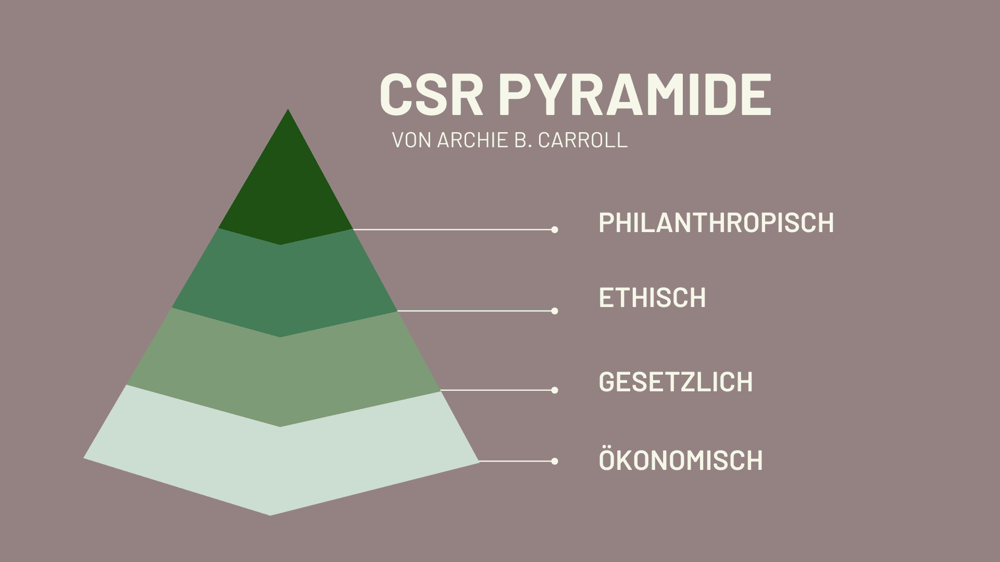

In einer Zeit, in der sich der Trend zur **Nachhaltigkeit** zunehmend verstärkt, stehen Unternehmen vor der Herausforderung, den höheren Ansprüchen ihrer Kunden gerecht zu werden. Die steigende Nachfrage nach nachhaltigen Produkten spiegelt sich im Verhalten der Verbraucher wider, die zunehmend Wert auf Umweltverträglichkeit und soziale Verantwortung legen – Stichwort: **Corporate Social Responsibility (CSR)**.

Daher sollten Sie sich mit den Grundlagen der Corporate Social Responsibility vertraut machen und Strategien entwickeln, wie Ihr Unternehmen die neuen Anforderungen erfüllen kann. Doch was genau verbirgt sich hinter dem Begriff CSR und wie können Sie Nachhaltigkeit im Unternehmen erfolgreich umsetzen?

Unternehmen erkennen zunehmend die Bedeutung von CSR und integrieren sie in ihre Strategien.

## Was CSR bedeutet

CSR steht für Corporate Social Responsibility, was bedeutet, dass Unternehmen im Sinne eines nachhaltigen Wirtschaftens **Verantwortung für ihre Auswirkungen auf die Gesellschaft übernehmen**. Das beinhaltet sowohl soziale als auch ökologische und ökonomische Aspekte. Zum Beispiel geht es um fairen Handel, mitarbeiterzentrierte Personalpolitik, Ressourcenschonung, Umweltschutz, Engagement vor Ort und verantwortungsvolles Lieferkettenmanagement.

Die Corporate Social Responsibility ist in der [ILO-Grundsatzerklärung](https://www.ilo.org/wcmsp5/groups/public/---ed_emp/---emp_ent/documents/publication/wcms_579897.pdf) über Unternehmen und Sozialpolitik, den [OECD-Leitsätzen](https://www.oecd-ilibrary.org/docserver/abd4d37b-de.pdf?expires=1712137089&id=id&accname=guest&checksum=D56F1DDB92AE228C737A33B9F8FCF629) für multinationale Unternehmen, den [UN-Leitprinzipien](https://www.auswaertiges-amt.de/blob/266624/b51c16faf1b3424d7efa060e8aaa8130/un-leitprinzipien-de-data.pdf) für Wirtschaft und Menschenrechte, im [UN Global Compact](https://www.globalcompact.de/fileadmin/user_upload/Bilder/Mediathek_Main_Page/Publikationen_PDF_speicher/DIE-ZEHN-PRINZIPIEN-1.pdf) und in der [ISO 26000](https://www.bmas.de/SharedDocs/Downloads/DE/Publikationen/a395-csr-din-26000.pdf?__blob=publicationFile&v=2) verankert.

## Wichtige Zusammenhänge kurz erklärt

Wenn Sie bisher wenig Berührungspunkte mit Corporate Social Responsibility hatten, fragen Sie sich vielleicht, was CSR mit Nachhaltigkeit zu tun hat, was Corporate Citizenship bedeutet oder warum einige den Begriff mit CR abkürzen. Die Begrifflichkeiten können zunächst verwirrend wirken, jedoch sind sie von entscheidender Bedeutung, um das Konzept der Unternehmensverantwortung vollständig zu verstehen.

- **Nachhaltigkeit:** In der Praxis nutzen viele Unternehmen den Begriff Corporate Social Responsibility als Synonym für Nachhaltigkeit. In der Theorie ist CSR als Konzept jedoch enger gefasst als Nachhaltigkeit, denn es bezeichnet den spezifischen Beitrag, den ein Unternehmen zum nachhaltigen Wirtschaften leistet.
- **Corporate Citizenship:** Das beschreibt das über die eigentliche Geschäftstätigkeit eines Unternehmens hinausgehende Engagement, das gemeinnützige Engagement. Darunter fallen beispielsweise Sponsorings, Spenden und Stiftungen.
- **Corporate Responsibility:** CR wird seit einigen Jahren als Synonym für CSR verwendet. Einige bevorzugen diesen Ausdruck, um Missverständnisse zu vermeiden, da das „Social“ in Corporate Social Responsibility oft ausschließlich sozial verstanden wird.

Nachhaltigkeit ist nicht nur ein Trend, sondern eine Notwendigkeit für Unternehmen.

## Die CSR-Pyramide nach Carroll

Die CSR-Pyramide, konzipiert von Archie B. Carroll, stellt eine detaillierte Richtlinie dar, die erklärt, wie und warum Organisationen ihrer gesellschaftlichen Verantwortung gerecht werden sollten. Diese Pyramide gliedert sich in vier Ebenen:

- **Ökonomische Verantwortung:** Dies ist die grundlegende Ebene der CSR. Unternehmen haben die Verantwortung, profitabel zu sein und Wert für ihre Aktionäre zu schaffen. Darunter fällt das Erwirtschaften von Gewinnen, den Aktionären Renditen zu bieten und die finanzielle Rentabilität sicherzustellen.
- **Rechtliche Verantwortung:** Unternehmen müssen sicherstellen, dass ihre Aktivitäten im Einklang mit den rechtlichen Rahmenbedingungen stehen. Dazu gehört beispielsweise die Einhaltung von Umweltvorschriften, Arbeitsgesetzen und Verbraucherschutzbestimmungen.
- **Ethische Verantwortung:** Auf dieser Ebene geht es darum, über das gesetzlich erforderliche Maß hinauszugehen und ethisch einwandfreies Verhalten zu fördern. Unternehmen sollten sich moralischen Prinzipien wie Integrität, Ehrlichkeit und Fairness verpflichten, sowohl in ihren internen Abläufen als auch in ihren Beziehungen zu externen Parteien wie Kunden, Lieferanten und der Gemeinschaft.
- **Philanthropische Verantwortung:** Die oberste Ebene der Corporate Social Responsibility beinhaltet freiwillige Beiträge zur Gesellschaft, die über die bloße Gewinnerzielung und die Einhaltung von Gesetzen und ethischen Standards hinausgehen. Dies kann beispielsweise Spenden an gemeinnützige Organisationen, Investitionen in Bildung oder Umweltschutzprojekte sowie die Förderung von sozialem Engagement der Mitarbeiter umfassen.

Die CSR-Pyramide nach Archie B. Carroll

## Die Vorteile von CSR

Die Implementierung von Corporate Social Responsibility in Ihrem Unternehmen bietet Ihnen nicht nur die Möglichkeit, einen positiven Beitrag zur Gesellschaft zu leisten, sondern bringt auch eine Reihe von Vorteilen für Ihr Unternehmen mit sich. Durch Ihr Engagement für soziale und ökologische Verantwortung stärken Sie Ihr Unternehmensimage und differenzieren sich von Mitbewerbern. Ein **positives Image** als verantwortungsbewusstes Unternehmen kann Ihre **Marke stärken** und Ihnen helfen, **Kunden zu gewinnen und zu binden**.

Die Förderung eines **positiven Betriebsklimas** und **engagierter Mitarbeiter** ist ein weiterer wesentlicher Vorteil von CSR. Durch die Schaffung einer Unternehmenskultur, die soziale Verantwortung und Mitarbeiterengagement fördert, stärken Sie die Bindung Ihrer Mitarbeiter an das Unternehmen. Darüber hinaus können CSR-Initiativen zur **Kostenreduktion** beitragen, indem sie beispielsweise den Energieverbrauch senken, Abfall und Verschwendung reduzieren oder effizientere Lieferketten fördern.

Insgesamt kann die Integration von CSR somit nicht nur dazu beitragen, einen positiven Beitrag zur Gesellschaft zu leisten, sondern bietet auch direkte geschäftliche Vorteile, die Ihr Unternehmen erfolgreicher machen können.

CSR sollte integraler Bestandteil der Unternehmenskultur sein.

## Herausforderungen bei der Umsetzung von Corporate Social Responsibility

Auf Ihrem Weg zu einem nachhaltigeren Unternehmen können Sie jedoch auch auf einige Herausforderungen stoßen. Beispielsweise können **zusätzliche Kosten** entstehen, wenn Sie Ihre Mitarbeiter zu Schulungen und Weiterbildungen schicken.

Ziele im Bereich der Nachhaltigkeit können sich als **langwierig** erweisen und es kann demotivierend sein, wenn Fortschritte nur langsam erreicht werden. Das Engagement in gemeinnützigen Aktivitäten kann ebenfalls **zusätzlichen Aufwand** bedeuten.



## Beispiele für geeignete Maßnahmen

Im Rahmen ihrer Corporate Social Responsibility (CSR) haben Unternehmen die Möglichkeit, eine Vielzahl von Maßnahmen zu ergreifen. Diese Maßnahmen tragen dazu bei, einen positiven Beitrag zu leisten und das Unternehmen als sozial verantwortlich und nachhaltig zu positionieren. Hier sind einige konkrete Beispiele:

Abstandshalter

- Flexible Arbeitsmodelle
- E-Autos als Firmenwagen
- Spendenaktionen
- Geschäftsreisen reduzieren
- Recycling und Abfallvermeidung

Abstandshalter

- Erneuerbare Energien
- Weiterbildung der Mitarbeiter
- Senkung der Emissionen
- Bildungsstipendien
- Formulierung von Grundwerten

CSR erfordert ein langfristiges Engagement und kontinuierliche Überprüfung.

## Warum CSR-Berichte essenziell sind

CSR-Berichte sind ein wesentliches Instrument, um Ihre Bemühungen im Bereich der Corporate Social Responsibility transparent zu dokumentieren und zu kommunizieren. Sie können darin festhalten, welche **Maßnahmen** Sie erfolgreich umgesetzt haben und welche **Ziele** Sie für die Zukunft anstreben.

Durch die Erstellung dieser Berichte schaffen Sie **Transparenz** und ermöglichen es Ihren Stakeholdern, die Auswirkungen Ihres Unternehmens auf die Umwelt und die Gesellschaft besser zu verstehen. Dies kann das **Vertrauen** in Ihr Unternehmen stärken und Ihnen einen entscheidenden Wettbewerbsvorteil verschaffen.

## Template von SeaTable

Um konkrete Ziele festzulegen und Ihren Fortschritt verfolgen zu können, bietet sich das kostenlose [Template](https://seatable.io/vorlage/dzs1hkplqmurvmuwzhv0fa/) von SeaTable an. In der Vorlage können Sie Ihre Ziele eintragen, diese in Kategorien einteilen und Abteilungen zuordnen. Neben anstehenden Maßnahmen können Sie so auch Prioritäten zuteilen und ein Zieldatum eintragen.

Mithilfe einer weiteren Tabelle behalten Sie den Überblick über alle wichtigen Zahlen und sehen auf einen Blick, in welchen Bereichen Sie sich bereits verbessern konnten. Ebenso können Sie Nachhaltigkeitszertifikate, die Sie bereits erhalten haben oder auf die Sie hinarbeiten, dokumentieren und automatisiert den nächsten Termin für die Neubeantragung generieren lassen.

Um SeaTable zu verwenden, müssen Sie sich lediglich kostenlos [registrieren](https://seatable.io/registrierung/). Anschließend können Sie die [Vorlage](https://seatable.io/vorlage/dzs1hkplqmurvmuwzhv0fa/) zu Ihrer Base hinzufügen und Ihre eigenen Daten ergänzen.
