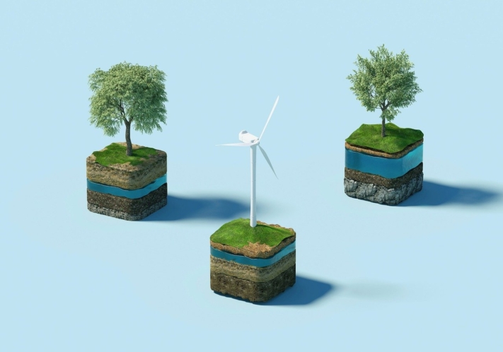

À une époque où la tendance au **développement durable** se renforce de plus en plus, les entreprises sont confrontées au défi de répondre aux exigences accrues de leurs clients. La demande croissante de produits durables se reflète dans le comportement des consommateurs, qui accordent de plus en plus d'importance au respect de l'environnement et à la responsabilité sociale - mot-clé : **Corporate Social Responsibility (CSR)**.

C'est pourquoi vous devez vous familiariser avec les bases de la responsabilité sociale des entreprises et développer des stratégies pour que votre entreprise puisse répondre aux nouvelles exigences. Mais que se cache-t-il exactement derrière le terme RSE et comment pouvez-vous mettre en œuvre avec succès la durabilité dans votre entreprise ?

Les entreprises reconnaissent de plus en plus l'importance de la RSE et l'intègrent dans leurs stratégies.

## Ce que signifie la RSE

CSR signifie Corporate Social Responsibility, ce qui signifie que les entreprises **assument la responsabilité de leur impact sur la société** dans le sens d'une gestion durable. Cela comprend aussi bien des aspects sociaux qu'écologiques et économiques. Il s'agit par exemple de commerce équitable, de politique du personnel centrée sur les employés, de préservation des ressources, de protection de l'environnement, d'engagement sur le terrain et de gestion responsable de la chaîne d'approvisionnement.

La responsabilité sociale des entreprises est ancrée dans la [Déclaration de principes de l'OIT](https://www.ilo.org/wcmsp5/groups/public/---ed_emp/---emp_ent/documents/publication/wcms_579897.pdf) sur les entreprises et la politique sociale, dans les [Principes directeurs de l'OCDE](https://www.oecd-ilibrary.org/docserver/abd4d37b-de.pdf?expires=1712137089&id=id&accname=guest&checksum=D56F1DDB92AE228C737A33B9F8FCF629) à l'intention des entreprises multinationales, dans les [Principes directeurs des Nations unies](https://www.auswaertiges-amt.de/blob/266624/b51c16faf1b3424d7efa060e8aaa8130/un-leitprinzipien-de-data.pdf) relatifs aux entreprises et aux droits de l'homme, dans le [Pacte mondial des Nations unies](https://www.globalcompact.de/fileadmin/user_upload/Bilder/Mediathek_Main_Page/Publikationen_PDF_speicher/DIE-ZEHN-PRINZIPIEN-1.pdf) et dans la [norme ISO 26000](https://www.bmas.de/SharedDocs/Downloads/DE/Publikationen/a395-csr-din-26000.pdf?__blob=publicationFile&v=2).

## Les relations importantes expliquées en bref

Si vous avez eu peu de contacts avec la responsabilité sociale des entreprises jusqu'à présent, vous vous demandez peut-être ce que la RSE a à voir avec la durabilité, ce que signifie la citoyenneté d'entreprise ou pourquoi certains l'ont abrégée en CR. Ces termes peuvent sembler déroutants au premier abord, mais ils sont essentiels pour comprendre pleinement le concept de responsabilité d'entreprise.

- **Durabilité :** dans la pratique, de nombreuses entreprises utilisent le terme de responsabilité sociale des entreprises (RSE) comme synonyme de durabilité. En théorie, la RSE en tant que concept est toutefois plus étroite que la durabilité, car elle désigne la contribution spécifique qu'une entreprise apporte à la gestion durable.
- **Corporate Citizenship :** cela décrit l'engagement qui va au-delà de l'activité commerciale proprement dite d'une entreprise, l'engagement d'utilité publique. Il s'agit par exemple du sponsoring, des dons et des fondations.
- **Responsabilité d'entreprise :** depuis quelques années, la CR est utilisée comme synonyme de RSE. Certains préfèrent cette expression pour éviter tout malentendu, le "social" de Corporate Social Responsibility étant souvent compris comme exclusivement social.

La durabilité n'est pas seulement une tendance, c'est une nécessité pour les entreprises.

## La pyramide de la RSE selon Carroll

La pyramide RSE, conçue par Archie B. Carroll, constitue une directive détaillée qui explique comment et pourquoi les organisations devraient assumer leur responsabilité sociale. Cette pyramide s'articule autour de quatre niveaux :

- **Responsabilité économique :** il s'agit du niveau fondamental de la RSE. Les entreprises ont la responsabilité d'être rentables et de créer de la valeur pour leurs actionnaires. Cela implique de réaliser des bénéfices, d'offrir des rendements aux actionnaires et d'assurer la rentabilité financière.
- **Responsabilité juridique :** les entreprises doivent s'assurer que leurs activités sont conformes au cadre juridique. Cela inclut par exemple le respect de la législation environnementale, du droit du travail et des règles de protection des consommateurs.
- **Responsabilité éthique :** à ce niveau, il s'agit d'aller au-delà de ce qui est requis par la loi et de promouvoir un comportement éthique. Les entreprises devraient s'engager à respecter des principes moraux tels que l'intégrité, l'honnêteté et l'équité, à la fois dans leurs opérations internes et dans leurs relations avec des parties externes telles que les clients, les fournisseurs et la communauté.
- **Responsabilité philanthropique :** le niveau supérieur de la responsabilité sociale de l'entreprise comprend les contributions volontaires à la société, qui vont au-delà de la simple réalisation de bénéfices et du respect des lois et des normes éthiques. Il peut s'agir par exemple de dons à des organisations caritatives, d'investissements dans l'éducation ou dans des projets de protection de l'environnement , ou encore de la promotion de l'engagement social des employés.

La pyramide de la RSE selon Archie B. Carroll

## Les avantages de la RSE

La mise en œuvre de la responsabilité sociale d'entreprise dans votre entreprise vous offre non seulement la possibilité d'apporter une contribution positive à la société, mais présente également un certain nombre d'avantages pour votre entreprise. En vous engageant dans la responsabilité sociale et environnementale, vous renforcez l'image de votre entreprise et vous vous démarquez de vos concurrents. Une **image positive** d'entreprise responsable peut **renforcer** votre **marque** et vous aider à **attirer et à fidéliser des clients**.

La promotion d'un **climat d'entreprise positif** et **de collaborateurs engagés** est un autre avantage essentiel de la RSE. En créant une culture d'entreprise qui encourage la responsabilité sociale et l'engagement des collaborateurs, vous renforcez l'attachement de ces derniers à l'entreprise. En outre, les initiatives RSE peuvent contribuer à **réduire les coûts** , par exemple en diminuant la consommation d'énergie, en réduisant les déchets et le gaspillage ou en favorisant des chaînes d'approvisionnement plus efficaces.

Dans l'ensemble, l'intégration de la RSE peut donc non seulement contribuer à apporter une contribution positive à la société, mais elle offre également des avantages commerciaux directs qui peuvent rendre votre entreprise plus performante.

La RSE devrait faire partie intégrante de la culture d'entreprise.

## Les défis de la mise en œuvre de la responsabilité sociale des entreprises

Cependant, vous pouvez également rencontrer quelques défis sur votre chemin vers une entreprise plus durable. Par exemple, l'envoi de vos collaborateurs à des formations et à des cours de perfectionnement peut entraîner des **coûts supplémentaires**.

Les objectifs en matière de durabilité peuvent s'avérer **longs à** atteindre et il peut être démotivant de constater que les progrès sont lents. L'engagement dans des activités d'intérêt général peut également représenter **un effort supplémentaire**.



## Exemples de mesures appropriées

Dans le cadre de leur responsabilité sociale d'entreprise (RSE), les entreprises ont la possibilité de prendre un grand nombre de mesures. Ces mesures contribuent à apporter une contribution positive et à positionner l'entreprise comme socialement responsable et durable. Voici quelques exemples concrets :

Entretoise

- Modèles de travail flexibles
- Voitures électriques comme voitures de société
- Collectes de fonds
- Réduire les voyages d'affaires
- Recyclage et prévention des déchets

Entretoise

- Énergie renouvelable
- Formation continue des employés
- Réduction des émissions
- Bourses d'études
- Formulation de valeurs fondamentales

La RSE nécessite un engagement à long terme et un contrôle continu.

## Pourquoi les rapports RSE sont essentiels

Les rapports RSE sont un instrument essentiel pour documenter et communiquer de manière transparente vos efforts dans le domaine de la responsabilité sociale de l'entreprise. Vous pouvez y consigner les **mesures** que vous avez mises en œuvre avec succès et les **objectifs** que vous vous êtes **fixés** pour l'avenir.

En produisant ces rapports, vous créez de **la transparence** et permettez à vos parties prenantes de mieux comprendre l'impact de votre entreprise sur l'environnement et la société. Cela peut renforcer la **confiance** dans votre entreprise et vous donner un avantage concurrentiel décisif.

## Modèle de SeaTable

Pour définir des objectifs concrets et suivre vos progrès, vous pouvez utiliser le [modèle]() gratuit de SeaTable. Le modèle vous permet de saisir vos objectifs, de les répartir en catégories et de les attribuer à des départements. Outre les mesures à prendre, vous pouvez également attribuer des priorités et inscrire une date cible.

Un autre tableau vous permet de garder une vue d'ensemble de tous les chiffres importants et de voir en un coup d'œil les domaines dans lesquels vous avez déjà pu vous améliorer. Vous pouvez également documenter les certificats de durabilité que vous avez déjà obtenus ou pour lesquels vous travaillez et générer automatiquement la prochaine échéance pour une nouvelle demande.

Pour utiliser SeaTable, il vous suffit de [vous inscrire]() gratuitement. Vous pouvez ensuite ajouter le [modèle]() à votre base et y ajouter vos propres données.
