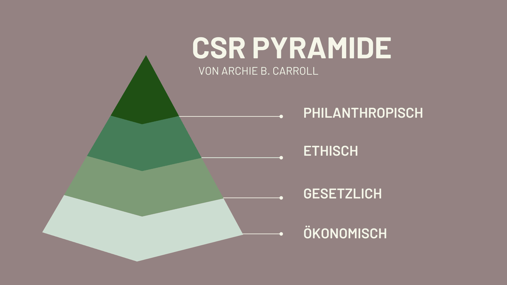

В то время, когда тенденция к **устойчивому** развитию набирает обороты, компании сталкиваются с необходимостью соответствовать возросшим ожиданиям своих клиентов. Растущий спрос на экологичные продукты отражается в поведении потребителей, которые все больше внимания уделяют экологичности и социальной ответственности - ключевое слово: **корпоративная социальная ответственность (КСО)**.

Поэтому вам следует ознакомиться с основами корпоративной социальной ответственности и разработать стратегию, как ваша компания может соответствовать новым требованиям. Но что именно означает термин КСО и как вы можете успешно внедрить устойчивое развитие в своей компании?

Компании все больше признают важность КСО и интегрируют ее в свои стратегии.

## Что означает КСО

CSR расшифровывается как Corporate Social Responsibility, что означает, что компании **берут на себя ответственность за свое влияние на общество** с точки зрения устойчивого ведения бизнеса. Это включает в себя как социальные, так и экологические и экономические аспекты. Например, это справедливая торговля, кадровая политика, ориентированная на сотрудников, экономия ресурсов, защита окружающей среды, участие местных жителей и ответственное управление цепочками поставок.

Корпоративная социальная ответственность закреплена в [Декларации принципов](https://www.ilo.org/wcmsp5/groups/public/---ed_emp/---emp_ent/documents/publication/wcms_579897.pdf) деловой и социальной политики [МОТ](https://www.ilo.org/wcmsp5/groups/public/---ed_emp/---emp_ent/documents/publication/wcms_579897.pdf), [Руководстве ОЭСР](https://www.oecd-ilibrary.org/docserver/abd4d37b-de.pdf?expires=1712137089&id=id&accname=guest&checksum=D56F1DDB92AE228C737A33B9F8FCF629) для транснациональных корпораций, [Руководящих принципах ООН](https://www.auswaertiges-amt.de/blob/266624/b51c16faf1b3424d7efa060e8aaa8130/un-leitprinzipien-de-data.pdf) по вопросам бизнеса и прав человека, [Глобальном договоре ООН](https://www.globalcompact.de/fileadmin/user_upload/Bilder/Mediathek_Main_Page/Publikationen_PDF_speicher/DIE-ZEHN-PRINZIPIEN-1.pdf) и [стандарте ISO 26000](https://www.bmas.de/SharedDocs/Downloads/DE/Publikationen/a395-csr-din-26000.pdf?__blob=publicationFile&v=2).

## Краткое описание важных соединений

Если вы мало сталкивались с корпоративной социальной ответственностью, вам может быть интересно, какое отношение КСО имеет к устойчивому развитию, что означает корпоративное гражданство или почему некоторые люди сокращают этот термин до КСО. Поначалу терминология может сбить с толку, но для полного понимания концепции корпоративной ответственности она крайне важна.

- **Устойчивое развитие:** На практике многие компании используют термин "корпоративная социальная ответственность" как синоним устойчивого развития. Однако в теории КСО - более узкое понятие, чем устойчивость, поскольку оно относится к конкретному вкладу, который компания вносит в устойчивое развитие бизнеса.
- **Корпоративное гражданство:** это описание обязательств компании перед обществом, выходящих за рамки ее фактической деятельности. Сюда относятся, например, спонсорство, пожертвования и фонды.
- **Корпоративная ответственность:** CR уже несколько лет используется как синоним КСО. Некоторые предпочитают этот термин, чтобы избежать недоразумений, поскольку под "социальным" в корпоративной социальной ответственности часто понимают исключительно социальное.

Устойчивое развитие - это не просто тенденция, а необходимость для компаний.

## Пирамида КСО по Кэрроллу

Пирамида КСО, разработанная Арчи Б. Кэрроллом, представляет собой подробное руководство, объясняющее, как и почему организации должны выполнять свою социальную ответственность. Пирамида разделена на четыре уровня:

- **Экономическая ответственность:** это фундаментальный уровень КСО. Компании обязаны быть прибыльными и создавать стоимость для своих акционеров. Это включает в себя генерирование прибыли, обеспечение доходности для акционеров и финансовую жизнеспособность.
- **Юридическая ответственность:** компании должны следить за тем, чтобы их деятельность соответствовала законодательной базе. Это включает, например, соблюдение экологических норм, трудового законодательства и правил защиты прав потребителей.
- **Этическая ответственность:** этот уровень предполагает выход за рамки законодательных требований и поощрение этичного поведения. Компании должны придерживаться таких моральных принципов, как честность, порядочность и справедливость, как в своих внутренних процессах, так и в отношениях с внешними сторонами, такими как клиенты, поставщики и общество.
- **Филантропическая ответственность:** высший уровень корпоративной социальной ответственности предполагает добровольный вклад в развитие общества, выходящий за рамки простого получения прибыли и соблюдения законов и этических норм. Это может включать, например, пожертвования в благотворительные организации, инвестиции в образование или проекты по защите окружающей среды , а также поощрение социальных обязательств со стороны сотрудников.

Пирамида КСО по версии Арчи Б. Кэрролла

## Преимущества КСО

Внедрение корпоративной социальной ответственности в вашей компании не только дает вам возможность внести позитивный вклад в развитие общества, но и приносит ряд преимуществ для вашей компании. Придерживаясь принципов социальной и экологической ответственности, вы укрепляете свой корпоративный имидж и отличаетесь от конкурентов. **Положительный имидж** ответственной компании может **укрепить** ваш **бренд** и помочь вам **привлечь и удержать клиентов**.

Еще одним ключевым преимуществом КСО является создание **позитивной рабочей среды** и **вовлечение сотрудников** в работу. Создавая корпоративную культуру, способствующую социальной ответственности и вовлеченности сотрудников, вы укрепляете их лояльность к компании. Инициативы в области КСО также могут помочь **сократить расходы** , например, за счет снижения энергопотребления, уменьшения количества отходов и расточительности или продвижения более эффективных цепочек поставок.

Таким образом, интеграция КСО не только помогает внести позитивный вклад в развитие общества, но и дает прямые преимущества для бизнеса, которые могут сделать вашу компанию более успешной.

КСО должна стать неотъемлемой частью корпоративной культуры.

## Проблемы реализации корпоративной социальной ответственности

Однако на пути к тому, чтобы стать более устойчивой компанией, вы можете столкнуться и с некоторыми трудностями. Например, вы можете понести **дополнительные расходы**, направляя своих сотрудников на программы обучения и развития.

Цели в области устойчивого развития могут **занимать много времени**, и медленное продвижение вперед может стать демотивирующим фактором. Участие в благотворительной деятельности также может потребовать **дополнительных усилий**.



## Примеры подходящих мер

В рамках своей корпоративной социальной ответственности (КСО) компании имеют возможность принимать различные меры. Эти меры помогают внести позитивный вклад и позиционируют компанию как социально ответственную и устойчивую. Вот несколько конкретных примеров:

Проставка

- Гибкие модели работы
- Электронные автомобили в качестве служебных автомобилей
- Кампании по сбору средств
- Сократите количество командировок
- Переработка и предотвращение образования отходов

Проставка

- Возобновляемые источники энергии
- Повышение квалификации сотрудников
- Сокращение выбросов
- Образовательные стипендии
- Формулировка основных ценностей

КСО требует долгосрочных обязательств и постоянного контроля.

## Почему отчеты о КСО необходимы

Отчеты о КСО - это важный инструмент для прозрачного документирования и распространения информации о ваших усилиях в области корпоративной социальной ответственности. С их помощью вы можете зафиксировать, какие **меры** были успешно реализованы и к каким **целям** вы стремитесь в будущем.

Выпуская эти отчеты, вы создаете **прозрачность** и позволяете заинтересованным сторонам лучше понять влияние вашей компании на окружающую среду и общество. Это может укрепить **доверие** к вашей компании и дать вам решающее конкурентное преимущество.

## Шаблон от SeaTable

Бесплатный [шаблон]() от SeaTable идеально подходит для постановки конкретных целей и отслеживания прогресса. Вы можете ввести свои цели в шаблон, разделить их на категории и распределить по отделам. В дополнение к предстоящим мероприятиям вы также можете назначить приоритеты и указать дату достижения цели.

С помощью еще одной таблицы вы можете отслеживать все важные показатели и сразу видеть, в каких областях вам уже удалось добиться улучшений. Вы также можете документировать сертификаты устойчивости, которые вы уже получили или над которыми вы работаете, и автоматически генерировать следующую дату для новой заявки.

Чтобы использовать SeaTable, достаточно бесплатно [зарегистрироваться](). Затем вы можете добавить [шаблон]() в свою базу и добавить свои собственные данные.
