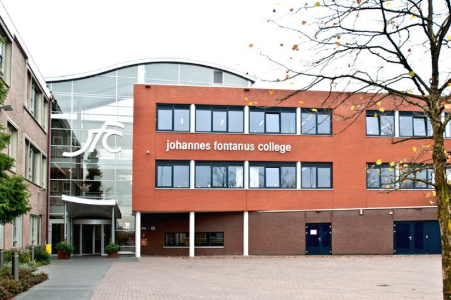



## Предыстория
Ко Смидт любит снижать риск ошибок и оптимизировать рабочие процессы. Неудивительно: как руководитель отдела экзаменов в [Johannes Fontanus College](https://www.jfc.nl/), он отвечает, помимо прочего, за прозрачное и безошибочное проведение экзаменов - процесс, в котором задействовано множество людей и конфиденциальных данных. В кулуарах выставки SeaDays 2024 в Майнце он объяснил, почему SeaTable - именно тот инструмент, который ему нужен. Потому что для средней школы в Барневелде (Нидерланды) с ее 300 сотрудниками и 2 300 учениками внедрение SeaTable означало значительное повышение эффективности и прозрачности при одновременном соблюдении законодательных норм защиты данных.

## Проблемы фрагментарного управления информацией
Существующие процессы не были идеальными. До внедрения SeaTable школа использовала Google Workspace for Education для оцифровки процессов и обеспечения совместной работы. Но на практике все было иначе. Совместная работа оказалась неэффективной и чреватой ошибками при использовании имеющихся инструментов. Общение по электронной почте и обмен документами были широко распространены, что означало регулярное распространение неполной или устаревшей информации. Это приводило к недоразумениям и отсутствию прозрачности. На основе имеющейся в системе информации было трудно четко определить текущий статус процессов или определить, кто отвечает за определенные задачи.

Эта в целом неудовлетворительная рабочая ситуация была усугублена новыми требованиями по защите данных. Колледжу больше не разрешалось хранить конфиденциальные данные студентов на внешних серверах за пределами ЕС.

## Переход на SeaTable



SeaTable обеспечивает целостность данных (благодаря продуманной структуре базы данных), а в сочетании с универсальным приложением, общими наборами данных и автоматизацией Вы можете значительно повысить эффективность и качество управления данными.



Первоначальные тесты с использованием известных американских инструментов для работы с электронными таблицами не дали ожидаемых результатов. Протестированные решения не обеспечивали необходимой защиты данных и не могли быть легко интегрированы в существующие рабочие процессы. Тогда Ко Смидт начал искать европейских поставщиков, особенно тех, кто уделяет большое внимание защите и безопасности данных. В конце концов, он наткнулся на SeaTable. **Этот инструмент идеально отвечал его требованиям**, особенно тем, что он размещен на европейских серверах и, таким образом, соответствует законодательным требованиям по защите данных, предлагает удобный интерфейс и возможности для рационализации процессов и эффективного управления данными с помощью форм, автоматизации и интегрированного создания документов.

## Внедрение и результаты
SeaTable был внедрен на первом этапе для экзаменационного отдела. **Внедрение проходило плавно** и небольшими шагами. Чтобы получить первоначальный опыт работы с новым инструментом, команда начала записывать данные в SeaTable вместо Google и отображать в нем начальные процессы. В конечном итоге, самой сложной задачей было убедить других сотрудников в преимуществах нового инструмента. Чтобы убедить всех, был использован подход дизайн-мышления: проблемы и пожелания коллег обсуждались вместе, разрабатывались и тестировались различные подходы, чтобы в итоге прийти к решению, которое удовлетворило бы всех участников. Прежде всего, решающим фактором оказалось **удобство для пользователя**, которое было еще больше улучшено с помощью универсального приложения.

Еще одно преимущество такого подхода: поскольку все пользователи были вовлечены в поэтапную разработку, тестирование и внедрение новых процессов и приложения, переход на новые процессы прошел гладко для всех коллег.

## Цифровизация на благо коллектива
Для Ко Смидта ясно одно: "SeaTable значительно улучшил нашу повседневную работу". Качество данных повысилось благодаря консолидированному, стандартизированному источнику данных, а процессы стали более эффективными. Но, пожалуй, самое главное - сокращение ручных, повторяющихся задач и более четкие процессы повысили **удовлетворенность работой**.

Внедрение SeaTable привело к значительной оптимизации в двух важнейших административных областях, в частности: Администрирование экзаменов и поддержка студентов. Ko Smidt оцифровал процесс проведения экзаменов, заменив ручные, бумажные системы автоматизированным, отслеживаемым процессом. Экзаменаторы теперь получают уведомления автоматически, что избавляет их от 250 ручных писем и дает всем участникам **информацию о статусе экзамена в режиме реального времени**.

Служба поддержки студентов, помимо прочего, заботится о требованиях студентов с особыми потребностями. Благодаря SeaTable выбранные сотрудники могут подавать все запросы, например, на дополнительные помещения, в цифровом виде со всеми необходимыми документами. Сложная автоматизация в SeaTable позволяет сотрудникам отслеживать статус запросов, устанавливать точные полномочия и оптимизировать каналы связи. Это позволило команде значительно снизить административное бремя **без ущерба для защиты данных и прозрачности**.

Отдел [информационных технологий школы]() и столовая теперь также используют SeaTable. А **отдел кадров уже планирует внедрить его**.

## Заключение
"SeaTable предлагает компетентную, ориентированную на клиента и дружелюбную поддержку. Документация является исчерпывающей, а программное обеспечение - стабильным, надежным и удобным. Благодаря этому нашей команде легко настраивать систему и эффективно ее использовать". объяснил Ко Смидт в нашем интервью. **Он может безоговорочно рекомендовать SeaTable всем, кому нужно эффективное, прозрачное, соответствующее GDPR решение для управления процессами и базами данных с высоким уровнем безопасности данных.**
