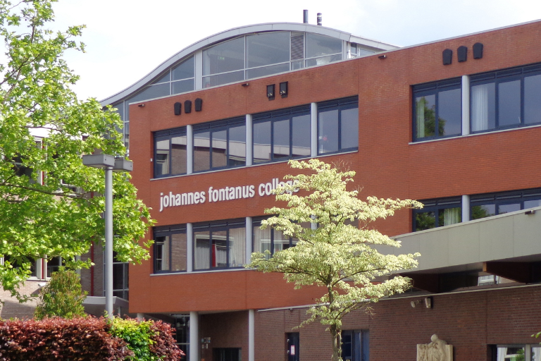



## Die Ausgangslage: Manuelle Prozesse, Ineffizienz und hoher Aufwand

Am [Johannes Fontanus College](https://www.jfc.nl/), einer Sekundarschule in Barneveld, nutzen etwa 95 % der Schüler die von der Schule zur Verfügung gestellten Laptops. Hinzu kommen die Anforderungen der 300 Mitarbeiter. Mit dem bestehenden fragmentierten System aus Papiertickets, E-Mail-Kommunikation und verschiedenen Spreadsheets geriet die IT-Abteilung an ihre Grenzen. Um die Prozesse zu verschlanken und den manuellen Aufwand zu reduzieren, sollte **ein robustes, integriertes System** für IT-Support, Asset-Management und Projektverwaltung entwickelt werden.



Als Bildungseinrichtung, die Tausende von Geräten und Support-Tickets verwaltet, brauchten wir eine robuste und dennoch flexible Lösung. SeaTable bot genau das – es ermöglichte uns benutzerdefinierte Anwendungen für verschiedene Abteilungen zu erstellen und gleichzeitig ein einheitliches System für unseren IT-Betrieb.



## SeaTable überzeugte durch Flexibilität und Leistungsfähigkeit
Die Umstellung begann, als Ko Smidt, der an der Schule bereits mit der Implementierung von SeaTable für die [Prüfungsabteilung]() begonnen hatte, den IT-Kollegen von seinen Erfahrungen mit der **No-Code-Plattform** berichtete. „SeaTable hat uns durch seine Flexibilität und seine schnellen Implementierungsmöglichkeiten beeindruckt.“, erzählte Matthias van Laar. Innerhalb weniger Tage konnte das IT-Team ein digitales Ticketingsystem aufbauen. Die **intuitive Benutzeroberfläche** und die Möglichkeit, schnell individuelle Lösungen ohne aufwendige Entwicklung zu erstellen, waren weitere wesentliche Faktoren für die Entscheidung, SeaTable einzuführen

Die **Implementierung verlief bemerkenswert reibungslos**. Die Mitarbeiter des IT-Service Desk und die  Systemadministratoren arbeiteten zusammen, um individuelle Schnittstellen zu schaffen, die auf die technischen Fähigkeiten der verschiedenen Benutzergruppen zugeschnitten waren. Denn dank der benutzerfreundlichen Oberfläche und **leistungsstarken Automatisierungsfunktionen** kommen auch nicht-technische Mitarbeiter mühelos mit dem Tool zurecht. Die Möglichkeit, Lösungen iterativ zu entwickeln und einzusetzen, ermöglichte eine kontinuierliche Prozessoptimierung, ohne den täglichen Betrieb zu stören.

## Sichtbare Erfolge in kurzer Zeit

Mit SeaTable konnte das IT-Team den Zeitaufwand für die manuelle Dateneingabe erheblich reduzieren, die Kommunikation zwischen den IT-Mitarbeitern und anderen Abteilungen verbessern und eine bis dahin nicht gekannte **Transparenz über alle Service-Desk-Aktivitäten und das Asset Management** gewinnen. Insgesamt haben sich die Abläufe beschleunigt.

Zu den wichtigsten Funktionen aus Sicht der IT-Abteilung gehören:
  
- Flexible Ansichten und Filtermöglichkeiten 
- Individuelle Formularerstellung für verschiedene Anwendungsfälle 
- Automatisierungsmöglichkeiten für die Zuweisung von Tickets 
- Integrationsmöglichkeiten mit anderen Tools wie PRTG 
- Dataset-Funktionalität für die gemeinsame Nutzung von Informationen in verschiedenen Tabellen 
- Die Möglichkeit, benutzerdefinierte Anwendungen für verschiedene Benutzergruppen zu erstellen

Das neue Schüler-Ticketing-System füllt nun automatisch die Daten der Schüler aus, verfolgt die Verfügbarkeit von Leih-Laptops und **weist die Support-Tickets den entsprechenden Teammitgliedern zu**. Das Ticketing-System für Mitarbeiter wurde mit dem Netzwerküberwachungsprogramm integriert, und bietet so einen **Echtzeitüberblick über Supportanfragen und den Gerätestatus**.

U. a. wird das Tool ebenfalls genutzt für: 

- **Asset Management:** Nachverfolgung von Mitarbeiter-Laptops und IT-Ausrüstung 
- **Projektmanagementverwaltung:** Organisieren und Verfolgen von IT-Initiativen 
- **Integration des Gebäudemanagements:** Wir entwickeln ein maßgeschneidertes Ticketingsystem für verschiedene Facility-Dienste   

Im nächsten Schritt prüfen Matthias van Laar und seine Kollegen u. a. die Umsetzung eines automatisierten Systems zur Verwaltung von Schließfachausweisen, das in ihr Active Directory integriert werden soll.

## Digitalisierter IT-Support mit SeaTable

Mit den in SeaTable vorhandenen Möglichkeiten, benutzerdefinierte Ansichten zu erstellen, Prozesse zu automatisieren und bestehende Tools zu integrieren, konnte das IT-Team bestehende Prozesse verschlanken und deutlich optimieren. Was als Lösung zur Verwaltung von Laptop-Problemen begann, hat sich zu einem **umfassenden Managementsystem** entwickelt, das die Effizienz, Zusammenarbeit und strategische Planung im gesamten IT-Team unterstützt. 

