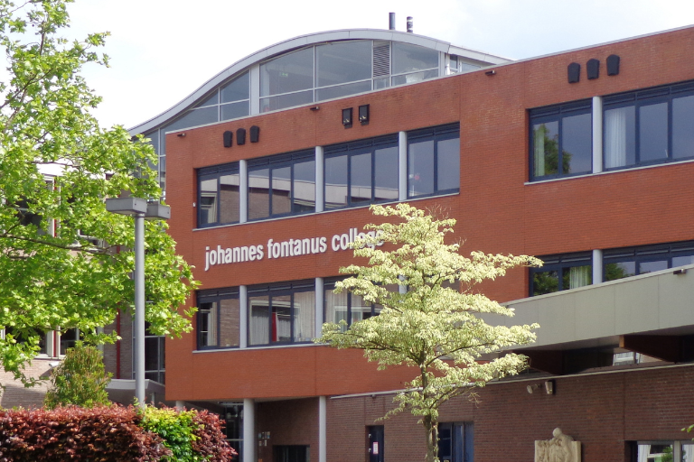



## La situation initiale : Processus manuels, inefficacité et coûts élevés

Au [Johannes Fontanus College](https://www.jfc.nl/), un établissement d'enseignement secondaire situé à Barneveld, environ 95 % des élèves utilisent les ordinateurs portables fournis par l'école. À cela s'ajoutent les besoins des 300 employés. Avec le système fragmenté existant, composé de tickets papier, de communications par courrier électronique et de diverses feuilles de calcul, le département informatique atteignait ses limites. Afin de rationaliser les processus et de réduire les efforts manuels, **un système robuste et intégré** pour l'assistance informatique, la gestion des actifs et la gestion des projets devait être développé.



En tant qu'institution éducative gérant des milliers d'appareils et de tickets d'assistance, nous avions besoin d'une solution à la fois robuste et flexible. SeaTable nous a permis de créer des applications personnalisées pour différents départements tout en fournissant un système unifié pour nos opérations informatiques.



## SeaTable a impressionné par sa flexibilité et ses performances
La transition a commencé lorsque Ko Smidt, qui avait déjà commencé à mettre en œuvre SeaTable pour le [département des examens]() de l'école, a fait part à ses collègues des TI de son expérience avec la plateforme **no-code**. "SeaTable nous a impressionnés par sa flexibilité et ses options de mise en œuvre rapide", a déclaré Matthias van Laar. En quelques jours, l'équipe informatique a pu mettre en place un système de billetterie numérique. L'interface utilisateur intuitive et la possibilité de créer rapidement des solutions personnalisées sans développement approfondi ont été d'autres facteurs clés dans la décision de mettre en œuvre SeaTable.

La **mise en œuvre s'est déroulée remarquablement bien**. Le personnel du service d'assistance informatique et les administrateurs du système ont travaillé ensemble pour créer des interfaces individuelles adaptées aux capacités techniques des différents groupes d'utilisateurs. Grâce à l'interface conviviale et aux **puissantes fonctions d'automatisation**, même le personnel non technique peut facilement se familiariser avec l'outil. La possibilité de développer et de déployer des solutions de manière itérative a permis une optimisation continue des processus sans perturber les opérations quotidiennes.

## Un succès visible en peu de temps

Grâce à SeaTable, l'équipe informatique a pu réduire considérablement le temps consacré à la saisie manuelle des données, améliorer la communication entre le personnel informatique et les autres départements et bénéficier d'une **transparence sans précédent sur toutes les activités du service desk et la gestion des actifs**. Dans l'ensemble, les processus ont été accélérés.

Les fonctions les plus importantes du point de vue du département informatique sont les suivantes
  
- Vues flexibles et options de filtrage
- Création de formulaires individuels pour différents cas d'utilisation
- Options d'automatisation pour l'attribution des tickets
- Options d'intégration avec d'autres outils tels que PRTG
- Fonctionnalité d'ensemble de données pour le partage d'informations dans différents tableaux
- La possibilité de créer des applications personnalisées pour différents groupes d'utilisateurs.

Le nouveau système de billetterie pour les étudiants remplit désormais automatiquement les données des étudiants, suit la disponibilité des ordinateurs portables de prêt et **assigne les tickets de support aux membres de l'équipe appropriés**. Le système de billetterie pour les employés a été intégré au programme de surveillance du réseau, ce qui permet d'avoir une **vue d'ensemble en temps réel des demandes d'assistance et de l'état des appareils**.

L'outil est également utilisé pour :

- **Gestion des actifs :** suivi des ordinateurs portables et du matériel informatique des employés
- **L'administration de la gestion de projet :** l'organisation et le suivi des initiatives informatiques
- **L'intégration de la gestion des installations :** nous développons un système de billetterie personnalisé pour les différents services des installations.

L'une des prochaines étapes que Matthias van Laar et ses collègues envisagent est la mise en œuvre d'un système automatisé de gestion des badges de casiers qui sera intégré à leur Active Directory.

## L'assistance informatique numérisée avec SeaTable

Grâce à la capacité de SeaTable à créer des vues personnalisées, à automatiser les processus et à intégrer les outils existants, l'équipe informatique a pu rationaliser et optimiser de manière significative les processus existants. Ce qui a commencé comme une solution pour gérer les problèmes liés aux ordinateurs portables s'est transformé en un **système de gestion complet** qui soutient l'efficacité, la collaboration et la planification stratégique au sein de l'équipe informatique.

