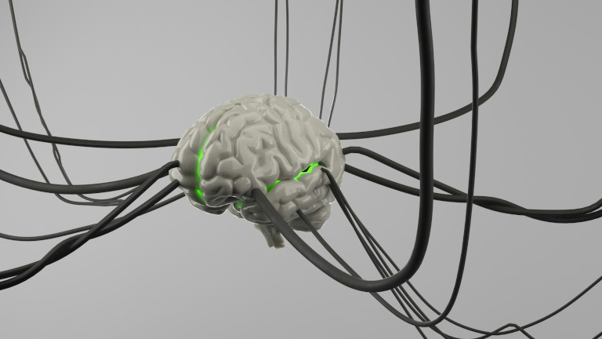

## Qu'est-ce qu'un journal de gratitude ?

Un **journal de gratitude** est une forme particulière de journal de pleine conscience. Il vise à orienter votre attention vers la reconnaissance et la consignation des beaux moments et des aspects positifs, tandis qu'un **journal de pleine conscience** vous permet plus généralement d'observer vos pensées, vos émotions et vos expériences dans l'ici et maintenant. Les deux vont de pair : pour pouvoir être reconnaissant de quelque chose, il faut d'abord apprendre, grâce à la pleine conscience, à percevoir consciemment les choses positives du quotidien.

### Quelle est la différence avec le journal du bonheur ?

Les termes sont souvent utilisés comme synonymes, mais le journal de gratitude va encore un peu plus loin. Ce n'est pas seulement une méthode pour rendre visible un bonheur discret, mais aussi pour développer consciemment de la reconnaissance à son égard.

## Journal de gratitude : les avantages en un coup d'œil

*   **Adopter des perspectives positives** : avec un journal de gratitude, vous détournez votre regard des problèmes, des soucis et des angoisses pour vous tourner vers les aspects positifs.
*   **Renforcer la confiance en soi** : lorsque vous notez ce qui va bien, vous commencez à voir votre bonheur et vos réussites. Cela peut renforcer votre confiance en vous, votre satisfaction et votre résilience.
*   **Réduire le ressenti du stress** : en apprenant la gratitude, vous générez des émotions positives et devenez moins vulnérable au stress négatif. Vous traversez ainsi le quotidien avec plus de sérénité.
*   **Un meilleur sommeil** : si vous écrivez le soir dans votre journal de gratitude avant de vous endormir, vous stoppez le tourbillon de pensées et terminez la journée sur un sentiment positif.
*   **Traverser les périodes difficiles** : c'est justement dans les phases difficiles que l'on peut perdre foi en la bonté. Si vous parvenez malgré tout à vous concentrer sur les éclaircies, cela peut vous donner force et confiance.  

## Le biais de négativité : comment une perception déformée bloque la pensée positive

Vous connaissez certainement cela : votre journée s'est globalement bien déroulée, mais au dîner vous racontez ce seul commentaire désagréable de votre cheffe et cette seule tâche de votre [liste de tâches]() que vous n'avez pas réussi à accomplir. On appelle ce phénomène le **biais de négativité** ou **distorsion de négativité**. On entend par là la tendance de l'être humain à percevoir plus fortement et à accorder plus de poids aux événements, aux nouvelles ou aux émotions négatives qu'aux positives, alors même que le bon l'emporte en réalité.  
  
C'est encore pire lorsque vous vivez une expérience négative dès le matin, par exemple manquer le bus et arriver en retard à un rendez-vous. Vous avez alors le sentiment que rien ne va. Et une fois que vous pensez cela, vous mettez tout ce qui tourne mal durant la journée sur le compte de votre malchance. Un filtre se pose sur votre perception et ne laisse plus passer que le négatif. **Vous ne remarquez même pas les choses positives**, bien qu'elles se produisent probablement aussi.

### Pourquoi notre cerveau doit apprendre la gratitude

Notre cerveau est programmé par l'évolution pour **percevoir plus rapidement les dangers et les garder plus longtemps en mémoire que les situations positives**. Le buisson aux baies juteuses passe au second plan lorsque le cerveau enregistre en même temps des épines acérées, une pente abrupte ou des prédateurs à l'affût. Ce qui assurait autrefois la **survie** fait toutefois qu'aujourd'hui, les facteurs de stress, les soucis et les problèmes reçoivent une attention disproportionnée.

En raison du biais de négativité, nous percevons par nature le négatif plus fortement que le positif. Nous mettons l'accent sur ce qui nous dérange ou nous manque, et les beaux moments passent sans laisser de trace. C'est précisément là qu'intervient un journal de gratitude. Il aiguise notre regard pour ce qui fonctionne déjà bien, afin de briser les **schémas de pensée négatifs** et d'être plus heureux à long terme.



Vous trouverez un exemple quotidien de la distorsion de négativité dans les médias : catastrophes naturelles, guerres et criminalité dominent l'actualité, car elles attirent plus l'attention que les bonnes nouvelles. La confrontation permanente avec ces contenus médiatiques peut donc conduire à une vision négative du monde, à un stress chronique et à un sentiment de surmenage. Découvrez dans l'article lié comment limiter votre consommation de médias grâce à une [détox numérique]() régulière et retrouver plus de calme et de joie de vivre.



## La psychologie positive : le concept derrière le journal de gratitude

Contrairement à la psychologie clinique, le plus souvent orientée vers les déficits, la psychologie positive travaille de manière **orientée vers les ressources** et place au centre de la recherche des aspects tels que les forces personnelles de caractère, les facteurs de bonheur et la résilience. Un terme central en est la **neuroplasticité** : notre cerveau possède la capacité de s'adapter aux changements tout au long de notre vie. Chaque fois que vous apprenez quelque chose de nouveau, vos cellules nerveuses forment de nouvelles connexions.  
  
Autrement dit : lorsque vous répétez régulièrement certains schémas de pensée et de comportement, vous renforcez des réseaux neuronaux dans certaines zones du cerveau. Celui qui perçoit surtout le stress et les problèmes manifeste inconsciemment précisément cette perception. Si, à l'inverse, vous adoptez régulièrement d'autres perspectives et apprenez la gratitude, vous renforcez les **réseaux neuronaux correspondants pour la pensée positive**.

## Comment un journal de gratitude peut renforcer votre santé mentale

Grâce à des méthodes de pleine conscience comme un journal de gratitude ou du bonheur, vous pouvez aiguiser votre regard pour le positif et ressentir plus de reconnaissance pour les choses du quotidien. Cela s'accompagne de **plus de satisfaction** – car la gratitude contrecarre notre tendance à percevoir en priorité ce qui va mal. Elle aide, même dans les phases éprouvantes, à mettre en lumière les côtés positifs et à voir ce qui va déjà bien. Car de ces aspects, il y en a plus que nous ne le pensons souvent.

Des études qui ont examiné le journal du bonheur en tant que méthode psychologique ont également constaté des effets positifs sur le bien-être, la motivation et la satisfaction de vie de ceux qui notaient chaque jour ce dont ils étaient reconnaissants. La manière exacte dont le journal de gratitude déploie ses effets n'est pas encore totalement élucidée. D'une part, il peut accroître la **confiance en soi**, parce que l'on s'entraîne à reconnaître les aspects positifs et que l'on prend conscience de ses réussites ainsi que de ses relations sociales solides.

D'autre part, il est plausible que les problèmes, les soucis et les angoisses passent un instant au second plan lorsque l'on réfléchit à des expériences positives – car on ne peut pas être reconnaissant et ressentir en même temps de la peur, de la colère ou de la tension. C'est pourquoi un journal de gratitude peut favoriser l'**équilibre émotionnel** et réduire la vulnérabilité au stress et aux humeurs dépressives.


Si vous souffrez de dépressions sévères, de traumatismes ou d'états d'angoisse, un journal de gratitude ne suffit pas. Il faut alors un accompagnement professionnel, par exemple une psychothérapie.


### Les effets potentiels en un coup d'œil

*   Plus de pleine conscience au quotidien et de reconnaissance pour les petites choses de la vie
*   Une plus grande satisfaction et une attitude plus positive face à la vie
*   Plus de motivation et de bien-être  
*   Un ressenti du stress moindre et un équilibre émotionnel
*   Une résilience et une sérénité renforcées grâce à une plus grande confiance en soi
*   Un mode de vie plus sain grâce à la réflexion : sommeil, [alimentation](), etc.

## Conseils pour la routine parfaite lorsque vous tenez un journal de gratitude

1.  **Déterminer un moment fixe** : comme toute nouvelle [habitude](), un journal de gratitude vit de la régularité. En routine matinale, il convient parfaitement pour commencer la journée avec une impulsion positive. Le soir, l'écriture aide à clore la journée et à trouver le calme intérieur. Vous pouvez aussi l'associer à une routine existante, en réfléchissant par exemple toujours pendant le brossage des dents à ce dont vous êtes reconnaissant.  
    
2.  **Ne noter que des pensées positives** : tâches non résolues, conflits ou problèmes – parfois le tourbillon de pensées semble tourner sans fin. Pour vraiment marquer une pause et créer un équilibre émotionnel, vous ne devriez consigner dans votre journal de gratitude que des pensées positives, des moments de bonheur et de beaux souvenirs. Vos soucis, vos tâches à faire et vos rendez-vous, vous pouvez au préalable les coucher sur le papier, par exemple dans un [bullet journal]().
    
3.  **Regarder de plus près et être concret** : lorsque l'on tient chaque jour un journal de gratitude, on peut vite avoir l'impression d'écrire toujours la même chose. Après tout, vous pourriez par exemple être durablement reconnaissant pour votre santé, votre travail ou votre famille. Essayez donc aussi de percevoir des choses plus petites et de les décrire concrètement. Vous remarquerez peut-être alors la succession de feux verts sur votre trajet de travail ou le vendeur aimable au supermarché.
    
4.  **Persévérer les mauvais jours** : c'est justement lors des journées accablantes qu'un journal de gratitude peut avoir le plus grand effet. Cela ne signifie pas que vous devez ignorer les sentiments négatifs, mais que vous pouvez malgré tout découvrir de petites éclaircies. Si vous êtes par exemple stressé, vous pouvez tout de même être reconnaissant de l'aide d'une amie ou d'une promenade au grand air. Cette perception nuancée renforce votre résilience de manière plus durable que le refoulement des aspects négatifs.  
    


Les mois de janvier à novembre comptent ensemble 48 semaines calendaires. Écrivez donc toutes les deux semaines vos plus grandes réussites ou vos plus beaux moments de bonheur sur un petit papier que vous conservez ensuite dans une boîte. Vous obtenez ainsi un [calendrier de l'avent]() avec 24 souvenirs positifs. En décembre, vous tirez alors chaque jour un papier pour repasser l'année en revue une nouvelle fois dans la gratitude.



## Tenir un journal de gratitude : les meilleures questions pour débuter

Ce sur quoi vous écrivez ne dépend bien sûr que de vous. Avec les questions suivantes, débuter votre journal du bonheur bien personnel devient en tout cas un jeu d'enfant :

*   Qu'est-ce qui a bien fonctionné aujourd'hui ?  
*   Qu'est-ce qui m'a fait plaisir aujourd'hui ?
*   Qu'est-ce qui m'a fait du bien aujourd'hui ?
*   De quoi suis-je reconnaissant aujourd'hui ?
*   Qui aimerais-je remercier aujourd'hui ?
*   Qu'est-ce qui me réjouit pour demain ?

Il ne s'agit pas d'événements spectaculaires. Avec un journal de pleine conscience, vous essayez de percevoir les nombreux petits moments où vous pouvez vous estimer heureux, par exemple :

*   une promenade détendue au soleil
*   une route dégagée là où règnent d'habitude les embouteillages
*   une blague qui vous a fait rire
*   une tâche que vous avez menée à bien
*   des plats et des boissons que vous avez savourés
*   une photo avec un beau souvenir
    


En Europe, nous considérons comme allant de soi de nombreuses choses pour lesquelles, à l'échelle mondiale, des millions d'autres personnes seraient reconnaissantes. Cela commence par l'eau du robinet propre et un approvisionnement alimentaire sûr, et ne s'arrête de loin pas à l'État de droit et à la liberté de voyager. Bien que nos problèmes et nos soucis soient naturellement légitimes, les remettre en perspective les fait paraître plus petits. Pour cela, vous pouvez documenter vos expériences dans d'autres pays avec un [journal de voyage]().



## Erreurs typiques lors de la tenue d'un journal de gratitude

*   **Des attentes trop élevées** : un journal de gratitude ne change pas votre vie du jour au lendemain. Les effets positifs ne naissent que par la répétition régulière sur plusieurs semaines.
*   **Ne pas écrire assez souvent** : écrire cinq minutes par jour dans son journal de gratitude est bien plus efficace que d'y consacrer une heure toutes les deux semaines.
*   **Des formulations trop générales** : essayez de décrire des instants aussi concrets que possible pour lesquels vous êtes reconnaissant, plutôt que des phrases vagues comme : « Je suis reconnaissant pour ma famille. »
*   **Un faux perfectionnisme** : un journal de gratitude n'a pas besoin de devenir un roman, de brefs mots-clés suffisent amplement. L'important est de persévérer, surtout dans les phases stressantes.
    
## Comment créer votre propre journal de gratitude numérique avec SeaTable

SeaTable est une [plateforme no-code avec IA]() qui vous permet de saisir des données, des textes et des images de manière structurée et de créer très facilement vos propres applications. Notre **modèle de journal de gratitude**, vous pouvez l'adapter avec flexibilité à vos besoins sans la moindre connaissance en programmation et l'utiliser durablement [gratuitement]().



Découvrez aussi l'**application de journal de gratitude** intégrée : à l'aide d'un formulaire, vous répondez systématiquement à des questions, de sorte que vos entrées de journal se rédigent en un tour de main. Vos entrées sont ensuite visualisées de manière claire sur différentes pages, dans un tableau ou une galerie de photos, ainsi que sur un calendrier ou un tableau de bord.

Votre journal de gratitude numérique est stocké en toute sécurité dans le [SeaTable Cloud]() et disponible à tout moment via Internet, indépendamment du lieu et de l'appareil. Vous pouvez ainsi consigner directement vos expériences positives partout, sans avoir à emporter un journal de gratitude analogique.



## Conclusion : établir des schémas de pensée positifs avec un journal de gratitude

Un journal de gratitude allie les enseignements de la psychologie positive à un journaling adapté au quotidien, afin d'opposer quelque chose au biais de négativité. Il offre une entrée simple vers plus de pleine conscience et de santé mentale en orientant l'attention sur ce qui va bien. Par la perception ciblée des réussites, des moments de bonheur et des aspects positifs, il brise les schémas de pensée négatifs et peut renforcer à long terme la confiance en soi, la résilience et le bien-être.

## Questions fréquentes sur le journal de gratitude



Non ! Un journal de gratitude peut vous aider au quotidien à vous débarrasser des schémas de pensée négatifs et à voir davantage d'aspects positifs. C'est pourquoi beaucoup l'utilisent en accompagnement d'une thérapie. Il ne devrait toutefois jamais remplacer le conseil d'un psychologue professionnel.





Non. Peu importe que vous utilisiez un simple bloc-notes, un journal de gratitude numérique ou un journal de pleine conscience plus global. L'essentiel est que vous reconnaissiez, documentiez et appréciiez les choses positives pour lesquelles vous pouvez être reconnaissant.





Le plus souvent à cause de la discipline nécessaire pour écrire chaque jour quelque chose de positif. Beaucoup ont des attentes trop élevées et abandonnent dès les premières semaines, avant qu'un changement net ne soit perceptible. C'est justement au début que presque tout le monde a des difficultés à percevoir au quotidien un bonheur moins évident.





Bien sûr, les pensées, sentiments et expériences négatifs ne disparaissent jamais complètement de notre vie. L'art consiste à leur opposer quelque chose. Il ne s'agit pas de rechercher désespérément la bonne humeur. En tenant un journal de gratitude, vous essayez simplement d'orienter l'attention vers quelque chose de positif. Si vous avez par exemple perdu un être cher, vous devriez laisser place à la douleur et au chagrin – mais vous pouvez écrire dans votre journal de gratitude que vous avez vécu ensemble de beaux moments.



  
  

  
  
