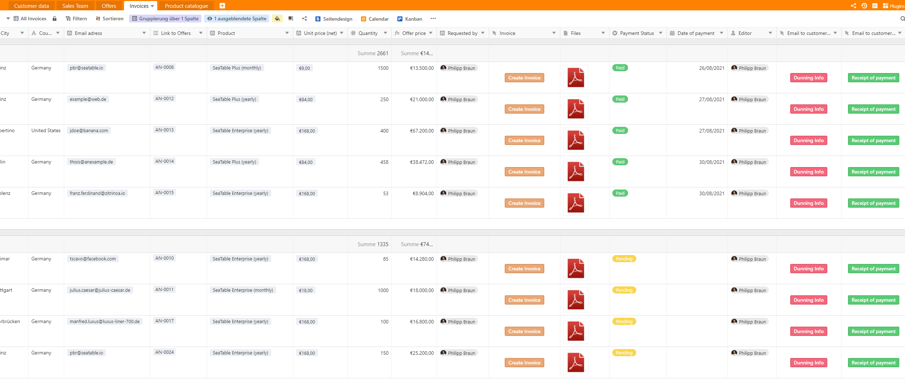
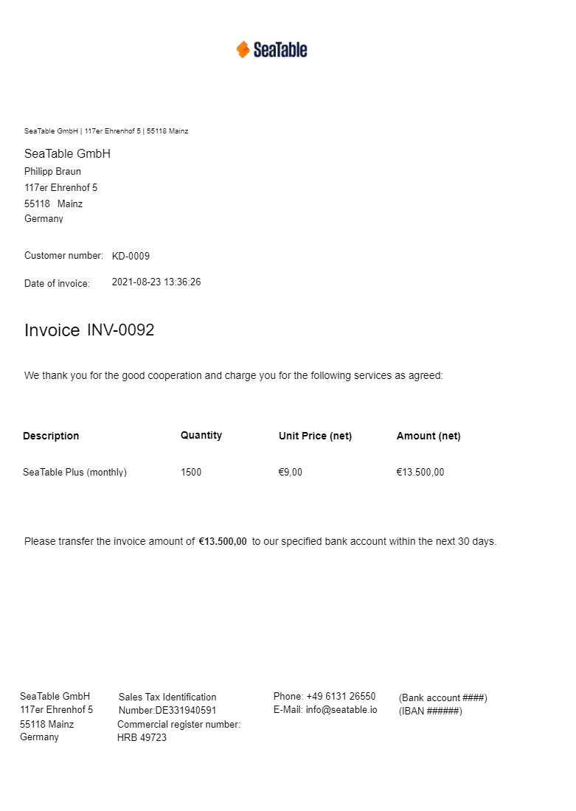
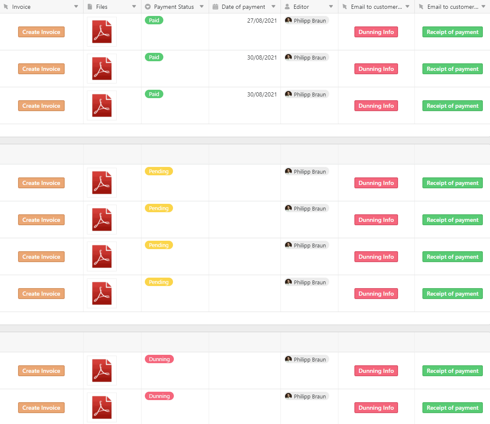
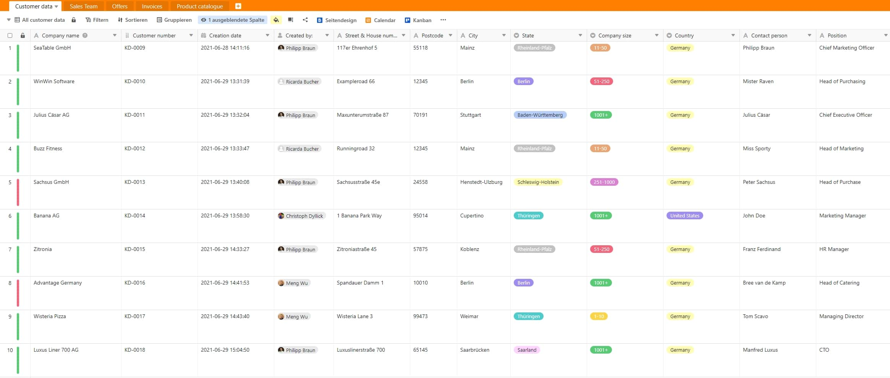
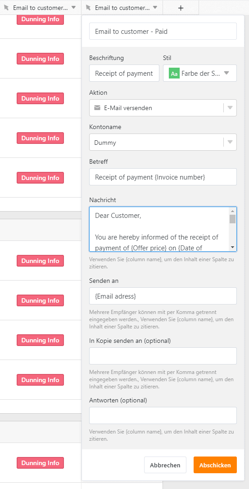

Zahlungseingänge müssen geprüft, Kunden an Zahlungen erinnert werden und teilweise kommt es sogar zu dem Part, den jedes Unternehmen vermeiden möchte: dem Mahnwesen. Das kann für viele Unternehmen zu einer wirklichen Herausforderung werden. Schnell verliert man sich im eigenen Chaos und niemand in Ihrem Unternehmen weiß noch, wann und ob eine Rechnung überhaupt bezahlt wurde. Am Ende leidet noch die Liquidität Ihres eigenen Unternehmens darunter. Soweit sollten Sie es jedoch nicht kommen lassen!

Mit [SeaTable]() haben Sie endlich alle Rechnungen bzw. Forderungen an Ihre Kunden auf einen Blick und wissen genau über jeden einzelnen Stand Bescheid. SeaTable ermöglicht Ihrer Debitorenbuchhaltung ein optimales und effizientes Forderungsmanagement. Zudem können Informationen ganz einfach unter den einzelnen Abteilungen in Ihrem Unternehmen ausgetauscht werden. Damit jeder auch mit den gleichen und richtigen Infos arbeiten kann und auch Sie als Unternehmer wieder ruhiger schlafen können.

[Hier geht es direkt zu unserem Template “CRM-Debitorenbuchhaltung”]()

## Was versteht man unter Debitorenbuchhaltung?

Die Debitorenbuchhaltung gehört der Finanzbuchhaltung an. In der Debitorenbuchhaltung werden alle Geschäftsvorgänge erfasst, die die eigenen Kunden des Unternehmens betreffen. Im Prinzip werden hier also alle Forderungen gegenüber den Debitoren (Kunden) erfasst und verwaltet. Diese ergeben sich im Normalfall aus dem Verkauf von Waren und Dienstleistungen aus dem eigenen Unternehmen. Debitoren sind also immer Schuldner, die Forderungen aus Lieferungen und Leistungen begleichen müssen. Ganz plakativ gesprochen zeigen Debitoren also auf, wie viel Geld Ihnen Ihre Kunden noch schulden und kümmern sich darum, dass diese Schulden auch beglichen werden. Am Ende sollte ein positiver Zahlungseingang des einzelnen Debitoren verzeichnet werden können.

## Was macht eigentlich eine Debitorenbuchhaltung?

Die Debitorenbuchhaltung hat vier wichtige Tätigkeitsfelder. In diesen beschäftigen sie sich ausgiebig mit den Verbuchungen von Forderungen und Gutschriften aus Lieferungen und Leistungen, mit der Überwachung von den einzelnen Zahlungseingängen, mit dem Mahnwesen und Inkasso und mit der eigentlichen Bonität jedes Kunden in Ihrem Unternehmen. Hierbei wird auch gerne von einem Debitoren Scoring gesprochen. Die Debitorenbuchhaltung sorgt also dafür, dass angefangen von der eigentlichen Rechnungsstellung bis zum Zahlungseingang alles nachgehalten bzw. dokumentiert wird und stößt bei ausbleibender Zahlung das Mahnwesen bzw. Inkasso an.

### **Forderungsmanagement**

Sollte ein Kunde in Ihrem Unternehmen ein Produkt kaufen, erhält dieser im Anschluss eine Rechnung. Diese wird durch die Debitorenbuchhaltung an den Kunden versendet. Der Kunde hat nun die Möglichkeit, innerhalb eines bestimmten vordefinierten Zahlungszeitraums den Rechnungsbetrag zum Beispiel per Lastschrift oder Banküberweisung an Ihr Unternehmen zu zahlen. Die Rechnung an den Kunden wird auch gerne als Forderung (Forderungsmanagement) bezeichnet. Die offenen Forderungen werden täglich geprüft. Dies dient zudem als Vorarbeit für das Mahnwesen.

### **Mahnwesen**

Beim Mahnwesen unterscheidet man zwischen dem außergerichtlichen und dem gerichtlichen Mahnwesen. Bei dem außergerichtlichen Mahnverfahren versucht man erst einmal intern die Rechnungssumme, die einem der Debitor (Kunde) noch schuldet, selbstständig einzuholen. Dies geschieht in der Regel mit sogenannten Mahnstufen. Mit jeder Mahnstufe wird der Kunde erneut daran erinnert, die noch ausstehende Zahlung zu begleichen. Wie viele Mahnstufen es bis zum gerichtlichen Mahnwesen gibt, entscheidet jedes Unternehmen für sich.

Im besten Fall erhält der Kunde auch vorerst eine freundliche Zahlungserinnerung, bevor das außerordentliche Mahnwesen startet. Ziel hierbei ist insbesondere die bestehende Geschäftsbeziehung nicht zu schwächen und den Konflikt auf einer noch möglichst „persönlichen Ebene“ zu regeln.

Bei dem gerichtlichen Mahnwesen hat das außerordentliche Mahnwesen also leider nicht funktioniert und die ausstehende Zahlung wurde immer noch nicht durch den Schuldner (Kunden) beglichen. In diesem Fall wird eine gerichtliche Mahnung ins Auge gefasst. Diese erfolgt durch Rechtsanwälte oder Inkassounternehmen, kann aber auch durch die eigene Debitorenbuchhaltung erfolgen, wenn hier die nötigen Kenntnisse vorhanden sind. Wichtig hierbei ist, sich mit den Prozessen der Gerichte bzw. Gerichtsvollziehern auszukennen.

### **Debitoren Scoring**

Besonders wichtig ist aber auch das sogenannte Debitoren Scoring im Unternehmen. Dieses soll wichtige Informationen geben über die eigentliche Zahlungsbereitschaft Ihrer Kunden. Über die getätigten Zahlungshistorien jedes einzelnen Kunden können explizite Aussagen getroffen werden, z. B. über die Zahlungszuverlässigkeit oder einzelne Zahlungsausfälle. Dadurch können gerade auch Insolvenzen der Kunden früh erkannt werden und der eigentliche finanzielle Schaden daraus auf ein Minimum reduziert werden. Der Kunde wird in diesem Fall einfach gesperrt und bis auf Weiteres nicht mehr mit Produkten oder Dienstleistungen beliefert.

### **Informationsmanagement**

Neben allen bereits genannten Punkten ist aber auch die Informationsweitergabe über ausstehende Zahlungen besonders wichtig. Hieraus können im Handumdrehen Entscheidungen über mögliche anstehende Investitionen und zur eigenen Liquidität getroffen werden. Sollten also vermehrt Zahlungen ausfallen, so können in Ihrem Unternehmen zu Folge eventuell keine neuen Investitionen angestoßen werden. Sollte hingegen der größte Teil Ihrer Forderungen beglichen sein, so steht ihr Unternehmen liquide da und weiteren Investitionen steht nichts mehr im Wege. Die Liquidität eines Unternehmens hängt also immer von den noch offenen bzw. beglichenen Forderungen ab.

## Was hat es mit dem Debitorenrisiko auf sich und wie kann man diesem entgegenwirken?

Nicht alle Kunden zahlen immer pünktlich bzw. mache Kunden zahlen deren Rechnungen bewusst nicht. Mit diesem sogenannten Debitorenrisiko muss Ihre Debitorenbuchhaltung aber bestmöglich umgehen können und die Zahlungsmöglichkeiten, die sich in Zahlungsverzug, Zahlungsunfähigkeit und Zahlungsunwilligkeit unterscheiden, möglichst genau einschätzen zu können.

Beim Zahlungsverzug bezahlt der Kunde (Schuldner) seine Rechnung nicht bis zu dem bereits vereinbarten Zahlungsziel. Bei der Zahlungsunfähigkeit sprechen wir bereits von einer Insolvenz. Hierbei kann der Kunde seinen Zahlungspflichten nicht mehr nachkommen. Bei der Zahlungsunwilligkeit hingegen verweigert der Kunde die Zahlung und handelt hier vorsätzlich. Entgegenwirken kann man diesem nur durch ein ordentliches Scoring.

Beim Scoring wird der Kunde genau beleuchtet. Vergangene Zahlungen werden hierbei genausten im eigentlichen Debitorenkonto jedes einzelnen Kunden gelistet und laufen in die Bonität ein. Sollte es also mal zu Problemen mit in der Vergangenheit zu begleichenden Zahlungen gekommen sein, so wird der Kunde schlechter im Scoring eingestuft. Dies kann auch bis zur eigentlichen Sperrung bzw. Nichtbelieferung des Debitoren führen. Hierbei kann z. B. Vorauszahlung Abhilfe schaffen. Sollte der Kunde hingegen alle seine Rechnungen immer fristgerecht bezahlt haben, so sollte er das bestmögliche Scoring in Ihrer Debitorenbuchhaltung haben.

## So effizient gestalten Sie Ihre Debitorenbuchhaltung in SeaTable

In unserem letzten Artikel „[CRM: Von der Kundenerfassung bis zum Angebot]()“ haben wir Ihnen gezeigt, wie Sie im Handumdrehen Ihr ganz persönliches CRM-System in SeaTable erstellen können. In diesem Artikel bzw. Template knüpfen wir nun an den eben genannten Artikel an und zeigen Ihnen, wie Sie in SeaTable Ihre Debitorenbuchhaltung effizient abbilden können. Bislang drehte sich alles um den Kundenstamm, das Produktportfolio und die Angebotserstellung. Jetzt kommen wir vom Angebot zur Rechnungsstellung. Somit finden Sie in dem eigentlichen Template neben den Tabellenblättern „Customer data“, „Sales team“, „Offers“ und „Product Catalogue“ auch das neue Tabellenblatt „Invoices“ wieder.

### **Vom Angebot zur Rechnungsbeauftragung**

Das Tabellenblatt „Offers“ wurde nun um die drei neuen [Spalten]() „Accounting Department“, „Payment Status“ und „Invoices“ ergänzt. Sollte nun Ihr Kunde ihr gestelltes Angebot akzeptiert haben und die Ware oder Dienstleistung beziehen wollen, so haben Sie nun die Möglichkeit, mit nur einem Klick auf die Schaltfläche „Please create Invoice“ die Buchhaltung darüber zu informieren, dem Kunden bitte eine Rechnung zu stellen. Alle wichtigen Daten zum akzeptierten Angebot wandern direkt als neue Zeile in das Tabellenblatt „Invoices“. Hierfür wird im Hintergrund ein Skript ausgeführt, dass die Daten zum Einen direkt in die Tabelle “Invoices” schreibt und zum Anderen eine Verknüpfung mit den Tabellenblättern “Invoices”, “Offers” und “Customer data” sicherstellt.

Übersicht der Angebotsseite in SeaTable

Den eigentlichen Zahlungsstatus können Sie dann bequem in der [Spalte]() „Payment Status“ einsehen. Alle Rechnungen sind zudem verknüpft mit dem Tabellenblatt „Invoices“ und können selbstverständlich auch in der Spalte „Invoices“ eingesehen werden. Somit haben Sie als Unternehmer aber auch ihr Salesteam immer alle wichtigen Infos auf einen Blick und können zur Not auch persönlich bei den Kunden nachhaken, falls eine Zahlung eventuell mal nicht rechtzeitig getätigt werden sollte.

### **Rechnungserstellung in nur wenigen Sekunden**

Wie bereits erwähnt, wandern alle wichtigen Informationen zum akzeptierten Angebot durch den Kunden direkt in das Tabellenblatt „Invoices“. Somit werden alle Daten wie beispielsweise Angebotsnummer, Kundenname, Kundennummer, Kontaktperson, Straße und Hausnummer, Postleitzahl, Stadt, Land und alle Produktinfos mit Produktname, Einzelpreis, Menge und Gesamtsumme automatisch übertragen. Alles, was Ihre Buchhaltung nun machen muss, ist in der Spalte „Invoice“ auf die Schaltfläche „Create Invoice“ zu drücken.

Alle Forderungen auf einen Blick

Nun öffnet sich vollautomatisch das Plug-in „Page-Design“ und füllt bereits alle wichtigen Informationen aus. Die Rechnung können Sie im Anschluss ganz einfach als PDF-Datei speichern und in der Spalte „Files“ ablegen oder ausdrucken und an Ihren Kunden per E-Mail oder per Brief verschicken. Natürlich können Sie das vordefinierte Page-Design-Template in wenigen Minuten nach Ihren Wünschen anpassen bzw. ergänzen.

Ihre fertige Rechnung im Page-Design-Plug-in

### **Den Zahlungsstatus im Blick behalten**

Damit auch alle relevanten Personen neben der eigentlichen Debitorenbuchhaltung in Ihrem Unternehmen Bescheid wissen, ob ein Kunde seine Rechnungen bezahlt oder nicht, steht Ihnen die Spalte „Payment Status“ zur Verfügung. Wird ein Angebot durch den Kunden akzeptiert und eine Rechnung erzeugt, so wird automatisch der Zahlungsstatus auf „Pending“ geändert. Sobald ein Zahlungseingang stattfindet, kann Ihre Debitorenbuchhaltung die Single Select-Spalte „Payment Status“ auf „Paid“ ändern und das Datum des Zahlungseingangs unter „Date of Payment“ erfassen. Mit der [Gruppierungsfunktion]() und den verschiedenen [Ansichten]() nach “Payment Status” erhält man den bestmöglichen Blick auf alle derzeitigen Zahlungsstände. Des Weiteren finden Sie im Kanban Plug-in nun auch den “Invoice Status”, damit Sie auch wirklich keinen Zahlungsstatus aus den Augen verlieren können.

Die verschiedenen Zahlungsstände

Das zusätzlich großartige an dem Payment Status: Jeder Status wirkt sich auch auf Ihren eigentlichen Kundenstamm unter dem Tabellenblatt „Customer data“ aus. Bedeutet: Bezahlt ein Kunde alle seine Rechnungen bzw. steht auf „Pending“, ist die eigentliche Zeile grün markiert. Sollte der Kunde seine Rechnung aus irgendwelchen Gründen nicht bezahlt haben, so ändert sich die Zeilenfarbe auf Rot und jeder Mitarbeiter weiß Bescheid, dass dieser Kunde sich gerade im Mahnwesen befindet und bis auf Weiteres nicht mehr mit Produkten oder Dienstleistungen beliefert werden sollte.

### **Mit nur einem Klick den Zahlungsstatus Ihren Kunden mitteilen**

Damit Ihre Debitorenbuchhaltung auch Ihre Kunden über den Zahlungseingang oder einen Zahlungsverzug informieren können, stehen Ihnen in SeaTable die beiden Schaltflächen „Receipt of Payment“ und „Dunning Info“ zur Verfügung. Mit nur einem Klick auf die jeweilige Schaltfläche wird automatisch eine E-Mail an die Kontakt-E-Mail-Adresse unter der Spalte „Email adress“ verschickt. In dieser werden auch Infos, wie beispielsweise die Rechnungsnummer oder der Betrag automatisch ergänzt. Die Nachricht an Ihre Kunden über die jeweiligen Zahlungsstände können Sie natürlich bequem nach Ihrem Belieben anpassen.

Zahlungsinformationen an Ihre Kunden direkt aus SeaTable heraus verschicken

### **Immer alle Zahlen im Blick**

Damit Sie auch permanent die wichtigsten Zahlen im Blick haben, wurde das Template mit drei weiteren relevanten [Statistiken]() ergänzt. Unter „Turnover of all product“ finden Sie nun den gesamten Umsatz wieder, den Sie durch Dienstleistungen oder Waren in Ihrem Unternehmen erwirtschaftet haben. Unter „Invoice status in percentage“ können Sie genau einsehen, wie viele Rechnungen insgesamt erfasst wurden und wie sich diese in Prozent nach den drei verschiedenen Zahlungsständen „Paid“, „Pending“ und „Dunning“ aufteilen. Damit Sie auch immer genau wissen, was dies in genauen Umsätzen bedeutet, wurde ebenfalls die Statistik „Payment Status (Turnover)“ integriert. Dies spiegelt genau die Umsätze der verschiedenen Zahlungsstände Ihrer Kunden wider.

## Mit SeaTable können Sie und Ihre Debitorenbuchhaltung ruhig schlafen

Es muss also nicht immer bei einer teuren Buchhaltungssoftware wie beispielsweise [Lexware](https://shop.lexware.de/), [Lexoffice](https://testen.lexoffice.de/online/), [sevDesk](https://sevdesk.de/), [orgaMax](https://www.deltra.com/) oder [Billie](https://www.billie.io/) enden, die Ihr Unternehmen eventuell sogar in enorme Unkosten stürzen kann. Das Geld können Sie sich definitiv sparen.

SeaTable schafft es durch seine enorme Flexibilität auch Ihre Debitorenbuchhaltung perfekt arbeiten zu lassen. Den klaren Vorteil, den SeaTable mit sich bringt, ist die Vielfältigkeit, in welcher Form das Produkt selbst eingesetzt werden kann. Neben der Debitorenbuchhaltung können auch weitere wichtige Anwendungsfälle in Ihrem Unternehmen abgedeckt werden. Mehr hierzu finden Sie in unserem [Blog]() oder unter direkt in unseren [Templates](). Überzeugen Sie sich nun selbst von dem mächtigsten und innovativsten Spreadsheet und starten Sie noch heute mit Ihrer Debitorenbuchhaltung so richtig durch.

[Zum Template „CRM-Debitorenbuchhaltung“]()  
[Jetzt SeaTable kostenlos in der Cloud ausprobieren]()  
[Oder lieber SeaTable Enterprise im eigenen Rechenzentrum betreiben]()
