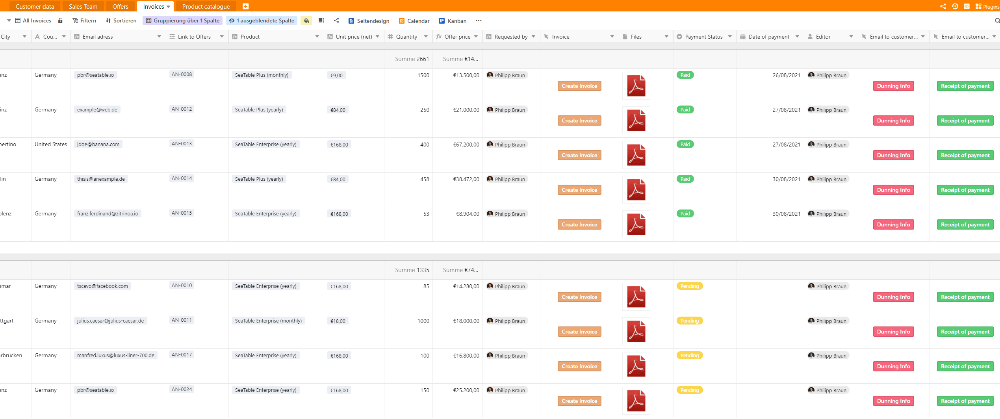
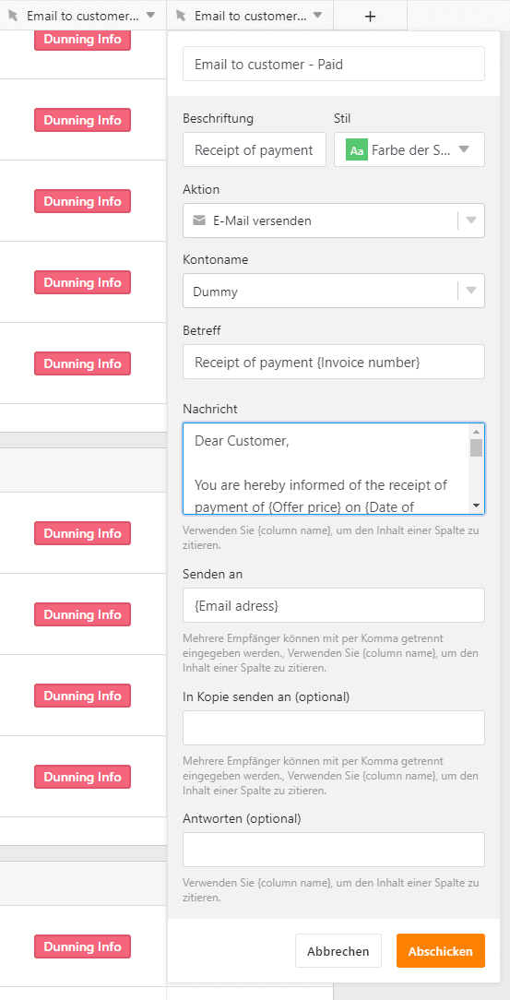

Необходимо проверять входящие платежи, напоминать клиентам о платежах, а иногда возникает даже та часть, которую каждая компания хочет избежать: процесс "прогонов". Это может стать настоящей проблемой для многих компаний. Вы быстро теряетесь в собственном хаосе, и никто в вашей компании не знает, когда и был ли вообще оплачен тот или иной счет. В итоге страдает ликвидность вашей собственной компании. Однако не стоит заходить так далеко!

С помощью [SeaTable](https://seatable.io/ru/registrierung/?lang=auto) вы, наконец, сможете сразу увидеть все счета или дебиторскую задолженность ваших клиентов и точно знать статус каждого из них. SeaTable позволяет вашему дебиторскому отделу оптимально и эффективно управлять дебиторской задолженностью. Кроме того, можно легко обмениваться информацией между отдельными отделами вашей компании. Чтобы все могли работать с одинаковой и правильной информацией, а вы как предприниматель могли снова спать спокойно.

[Нажмите здесь, чтобы перейти непосредственно к нашему шаблону "CRM Дебиторская задолженность".](https://seatable.io/ru/vorlage/wsnf1ukarv6sp5omx6a2og/)

## Что такое учет дебиторской задолженности?

Учет дебиторской задолженности является частью финансового учета. В учете дебиторской задолженности регистрируются все хозяйственные операции, касающиеся собственных клиентов компании. В принципе, вся дебиторская задолженность покупателей учитывается и управляется здесь. Обычно они возникают в результате продажи товаров и услуг самой компании. Поэтому дебиторы - это всегда должники, которые должны погасить дебиторскую задолженность по поставкам и услугам. Грубо говоря, дебиторы показывают, сколько денег ваши клиенты еще должны вам, и следят за тем, чтобы эти долги были выплачены. В конечном итоге, индивидуальный должник должен иметь возможность зафиксировать положительный входящий платеж.

## Чем на самом деле занимается учет дебиторской задолженности?

Учет дебиторской задолженности имеет четыре важные сферы деятельности. В них подробно рассматриваются вопросы резервирования дебиторской задолженности и кредитных авизо по поставкам и услугам, контроля отдельных входящих платежей, погашения и инкассации, а также фактической кредитоспособности каждого клиента вашей компании. Это также часто называют скорингом должника. Учет дебиторской задолженности обеспечивает отслеживание или документирование всего процесса от фактического выставления счета до получения платежа и запускает процесс "dunning" или взыскания задолженности в случае неуплаты.

### **Управление дебиторской задолженностью**

Если клиент покупает товар в вашей компании, он получает счет-фактуру. Это отправляется клиенту отделом дебиторской задолженности. Теперь у клиента есть возможность оплатить сумму счета вашей компании в течение определенного заранее установленного периода оплаты, например, путем прямого дебета или банковского перевода. Счет, выставленный покупателю, также часто называют дебиторской задолженностью (управление дебиторской задолженностью). Открытая дебиторская задолженность проверяется ежедневно. Это также служит подготовительной работой для процесса "dunning".

### **Даннинг**

В процессе демандинга различают внесудебный и судебный демандинг. При внесудебной процедуре dunning вы сначала пытаетесь самостоятельно взыскать сумму счета, которую вам еще должен должник (клиент). Обычно это делается с помощью так называемых уровней даннинга. При каждом уровне промедления клиенту снова напоминают о необходимости погасить задолженность. Каждая компания сама решает, сколько существует уровней доведения до судебного доведения.

В лучшем случае клиент получает дружеское напоминание о платеже до того, как начнется экстраординарный процесс отключения. Цель здесь, в частности, состоит в том, чтобы не ослаблять существующие деловые отношения и урегулировать конфликт на как можно более "личном уровне".

В случае судебного процесса "dunning", чрезвычайный процесс "dunning", к сожалению, не сработал, и просроченный платеж до сих пор не погашен должником (клиентом). В этом случае рассматривается вопрос о судебном напоминании. Этим занимаются юристы или агентства по взысканию долгов, но это может сделать и ваш собственный отдел по работе с дебиторами, если вы обладаете необходимыми знаниями. Важно быть знакомым с процессом работы судов и судебных приставов.

### **Скоринг должников**

Однако особое значение в компании имеет и так называемый скоринг дебиторов. Это должно дать важную информацию о фактической готовности ваших клиентов платить. Могут быть сделаны явные заявления об истории платежей каждого отдельного клиента, например, о надежности платежей или индивидуальных неплатежах. Таким образом, неплатежеспособность клиента можно распознать на ранней стадии и свести реальный финансовый ущерб к минимуму. В этом случае клиент просто блокируется и больше не получает продукты или услуги до дальнейшего уведомления.

### **Управление информацией**

В дополнение ко всем уже упомянутым пунктам, особенно важно передавать информацию о неоплаченных платежах. На основе этой информации можно в кратчайшие сроки принимать решения о возможных предстоящих инвестициях и собственной ликвидности. Если все больше и больше платежей будет пропущено, ваша компания может оказаться не в состоянии инициировать новые инвестиции. Если, с другой стороны, большая часть вашей дебиторской задолженности погашена, ваша компания ликвидна, и ничто не мешает дальнейшим инвестициям. Поэтому ликвидность компании всегда зависит от непогашенной или погашенной дебиторской задолженности.

## Что такое риск дебитора и как ему противостоять?

Не все клиенты всегда платят вовремя или некоторые клиенты намеренно не оплачивают свои счета. Однако ваш отдел дебиторской задолженности должен уметь наилучшим образом справляться с этим так называемым риском дебитора и как можно точнее оценивать варианты оплаты, которые различаются на просрочку платежа, неспособность платить и нежелание платить.

В случае просрочки платежа клиент (должник) не оплачивает свой счет к уже согласованному сроку оплаты. В случае неплатежеспособности речь уже идет о банкротстве. В этом случае клиент больше не может выполнять свои платежные обязательства. В случае нежелания платить, с другой стороны, клиент отказывается платить и действует намеренно. Этому можно противостоять только путем правильного подсчета очков.

Скоринг - это детальное изучение клиента. Прошлые платежи подробно перечисляются в фактическом счете дебитора каждого отдельного клиента и включаются в кредитный рейтинг. Если в прошлом возникли проблемы с платежами, которые необходимо было урегулировать, балл клиента будет снижен. Это также может привести к фактической блокировке или недоставке должника. Это можно исправить, например, с помощью авансового платежа. Если, с другой стороны, клиент всегда вовремя оплачивал все свои счета, он должен иметь наилучшую оценку в вашем учете дебиторской задолженности.

## Как эффективно управлять дебиторской задолженностью в SeaTable

В нашей последней статье,["CRM: от ввода клиента до составления сметы](https://seatable.io/ru/crm-angebotsmanagement/)", мы показали вам, как вы можете создать свою собственную CRM-систему в SeaTable в кратчайшие сроки. В этой статье или шаблоне мы продолжим только что упомянутую статью и покажем вам, как можно эффективно отображать дебиторскую задолженность в SeaTable. До сих пор все крутилось вокруг клиентской базы, портфеля продуктов и создания котировок. Теперь мы переходим от предложения к выставлению счета. Таким образом, в дополнение к таблицам "Данные клиента", "Отдел продаж", "Предложения" и "Каталог продукции" в актуальном шаблоне вы также найдете новую таблицу "Счета-фактуры".

### **От предложения до счета-фактуры**

Электронная таблица "Предложения" теперь дополнена тремя новыми [колонками](https://seatable.io/ru/docs/handbuch/datenmanagement/feld-typen/?lang=auto) "Бухгалтерия", "Статус оплаты" и "Счета-фактуры". Если клиент принял ваше предложение и хочет приобрести товар или услугу, то теперь у вас есть возможность одним щелчком мыши на кнопке "Создать счет-фактуру" сообщить бухгалтерии, чтобы она выставила счет-фактуру. Все важные данные по принятому предложению перемещаются непосредственно в виде новой строки в электронную таблицу "Счета-фактуры". Для этого в фоновом режиме выполняется скрипт, который записывает данные непосредственно в таблицу "Счета" и обеспечивает связь с табличными листами "Счета", "Предложения" и "Данные клиента".

Обзор страницы предложения в SeaTable

Затем вы можете удобно просмотреть фактический статус платежа в [колонке](https://seatable.io/ru/docs/handbuch/datenmanagement/feld-typen/?lang=auto) "Статус платежа". Все счета-фактуры также связаны с электронной таблицей "Счета-фактуры" и, конечно же, могут быть просмотрены в колонке "Счета-фактуры". Таким образом, вы как предприниматель и ваш отдел продаж всегда будете иметь всю важную информацию под рукой и, при необходимости, сможете лично проследить за клиентом, если платеж не будет произведен вовремя.

### **Создание счета-фактуры всего за несколько секунд**

Как уже упоминалось, вся важная информация о принятом клиентом предложении переносится непосредственно в таблицу "Счета". Таким образом, все данные, такие как номер предложения, имя клиента, номер клиента, контактное лицо, улица и номер дома, почтовый индекс, город, страна, а также вся информация о продукте с названием продукта, ценой за единицу товара, количеством и общей суммой передаются автоматически. Теперь вашей бухгалтерии остается только нажать кнопку "Создать счет-фактуру" в колонке "Счет-фактура".

Все требования с первого взгляда

Плагин "Дизайн страницы" открывается автоматически и заполняет всю важную информацию. Затем вы можете легко сохранить счет в формате PDF и сохранить его в колонке "Файлы" или распечатать его и отправить клиенту по электронной почте или письмом. Разумеется, вы можете адаптировать или дополнить предустановленный шаблон дизайна страницы в соответствии с вашими пожеланиями всего за несколько минут.

Ваш готовый счет-фактура в плагине для дизайна страниц

### **Следить за состоянием платежа**

Для того чтобы все заинтересованные лица в вашей компании, помимо собственно отдела дебиторской задолженности, знали, оплачивает ли клиент свои счета или нет, предусмотрена колонка "Статус оплаты". Если предложение покупателя принято и счет-фактура сформирован, то статус оплаты автоматически меняется на "В ожидании". Как только произойдет оплата, дебиторская служба может изменить в столбце "Статус оплаты" значение "Оплачено" и ввести дату поступления платежа в поле "Дата оплаты". Благодаря [функции группировки](https://seatable.io/ru/docs/handbuch/datenmanagement/gruppierung-sortierung-filter/?lang=auto) и различным [представлениям](https://seatable.io/ru/docs/handbuch/datenmanagement/ansichten/?lang=auto) по "Статусу платежа" вы получаете наилучшее представление обо всех текущих статусах платежей. Кроме того, теперь в плагине Kanban также отображается "Статус счета", что позволяет не упустить из виду ни один статус платежа.

Различные статусы оплаты

Дополнительный плюс статуса платежа: каждый статус также влияет на фактический мастер клиента в рабочем листе "Данные клиента". Это означает: если клиент оплатил все свои счета или находится в состоянии "В ожидании", то фактическая строка помечается зеленым цветом. Если клиент по какой-либо причине не оплатил свой счет, цвет линии меняется на красный, и каждый сотрудник знает, что этот клиент в настоящее время находится в процессе отключения и не должен получать продукцию или услуги до дальнейшего уведомления.

### **Сообщите статус платежа своим клиентам одним щелчком мыши**

Чтобы ваш отдел дебиторской задолженности мог также информировать клиентов о получении платежа или задержке платежа, в SeaTable имеются две кнопки "Получение платежа" и "Информация о задержке". Одним нажатием на соответствующую кнопку автоматически отправляется письмо на контактный адрес электронной почты, указанный в графе "Адрес электронной почты". В это письмо автоматически добавляется такая информация, как номер счета или сумма. Конечно, вы можете легко настроить сообщение для своих клиентов о соответствующих статусах оплаты по своему усмотрению.

Отправляйте информацию о платежах своим клиентам непосредственно из SeaTable

### **Всегда все фигуры на виду**

Для того чтобы вы всегда имели в поле зрения самые важные цифры, шаблон дополнен тремя дополнительными [статистическими данными](https://seatable.io/ru/docs/handbuch/datenmanagement/statistiken/?lang=auto). В разделе "Оборот всей продукции" вы найдете общий оборот, который вы создали с помощью услуг или товаров в вашей компании. В разделе "Статус счета в процентах" вы можете увидеть, сколько всего счетов было зарегистрировано и как они распределяются в процентах в соответствии с тремя различными статусами оплаты: "Оплачен", "Ожидает" и "Просрочен". Чтобы вы всегда точно знали, что это означает с точки зрения оборота, была также интегрирована статистика "Состояние платежа (оборот)". Это точно отражает оборот различных платежных статусов ваших клиентов.

## С SeaTable вы и ваш отдел дебиторской задолженности можете спать спокойно

Поэтому не всегда обязательно использовать дорогое бухгалтерское программное обеспечение, такое как [Lexware](https://shop.lexware.de/), [Lexoffice](https://testen.lexoffice.de/online/), [sevDesk](https://sevdesk.de/), [orgaMax](https://www.deltra.com/) или [Billie](https://www.billie.io/), например, которое может даже ввергнуть вашу компанию в огромные накладные расходы. Вы определенно можете сэкономить свои деньги.

Благодаря своей огромной гибкости SeaTable также может обеспечить идеальную работу вашего отдела дебиторской задолженности. Несомненным преимуществом, которое дает SeaTable, является разнообразие вариантов использования самого продукта. Помимо дебиторской задолженности, могут быть охвачены и другие важные сценарии использования в вашей компании. Подробнее об этом вы можете узнать в нашем [блоге](https://seatable.io/ru/blog/?lang=auto) или непосредственно в наших [шаблонах](https://seatable.io/ru/docs/templates/?lang=auto). Убедитесь в том, что это самая мощная и инновационная электронная таблица, и начните учет дебиторской задолженности уже сегодня.

[В шаблон "CRM Дебиторская задолженность"](https://seatable.io/ru/vorlage/wsnf1ukarv6sp5omx6a2og/)  
[Попробуйте SeaTable в облаке бесплатно прямо сейчас]()  
[Или предпочитаете использовать SeaTable Enterprise в собственном центре обработки данных]()
