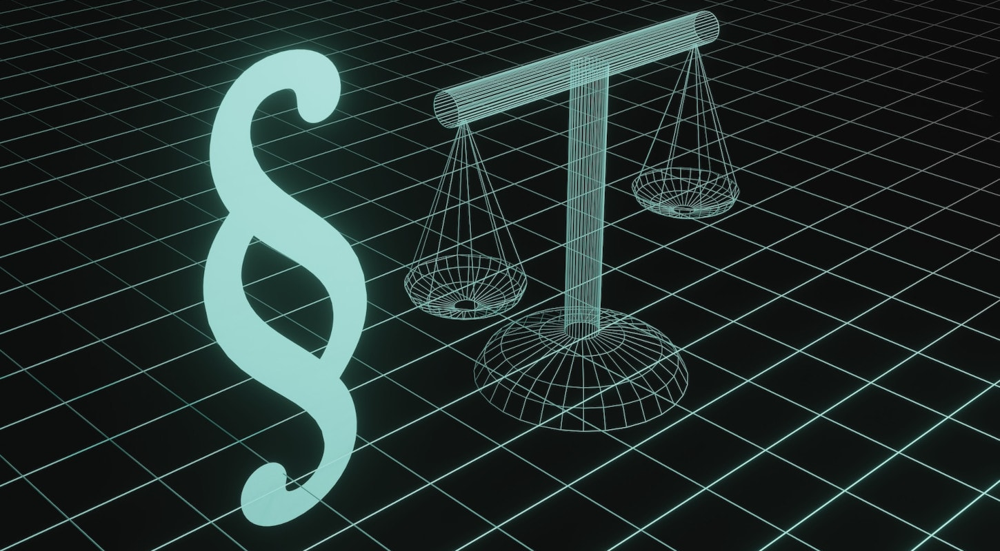

In today's digital age, our **online lives** are becoming increasingly important: we communicate via e-mail, messenger and social media, store important files and photos in the cloud, do online banking and leave countless traces on the Internet. But what actually happens to all this data and accounts when you die one day? Keyword: **digital estate**.

Digital legacy is a topic that many people neglect or suppress. However, dealing with it in good time is important to ensure that relatives handle your digital traces, data and accounts appropriately should the worst happen. The following article clarifies the most common questions around digital inheritance and shows how you can **manage your digital estate in 5 steps**.

## What is a digital estate?

A digital estate consists of **all of a person's digital activities, data and accounts**. This includes social media profiles, email accounts, cloud storage, online stores, online bank accounts, streaming services, and more. A digital estate can include personal memories, important documents, and valuable data (e.g., on digital wallets).

A digital estate can contain many accounts.

## What happens to a user's digital estate after their death?

**Contractual relationships** with providers of a wide range of online services continue after death and pass to the deceased user's heirs. It is therefore important to cancel all current contracts and paid memberships as quickly as possible.

In principle, **access to online accounts of** a deceased person is difficult, because most services have strict policies regarding third-party access. When a user dies, relatives are therefore initially unable to access the accounts. In order for the service operators to take action, you usually first have to present a death certificate or a certificate of inheritance. And even then, it is often only possible to have an account deleted - the data is lost.

### What is the legal situation in Germany?

From a legal perspective, the situation in Germany has not been conclusively clarified. In precedents, courts have ruled that the contract for a **user account** generally passes to the heirs of the original account holder. The heirs must be able to inspect the account, e.g., to settle outstanding invoices or cancel paid memberships. However, this only constitutes a **passive right to read**, but not a right to actively continue the account.

It is also unclear whether heirs may access communication content of the deceased, such as chats and e-mails, if he did not record his last will in this regard. On the one hand, inheritance law obliges the provider to hand over e-mails to the heirs in the same way as unopened letters. On the other hand, however, the handover may violate the secrecy of telecommunications and data protection regulations.

Digital legacy is not clearly regulated by law in Germany.

If a person dies and has not taken appropriate precautions, their data may be inaccessible and lost. Some online services now offer policies and settings for account deletion in the event of death. This can be a useful option for managing a deceased person's online presence.

### Examples: Google, Facebook and Apple

Google, Facebook and Apple offer certain settings in the user account in which a digital estate can be regulated:

- Google has a so-called [account inactivity manager for](https://myaccount.google.com/inactive?continue=https%3A%2F%2Fmyaccount.google.com%2Fdata-and-privacy) this purpose: You can specify during your lifetime who will be notified when your account is inactive and who should have access to your account. Likewise, you can specify that your account will be automatically and completely deleted after a specified time.
- Facebook gives you the option to designate an **estate contact in** your [personal settings](https://accountscenter.facebook.com/personal_info) who is allowed to manage your profile in case of death. You can also specify whether your profile will be deleted or memorialized after death.
- Apple device users can [add estate contacts to Apple ID.](https://support.apple.com/de-de/HT212360) These people can access your stored photos, messages, notes, files, etc. after your death, but **not** payment data or passwords.

## How and why you should make provisions during your lifetime

In many cases, a digital estate is not settled in time. The heirs then have to poke around in the fog and embark on a laborious search for clues: Which online accounts did the deceased use? What are the user names and passwords? Without this data, the relatives have no access for the time being - but they urgently need it, for example, to cancel current subscriptions.

Without access data, relatives face a high hurdle.

Therefore, take precautions with a **power of attorney** in which you record clear instructions for your trusted person on how your digital estate is to be managed after your death. Also keep an up-to-date **list of your user accounts and access data**. This will save your relatives a lot of time and make it much easier for them to access your online accounts.

## Digital estate: 5 steps to perfect management

### 1\. decide on a storage medium

Theoretically, you can write down all your accounts and passwords on **paper** and deposit them in a safe place with your power of attorney. However, this has the disadvantage that your list quickly becomes confusing and loses its topicality. Whenever you change a password, delete an account or create a new account, you have to correct your list in writing or rewrite it completely.

Using the same principle, you can also save your accounts and passwords **electronically in a text document** on your computer, hard drive or USB stick. You can make changes there more easily than on paper.

Also many browsers offer the possibility to conveniently save login data.

With a digital [password manager](https://seatable.io/en/digitaler-nachlass/#Mit_welchen_Tools_ein_digitaler_Nachlass_verwaltet_werden_kann), you can manage your access data clearly and flexibly: These tools allow you to store accounts and passwords securely and pass them on to trusted people in case of death. Therefore, this is one of the best ways to organize your digital estate.

### 2\. create an overview of your digital estate

Make a note of any online accounts you have and the associated access data. Be sure to document which paid services you use so that your heirs can cancel them directly.

Your digital estate can contain any amount of data. Depending on the number of accounts you have, it makes sense to take a step-by-step approach and divide your list into categories. The most important online services include:

- Email accounts and messengers (e.g. WhatsApp, Signal)
- Workspace accounts (e.g. Google, Microsoft)
- Online banking and payment services (e.g. PayPal)
- Online stores and marketplaces (e.g. Amazon, eBay)
- Social networks (e.g. Facebook, Instagram, LinkedIn)
- Cloud storage (e.g. Dropbox, Seafile)
- Streaming and entertainment (e.g. Netflix, Spotify, Disney+)
- Apps, online games, dating platforms
- Digital subscriptions (e.g. magazines, e-paper)
- Other user accounts (e.g., forums, Adobe Creative Cloud)



### 3\. determine trusted third party

Appoint a person you trust as your digital executor. Specify in a power of attorney that the authorized person should take care of your digital inheritance and your online business - after your death or already during your lifetime if you are unable to do so, for example, due to a coma, a mental disability or other reasons.

Make it as easy as possible for the authorized person: You can regulate in advance exactly which online accounts the person should have access to in the event of an emergency. Formulate your will in writing as to what the person should do with which account.

### 4\. open communication

Communicate openly what you want to happen to your digital estate. For example, give your trusted person instructions about which files, photos, and videos to delete, back up, or give to specific people in your cloud storage and on your devices (e.g., computer, smartphone, tablet) after your death.

Determine your legacy for your social media profiles and online accounts: Should your Facebook profile be turned into a memorial page or deleted? Should your trusted person still back up personal data from your Google, Dropbox or WhatsApp account?

### 5\. grant access to the account list

Consider the ways in which you would like to give your trusted person access to your online accounts so that they can act on your behalf after your death.

If you have stored most of your login data and passwords on a specific device (e.g., in a browser or in a text document), your trusted person should be able to access them after your death. For example, write down your smartphone **PIN** or **computer password** on a piece of paper that you keep in a sealed envelope.

However, you can also write down your passwords on paper or enter them in a digital password manager. But remember to always update changed passwords there as well! Write down the **master password** and store it in a safe place, which you share with the person you trust.

## What tools can be used to manage a digital estate

One of the most secure solutions to manage your digital estate is a **password manager**. If you want to protect your personal data on the Internet as reliably as possible, you should use a separate password for each service. This should consist of letters, numbers and special characters and be at least eight characters long.

Since almost no one can remember more than ten different passwords, there are special **databases** that can store all these passwords for you and also generate them if necessary. Two popular password managers are KeePass and Bitwarden, for example.

Another database software that lets you manage your digital estate in a clear, flexible and secure way is called **SeaTable**. With it you'll be able to store not only all your accounts, usernames and passwords, but also as much additional information as you want.

Use a password manager to document your digital estate.

If you would like to use SeaTable's password manager for your digital estate, you can view the [template here](). If you are interested, simply [register](https://seatable.io/en/registrierung/) for free and create an overview with your own data.

## Conclusion: A digital estate is more important than ever

Nowadays, each of us has dozens of online accounts. To ensure that your relatives can access your user accounts should the worst happen, you should take precautions in good time. That's why a digital estate in which you document all your access data is more important than ever.

Managing your digital estate requires careful planning and preparation. It's important to think ahead about what you want to happen to your digital legacy, where you'll store your passwords, and which trusted person you'll involve to manage your digital estate in accordance with your wishes. Having an up-to-date list of all your accounts and passwords can not only ease the burden on your loved ones during the difficult period after your death, but also help you keep track of your personal data while you are still alive.
