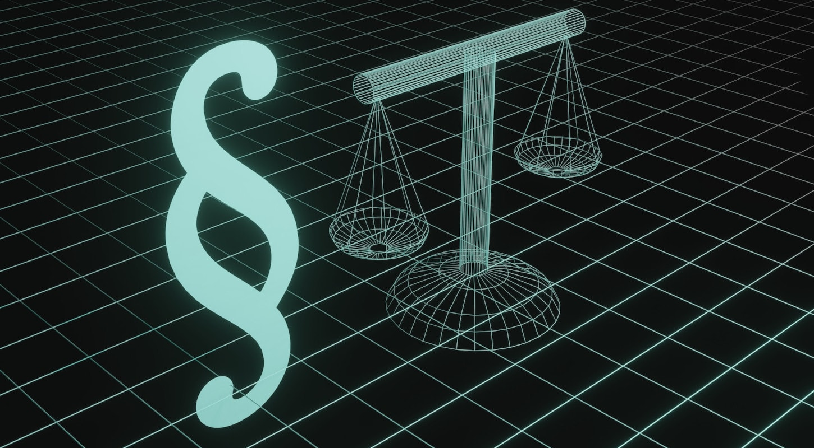
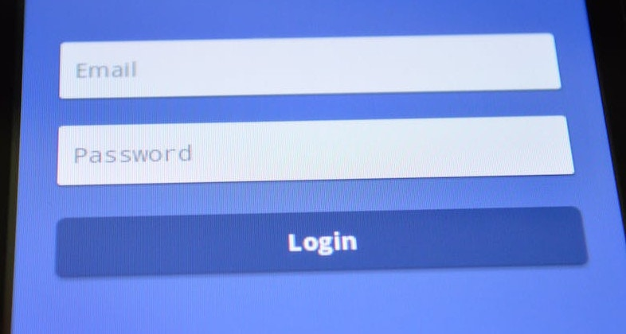
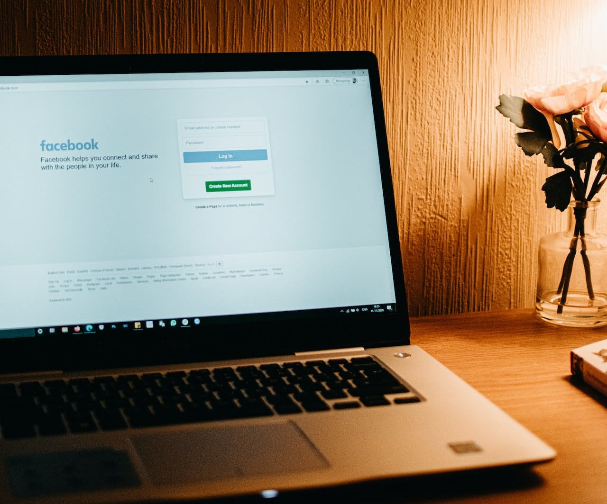

En la era digital actual, nuestra **vida online** es cada vez más importante: nos comunicamos por correo electrónico, mensajería y redes sociales, almacenamos archivos y fotos importantes en la [nube](), hacemos operaciones bancarias online y dejamos innumerables rastros en Internet. Pero, ¿qué ocurre realmente con todos estos datos y cuentas [cuando uno fallece algún día]()? Palabra clave: **patrimonio digital**.

La herencia digital es un tema que mucha gente descuida o reprime. Sin embargo, abordarlo a tiempo es importante para garantizar que los familiares gestionen adecuadamente sus rastros, datos y cuentas digitales en caso de que ocurra lo peor. El siguiente artículo aclara las preguntas más comunes en torno a la herencia digital y muestra cómo puede **gestionar su patrimonio digital en 5 pasos**.

## ¿Qué es un patrimonio digital?

Un patrimonio digital consiste en **todas las actividades, datos y cuentas digitales de una persona**. Esto incluye perfiles de redes sociales, cuentas de correo electrónico, almacenamiento en la nube, tiendas online, cuentas bancarias online, servicios de streaming y mucho más. Un patrimonio digital puede incluir recuerdos personales, documentos importantes y datos valiosos (por ejemplo, de carteras digitales).

Un patrimonio digital puede contener muchas cuentas.

## ¿Qué ocurre con el patrimonio digital de un usuario tras su fallecimiento?

**Las relaciones contractuales** con los proveedores de los más diversos servicios en línea continúan tras el fallecimiento y pasan a los herederos del usuario fallecido. Por lo tanto, es importante cancelar todos los contratos en vigor y las afiliaciones de pago lo antes posible.

En principio, el **acceso a las cuentas en línea** de una persona fallecida es difícil, porque la mayoría de los servicios tienen políticas estrictas sobre el acceso de terceros. Por eso, cuando fallece un usuario, los familiares no pueden acceder a las cuentas en un primer momento. Para que los operadores de los servicios actúen, normalmente hay que presentar primero un **certificado de defunción** o un **certificado de herencia**. E incluso entonces, a menudo solo es posible borrar una cuenta: los datos se pierden.

### ¿Cuál es la situación jurídica en Alemania?

Desde el punto de vista jurídico, la situación en Alemania no se ha aclarado de forma concluyente. En los precedentes, los tribunales han dictaminado que el contrato de una **cuenta de usuario** pasa por lo general a los herederos del titular original de la cuenta. Los herederos deben poder consultarla, por ejemplo, para liquidar facturas pendientes o cancelar afiliaciones sujetas a cargos. Sin embargo, esto solo establece un **derecho pasivo de lectura**, pero no un derecho a continuar activamente con la cuenta.

Tampoco está claro si los herederos pueden acceder al contenido de las comunicaciones del fallecido, como chats y correos electrónicos, si este no dejó constancia de su última voluntad al respecto. Por un lado, el **derecho de sucesiones** obliga al proveedor a entregar los correos electrónicos a los herederos, de forma similar a las cartas sin abrir. Por otro lado, sin embargo, la entrega puede violar el secreto de las telecomunicaciones y las disposiciones de protección de datos.

Legalmente, la herencia digital no está claramente regulada en Alemania.

**Si una persona fallece y no ha tomado las medidas oportunas, sus datos pueden quedar inaccesibles y perderse.** Algunos servicios en línea ofrecen ahora políticas y configuraciones para la eliminación de cuentas en caso de fallecimiento. Esta puede ser una opción útil para gestionar la presencia en línea de una persona fallecida.

### Ejemplos: Google, Facebook y Apple

Google, Facebook y Apple ofrecen ciertos ajustes en la cuenta de usuario con los que se puede regular un patrimonio digital:

- Para ello, Google dispone del denominado [gestor de inactividad de cuentas](https://myaccount.google.com/inactive?continue=https%3A%2F%2Fmyaccount.google.com%2Fdata-and-privacy): puede determinar en vida quién debe recibir una notificación cuando su cuenta esté inactiva y quién debe tener acceso a ella. También puede especificar que su cuenta se elimine automática y completamente tras un periodo de tiempo predefinido.
- Facebook le ofrece la posibilidad de designar en su configuración personal un **contacto de legado** que pueda gestionar su perfil en caso de fallecimiento. Además, puede determinar si su perfil se elimina o se convierte en cuenta conmemorativa tras el fallecimiento.
- Los usuarios de dispositivos Apple pueden [añadir contactos de legado al ID de Apple](https://support.apple.com/de-de/102631). Estas personas pueden acceder a sus fotos, mensajes, notas, archivos, etc. almacenados tras su fallecimiento, pero **no** a los datos de pago ni a las contraseñas.

## Cómo y por qué debería tomar precauciones en vida

En muchos casos, una herencia digital no se regula a tiempo. Los herederos tienen entonces que avanzar a ciegas y emprender una **tediosa búsqueda de pistas**: ¿Qué cuentas en línea utilizaba el fallecido? ¿Cuáles son los nombres de usuario y las contraseñas? Sin estos datos, los familiares no tienen acceso en un primer momento, pero lo necesitan urgentemente, por ejemplo, para cancelar **suscripciones en curso**.

Sin datos de acceso, los familiares se enfrentan a un gran obstáculo.

Por lo tanto, tome precauciones con un **poder notarial** en el que registre instrucciones claras para su persona de confianza sobre cómo debe gestionarse su patrimonio digital tras su fallecimiento. Tenga también a mano una **lista actualizada de sus cuentas de usuario y datos de acceso**. Esto ahorrará mucho tiempo a sus familiares y les facilitará enormemente el acceso a sus cuentas online.

## Patrimonio digital: 5 pasos para una administración perfecta

### 1\. Elija un soporte de almacenamiento

En teoría, puede anotar todas sus cuentas y contraseñas en **papel** y depositarlas en un lugar seguro junto con su poder notarial. Sin embargo, esto tiene el inconveniente de que su lista se vuelve rápidamente confusa y pierde actualidad. Cada vez que cambie una contraseña, borre una cuenta o cree una nueva, tendrá que corregir su lista por escrito o reescribirla por completo.

Siguiendo el mismo principio, también puede guardar sus cuentas y contraseñas **electrónicamente en un documento de texto** en su ordenador, un disco duro o una memoria USB. Así podrá hacer cambios más fácilmente que en papel. Muchos **navegadores** ofrecen además la posibilidad de guardar cómodamente los datos de acceso.

Con un **gestor de contraseñas** digital podrá gestionar sus datos de acceso de forma clara y flexible: estas herramientas permiten almacenar cuentas y contraseñas de forma segura y transmitirlas a personas de confianza en caso de fallecimiento. Por tanto, es una de las mejores formas de organizar su patrimonio digital.

### 2\. Crear una visión general de su patrimonio digital

Anote todas las **cuentas en línea** que tenga y los **datos de acceso** correspondientes. Asegúrese de documentar qué servicios de pago utiliza para que sus herederos puedan cancelarlos directamente.

Su patrimonio digital puede contener una gran cantidad de datos. Dependiendo del número de cuentas que tenga, tiene sentido proceder paso a paso y dividir su lista en categorías. Los servicios en línea más importantes son:

- Cuentas de correo electrónico y mensajeros (por ejemplo, WhatsApp, Signal)
- Cuentas de espacio de trabajo (por ejemplo, Google, Microsoft)
- Servicios bancarios y de pago en línea (por ejemplo, PayPal)
- Tiendas y mercados en línea (por ejemplo, Amazon, eBay)
- [Redes sociales]() (por ejemplo, Facebook, Instagram, LinkedIn)
- Almacenamiento en la nube (por ejemplo, Dropbox, Seafile)
- Streaming y entretenimiento (por ejemplo, Netflix, Spotify, Disney+)
- Aplicaciones, juegos en línea, plataformas de citas
- Suscripciones digitales (revistas, periódicos electrónicos, etc.)
- Otras cuentas de usuario (por ejemplo, foros, Adobe Creative Cloud)



### 3\. Nombrar a una persona de confianza

Designe a una persona de su confianza como su **albacea digital**. Especifique en un poder notarial que la persona autorizada se encargue de su herencia digital y de sus gestiones en línea, después de su fallecimiento o ya en vida si usted no puede hacerlo, por ejemplo, debido a un coma, una discapacidad psíquica u otros motivos.

Póngaselo lo más fácil posible a la persona autorizada: puede regular de antemano exactamente a qué cuentas online debe tener acceso en caso necesario. Formule su voluntad por escrito sobre qué debe hacer la persona con cada cuenta.

### 4\. Comunicación abierta

Comunique abiertamente qué quiere que ocurra con su patrimonio digital. Por ejemplo, dé a su persona de confianza **instrucciones** sobre qué archivos, fotos y vídeos debe eliminar, guardar o entregar a personas concretas en su almacenamiento en la nube y en sus dispositivos (por ejemplo, ordenador, smartphone, tableta) tras su fallecimiento.

Determine su **legado** para sus perfiles en redes sociales y cuentas online: ¿debería su perfil de Facebook convertirse en una página conmemorativa o borrarse? ¿Debe su persona de confianza guardar aún datos personales de su cuenta de Google, Dropbox o WhatsApp?

### 5\. Conceder acceso a la lista de cuentas

Piense de qué manera le gustaría dar a su persona de confianza acceso a sus cuentas online para que pueda actuar conforme a su voluntad tras su fallecimiento.

Si ha guardado la mayoría de sus datos de acceso y contraseñas en un dispositivo concreto (por ejemplo, en un navegador o en un documento de texto), su persona de confianza debería poder acceder a ellos tras su fallecimiento. Anote, por ejemplo, el **PIN** de su smartphone o la **contraseña de su ordenador** en un papel que guarde en un sobre cerrado.

Sin embargo, también puede escribir sus contraseñas en papel o introducirlas en un gestor de contraseñas digital. Pero recuerde actualizar siempre allí también las contraseñas modificadas. Anote la **contraseña maestra** y guárdela en un lugar seguro que comunique a su persona de confianza.

## Con qué herramientas se puede gestionar un patrimonio digital

Una de las soluciones más seguras para gestionar su patrimonio digital es un **gestor de contraseñas**. Si quiere proteger sus datos personales en Internet de la forma más fiable posible, debe utilizar una contraseña distinta para cada servicio. Esta debe constar de letras, números y caracteres especiales y tener una longitud mínima de ocho caracteres.

Como casi nadie puede recordar más de diez contraseñas diferentes, existen [bases de datos]() especiales que pueden almacenar todas estas contraseñas por usted y también generarlas si es necesario. Dos gestores de contraseñas muy populares son KeePass y Bitwarden, por ejemplo.

Otro software de base de datos que le permite gestionar su patrimonio digital de forma clara, flexible y segura se llama **SeaTable**. Con él no solo puede almacenar todas sus cuentas, nombres de usuario y contraseñas, sino también toda la información adicional que desee.



Si desea utilizar el gestor de contraseñas de SeaTable para su patrimonio digital, puede [ver la plantilla aquí](). Si está interesado, solo tiene que [registrarse]() gratuitamente y crear una visión general con sus propios datos.

## Conclusión: el patrimonio digital es más importante que nunca

Hoy en día, cada uno de nosotros tiene decenas de cuentas en Internet. Para asegurarse de que sus familiares puedan acceder a sus cuentas de usuario en el peor de los casos, debe tomar disposiciones a tiempo. Por eso es más importante que nunca un patrimonio digital en el que documente todos sus datos de acceso.

La gestión de su patrimonio digital requiere una cuidadosa planificación y preparación. Es importante pensar de antemano qué quiere que ocurra con su legado digital, dónde almacena sus contraseñas y a qué persona de confianza implica para que gestione su patrimonio digital de acuerdo con sus deseos. Una lista actualizada de todas sus cuentas y contraseñas no solo puede aliviar a sus familiares durante la difícil fase posterior a su fallecimiento, sino que también le ayudará a mantener el control de sus datos personales en vida.
