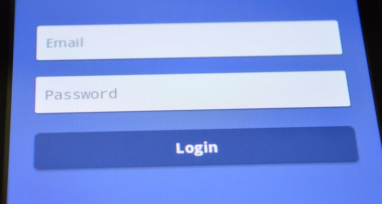

À l'ère du numérique, notre **vie en ligne** prend de plus en plus d'importance : nous communiquons par e-mails, messageries et médias sociaux, nous stockons des fichiers et des photos importants dans le cloud, nous effectuons des opérations bancaires en ligne et nous laissons d'innombrables traces sur Internet. Mais qu'advient-il de toutes ces données et de tous ces comptes si l'on décède un jour ? Mot-clé : l'**héritage numérique**.

L'héritage numérique est un sujet que beaucoup de gens négligent ou refoulent. Il est pourtant important de s'en occuper à temps pour s'assurer que vos proches gèrent vos traces, données et comptes numériques de manière appropriée en cas de besoin. L'article suivant clarifie les questions les plus fréquentes concernant l'héritage numérique et montre comment **gérer votre héritage numérique en 5 étapes**.

## Qu'est-ce qu'un héritage numérique ?

Un héritage numérique se compose de **toutes les activités, données et comptes numériques d'une personne**. Il s'agit notamment des profils de médias sociaux, des comptes de messagerie électronique, des espaces de stockage en nuage, des boutiques en ligne, des comptes bancaires en ligne, des services de streaming et bien plus encore. Un héritage numérique peut contenir des souvenirs personnels, des documents importants et des données précieuses (par exemple sur les portefeuilles numériques).

Un héritage numérique peut contenir de nombreux comptes.

## Qu'advient-il de l'héritage numérique d'un utilisateur après son décès ?

Les **relations contractuelles** avec les fournisseurs de services en ligne les plus divers se poursuivent après le décès et sont transmises aux héritiers de l'utilisateur décédé. Il convient donc de résilier le plus rapidement possible tous les contrats en cours et les adhésions payantes.

En principe, l'**accès aux comptes en ligne** d'une personne décédée est difficile, car la plupart des services ont des directives strictes en ce qui concerne l'accès de tiers. Lorsqu'un utilisateur décède, les proches ne peuvent donc pas, dans un premier temps, accéder aux comptes. Pour que les exploitants des services puissent agir, il faut généralement d'abord présenter un certificat de décès ou un certificat d'hérédité. Et même alors, il n'est souvent possible que de faire supprimer un compte - les données sont perdues.

### Quelle est la situation juridique en Allemagne ?

D'un point de vue juridique, la situation en Allemagne n'est pas définitivement clarifiée. Dans des précédents, les tribunaux ont décidé que le contrat relatif à un **compte d'utilisateur** est en principe transmis aux héritiers du titulaire initial du compte. Les héritiers doivent pouvoir consulter le compte afin, par exemple, de régler des factures impayées ou de résilier des adhésions payantes. Toutefois, cela ne leur confère qu'un **droit de lecture passif**, et non un droit de poursuivre activement l'exploitation du compte.

Il n'est pas non plus clair si les héritiers peuvent accéder aux contenus de communication du défunt, tels que les chats et les e-mails, lorsque celui-ci n'a pas consigné ses dernières volontés à ce sujet. D'une part, le droit successoral oblige le fournisseur à remettre les e-mails aux héritiers, comme s'il s'agissait de lettres non ouvertes. Mais d'un autre côté, cette remise peut violer le secret des télécommunications et les dispositions relatives à la protection des données.

Légalement, le patrimoine numérique n'est pas clairement réglementé en Allemagne.

Si une personne décède et n'a pas pris les dispositions nécessaires, ses données peuvent être inaccessibles et perdues. Certains services en ligne proposent désormais des politiques et des paramètres de suppression de compte en cas de décès. Cela peut être une option utile pour gérer la présence en ligne d'une personne décédée.

### exemples : Google, Facebook et Apple

Google, Facebook et Apple proposent dans le compte d'utilisateur certains paramètres dans lesquels il est possible de régler une succession numérique :

- Google dispose à cet effet d'un [gestionnaire d'inactivité de compte](https://myaccount.google.com/inactive?continue=https%3A%2F%2Fmyaccount.google.com%2Fdata-and-privacy): vous pouvez définir de votre vivant qui doit être informé en cas d'inactivité de votre compte et qui doit avoir accès à votre compte. De même, vous pouvez décider que votre compte sera automatiquement et complètement supprimé après une période prédéfinie.
- Facebook vous donne la possibilité de désigner dans vos [paramètres personnels](https://accountscenter.facebook.com/personal_info) un **contact successoral** qui sera autorisé à gérer votre profil en cas de décès. Vous pouvez également choisir de supprimer votre profil après le décès ou de le placer en mode commémoratif.
- Les utilisateurs d'appareils Apple peuvent [ajouter des contacts successoraux à leur identifiant Apple](https://support.apple.com/de-de/HT212360). Après votre décès, ces personnes peuvent accéder à vos photos, messages, notes, fichiers, etc. enregistrés, mais **pas** aux informations de paiement ou aux mots de passe.

## Comment et pourquoi prendre des dispositions de son vivant ?

Dans de nombreux cas, une succession numérique n'est pas réglée à temps. Les héritiers doivent alors s'enfoncer dans le brouillard et se lancer dans une pénible recherche de traces : Quels comptes en ligne le défunt utilisait-il ? Quels sont les noms d'utilisateur et les mots de passe ? Sans ces données, les proches n'ont pour l'instant aucun accès - ils en ont pourtant un besoin urgent, par exemple pour résilier des abonnements en cours.

Sans données d'accès, les proches sont confrontés à un obstacle de taille.

Prenez donc vos précautions en rédigeant une **procuration** dans laquelle vous donnerez des instructions claires à votre personne de confiance sur la manière dont votre héritage numérique sera géré après votre décès. Ayez également à disposition une **liste** actualisée **de vos comptes d'utilisateur et de vos données d'accès**. Cela permettra à vos proches de gagner beaucoup de temps et leur facilitera grandement l'accès à vos comptes en ligne.

## Succession numérique : 5 étapes pour une gestion parfaite

### 1\. choisissez un support de stockage

En théorie, vous pouvez noter tous vos comptes et mots de passe sur **papier** et les déposer dans un endroit sûr avec votre procuration. Cela présente toutefois l'inconvénient que votre liste devient rapidement confuse et perd de son actualité. Chaque fois que vous modifiez un mot de passe, supprimez un compte ou en créez un nouveau, vous devez corriger votre liste par écrit ou la réécrire complètement.

Selon le même principe, vous pouvez également enregistrer vos comptes et mots de passe **sous forme électronique dans un document texte** sur votre ordinateur, un disque dur ou une clé USB. Vous pourrez y apporter des modifications plus facilement que sur papier.

De nombreux navigateurs offrent également la possibilité d'enregistrer facilement les données de connexion.

Un [gestionnaire de mots de passe]() numérique vous permet de gérer vos données d'accès de manière claire et flexible : Ces outils permettent de sauvegarder les comptes et les mots de passe en toute sécurité et de les transmettre à des personnes de confiance en cas de décès. C'est donc l'un des meilleurs moyens d'organiser votre succession numérique.

### 2\. créer un aperçu de votre patrimoine numérique

Notez tous les comptes en ligne que vous avez et les données d'accès correspondantes. Documentez impérativement les services payants que vous utilisez, afin que vos héritiers puissent les résilier directement.

Votre patrimoine numérique peut contenir une multitude de données. Selon le nombre de vos comptes, il est judicieux de procéder par étapes et de classer votre liste par catégories. Parmi les services en ligne les plus importants, on trouve

- Comptes de messagerie et messagers (par exemple WhatsApp, Signal)
- Comptes Workspace (par exemple Google, Microsoft)
- Services bancaires en ligne et services de paiement (par exemple PayPal)
- Boutiques en ligne et places de marché (par ex. Amazon, eBay)
- Réseaux sociaux (par ex. Facebook, Instagram, LinkedIn)
- Stockage dans le nuage (par exemple Dropbox, Seafile)
- Streaming et divertissement (par ex. Netflix, Spotify, Disney+)
- Apps, jeux en ligne, plateformes de rencontre
- Abonnements numériques (p. ex. magazines, e-paper)
- Autres comptes d'utilisateurs (par exemple, forums, Adobe Creative Cloud)



### 3\. désigner une personne de confiance

Désignez une personne de confiance comme votre exécuteur testamentaire numérique. Indiquez dans une procuration que la personne mandatée devra s'occuper de votre héritage numérique et de vos affaires en ligne - après votre décès ou déjà de votre vivant si vous n'êtes pas en mesure de le faire, par exemple en raison d'un coma, d'un handicap psychique ou d'autres raisons.

Facilitez au maximum la tâche de la personne mandatée : vous pouvez régler à l'avance et avec précision les comptes en ligne auxquels la personne doit avoir accès en cas de besoin. Formulez par écrit votre volonté quant à ce que la personne doit faire avec tel ou tel compte.

### 4\. communication ouverte

Communiquez ouvertement ce que vous souhaitez faire de votre héritage numérique. Par exemple, donnez à votre personne de confiance des instructions sur les fichiers, photos et vidéos qu'elle doit supprimer, sauvegarder ou remettre à certaines personnes dans vos espaces de stockage en ligne et sur vos appareils (par exemple, ordinateur, smartphone, tablette) après votre décès.

Définissez votre héritage pour vos profils de médias sociaux et vos comptes en ligne : votre profil Facebook doit-il être transformé en page commémorative ou supprimé ? Votre personne de confiance doit-elle encore sauvegarder des données personnelles de votre compte sur Google, Dropbox ou WhatsApp ?

### 5\. donner accès à la liste des comptes

Réfléchissez à la manière dont vous souhaitez donner à votre personne de confiance l'accès à vos comptes en ligne afin qu'elle puisse agir en votre nom après votre décès.

Si vous avez enregistré la plupart de vos identifiants et mots de passe sur un appareil spécifique (par exemple dans un navigateur ou dans un document texte), votre personne de confiance devrait pouvoir y accéder après votre décès. Notez par exemple le **code PIN** de votre smartphone ou **le mot de passe de votre ordinateur** sur un papier que vous conserverez dans une enveloppe scellée.

Vous pouvez également écrire vos mots de passe sur papier ou les saisir dans un gestionnaire de mots de passe numérique. N'oubliez cependant pas d'y mettre à jour les mots de passe modifiés ! Notez le **mot de passe principal** et déposez-le dans un endroit sûr que vous communiquerez à votre personne de confiance.

## Quels outils pour gérer un héritage numérique ?

L'une des solutions les plus sûres pour gérer votre patrimoine numérique est un **gestionnaire de mots de passe**. Si vous souhaitez protéger vos données personnelles sur Internet de la manière la plus fiable possible, vous devriez utiliser un mot de passe différent pour chaque service. Celui-ci doit être composé de lettres, de chiffres et de caractères spéciaux et comporter au moins huit caractères.

Comme presque personne ne peut se souvenir de plus de dix mots de passe différents, il existe des **bases de données** spéciales qui peuvent enregistrer tous ces mots de passe pour vous et, le cas échéant, les générer. Deux gestionnaires de mots de passe populaires sont par exemple KeePass et Bitwarden.

Un autre logiciel de base de données qui vous permet de gérer votre patrimoine numérique de manière claire, flexible et sûre s'appelle **SeaTable**. Il vous permet de stocker non seulement tous vos comptes, noms d'utilisateur et mots de passe, mais aussi autant d'informations supplémentaires que vous le souhaitez.

Utilisez un gestionnaire de mots de passe pour documenter votre héritage numérique.

Si vous souhaitez utiliser le gestionnaire de mots de passe de SeaTable pour votre héritage numérique, vous pouvez [consulter le modèle ici](). Si vous êtes intéressé, il vous suffit de vous [inscrire]() gratuitement et de créer un aperçu avec vos propres données.

## Conclusion : un héritage numérique est plus important que jamais

De nos jours, chacun d'entre nous possède des dizaines de comptes en ligne. Pour que vos proches puissent accéder à vos comptes d'utilisateur en cas de besoin, vous devez prendre vos dispositions à temps. C'est pourquoi un héritage numérique dans lequel vous documentez toutes vos données d'accès est plus important que jamais.

La gestion de votre héritage numérique nécessite une planification et une préparation minutieuses. Il est important que vous réfléchissiez à l'avance à ce qu'il adviendra de votre héritage numérique, à l'endroit où vous stockerez vos mots de passe et à la personne de confiance que vous désignerez pour gérer votre héritage numérique conformément à vos souhaits. Une liste à jour de tous vos comptes et mots de passe peut non seulement soulager vos proches dans la phase difficile qui suit votre décès, mais aussi vous aider à garder une vue d'ensemble de vos données personnelles de votre vivant.
