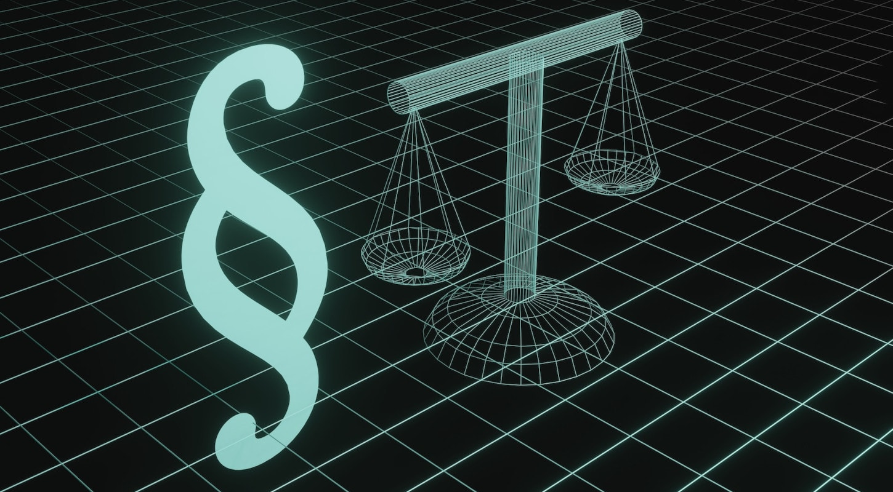

Na era digital em que vivemos, a nossa **vida em linha** está a tornar-se cada vez mais importante: comunicamos através de e-mails, messengers e redes sociais, guardamos ficheiros e fotografias importantes na nuvem, fazemos operações bancárias em linha e deixamos inúmeros vestígios na Internet. Mas o que acontece realmente a todos estes dados e contas quando morremos um dia? Palavra-chave: **património digital**.

A herança digital é um tema que muitas pessoas negligenciam ou suprimem. No entanto, é importante tratar o assunto atempadamente para garantir que os familiares tratam os seus vestígios, dados e contas digitais de forma adequada, caso o pior aconteça. O artigo seguinte esclarece as questões mais comuns sobre a herança digital e mostra como pode **gerir o seu património digital em 5 passos**.

## O que é um património digital?

Um património digital é constituído por **todas as actividades, dados e contas digitais de uma pessoa**. Inclui perfis nas redes sociais, contas de correio eletrónico, armazenamento na nuvem, lojas em linha, contas bancárias em linha, serviços de streaming e muito mais. Um património digital pode incluir memórias pessoais, documentos importantes e dados valiosos (por exemplo, em carteiras digitais).

Um património digital pode conter muitas contas.

## O que acontece ao património digital de um utilizador após a sua morte?

**As relações contratuais** com os fornecedores de vários serviços em linha mantêm-se após a morte e passam para os herdeiros do utilizador falecido. Por conseguinte, é importante cancelar todos os contratos em vigor e as adesões pagas o mais rapidamente possível.

Em princípio, **o acesso às contas em linha de** uma pessoa falecida é difícil porque a maioria dos serviços tem políticas rigorosas em relação ao acesso de terceiros. Por conseguinte, quando um utilizador morre, os familiares não podem, à partida, aceder às contas. Para que os operadores dos serviços possam atuar, é geralmente necessário apresentar primeiro uma certidão de óbito ou um certificado de herança. E mesmo assim, muitas vezes só é possível apagar uma conta - os dados perdem-se.

### Qual é a situação jurídica na Alemanha?

Do ponto de vista jurídico, a situação na Alemanha ainda não foi esclarecida de forma conclusiva. Em precedentes, os tribunais decidiram que o contrato relativo a uma **conta de utilizador** passa geralmente para os herdeiros do titular original da conta. Os herdeiros devem poder consultar a conta, por exemplo, para liquidar facturas pendentes ou para cancelar associações pagas. No entanto, isto apenas estabelece um **direito passivo de leitura**, mas não um direito de continuar ativamente com a conta.

Também não é claro se os herdeiros podem aceder ao conteúdo das comunicações do falecido, como conversas e mensagens de correio eletrónico, se este não tiver registado a sua última vontade a este respeito. Por um lado, o direito sucessório obriga o prestador de serviços a entregar o correio eletrónico aos herdeiros, à semelhança do que acontece com as cartas não abertas. No entanto, por outro lado, a entrega pode violar o sigilo das telecomunicações e as disposições relativas à proteção de dados.

Juridicamente, a herança digital não está claramente regulamentada na Alemanha.

Se uma pessoa falecer e não tiver tomado as devidas providências, os seus dados podem ficar inacessíveis e perder-se. Alguns serviços em linha oferecem atualmente políticas e definições para a eliminação da conta em caso de morte. Esta pode ser uma opção útil para gerir a presença em linha de uma pessoa falecida.

### Exemplos: Google, Facebook e Apple

A Google, o Facebook e a Apple oferecem determinadas definições na conta do utilizador, nas quais é possível regular um património digital:

- [Para](https://myaccount.google.com/inactive?continue=https%3A%2F%2Fmyaccount.google.com%2Fdata-and-privacy) este efeito, a Google dispõe do chamado [gestor de inatividade da conta](https://myaccount.google.com/inactive?continue=https%3A%2F%2Fmyaccount.google.com%2Fdata-and-privacy): pode especificar durante a sua vida útil quem deve ser notificado quando a sua conta está inativa e quem deve ter acesso à sua conta. Também pode especificar que a sua conta seja automática e completamente eliminada após um período de tempo predefinido.
- O Facebook dá-te a opção de designar um **contacto do espólio nas** tuas [definições pessoais](https://accountscenter.facebook.com/personal_info) que pode gerir o teu perfil em caso de morte. Também podes determinar se o teu perfil é eliminado ou memorizado após a morte.
- Os utilizadores de dispositivos Apple podem [adicionar contactos do espólio ao ID Apple.](https://support.apple.com/de-de/HT212360) Estas pessoas podem aceder às suas fotografias, mensagens, notas, ficheiros, etc. armazenados após a sua morte, mas **não** aos dados de pagamento ou às palavras-passe.

## Como e porquê fazer provisões em vida

Em muitos casos, o património digital não é liquidado a tempo. Os herdeiros têm então de remexer no nevoeiro e embarcar numa tediosa busca de pistas: Que contas online é que o falecido utilizava? Quais são os nomes de utilizador e as palavras-passe? Sem estes dados, os familiares não têm acesso à partida - mas precisam deles urgentemente, por exemplo, para cancelar as subscrições actuais.

Sem dados de acesso, os familiares enfrentam um grande obstáculo.

Por isso, tome precauções com uma **procuração** na qual registe instruções claras para a sua pessoa de confiança sobre a forma como o seu património digital deve ser gerido após a sua morte. Mantenha também uma **lista** actualizada **das suas contas de utilizador e dados de acesso**. Isto poupará muito tempo aos seus familiares e facilitará muito o acesso às suas contas online.

## Património digital: 5 passos para uma administração perfeita

### 1\. decidir sobre um suporte de armazenamento

Teoricamente, pode anotar todas as suas contas e palavras-passe num **papel** e depositá-las num local seguro com a sua procuração. No entanto, isto tem a desvantagem de a sua lista se tornar rapidamente confusa e perder a atualidade. Sempre que alterar uma palavra-passe, eliminar uma conta ou criar uma nova conta, terá de corrigir a sua lista por escrito ou reescrevê-la completamente.

Utilizando o mesmo princípio, também pode guardar as suas contas e palavras-passe **eletronicamente num documento de texto** no seu computador, num disco rígido ou numa pen USB. Pode efetuar alterações mais facilmente do que em papel.

Muitos navegadores também oferecem a opção de guardar convenientemente os dados de início de sessão.

Com um [gestor de senhas](https://seatable.io/pt/digitaler-nachlass/#Mit_welchen_Tools_ein_digitaler_Nachlass_verwaltet_werden_kann) digitais, pode gerir os seus dados de acesso de forma clara e flexível: Estas ferramentas permitem armazenar contas e palavras-passe de forma segura e transmiti-las a pessoas de confiança em caso de morte. Por conseguinte, esta é uma das melhores formas de organizar o seu património digital.

### 2\. criar uma visão geral do seu património digital

Tome nota de todas as contas em linha que possui e dos respectivos dados de acesso. Certifique-se de que documenta os serviços pagos que utiliza para que os seus herdeiros os possam cancelar diretamente.

O seu património digital pode conter qualquer quantidade de dados. Dependendo do número de contas que possui, faz sentido proceder passo a passo e dividir a sua lista em categorias. Os serviços em linha mais importantes incluem:

- Contas de correio eletrónico e mensageiros (por exemplo, WhatsApp, Signal)
- Contas de espaço de trabalho (por exemplo, Google, Microsoft)
- Serviços bancários e de pagamento em linha (por exemplo, PayPal)
- Lojas e mercados em linha (por exemplo, Amazon, eBay)
- Redes sociais (por exemplo, Facebook, Instagram, LinkedIn)
- Armazenamento em nuvem (por exemplo, Dropbox, Seafile)
- Streaming e entretenimento (por exemplo, Netflix, Spotify, Disney+)
- Aplicações, jogos em linha, plataformas de encontros
- Assinaturas digitais (por exemplo, revistas, papel eletrónico)
- Outras contas de utilizador (por exemplo, fóruns, Adobe Creative Cloud)



### 3\. nomear uma pessoa de confiança

Nomeie uma pessoa da sua confiança como seu executor digital. Especifique numa procuração que a pessoa autorizada deve cuidar da sua herança digital e do seu negócio em linha - após a sua morte ou já durante a sua vida, se não o puder fazer, por exemplo, devido a um coma, uma deficiência mental ou outros motivos.

Facilite ao máximo as coisas para a pessoa autorizada: pode regular antecipadamente quais as contas em linha a que a pessoa deve ter acesso em caso de emergência. Formule por escrito a sua vontade relativamente ao que a pessoa deve fazer com cada conta.

### 4\. comunicação aberta

Comunique abertamente o que pretende que aconteça ao seu património digital. Por exemplo, dê à sua pessoa de confiança instruções sobre os ficheiros, fotografias e vídeos que deve apagar, fazer cópias de segurança ou entregar a pessoas específicas no seu armazenamento na nuvem e nos seus dispositivos (por exemplo, computador, smartphone, tablet) após a sua morte.

Determine o seu legado para os seus perfis de redes sociais e contas em linha: o seu perfil do Facebook deve ser transformado numa página memorial ou eliminado? A sua pessoa de confiança deve continuar a fazer cópias de segurança dos dados pessoais da sua conta Google, Dropbox ou WhatsApp?

### 5\. conceder acesso à lista de contas

Pense nas formas como gostaria de dar à sua pessoa de confiança acesso às suas contas em linha para que possa agir no seu melhor interesse após a sua morte.

Se tiver guardado a maior parte dos seus dados de início de sessão e palavras-passe num dispositivo específico (por exemplo, num browser ou num documento de texto), a pessoa de confiança deve poder aceder-lhes após a sua morte. Por exemplo, escreva o **PIN** do seu smartphone ou **a palavra-passe do** seu **computador** numa folha de papel que guarde num envelope fechado.

No entanto, também pode escrever as suas palavras-passe em papel ou introduzi-las num gestor de palavras-passe digital. Mas lembre-se também de atualizar sempre as palavras-passe alteradas! Anote a **palavra-passe mestra** e guarde-a num local seguro, que deve ser comunicado à sua pessoa de confiança.

## Com que ferramentas pode ser gerido um património digital

Uma das soluções mais seguras para gerir o seu património digital é um **gestor de palavras-passe**. Se quiser proteger os seus dados pessoais na Internet da forma mais fiável possível, deve utilizar uma palavra-passe separada para cada serviço. Esta deve ser composta por letras, números e caracteres especiais e ter, pelo menos, oito caracteres.

Uma vez que quase ninguém se consegue lembrar de mais de dez palavras-passe diferentes, existem **bases de dados** especiais que podem armazenar todas essas palavras-passe por si e também gerá-las, se necessário. Dois gestores de palavras-passe populares são o KeePass e o Bitwarden, por exemplo.

Outro software de base de dados que lhe permite gerir o seu património digital de uma forma clara, flexível e segura chama-se **SeaTable**. Com ele, pode armazenar não só todas as suas contas, nomes de utilizador e palavras-passe, mas também toda a informação adicional que desejar.

Utilize um gestor de palavras-passe para documentar o seu património digital.

Se pretender utilizar o gestor de palavras-passe do SeaTable para o seu património digital, pode [ver o modelo aqui](). Se estiver interessado, basta [registar-se]() gratuitamente e criar uma visão geral com os seus próprios dados.

## Conclusão: O património digital é mais importante do que nunca

Atualmente, cada um de nós tem dezenas de contas online. Para garantir que os seus familiares possam aceder às suas contas de utilizador se o pior acontecer, deve tomar providências atempadamente. É por isso que um espólio digital no qual documenta todos os seus dados de acesso é mais importante do que nunca.

A gestão do património digital requer um planeamento e uma preparação cuidadosos. É importante pensar antecipadamente sobre o que pretende que aconteça ao seu legado digital, onde guarda as suas palavras-passe e que pessoa de confiança envolve para gerir o seu património digital de acordo com os seus desejos. Uma lista actualizada de todas as suas contas e palavras-passe pode não só aliviar os seus familiares durante a fase difícil após a sua morte, mas também ajudá-lo a manter o controlo dos seus dados pessoais enquanto está vivo.
