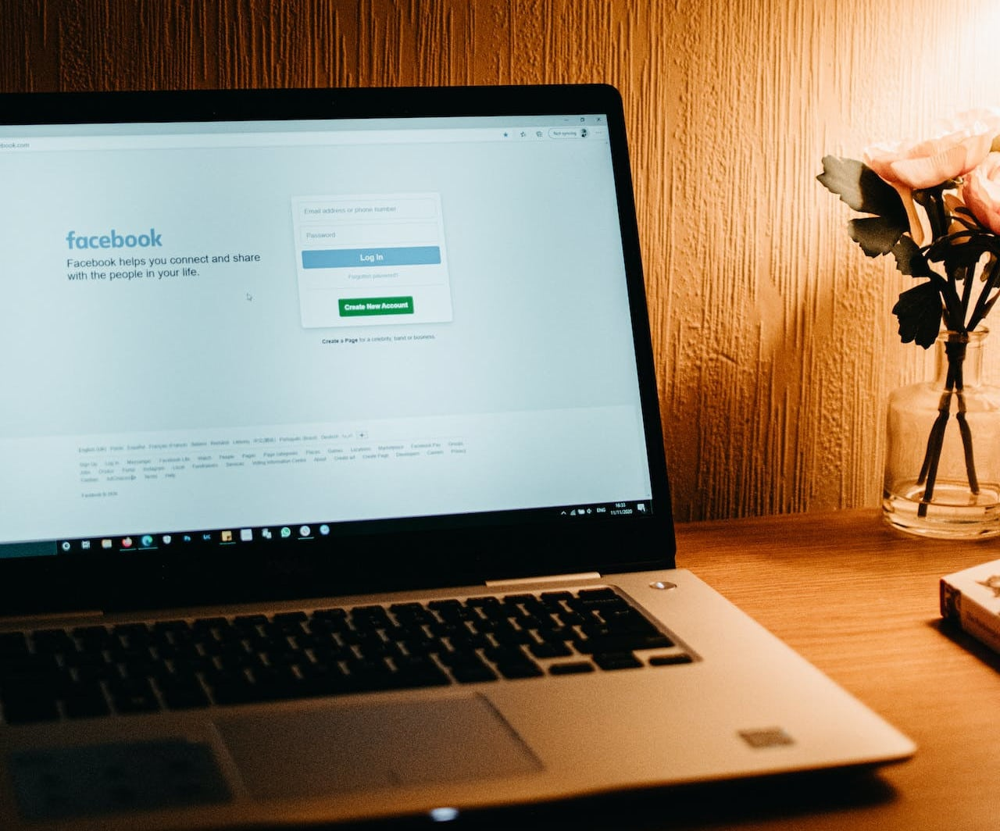

В современный век цифровых технологий наша **жизнь в Интернете** приобретает все большее значение: мы общаемся по электронной почте, в мессенджерах и социальных сетях, храним важные файлы и фотографии в облаке, совершаем онлайн-банкинг и оставляем бесчисленные следы в Интернете. Но что на самом деле произойдет со всеми этими данными и аккаунтами, когда вы однажды умрете? Ключевое слово: **цифровое наследство**.

Цифровое наследство - тема, которой многие пренебрегают или умалчивают. Тем не менее, своевременно разобраться с ней очень важно для того, чтобы родственники правильно распорядились вашими цифровыми следами, данными и счетами, если случится худшее. В следующей статье мы разъясним наиболее распространенные вопросы, связанные с наследованием цифровых данных, и покажем, как можно **управлять своим цифровым имуществом в 5 шагов**.

## Что такое цифровая недвижимость?

Цифровое имущество состоит из **всех цифровых действий, данных и учетных записей человека**. Сюда входят профили в социальных сетях, учетные записи электронной почты, облачные хранилища, интернет-магазины, счета в интернет-банках, потоковые сервисы и многое другое. Цифровое имущество может включать личные воспоминания, важные документы и ценные данные (например, на цифровых кошельках).

Цифровое имущество может содержать множество учетных записей.

## Что происходит с цифровым имуществом пользователя после его смерти?

**Договорные отношения** с поставщиками различных онлайновых услуг продолжаются и после смерти и переходят к наследникам умершего пользователя. Поэтому важно как можно скорее расторгнуть все действующие контракты и платные членства.

В принципе, **доступ к учетным записям** умершего человека в **Интернете** затруднен, поскольку большинство сервисов имеют строгую политику в отношении доступа третьих лиц. Поэтому после смерти пользователя его родственники сначала не могут получить доступ к счетам. Для того чтобы операторы сервисов могли предпринять какие-либо действия, обычно сначала необходимо предъявить свидетельство о смерти или свидетельство о праве на наследство. И даже в этом случае зачастую возможно только удаление учетной записи - данные теряются.

### Какова правовая ситуация в Германии?

С юридической точки зрения ситуация в Германии окончательно не прояснена. В прецедентах суды постановляли, что договор на **учетную запись пользователя**, как правило, переходит к наследникам первоначального владельца учетной записи. Наследники должны иметь возможность проверять состояние счета, например, для погашения задолженности по счетам или отмены членства, за которое взимается плата. Однако это устанавливает только **пассивное право на чтение**, но не право на активное продолжение использования учетной записи.

Неясно также, могут ли наследники получить доступ к коммуникационному контенту покойного, такому как чаты и электронные письма, если он не зафиксировал свою последнюю волю на этот счет. С одной стороны, наследственное право обязывает провайдера передать электронную почту наследникам, подобно невскрытым письмам. Однако, с другой стороны, такая передача может нарушить положения о тайне связи и защите информации.

Юридически наследование цифровых технологий в Германии четко не регламентировано.

Если человек умирает и не принял соответствующих мер, его данные могут оказаться недоступными и потерянными. В настоящее время некоторые онлайновые службы предлагают политику и настройки для удаления учетной записи в случае смерти. Это может быть полезной опцией для управления присутствием умершего человека в Интернете.

### Примеры: Google, Facebook и Apple

Google, Facebook и Apple предлагают определенные настройки в учетной записи пользователя, с помощью которых можно регулировать цифровое имущество:

- [Для](https://myaccount.google.com/inactive?continue=https%3A%2F%2Fmyaccount.google.com%2Fdata-and-privacy) этого в Google предусмотрен так называемый [менеджер неактивности аккаунта](https://myaccount.google.com/inactive?continue=https%3A%2F%2Fmyaccount.google.com%2Fdata-and-privacy): в течение жизни аккаунта вы можете указать, кто должен получать уведомления о том, что ваш аккаунт неактивен, и кто должен иметь доступ к вашему аккаунту. Вы также можете указать, что по истечении заданного периода времени ваш аккаунт будет автоматически и полностью удален.
- Facebook предоставляет возможность указать в [личных настройках](https://accountscenter.facebook.com/personal_info) **контактное** лицо, которое может управлять вашим профилем в случае смерти. Вы также можете определить, будет ли ваш профиль удален или сохранен в памяти после смерти.
- Пользователи устройств Apple могут [добавить в Apple ID контакты наследников.](https://support.apple.com/de-de/HT212360) Эти люди смогут получить доступ к сохраненным фотографиям, сообщениям, заметкам, файлам и т.д. после вашей смерти, но **не** к платежным данным или паролям.

## Как и почему следует создавать резервы в течение жизни

Во многих случаях цифровое наследство не успевает оформиться. Тогда наследникам приходится копаться в тумане и заниматься утомительным поиском подсказок: Какими учетными записями в Интернете пользовался покойный? Каковы имена пользователей и пароли? Без этих данных родственники поначалу не имеют доступа, но они им срочно нужны, например, для отмены текущих подписок.

Без данных доступа родственники сталкиваются с большими трудностями.

Поэтому следует принять меры предосторожности, оформив **доверенность**, в которой вы зафиксируете четкие инструкции для своего доверенного лица относительно того, как будет осуществляться управление вашим цифровым имуществом после вашей смерти. Кроме того, храните актуальный **список учетных записей пользователей и данных доступа к** ним. Это позволит родственникам сэкономить время и значительно упростит им доступ к вашим учетным записям в Интернете.

## Цифровое наследство: 5 шагов к идеальному управлению

### 1\. принять решение о выборе носителя информации

Теоретически можно записать все свои учетные записи и пароли на **бумаге** и положить их в надежное место, оформив доверенность. Однако это имеет тот недостаток, что список быстро запутается и потеряет свою актуальность. При смене пароля, удалении учетной записи или создании новой учетной записи приходится письменно корректировать список или полностью переписывать его.

По такому же принципу можно сохранять учетные записи и пароли **в электронном виде в текстовом документе** на компьютере, жестком диске или USB-накопителе. Вносить в него изменения гораздо проще, чем в бумажный документ.

Многие браузеры также предлагают возможность удобного сохранения данных для входа в систему.

С помощью цифрового [менеджера паролей]() можно четко и гибко управлять данными доступа: Эти инструменты позволяют надежно хранить учетные записи и пароли и передавать их доверенным лицам в случае смерти. Таким образом, это один из лучших способов организовать свое цифровое имущество.

### 2\. создать обзор своего цифрового имущества

Запишите все имеющиеся у вас учетные записи в Интернете и соответствующие данные доступа к ним. Обязательно задокументируйте, какими платными услугами вы пользуетесь, чтобы ваши наследники могли напрямую отказаться от них.

Ваше цифровое имущество может содержать любое количество данных. В зависимости от количества имеющихся у вас учетных записей имеет смысл действовать поэтапно, разбив свой список на категории. К наиболее важным онлайновым сервисам относятся:

- Учетные записи электронной почты и мессенджеры (например, WhatsApp, Signal)
- Учетные записи рабочего пространства (например, Google, Microsoft)
- Онлайновые банковские и платежные услуги (например, PayPal)
- Интернет-магазины и торговые площадки (например, Amazon, eBay)
- Социальные сети (например, Facebook, Instagram, LinkedIn)
- Облачные хранилища (например, Dropbox, Seafile)
- Потоковое вещание и развлечения (например, Netflix, Spotify, Disney+)
- Приложения, онлайн-игры, платформы для знакомств
- Цифровые подписки (например, журналы, электронная газета)
- Другие учетные записи пользователей (например, форумы, Adobe Creative Cloud)



### 3\. назначить доверенное лицо

Назначьте человека, которому вы доверяете, своим цифровым душеприказчиком. Укажите в доверенности, что доверенное лицо должно позаботиться о вашем цифровом наследстве и вашем бизнесе в Интернете - после вашей смерти или уже при жизни, если вы не можете этого сделать, например, из-за комы, психического расстройства или по другим причинам.

Максимально упростите работу уполномоченного лица: Вы можете заранее определить, к каким именно счетам в Интернете оно должно иметь доступ в случае возникновения чрезвычайной ситуации. Сформулируйте в письменном виде свою волю относительно того, какие действия он должен совершать с тем или иным счетом.

### 4\. открытая коммуникация

Открыто сообщайте о том, что вы хотите, чтобы произошло с вашим цифровым имуществом. Например, дайте своему доверенному лицу указания о том, какие файлы, фотографии и видеозаписи следует удалить, создать резервные копии или передать конкретным людям в облачном хранилище и на устройствах (например, компьютере, смартфоне, планшете) после вашей смерти.

Определите, каким будет наследие ваших профилей в социальных сетях и учетных записей в Интернете: следует ли превратить профиль Facebook в мемориальную страницу или удалить его? Должен ли ваш доверенный человек по-прежнему сохранять резервные копии личных данных из аккаунта Google, Dropbox или WhatsApp?

### 5\. предоставить доступ к списку счетов

Продумайте, каким образом вы хотели бы предоставить доверенному лицу доступ к вашим счетам в Интернете, чтобы оно могло действовать в ваших интересах после вашей смерти.

Если вы храните большинство своих регистрационных данных и паролей на определенном устройстве (например, в браузере или в текстовом документе), то доверенное лицо должно иметь возможность получить к ним доступ после вашей смерти. Например, запишите **PIN-код** смартфона или **пароль компьютера** на листе бумаги, который хранится в запечатанном конверте.

Однако можно также записывать пароли на бумаге или вводить их в цифровой менеджер паролей. Но не забывайте всегда обновлять измененные пароли и там! Запишите **мастер-пароль** и храните его в надежном месте, о чем сообщите своему доверенному лицу.

## С помощью каких инструментов можно управлять цифровым имуществом

Одним из наиболее надежных решений для управления своим цифровым имуществом является **менеджер паролей**. Если вы хотите как можно надежнее защитить свои персональные данные в Интернете, то для каждого сервиса следует использовать отдельный пароль. Он должен состоять из букв, цифр и специальных символов и иметь длину не менее восьми знаков.

Поскольку практически никто не может запомнить более десяти различных паролей, существуют специальные **базы данных**, которые могут хранить все эти пароли за вас, а также генерировать их при необходимости. Двумя популярными менеджерами паролей являются, например, KeePass и Bitwarden.

Еще одно программное обеспечение для работы с базами данных, позволяющее четко, гибко и безопасно управлять своим цифровым имуществом, называется **SeaTable**. С ее помощью можно хранить не только все свои учетные записи, имена пользователей и пароли, но и сколько угодно дополнительной информации.

Используйте менеджер паролей для документирования своего цифрового имущества.

Если вы хотите использовать менеджер паролей SeaTable для своего цифрового имущества, вы можете [посмотреть шаблон здесь](). Если вы заинтересовались, просто [зарегистрируйтесь]() бесплатно и создайте обзор с вашими собственными данными.

## Вывод: цифровая недвижимость важна как никогда

В настоящее время каждый из нас имеет десятки учетных записей в Интернете. Чтобы гарантировать родственникам доступ к учетным записям пользователей в случае худшего, необходимо заблаговременно позаботиться об этом. Именно поэтому как никогда важно создать цифровое наследство, в котором будут задокументированы все данные доступа.

Управление цифровым имуществом требует тщательного планирования и подготовки. Важно заранее продумать, что вы хотите, чтобы произошло с вашим цифровым наследием, где вы храните свои пароли и кому из доверенных лиц вы поручаете управлять вашим цифровым имуществом в соответствии с вашими пожеланиями. Актуальный список всех учетных записей и паролей поможет не только облегчить жизнь родственникам на трудном этапе после вашей смерти, но и следить за своими персональными данными еще при жизни.
