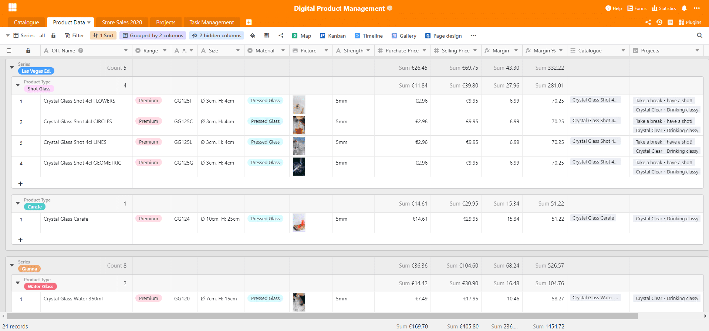
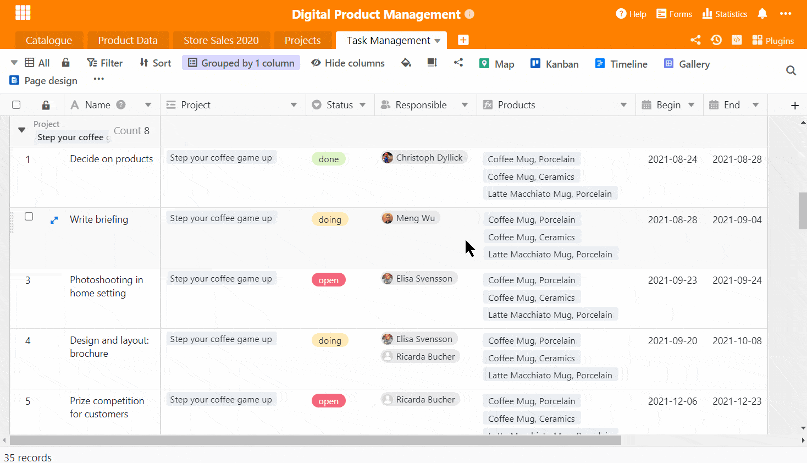
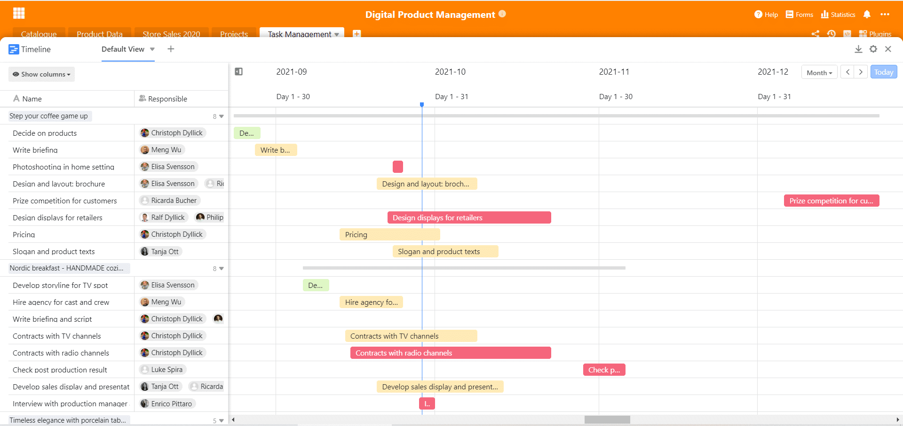
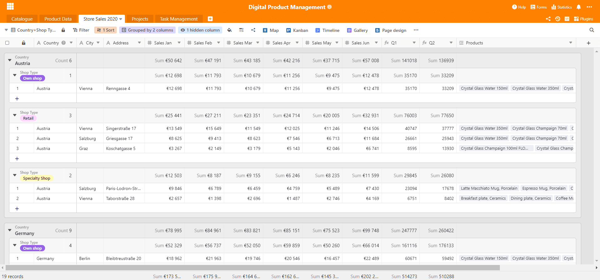
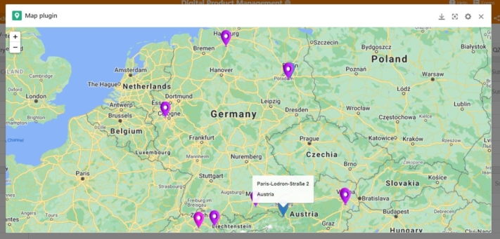
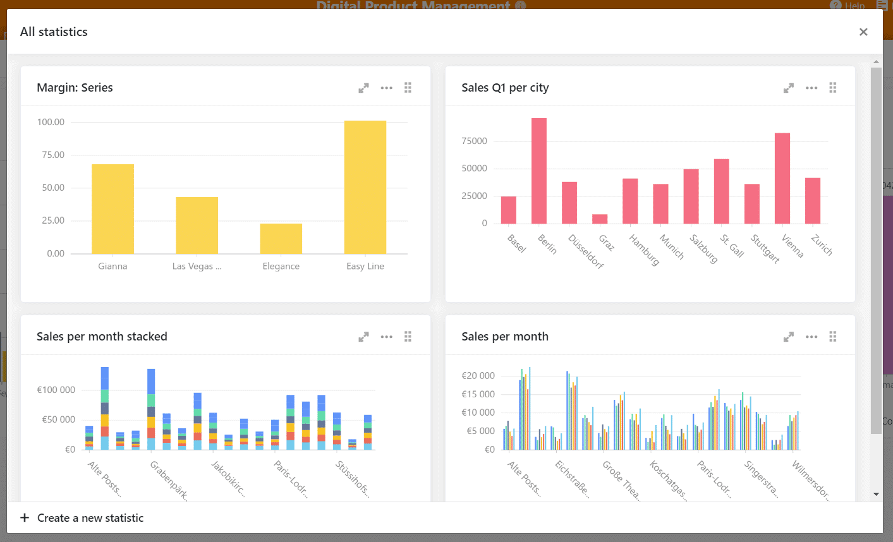
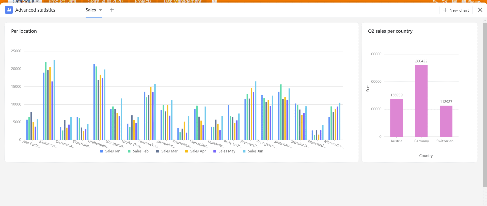

Digital product management is indispensable in dealing with products in today's age. Because digitally, many things are so much easier than they used to be. One goal is to map the various interfaces of the entire product management from start to finish and to compile all information completely and compactly. This often involves switching back and forth between different programmes and tools - with SeaTable, this is no longer necessary.

SeaTable offers an excellent basis for digital product management, as it can map almost all steps in the product development process with its versatile functions. In the following, we explain [our specially developed template](https://seatable.io/en/vorlage/lejzgk0brbo1piwmodvlsa/) and all the important functions that are essential in the everyday life of a product manager.

### Excursus: What is product management?

In product management, products are planned, developed, implemented and continuously monitored on the market. All processes are centrally controlled and monitored there. Product managers work out efficient product strategies suitable for the market and thus provide a decision-making basis for further work with products.

In product management, there are many interfaces with other departments and external stakeholders that need to be carefully organised together with the daily tasks. The dynamics of digital product management therefore require strong software to map all work processes carefully and, above all, to make work easier. Modern product development is dependent on digital product management, [concludes an expert](https://www.adhibeo.de/digitales-produktmanagement-oberstes-ziel-moderner-digitaler-produktentwicklung-ist-es-ein-produkt-bereitzustellen-das-am-markt-auch-wirklich-angenommen-wird/) from the Fresenius University of Applied Sciences in Hamburg.

## Informative product catalogues

Digital product management benefits from appropriate product management tools. A comprehensive catalogue with all product specifications should always be created internally for one's own products. A distinction can be made between two types: On the one hand, product information intended for external use and public distribution, such as for advertising catalogues or for product exhibitions.

On the other hand, there are also other product characteristics that are not intended for the general public, such as material thickness, coating or even own colour mixtures or material compositions. For this information, there is a detailed internal product data catalogue that summarises all of this. We have integrated both versions in our template.

[Click here to go directly to the template](https://seatable.io/en/vorlage/lejzgk0brbo1piwmodvlsa/)

### More overview with double grouping

To create a better overview within the catalogue, we use SeaTable's multiple [grouping function](https://seatable.io/en/docs/handbuch/seatable-nutzen/gruppierung-sortierung-filter/). This allows you to arrange and structure your data as you wish: For example, by series and quality range, or as in our template, by product series and product type.

A product catalogue for external presentation

You need more than just a display view of your products? No problem! Simply add multiple views to your table and group, sort and filter your data as you need it. For example, you can work on the basis of individual product series by creating your own view for the "Gianna" series. With a few clicks you have all relevant information available.

### Gallery plugin for all product images

You might know this - you are looking for a product and you know what it looks like, but not what it is called? Our gallery plugin is very helpful for this. It displays all the images that have been entered in the selected table and forms a compact information pool for your product management. With additional information such as product name, series and item number, you can thus create a detailed image gallery that also contains important product specifics.

With a few clicks you have created an informative gallery.

The plugin perfectly complements the product catalogues and makes image databases on other platforms superfluous. Since SeaTable is not only a [powerful project management tool](https://seatable.io/en/vorlage/brsc53rrtqwduseehp2ntq/), but also a database that stores images in the original at the same time, this function is optimal for digital [project management](https://seatable.io/en/projektmanagement/).

## Simple cataloguing of products

Let us now turn to the internal product catalogue: This serves as an internal source of information and data collection point for the products. It not only contains elementary information such as product name, colour and quality range, but also important dimensions, material and material thickness, purchase and sales price, margin and much more related information.

This results in a very detailed product catalogue that enables every employee to obtain maximum information output with minimum effort. Indeed, a fully equipped catalogue minimises communication with responsible units, such as the product managers or other units, if, for example, the exact designation of the product coating is missing.

In our example, we directly created calculations for the margin in order to observe how the individual products perform in production. This is very easy with the [formula column](https://seatable.io/en/docs/handbuch/seatable-nutzen/feld-typen/), which first calculates the margin and then the margin as a percentage. This way, product managers and employees can see at a glance how the different products are doing.

In the right part of the screen you can see links to the "Catalogue" and "Projects" table. The first link is used to correctly pass some data from the product data sheet to the catalog, since some information is the same. The "Product Data" table serves as a master table; whenever things are changed there, such as the purchase price, these values are automatically changed in the catalog as a result of the link. In this way, purchase prices no longer have to be changed manually.

The connection to the "Projects" table is used to link the project management around these products directly to the product data sheet. Thus, planned, ongoing and completed projects and marketing activities around the products are linked to the products themselves and your digital product management becomes a well-rounded affair.

## Project management and task management

In product management, products are not only developed, but also implemented and marketed. This makes it all the more sensible to integrate projects directly into the base in order to have a central place for project management. And what would digital product management be without the appropriate tools for implementation? The individual projects are listed in a table with responsibilities, status, associated products and the departments involved.

In order to divide the individual projects more precisely into task packages, the "Tasks" table was created and linked to the project table - all tasks that belong to the "Take a break - have a shot!" project, for example, are linked to it and at the same time also provide a new structure in the task table. We have grouped the tasks there per project so that everything remains clear.

For easier handling of the tasks, we have integrated the **Kanban plugin**, which makes task management easy. In the Kanban manner, individual tasks can be transformed into a new status with one click, for example when the products for the campaign have been finally selected: Done! The Kanban plugin is based on the various views created in a table, so you can also create employee-specific views for your own Kanban boards.

With the Kanban plugin you always have your tasks perfectly in view

To ensure that you always have an eye on the time, we supplement our digital product management with the **Timeline plug-in**. It shows the course of time of your tasks in the form of a timeline. Always starting from the current date, a marker shows which tasks are still in time and which should already be completed. So you know at a glance whether your team is on schedule.

The timeline shows tasks and projects over time. Are you on time?

## Sales figures for all branches

Of course, it is enormously important in product management to keep an eye on the monthly sales figures. Many informative analyses can be made on the basis of the figures. Will the new product flop and not be accepted by the customers at all? Or will it be an absolute sales hit? Is it possibly selling better in Germany than in Switzerland? All such questions can be answered very quickly with the sales figures.

All selling stores are listed here with address and sales figures

In our product management template, the table contains not only the sales, but also all listed outlets with address and the products that are sold at the outlets. The products are added to the "Catalogue" table by means of a link column and thus belong to the individual stores as sales units.   
  
This can be used to create a detailed store portfolio, for example if employees and branch managers are added. When the addresses are entered, the map plug-in can be used at the same time, which can locate places by means of address or coordinates and visualise them on the map.  
Stores are thus mapped geographically and provide information about a particularly high or low store density and where exactly new locations could be planned.

### Statistics for a clear view of data

The sales figures are the heart of this table and extremely important for digital product management. The monthly figures allow for far-reaching analyses. For the first and second quarters, the correct figures have already been determined with a formula column in order to be able to better compare the developments of the stores. With the help of your own SeaTable statistics, you can create valuable and meaningful [statistics](https://seatable.io/en/docs/handbuch/seatable-nutzen/statistiken/) that structure your data in an informative and visual way.

We have already created some statistics that are helpful for the data evaluation of this table. There are hardly any limits to the selection possibilities: By selecting a view depending on the table, highly individualised statistics can be created; for example, if a shop is to be analysed specifically, a single view can be created for this branch and then a statistic created just for it.

These statistics complement product management with important analyses

The first statistic shows the margins of the different product series and it becomes clear that the Easy Line has the highest margin. The following statistic on the right shows the sales figures in the first quarter for the individual sales locations: Berlin is obviously a strong location, while the figures in Graz look rather poor. So the rather meagre figures can be followed up by the product management in the further course to possibly improve the output.

The statistics at the bottom left show the monthly sales figures of the stores with a stacked bar chart, which also shows the sum of the months at the height of the bar. To get another perspective on the monthly sales,  we have created another bar chart at the bottom left, showing all monthly sales figures per branch with narrow lines.

If you want more flexibility, you can use our plugin "Advanced statistics". The advantage of this plugin is the enlargement of the statistics at will in the overview and a completely flexible and new arrangement of statistics. These two statistics can be enlarged or reduced in any direction with the mouse cursor and can be placed perfectly next to each other. This is especially important in cases where important numbers need to be compared directly.

The statistics are a very powerful feature that is integrated in every version of SeaTable. [Our template is available](https://seatable.io/en/vorlage/lejzgk0brbo1piwmodvlsa/) for download [here](https://seatable.io/en/vorlage/lejzgk0brbo1piwmodvlsa/)!

## Start your digital product management now with SeaTable

This application example clearly shows how well SeaTable can map digital product management and thus positively change the way you work. As a versatile and highly flexible software, SeaTable can adapt to your needs and react to every situation. With the different column types and useful plugins, a wide variety of processes can be implemented: No matter if you [need](https://seatable.io/en/vorlage/gnx7mg0dqkejp6p4e5c6-w/) a sophisticated [CRM management tool](https://seatable.io/en/vorlage/gnx7mg0dqkejp6p4e5c6-w/) or if you want to [record](https://seatable.io/en/vorlage/dkcp4_k3rnsb4d9sskb6qw/) and further process the [working hours of your employees](https://seatable.io/en/vorlage/dkcp4_k3rnsb4d9sskb6qw/). With SeaTable, there are hardly any limits!

[Register for free]() and try out our features. We have created helpful templates that can help you get started with certain topics!
