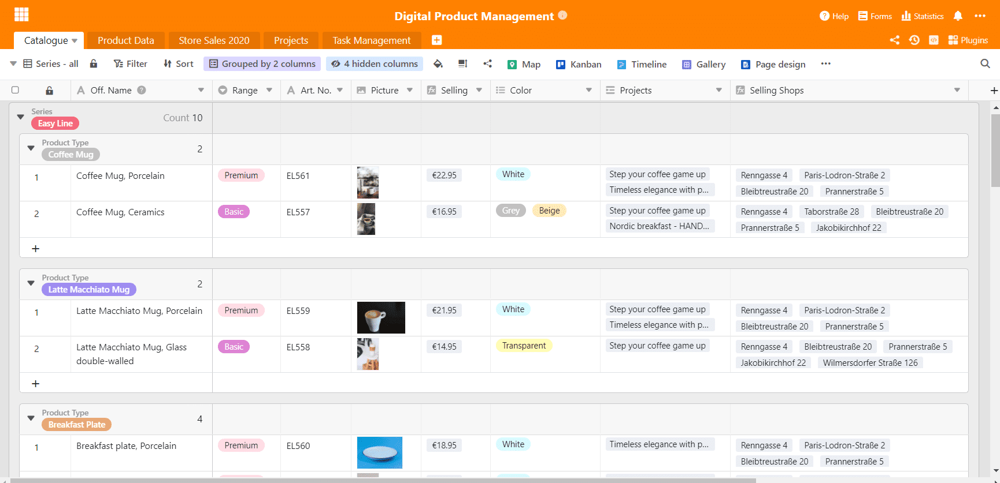
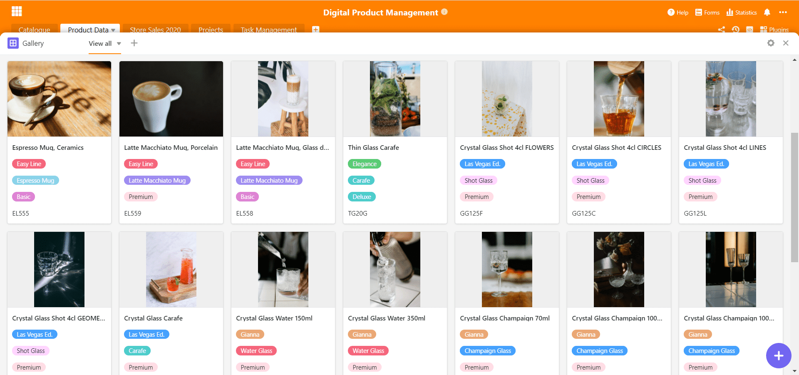

A gestão digital de produtos é indispensável para lidar com os produtos da era actual. Porque, digitalmente, muitas coisas são muito mais fáceis do que costumavam ser. Um objectivo é mapear as várias interfaces de toda a gestão do produto do início ao fim e compilar toda a informação de forma completa e compacta. Isto envolve muitas vezes a mudança entre diferentes programas e ferramentas - com o SeaTable, isto já não é necessário.

SeaTable oferece uma excelente base para a gestão digital de produtos, uma vez que pode mapear quase todas as etapas do processo de desenvolvimento do produto com as suas funções versáteis. Em seguida, explicamos o [nosso modelo especialmente desenvolvido]() e todas as funções importantes que são essenciais na vida quotidiana de um gestor de produto.

### Excursus: O que é a gestão do produto?

Na gestão de produtos, os produtos são planeados, desenvolvidos, implementados e continuamente monitorizados no mercado. Todos os processos são aí controlados e monitorizados de forma centralizada. Os gestores de produto elaboram estratégias de produto eficientes e adequadas ao mercado, fornecendo assim uma base de decisão para o trabalho futuro com os produtos.

Na gestão de produtos, há muitas interfaces com outros departamentos e intervenientes externos que precisam de ser cuidadosamente organizadas juntamente com as tarefas diárias. A dinâmica da gestão digital de produtos requer, portanto, um software forte para mapear cuidadosamente todos os processos de trabalho e, acima de tudo, para facilitar o trabalho. O desenvolvimento de produtos modernos depende da gestão digital de produtos, [conclui um perito](https://www.adhibeo.de/digitales-produktmanagement-oberstes-ziel-moderner-digitaler-produktentwicklung-ist-es-ein-produkt-bereitzustellen-das-am-markt-auch-wirklich-angenommen-wird/) da Universidade Fresenius de Ciências Aplicadas de Hamburgo.

## Catálogos informativos de produtos

A gestão digital de produtos beneficia de ferramentas apropriadas de gestão de produtos. Deve ser sempre criado internamente um catálogo abrangente com todas as especificações do produto para os próprios produtos. Pode ser feita uma distinção entre dois tipos: Por um lado, informações sobre produtos destinadas a utilização externa e distribuição pública, tais como catálogos publicitários ou exposições de produtos.

Por outro lado, existem também outras características do produto que não se destinam ao público em geral, tais como espessura do material, revestimento ou mesmo misturas de cor ou composições de material próprias. Para esta informação, existe um catálogo interno detalhado de dados de produtos que resume tudo isto. Integramos ambas as versões no nosso modelo.

[Clique aqui para ir directamente para o modelo]()

### Mais visão geral com agrupamento duplo

Para criar uma melhor visão geral dentro do catálogo, utilizamos a [função de agrupamento](https://seatable.io/pt/docs/handbuch/seatable-nutzen/gruppierung-sortierung-filter/) múltiplo do SeaTable. Isto permite-lhe organizar e estruturar os seus dados como desejar: Por exemplo, por série e gama de qualidade, ou como no nosso modelo, por série de produto e tipo de produto.

Um catálogo de produtos para apresentação externa

Precisa de mais do que uma simples visualização dos seus produtos? Não há problema! Basta adicionar várias vistas à sua tabela e agrupar, ordenar e filtrar os seus dados conforme necessário. Por exemplo, pode trabalhar com base em séries de produtos individuais, criando a sua própria vista para a série "Gianna". Com apenas alguns cliques, tem toda a informação relevante na ponta dos dedos.

### Plugin de galeria para todas as imagens de produtos

Talvez saiba isto - está à procura de um produto e sabe como é, mas não como se chama? O nosso plugin de galeria é muito útil para isto. Apresenta todas as imagens que foram introduzidas na tabela seleccionada e forma um conjunto compacto de informações para a gestão do seu produto. Com informações adicionais tais como nome do produto, série e número de item, pode assim criar uma galeria de imagens detalhada que também contém importantes especificidades de produto.

Com alguns cliques, criou uma galeria informativa.

O plugin complementa perfeitamente os catálogos de produtos e torna supérfluas as bases de dados de imagens em outras plataformas. Uma vez que o SeaTable não é apenas uma poderosa ferramenta de gestão de projectos, mas também uma base de dados que armazena imagens no original ao mesmo tempo, esta função é óptima para a [gestão de projectos](https://seatable.io/pt/projektmanagement/) digitais.

## Catalogação simples de produtos

Passemos agora ao catálogo interno de produtos: Isto serve como uma fonte interna de informação e ponto de recolha de dados para os produtos. Contém não só informação elementar como nome do produto, cor e gama de qualidade, mas também dimensões importantes, material e espessura do material, preço de compra e venda, margem e muito mais informação relacionada.

Isto resulta num catálogo de produtos muito detalhado que permite a cada empregado obter o máximo rendimento de informação com o mínimo esforço. De facto, um catálogo totalmente equipado minimiza a comunicação com as unidades responsáveis, tais como os gestores do produto ou outras unidades, se, por exemplo, faltar a designação exacta do revestimento do produto.

No nosso exemplo, criámos directamente cálculos para a margem a fim de observar como os produtos individuais se comportam na produção. Isto é muito fácil com a [coluna da fórmula](https://seatable.io/pt/docs/handbuch/seatable-nutzen/feld-typen/), que primeiro calcula a margem e depois a margem como percentagem. Desta forma, os gestores de produtos e empregados podem ver, num relance, como estão a fazer os diferentes produtos.

Na parte direita do ecrã, aparecem ligações para a tabela "Catálogo" e "Projectos". A primeira ligação é utilizada para passar corretamente alguns dados da ficha de produto para o catálogo, uma vez que algumas informações são as mesmas. A tabela "Dados do produto" funciona como uma tabela-mestra; sempre que se alteram dados nessa tabela, como o preço de compra, esses valores são automaticamente alterados no catálogo através da ligação. Desta forma, os preços de compra deixam de ter de ser alterados manualmente.

A ligação à tabela "Projectos" é utilizada para ligar a gestão de projectos em torno destes produtos diretamente à folha de dados do produto. Desta forma, os projectos planeados, em curso e concluídos e as medidas de marketing em torno dos produtos estão ligados aos próprios produtos e a sua gestão de produtos digitais torna-se um assunto completo.

## Gestão de projectos e gestão de tarefas

Na gestão de produtos, os produtos não são apenas desenvolvidos, mas também implementados e comercializados. Isto torna ainda mais sensato integrar projectos directamente na base, a fim de ter um lugar central para a gestão de projectos. E o que seria a gestão de produtos digitais sem as ferramentas apropriadas para a implementação? Os projectos individuais são listados numa tabela com responsabilidades, estatuto, produtos associados e os departamentos envolvidos.

Para dividir os projectos individuais de forma mais precisa em pacotes de tarefas, foi criada a tabela "Tarefas" e ligada à tabela de projectos - todas as tarefas que pertencem ao projeto "Faça uma pausa - experimente!", por exemplo, estão ligadas a esta tabela e, ao mesmo tempo, dão uma nova estrutura à tabela de tarefas. Agrupámos as tarefas por projeto para que tudo fique claro.

Para facilitar a gestão das tarefas, integrámos o **plugin Kanban**, o que facilita a gestão de tarefas. Na verdadeira moda Kanban, as tarefas individuais podem ser transformadas num novo estatuto com um clique, por exemplo, quando os produtos para a campanha tiverem sido finalmente seleccionados: Feito! O plugin Kanban é baseado nas várias visões criadas numa tabela, pelo que também pode criar visões específicas de empregados para os seus próprios quadros Kanban.

Com o plugin Kanban tem sempre as suas tarefas perfeitamente em vista

Para garantir que está sempre de olho no tempo, complementamos a nossa gestão de produtos digitais com o **plug-in da Linha do Tempo**. Mostra o curso do tempo das suas tarefas sob a forma de uma linha temporal. Sempre a partir da data actual, um marcador mostra quais as tarefas que ainda estão a tempo e quais as que já devem ser concluídas. Assim, sabe num relance se a sua equipa está dentro do prazo.

A linha temporal mostra tarefas e projectos ao longo do tempo. Chegou a tempo?

## Números de vendas de todos os ramos

Naturalmente, é extremamente importante na gestão do produto estar atento aos números das vendas mensais. Muitas análises informativas podem ser feitas com base nos números. Será que o novo produto falhará e não será de todo aceite pelos clientes? Ou será um sucesso absoluto de vendas? É possível que esteja a vender melhor na Alemanha do que na Suíça? Todas estas perguntas podem ser respondidas muito rapidamente com os números das vendas.

Todas as lojas de venda estão aqui listadas com endereço e números de vendas

No nosso modelo de gestão de produtos, a tabela contém não só as vendas, mas também todos os pontos de venda listados com o endereço e os produtos que são vendidos nos pontos de venda. Os produtos são adicionados à tabela "Catálogo" através de uma coluna de ligação e pertencem assim às lojas individuais como unidades de venda.   
  
Isto pode ser utilizado para criar uma carteira detalhada de lojas, por exemplo, se forem adicionados empregados e gestores de sucursais. Quando os endereços são introduzidos, o plug-in do mapa pode ser utilizado ao mesmo tempo, que pode localizar locais através do endereço ou coordenadas e visualizá-los no mapa.  
As lojas são assim mapeadas geograficamente e fornecem informação sobre uma densidade de lojas particularmente alta ou baixa e onde exactamente novos locais poderiam ser planeados.

### Estatísticas para uma visão clara dos dados

Os números das vendas são o coração desta tabela e extremamente importantes para a gestão digital de produtos. Os números mensais permitem análises de grande alcance. Para o primeiro e segundo trimestres, os números correctos já foram determinados com uma coluna de fórmula a fim de se poder comparar melhor os desenvolvimentos das lojas. Com a ajuda das suas próprias estatísticas SeaTable, pode criar [estatísticas](https://seatable.io/pt/docs/handbuch/seatable-nutzen/statistiken/) valiosas e significativas que estruturam os seus dados de uma forma informativa e visual.

Já criámos algumas estatísticas que são úteis para a avaliação dos dados desta tabela. Quase não há limites para as possibilidades de selecção: Ao seleccionar uma vista dependendo da tabela, podem ser criadas estatísticas altamente individualizadas; por exemplo, se uma loja tiver de ser analisada especificamente, pode ser criada uma vista única para este ramo e depois uma estatística criada apenas para ele.

Estas estatísticas complementam a gestão de produtos com análises importantes

A primeira estatística mostra as margens das diferentes séries de produtos e torna-se claro que a Linha Fácil tem a margem mais alta. A seguinte estatística à direita mostra os números das vendas no primeiro trimestre para os locais de venda individuais: Berlim é obviamente uma localização forte, enquanto que os números em Graz parecem bastante pobres. Assim, os números bastante escassos podem ser seguidos pela gestão do produto no curso seguinte para possivelmente melhorar a produção.

As estatísticas na parte inferior esquerda mostram os números das vendas mensais das lojas com um gráfico de barras empilhadas, que também mostra a soma dos meses na altura do bar. Para obter outra perspectiva sobre as vendas mensais,  criámos outro gráfico de barras na parte inferior esquerda, mostrando todos os números de vendas mensais por ramo com linhas estreitas.

Se pretender mais flexibilidade, pode utilizar o nosso plugin "Estatísticas avançadas". A vantagem deste plugin é a ampliação das estatísticas conforme desejado na visão geral e uma disposição completamente flexível e nova das estatísticas. Estas duas estatísticas podem ser ampliadas ou reduzidas em qualquer direção com o ponteiro do rato e podem, assim, ser colocadas perfeitamente uma ao lado da outra. Isto é especialmente importante nos casos em que números importantes devem ser comparados diretamente entre si.

As estatísticas são uma característica muito poderosa que está integrada em todas as versões do SeaTable. O [nosso modelo está disponível]() para download [aqui]()!

## Comece agora a gestão do seu produto digital com SeaTable

Este exemplo de aplicação mostra claramente como a SeaTable pode mapear bem a gestão digital de produtos e assim mudar positivamente a sua forma de trabalhar. Como um software versátil e altamente flexível, SeaTable pode adaptar-se às suas necessidades e reagir a qualquer situação. Com os diferentes tipos de colunas e plugins úteis, uma grande variedade de processos pode ser implementada: Não importa se [necessita de]() uma [ferramenta]() sofisticada [de gestão de CRM]() ou se pretende [registar]() e processar posteriormente as [horas de trabalho dos seus empregados](). Com o SeaTable, quase não há limites!

[Registe-se gratuitamente]() e experimente as nossas características. Criámos modelos úteis que o podem ajudar a começar com certos tópicos!
