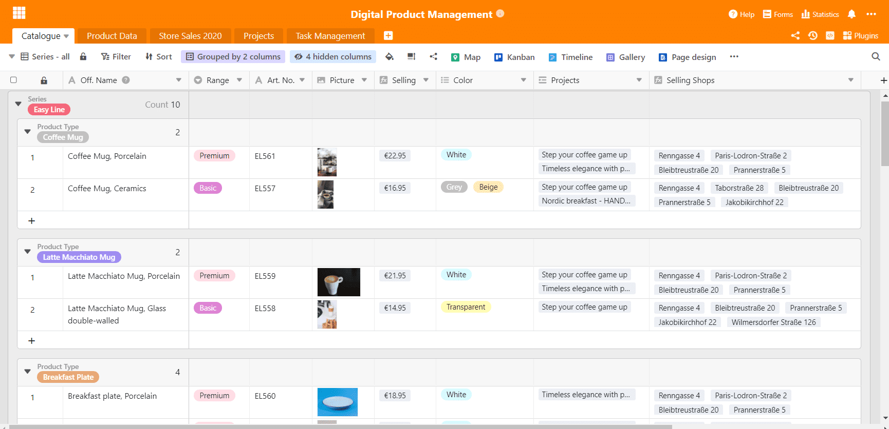
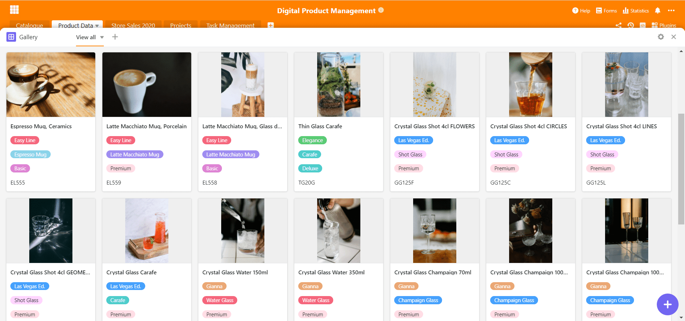
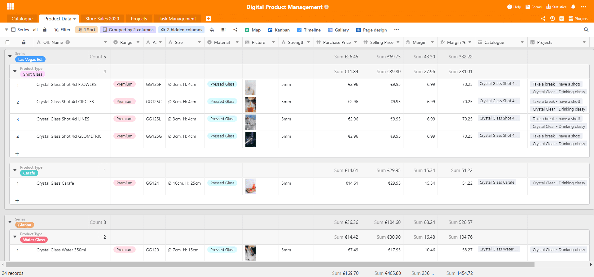
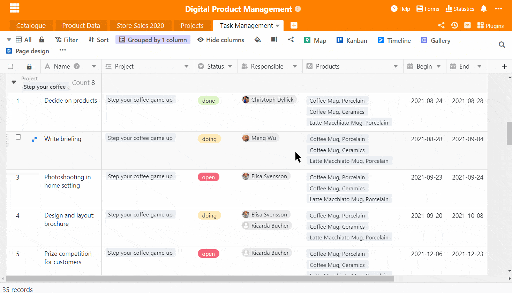
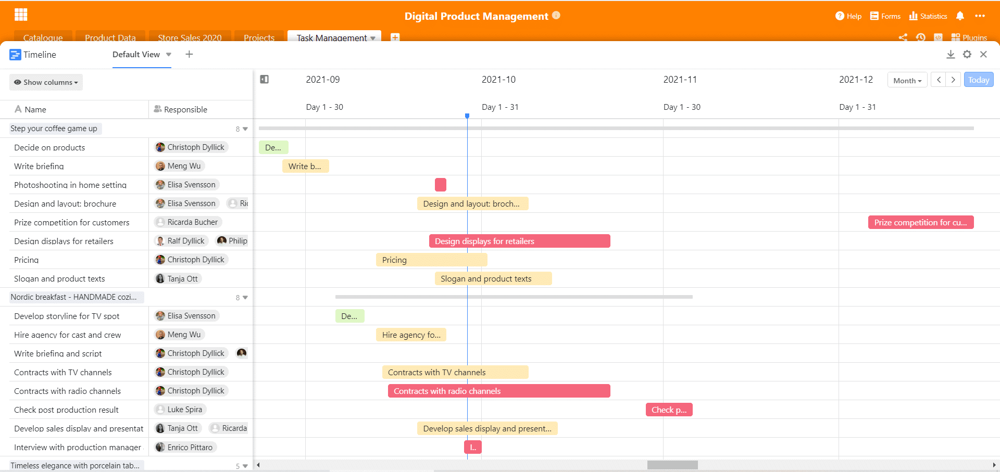
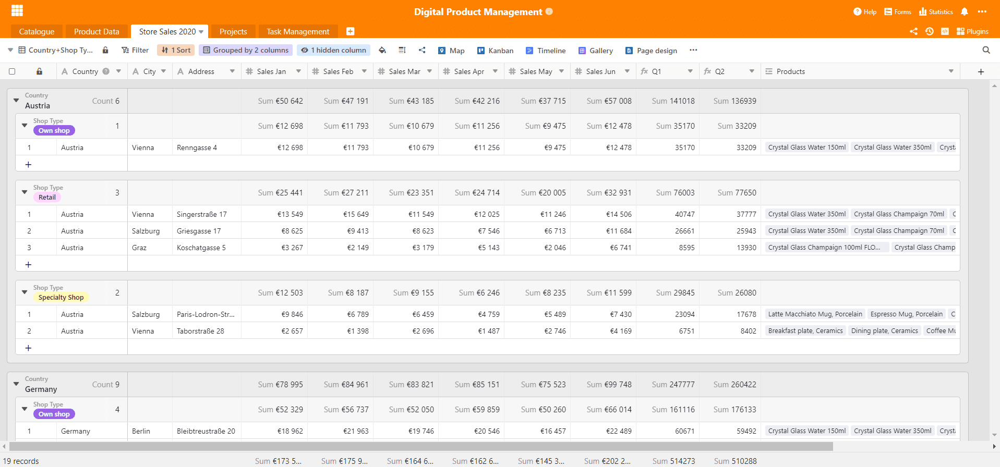
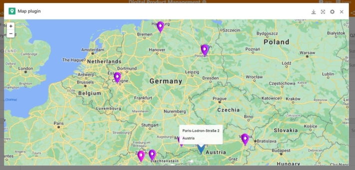
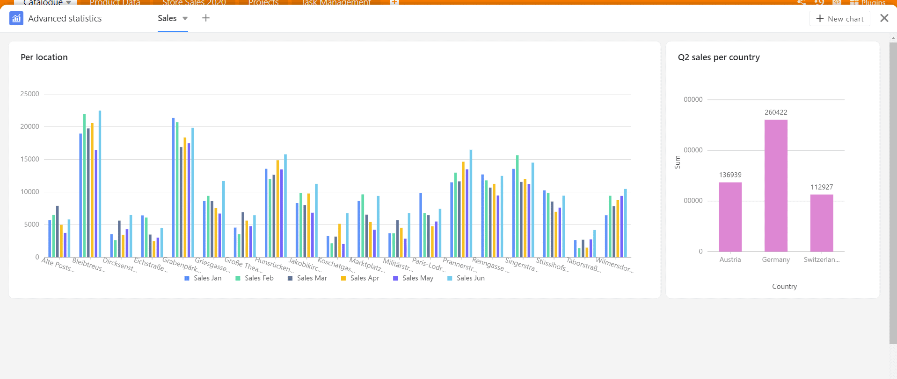

Управление цифровыми продуктами незаменимо при работе с продуктами в современную эпоху. Потому что в цифровом формате многие вещи намного проще, чем раньше. Одна из целей - отобразить различные интерфейсы всего управления продуктом от начала до конца и собрать всю информацию полностью и компактно. Это часто связано с переключением туда-сюда между различными программами и инструментами - с SeaTable в этом больше нет необходимости.

SeaTable предлагает отличную основу для цифрового управления продуктами, поскольку благодаря своим универсальным функциям он может отобразить практически все этапы процесса разработки продукта. Далее мы расскажем о [специально разработанном нами шаблоне]() и обо всех важных функциях, которые необходимы в повседневной жизни менеджера по продукту.

### Экскурс: Что такое управление продуктом?

В области управления продукцией продукты планируются, разрабатываются, внедряются и постоянно контролируются на рынке. Все процессы централизованно контролируются и отслеживаются там. Менеджеры по продуктам разрабатывают эффективные стратегии продуктов, подходящие для рынка, и тем самым обеспечивают основу для принятия решений по дальнейшей работе с продуктами.

В управлении продуктами существует множество интерфейсов с другими отделами и внешними заинтересованными сторонами, которые должны быть тщательно организованы вместе с ежедневными задачами. Поэтому динамика управления цифровыми продуктами требует мощного программного обеспечения для тщательного отображения всех рабочих процессов и, прежде всего, для облегчения работы. Современная разработка продукта зависит от цифрового управления продуктом, [заключает эксперт](https://www.adhibeo.de/digitales-produktmanagement-oberstes-ziel-moderner-digitaler-produktentwicklung-ist-es-ein-produkt-bereitzustellen-das-am-markt-auch-wirklich-angenommen-wird/) из Университета прикладных наук Фрезениус в Гамбурге.

## Информативные каталоги продукции

Управление цифровыми продуктами выигрывает от использования соответствующих инструментов управления продуктами. Для собственной продукции всегда следует создавать полный каталог со всеми техническими характеристиками. Можно провести различие между двумя типами: С одной стороны, информация о продукции, предназначенная для внешнего использования и публичного распространения, например, для рекламных каталогов или выставок продукции.

С другой стороны, существуют и другие характеристики продукции, которые не предназначены для широкой публики, например, толщина материала, покрытие или даже собственные цветовые смеси или составы материалов. Для этой информации существует подробный внутренний каталог данных о продукции, в котором все это обобщено. Мы интегрировали обе версии в наш шаблон.

[Нажмите здесь, чтобы перейти непосредственно к шаблону]()

### Больше обзора с двойной группировкой

Для создания лучшего обзора в каталоге мы используем [функцию]() множественной [группировки]() в SeaTable. Это позволяет упорядочить и структурировать данные по своему усмотрению: Например, по серии и диапазону качества, или, как в нашем шаблоне, по серии и типу продукта.

Каталог продукции для внешней презентации

Вам нужно больше, чем просто отображение продукции? Нет проблем! Просто добавьте к таблице несколько представлений и группируйте, сортируйте и фильтруйте данные так, как вам нужно. Например, можно работать с отдельными сериями товаров, создав собственное представление для серии "Gianna". Всего несколько щелчков мышью - и вся необходимая информация у вас под рукой.

### Плагин галереи для всех изображений товаров

Возможно, вам это знакомо - вы ищете продукт и знаете, как он выглядит, но не знаете, как он называется? Наш плагин галереи очень полезен для этого. Он отображает все изображения, которые были введены в выбранную таблицу, и формирует компактный информационный пул для управления вашим продуктом. С помощью дополнительной информации, такой как название продукта, серия и номер изделия, вы можете создать подробную галерею изображений, которая также содержит важные характеристики продукта.

Несколькими щелчками мыши вы создали информативную галерею.

Плагин прекрасно дополняет каталоги продукции и делает ненужными базы данных изображений на других платформах. Поскольку SeaTable - это не только мощный инструмент управления проектами, но и база данных, которая одновременно хранит изображения в оригинале, эта функция оптимальна для [управления](https://seatable.io/ru/projektmanagement/) цифровыми [проектами](https://seatable.io/ru/projektmanagement/).

## Простая каталогизация продукции

Теперь обратимся к внутреннему каталогу продукции: Это служит внутренним источником информации и пунктом сбора данных о продукции. Он содержит не только элементарную информацию, такую как название продукта, цвет и диапазон качества, но и важные размеры, материал и толщину материала, закупочную и продажную цену, маржу и много другой сопутствующей информации.

В результате получается очень подробный каталог продукции, который позволяет каждому сотруднику получить максимум информации при минимальных усилиях. Действительно, полностью укомплектованный каталог сводит к минимуму общение с ответственными подразделениями, такими как менеджеры по продукции или другие подразделения, если, например, отсутствует точное обозначение покрытия продукта.

В нашем примере мы непосредственно создали расчеты для маржи, чтобы проследить, как отдельные продукты работают в производстве. Это очень легко сделать с помощью [столбца формул](), который сначала вычисляет маржу, а затем маржу в процентах. Таким образом, менеджеры по продуктам и сотрудники могут с первого взгляда увидеть, как обстоят дела с различными продуктами.

В правой части экрана отображаются ссылки на таблицу "Каталог" и "Проекты". Первая ссылка используется для корректного переноса некоторых данных из технического паспорта в каталог, так как часть информации совпадает. Таблица "Данные о продукте" служит в качестве основной таблицы; при изменении в ней данных, например, закупочной цены, эти значения автоматически изменяются в каталоге по ссылке. Таким образом, отпадает необходимость изменять закупочные цены вручную.

Связь с таблицей "Проекты" используется для того, чтобы связать управление проектами вокруг этих продуктов непосредственно с техническим паспортом продукта. Таким образом, планируемые, текущие и завершенные проекты и маркетинговые мероприятия, связанные с продуктами, привязываются к самим продуктам, и управление цифровыми продуктами становится всесторонним.

## Управление проектами и управление задачами

При управлении продуктами продукты не только разрабатываются, но и внедряются и продаются. Это делает еще более разумной интеграцию проектов непосредственно в базу, чтобы иметь центральное место для управления проектами. И чем бы было управление цифровыми продуктами без соответствующих инструментов для внедрения? Отдельные проекты перечислены в таблице с указанием обязанностей, статуса, сопутствующих продуктов и задействованных отделов.

Для более точного разделения отдельных проектов на пакеты задач была создана таблица "Задачи", которая связана с таблицей проектов - все задачи, относящиеся, например, к проекту "Перерыв - выстрел!", связаны с ней и одновременно придают новую структуру таблице задач. Мы сгруппировали задачи по проектам, чтобы все оставалось понятным.

Для облегчения работы с задачами мы интегрировали **плагин Kanban**, который упрощает управление задачами. В манере Kanban отдельные задачи могут быть переведены в новый статус одним щелчком мыши, например, когда продукты для кампании окончательно выбраны: Готово! Плагин Kanban основан на различных представлениях, созданных в таблице, поэтому вы также можете создавать представления для конкретных сотрудников для своих собственных досок Kanban.

С плагином Kanban ваши задачи всегда будут на виду.

Чтобы вы всегда следили за временем, мы дополняем управление цифровыми продуктами **плагином Timeline**. Он показывает ход времени выполнения ваших задач в виде временной шкалы. Всегда начиная с текущей даты, маркер показывает, какие задачи еще не выполнены, а какие уже должны быть завершены. Так вы сразу узнаете, укладывается ли ваша команда в график.

Временная шкала показывает задачи и проекты с течением времени. Ты вовремя?

## Показатели продаж по всем филиалам

Конечно, в управлении продуктом очень важно следить за ежемесячными показателями продаж. На основе этих цифр можно провести много информативных анализов. Не окажется ли новый продукт неудачным и не будет принят покупателями вообще? Или это будет абсолютный хит продаж? Возможно, в Германии он продается лучше, чем в Швейцарии? На все эти вопросы можно ответить очень быстро, имея данные о продажах.

Здесь перечислены все продающие магазины с адресами и данными о продажах

В нашем шаблоне управления товарами таблица содержит не только продажи, но и все перечисленные торговые точки с адресами и продуктами, которые продаются в этих точках. Продукты добавляются в таблицу "Каталог" с помощью колонки ссылок и, таким образом, принадлежат отдельным магазинам как единицам продаж.   
  
Это позволяет создать подробный портфель магазинов, например, если добавить сотрудников и руководителей филиалов. Когда адреса введены, одновременно можно использовать плагин карты, который может находить места по адресу или координатам и визуализировать их на карте.  
Таким образом, магазины наносятся на географическую карту и предоставляют информацию об особенно высокой или низкой плотности магазинов и о том, где именно можно планировать новые места.

### Статистика для наглядного представления данных

Показатели продаж являются сердцем этой таблицы и чрезвычайно важны для управления цифровыми продуктами. Ежемесячные показатели позволяют проводить далеко идущий анализ. Для первого и второго кварталов правильные цифры уже определены с помощью столбца формул, чтобы иметь возможность лучше сравнить развитие магазинов. С помощью собственной статистики SeaTable вы можете создавать ценные и значимые [статистические данные](), которые структурируют ваши данные в информативной и наглядной форме.

Мы уже создали некоторые статистические данные, полезные для оценки данных этой таблицы. Возможности выбора практически не ограничены: Выбрав представление в зависимости от таблицы, можно создать индивидуальную статистику; например, если нужно проанализировать конкретно магазин, можно создать отдельное представление для этого филиала, а затем создать статистику только для него.

Эта статистика дополняет управление продуктами важными аналитическими данными

Первая статистика показывает маржу различных серий продуктов, и становится ясно, что Easy Line имеет самую высокую маржу. Следующая статистика справа показывает показатели продаж в первом квартале по отдельным местам продаж: Берлин, очевидно, является сильным местом, в то время как показатели в Граце выглядят довольно плохо. Таким образом, довольно скудные цифры могут быть использованы менеджментом продукта в дальнейшем для возможного улучшения результатов.

Статистика в левом нижнем углу показывает ежемесячные показатели продаж магазинов с помощью гистограммы, которая также показывает сумму месяцев на высоте гистограммы. Чтобы получить еще один взгляд на ежемесячные продажи,  мы создали еще одну гистограмму в левом нижнем углу, показывающую все месячные показатели продаж по филиалам с помощью узких линий.

Если вам нужна большая гибкость, вы можете воспользоваться нашим плагином "Advanced Statistics". Преимуществом этого плагина является увеличение статистики по желанию в обзоре и совершенно гибкое и новое расположение статистики. Эти две статистики могут быть увеличены или уменьшены в любом направлении с помощью указателя мыши и, таким образом, могут быть идеально расположены рядом друг с другом. Это особенно важно в тех случаях, когда требуется сравнить важные показатели непосредственно друг с другом.

Статистика - это очень мощная функция, которая интегрирована в каждую версию SeaTable. [Наш шаблон можно]() скачать [здесь]()!

## Начните управление цифровыми продуктами прямо сейчас с помощью SeaTable

Этот пример применения наглядно показывает, насколько хорошо SeaTable может отобразить управление цифровыми продуктами и тем самым позитивно изменить подход к работе. Будучи универсальным и очень гибким программным обеспечением, SeaTable может адаптироваться к вашим потребностям и реагировать на любую ситуацию. Благодаря различным типам колонок и полезным плагинам можно реализовать самые разнообразные процессы: Неважно, [нужен]() ли вам сложный [инструмент управления CRM]() или вы хотите [вести учет]() и дальнейшую обработку [рабочего времени ваших сотрудников](). С SeaTable ограничений практически не существует!

[Зарегистрируйтесь бесплатно]() и попробуйте наши возможности. Мы создали полезные шаблоны, которые помогут вам начать работу с определенными темами!
