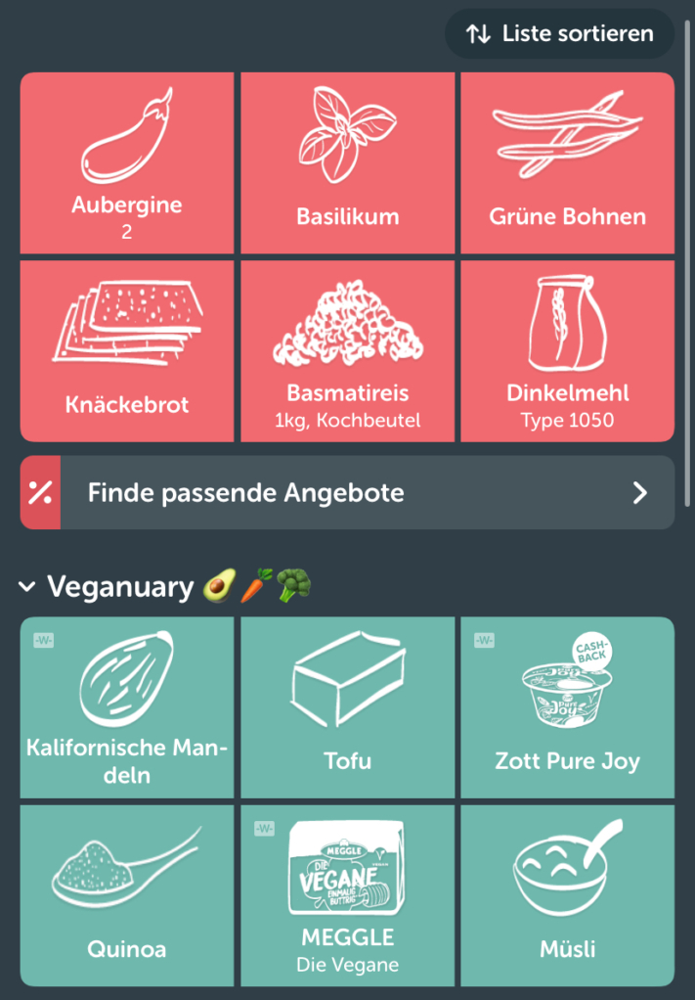

En la agitada vida cotidiana, ir al supermercado puede convertirse en un verdadero reto entre todos los compromisos profesionales y privados. En los días estresantes, no es raro olvidarse de la lista de la compra que se ha elaborado minuciosamente en casa. Pero no se preocupe: una **lista de la compra digital** puede ser un remedio eficaz en estas situaciones.

Sin embargo, la pregunta sigue siendo: ¿qué lista de la compra digital/app es la mejor opción para satisfacer sus necesidades individuales? En este artículo analizamos siete prometedoras aplicaciones diseñadas para facilitar las compras.

Con la organización adecuada, ir de compras no supone ningún estrés.

## Por qué tienen sentido las listas de la compra

Hay buenas razones para hacer listas en todos los ámbitos de la vida, y la compra no es una excepción. Una lista de la compra cuidadosamente planificada no sólo proporciona una estructura organizativa, sino que también tiene numerosas ventajas para tu vida diaria:

- **Ahorrar dinero**: Si planificas exactamente lo que necesitas antes de ir de compras e incluso elaboras un [plan semanal](https://seatable.io/es/meal-prep-gesund-und-guenstig-essen-vorkochen/), puedes ahorrar mucho dinero. Esto significa que ya no compras artículos al azar que te llaman la atención, sino solo lo que realmente necesitas.
- **Ahorra tiempo**: Si planificas la compra con antelación con una lista de la compra, siempre tendrás a mano todos los alimentos que necesitas para tus recetas favoritas sin olvidar nada. Así ahorrarás mucho tiempo, ya que los dobles viajes al supermercado son cosa del pasado.
- **Minimizar el desperdicio de alimentos**: Según el [Ministerio Federal de Alimentación y Agricultura](https://www.bmel.de/DE/themen/ernaehrung/lebensmittelverschwendung/studie-lebensmittelabfaelle-deutschland.html), cada consumidor tira unos 78 kilos de comida al año. Tal vez usted también tire habitualmente comida porque está estropeada o ha pasado su fecha de consumo preferente. Si en el futuro sólo compra lo que realmente necesita, también tendrá que tirar menos. Si planificas bien la compra y te [abasteces](https://seatable.io/es/notvorrat-anlegen/) adecuadamente, no sólo te ayudas a ti mismo, sino también al medio ambiente.

Los alemanes son los que más fruta y verdura tiran.

## Resumen de las aplicaciones de listas de la compra

La cuestión de qué lista de la compra digital / aplicación es la adecuada para usted depende de cuáles sean sus necesidades. Hemos establecido unos criterios según los cuales juzgamos las siguientes aplicaciones. Además de la **claridad** y el **diseño**, también evaluaremos las **recetas integradas**, las **ofertas actuales** y las **funciones inteligentes**.

Todas las aplicaciones probadas permiten crear varias listas de la compra. Luego puedes compartirlas fácilmente con familiares, amigos o compañeros de piso.

### 1\. la lista de la compra

La aplicación de lista de la compra es perfecta para aquellos a los que no les gusta teclear en su smartphone. Gracias a la función de **entrada de voz**, puedes decir simplemente los productos que necesitas y evitar los molestos errores de escritura.

Ya se trate de gestionar y clasificar **categorías de alimentos** o de tus **recetas favoritas**, que puedes compartir fácilmente con amigos y compañeros, esta aplicación combina muchas funciones importantes en una sola.

**Ventajas**

- Buena claridad
- Diseño cuidado y estético
- Recetas integradas
- Ofertas actuales
- Búsqueda inteligente

**Desventajas**

- No se dispone de desventajas relevantes

Este es el aspecto de "La lista de la compra".

### 2\. ¡trae!

Además de organizar su compra semanal, la aplicación Bring también añade una pizca de variedad a su diversidad culinaria. También te recuerda que pruebes cosas nuevas con sugerencias e inspiración. Por ejemplo, muestra productos que coinciden con la **temporada actual** o **promociones** como Veganuary.

Dentro de la aplicación, también puedes enviar **mensajes predefinidos** a los compañeros de piso con los que hayas compartido la lista de la compra / aplicación. Por ejemplo: "¡Me voy de compras! Última oportunidad para los ajustes" o "Noticias de última hora. Por favor, ¡trae leche!". Sin embargo, esta función requiere que todas las partes implicadas hayan activado la autorización de notificación en los ajustes de su smartphone.

**Ventajas**

- Interfaz de usuario clara
- Diseño auténtico
- Recetas integradas
- Ofertas actuales
- Clasificación inteligente

**Desventajas**

- No se dispone de desventajas relevantes

La aplicación de lista de la compra "¡Trae!"

### 3\. pon

A los amantes de la tecnología les encantará esta aplicación, ya que combina muchas **funciones inteligentes**. Además de detalles como el lugar de compra, el precio normal y el precio de oferta especial, también puedes establecer recordatorios de mejor antes tras iniciar sesión.

Además, no sólo se **analizan** las preferencias y hábitos del usuario, sino también el momento en que se vuelven a necesitar los artículos. También puede activar las notificaciones para que la app reconozca su ubicación y le avise cuando tenga un producto en su lista de la compra y esté cerca de un supermercado adecuado.

**Ventajas**

- Clasificación por tiendas
- Recetas integradas
- Ofertas actuales
- Muchas funciones inteligentes

**Desventajas**

- No hay iconos de los productos

La lista de la compra en "pon"

### 4\. comprar

Esta aplicación es ideal para todos los usuarios de Apple Watch y los amantes de la moda oscura. Utiliza **plantillas** para ahorrar tiempo, sobre todo si sueles comprar las mismas cosas, o añade **fotos** a tus productos.

Si guardas tus **recetas** en la aplicación, puedes añadir los ingredientes que faltan a tu lista de la compra la próxima vez sin apenas esfuerzo.

**Ventajas**

- Muy buena claridad
- Modo oscuro
- Recetas integradas
- Widget

**Desventajas**

- No hay ofertas
- El número ilimitado de listas y plantillas está sujeto a un recargo

La aplicación "ToBuy" en modo oscuro

### 5\. weNeed

En comparación, esta aplicación es un poco más sencilla que las demás. Así que si no necesitas un montón de campanas y silbatos, pero quieres concentrarte en la función principal, esta aplicación de lista de la compra es la elección correcta.

Aunque es posible **agrupar** y **clasificar de forma personalizada**, las funciones inteligentes, las ofertas y las recetas están totalmente ausentes.

**Ventajas**

- Presentación clara
- Imágenes de productos

**Desventajas**

- Sin recetas
- No hay ofertas
- Sin funciones inteligentes

La aplicación "WeNeed

### 6\. aplicaciones para tomar notas según el smartphone

Una opción probada son las aplicaciones integradas en el smartphone, como **Recordatorios**, **Samsung Notes** o **Google Notes**. Debido a su **uso intuitivo** y al hecho de que suelen utilizarse para otras notas, son una buena opción para cualquiera a quien le guste anotar sus listas de la compra **sin complicaciones**.

Las funciones pueden variar según la marca. Sin embargo, suelen consistir en una lista que se puede **marcar**, normalmente sin agrupar ni categorizar.

**Ventajas**

- Diseño minimalista

**Desventajas**

- Sin recetas integradas
- No hay ofertas
- Sin funciones inteligentes

La aplicación de notas como lista de la compra

### 7 Mesa de mar

SeaTable ofrece una [plantilla](https://seatable.io/es/vorlage/rw6cogmdrjyl-j0w3sjraw/) que complementa la típica lista de la compra con muchas otras funciones. Aquí no solo puedes **marcar** tus artículos, sino también introducir **recetas** y subir **fotos**.

La lista de la compra digital / app también te ayuda a controlar mejor los aspectos financieros de tus compras. Por ejemplo, puedes asignar productos a categorías o tiendas específicas y **registrar los precios**, que se suman para cada supermercado y compra. Con la ayuda de las **estadísticas** integradas, puedes tener una visión clara de tus gastos.

**Ventajas**

- Clasificación por tiendas
- Clasificación por colores
- Recetas integradas
- Estadísticas

**Desventajas**

- No hay ofertas

### Conclusión:

En resumen, elegir la aplicación de lista de la compra adecuada depende de tus preferencias y necesidades. Aunque cada una de las aplicaciones analizadas tiene sus puntos fuertes y débiles, todas tienen algo en común: facilitan el día a día y contribuyen a hacer la compra sin estrés.
