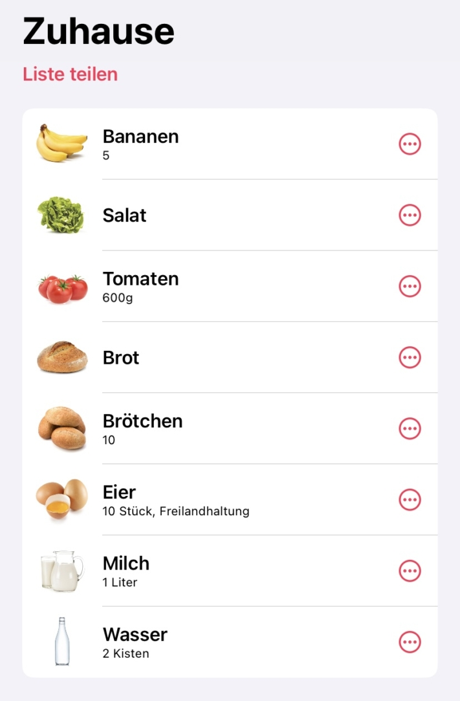

Dans le rythme effréné de la vie quotidienne, aller au supermarché peut devenir un véritable défi entre toutes les obligations professionnelles et privées. Les jours de stress, il n'est pas rare que l'on oublie également la liste de courses que l'on a péniblement établie à la maison. Mais ne vous inquiétez pas - une **liste de courses / application numérique** peut remédier efficacement à de telles situations.

Cependant, la question se pose de savoir quelle liste de courses/application numérique est le meilleur choix pour répondre à vos besoins individuels ? Dans cet article, nous jetons un regard plus approfondi sur sept applications prometteuses destinées à faciliter les achats.

Avec une bonne organisation, faire ses courses est sans stress.

## Pourquoi les listes d'achats sont-elles utiles ?

Il y a de bonnes raisons de faire des listes dans tous les domaines de la vie - c'est aussi le cas pour les courses. Une liste de courses soigneusement planifiée offre non seulement une structure organisationnelle, mais recèle également de nombreux avantages pour votre quotidien :

- **Économiser de l'argent**: Si vous planifiez exactement ce dont vous avez besoin avant de faire vos achats, et peut-être même si vous établissez un [plan hebdomadaire](https://seatable.io/fr/meal-prep-gesund-und-guenstig-essen-vorkochen/), vous pouvez économiser beaucoup d'argent. En effet, vous n'achèterez plus au hasard des articles qui vous sautent aux yeux, mais uniquement ce dont vous avez vraiment besoin.
- **Gagnez du temps**: Si vous planifiez vos achats à l'avance avec une liste de courses, vous aurez toujours sous la main tous les aliments dont vous avez besoin pour vos recettes préférées, sans rien oublier. Cela vous permet de gagner du temps, car les doubles trajets au supermarché appartiennent au passé.
- **Minimiser le gaspillage alimentaire**: Selon le [ministère fédéral de l'Alimentation et de l'Agriculture](https://www.bmel.de/DE/themen/ernaehrung/lebensmittelverschwendung/studie-lebensmittelabfaelle-deutschland.html), chaque consommateur jette environ 78 kilos de nourriture par an. Peut-être que vous aussi, vous jetez régulièrement des aliments parce qu'ils sont abîmés ou que leur date de péremption est dépassée. Si, à l'avenir, vous n'achetez que ce dont vous avez vraiment besoin, vous aurez aussi moins de choses à jeter. En planifiant judicieusement vos achats et [en stockant](https://seatable.io/fr/notvorrat-anlegen/) correctement, vous vous aidez donc non seulement vous-même, mais aussi l'environnement.

Les Allemands sont ceux qui jettent le plus souvent les fruits et les légumes.

## Aperçu des applications de listes d'achats

La question de savoir quelle liste de courses / application numérique est la bonne pour vous dépend de vos besoins. Nous avons établi des critères selon lesquels nous évaluerons les applications suivantes. Outre **la clarté** et **le design**, nous évaluerons également les **recettes intégrées**, les **offres actuelles** et les **fonctionnalités intelligentes**.

Dans toutes les applications testées, il est possible de créer plusieurs listes d'achats. Ces listes peuvent ensuite être facilement partagées avec les membres de la famille, les amis ou les colocataires.

### 1\. la liste d'achats

L'application Liste de courses est exactement ce qu'il faut pour ceux qui n'aiment pas taper sur leur smartphone. En effet, grâce à la **saisie vocale**, vous pouvez y énoncer simplement les produits dont vous avez besoin et éviter ainsi les erreurs de frappe agaçantes.

Que ce soit la gestion et le tri des **catégories d'aliments** ou les **recettes préférées** que vous pouvez facilement partager avec vos amis et collègues, cette application réunit de nombreuses fonctions importantes en une seule.

**Avantages**

- Bonne visibilité
- Design ordonné et esthétique
- Recettes intégrées
- Offres actuelles
- Recherche intelligente

**Inconvénients**

- Aucun inconvénient majeur

Voici à quoi ressemble "La liste des courses".

### 2\. apportez !

En plus de vous permettre de faire vos courses hebdomadaires de manière ordonnée, l'application Apporter apporte une touche de variété à votre diversité culinaire. De plus, elle vous rappelle d'essayer de nouvelles choses grâce à des suggestions et des inspirations. Elle indique par exemple les produits qui correspondent à la **saison actuelle** ou à **des actions** comme le Veganuary.

L'application permet également d'envoyer **des messages prédéfinis** aux colocataires avec lesquels vous avez partagé la liste de courses / l'application. Il s'agit notamment de "Je vais faire les courses ! Dernière chance pour les ajustements" ou "Message urgent. Va chercher du lait, s'il te plaît". Cette fonction suppose toutefois que toutes les personnes concernées aient activé une autorisation de communication dans les paramètres de leur smartphone.

**Avantages**

- Interface utilisateur claire
- Un design authentique
- Recettes intégrées
- Offres actuelles
- Tri intelligent

**Inconvénients**

- Aucun inconvénient majeur

L'application de liste de courses "Bring !

### 3ème Pon

Les férus de technologie vont adorer cette application, car elle réunit de nombreuses **fonctionnalités intelligentes**. Outre des indications telles que le lieu d'achat, le prix normal et le prix offert, vous pouvez également y régler des rappels de date limite de consommation après vous être inscrit.

En outre, non seulement les préférences et les habitudes de l'utilisateur sont **analysées**, mais aussi le moment où les articles sont à nouveau nécessaires. Vous pouvez également activer des notifications pour que l'application reconnaisse votre position et vous avertisse lorsque vous avez un produit sur votre liste de courses et que vous vous trouvez à proximité d'un supermarché approprié.

**Avantages**

- Trier par magasins d'achat
- Recettes intégrées
- Offres actuelles
- De nombreuses fonctions intelligentes

**Inconvénients**

- Pas d'icônes des produits

La liste d'achats en "pon

### 4\. ToBuy

Cette application est idéale pour tous les utilisateurs d'Apple Watch et les amateurs de mode sombre. Utilisez **des modèles** pour gagner du temps, surtout si vous achetez souvent les mêmes choses, ou ajoutez **des photos** à vos produits.

Si vous enregistrez vos **recettes** dans l'application, vous pourrez ajouter les ingrédients manquants à votre liste de courses la prochaine fois, presque sans effort.

**Avantages**

- Très bonne clarté
- Mode sombre
- Recettes intégrées
- Widget

**Inconvénients**

- Aucune offre
- Un nombre illimité de listes et de modèles est payant

L'application "ToBuy" en mode sombre

### 5\. WeNeed

Cette application est un peu moins sophistiquée que les autres. Si vous n'avez pas besoin de beaucoup de fioritures, mais que vous souhaitez vous concentrer sur la fonction principale, cette application de liste de courses est la bonne.

Ici, il est certes possible **de procéder à différents regrou** pements et **à des tris individuels** - mais les fonctionnalités intelligentes, les offres et les recettes font totalement défaut.

**Avantages**

- Présentation claire
- Images des produits

**Inconvénients**

- Pas de recettes
- Aucune offre
- Pas de fonctionnalités intelligentes

L'application "WeNeed

### 6\. applications de prise de notes en fonction du smartphone

Les applications intégrées au smartphone, telles que **Rappels**, **Samsung Notes** ou **Google Notes**, sont une option qui a fait ses preuves. Grâce à leur **utilisation intuitive** et parce qu'elles sont souvent utilisées pour d'autres notes, elles constituent une bonne option pour tous ceux qui aiment noter leurs listes de courses **sans complication**.

Les fonctions peuvent varier en fonction de la marque. Mais normalement, elles consistent en une liste que l'on peut **cocher** - généralement sans regroupement ni catégories.

**Avantages**

- Design minimaliste

**Inconvénients**

- Pas de recettes intégrées
- Aucune offre
- Pas de fonctionnalités intelligentes

L'application Notes comme liste de courses

### 7\. SeaTable

SeaTable propose un [modèle]() qui complète la liste de courses typique par de nombreuses autres fonctions. Vous pouvez non seulement **cocher** vos articles, mais aussi saisir **des recettes** et télécharger **des images**.

La liste d'achats numérique / l'application vous aide également à mieux contrôler les aspects financiers des achats. Vous pouvez par exemple attribuer les produits à certaines catégories ou à certains magasins et **saisir les prix**, qui sont ensuite additionnés par supermarché et par achat. À l'aide des **statistiques** intégrées, vous pouvez ainsi garder une vue d'ensemble claire de vos dépenses.

**Avantages**

- Trier par magasins d'achat
- Catégorisation par couleur
- Recettes intégrées
- Statistiques

**Inconvénients**

- Aucune offre

### Conclusion

En résumé, le choix de la bonne application de liste de courses dépend de vos préférences et de vos besoins. Bien que chacune des applications testées ait ses propres forces et faiblesses, elles ont toutes un point commun : elles facilitent votre quotidien et contribuent à réduire le stress lié aux achats.
