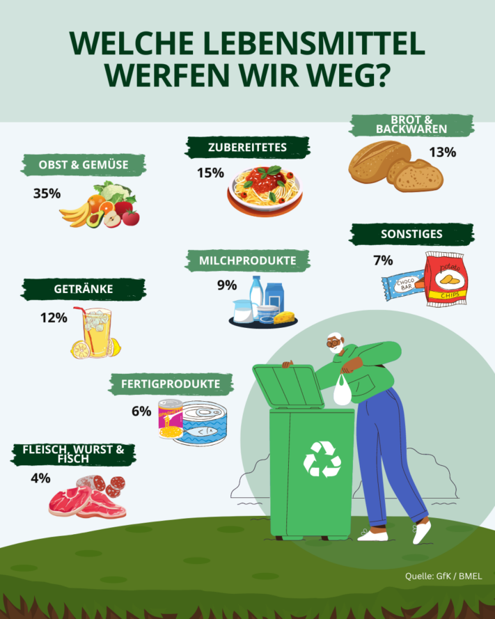
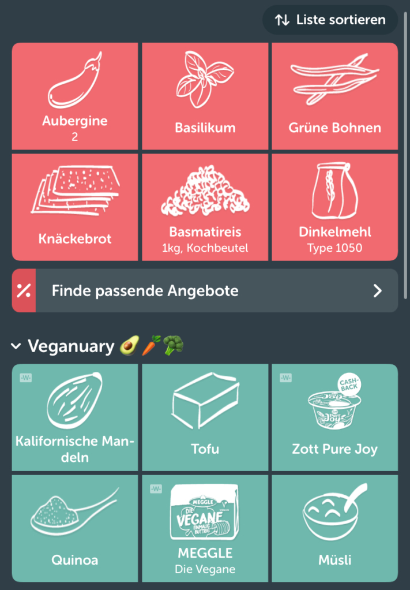
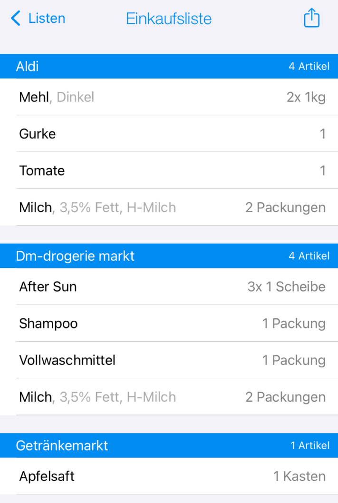
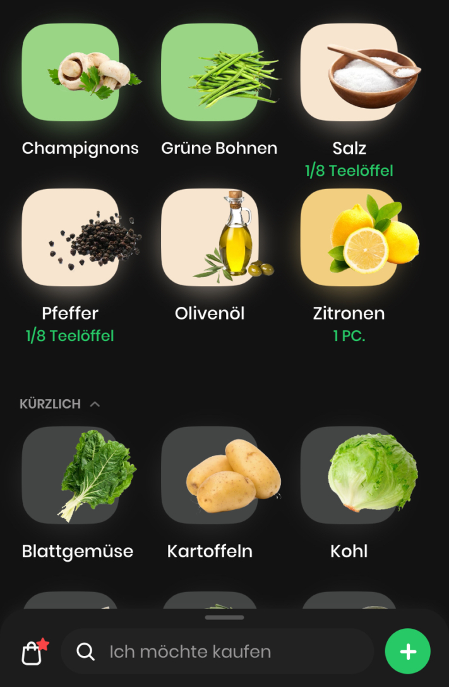
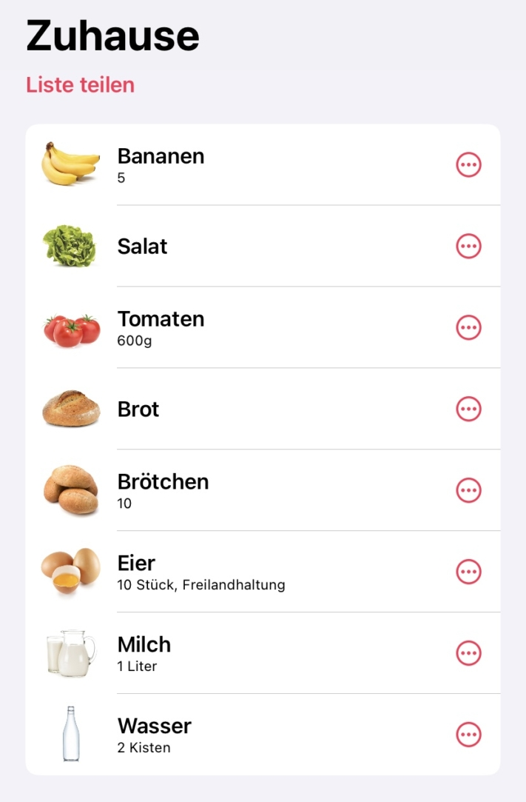

Na vida quotidiana agitada, ir ao supermercado pode tornar-se um verdadeiro desafio entre todos os compromissos profissionais e privados. Em dias de stress, não é raro esquecer a lista de compras que foi cuidadosamente criada em casa. Mas não se preocupe - uma **lista de compras digital/aplicação** pode ser um remédio eficaz nessas situações.

No entanto, a questão mantém-se: que lista de compras digital/aplicação é a melhor escolha para satisfazer as suas necessidades individuais? Neste artigo, analisamos em pormenor sete aplicações promissoras concebidas para facilitar as compras.

Com a organização certa, as compras são livres de stress.

## Porque é que as listas de compras fazem sentido

Há boas razões para manter listas em todas as áreas da vida - e as compras não são exceção. Uma lista de compras cuidadosamente planeada não só proporciona uma estrutura organizacional, como também tem inúmeras vantagens para a sua vida quotidiana:

- Poupar **dinheiro**: Se planear exatamente o que precisa antes de ir às compras e talvez até elaborar um [plano semanal](https://seatable.io/pt/meal-prep-gesund-und-guenstig-essen-vorkochen/), pode poupar muito dinheiro. Isto significa que já não compra artigos aleatórios que lhe chamam a atenção, mas apenas aquilo de que realmente precisa.
- Poupar **tempo**: Se planear as suas compras antecipadamente com uma lista de compras, terá sempre à mão todos os alimentos necessários para as suas receitas favoritas, sem se esquecer de nada. Isto poupa-lhe muito tempo, porque as idas duplas ao supermercado são uma coisa do passado.
- **Minimizar o desperdício de alimentos**: De acordo com o [Ministério Federal da Alimentação e Agricultura](https://www.bmel.de/DE/themen/ernaehrung/lebensmittelverschwendung/studie-lebensmittelabfaelle-deutschland.html), cada consumidor deita fora cerca de 78 quilos de alimentos por ano. Talvez também deite fora regularmente alimentos estragados ou fora do prazo de validade. Se, no futuro, comprar apenas o que realmente precisa, também terá de deitar menos fora. Ao planear as suas compras de forma sensata e ao [abastecer-se](https://seatable.io/pt/notvorrat-anlegen/) adequadamente, não só está a ajudar-se a si próprio, como também ao ambiente.

Os alemães são os que mais deitam fora fruta e legumes.

## Aplicações de listas de compras em resumo

A questão de saber qual a lista de compras digital / aplicação mais adequada para si depende das suas necessidades. Estabelecemos critérios de acordo com os quais avaliamos as seguintes aplicações. Para além da **clareza** e do **design**, também avaliaremos **as receitas integradas**, as **ofertas actuais** e **as funcionalidades inteligentes**.

Todas as aplicações testadas permitem criar várias listas de compras. Estas listas podem ser facilmente partilhadas com familiares, amigos ou colegas de casa.

### 1\. a lista de compras

A aplicação de lista de compras é perfeita para quem não gosta de escrever no smartphone. Graças à função de **introdução de voz**, pode simplesmente dizer os produtos de que necessita e evitar erros de escrita irritantes.

Quer se trate de gerir e ordenar **categorias de alimentos** ou das suas **receitas favoritas**, que pode facilmente partilhar com amigos e colegas - esta aplicação combina muitas funções importantes numa só.

**Vantagens**

- Boa clareza
- Design limpo e estético
- Receitas integradas
- Ofertas actuais
- Pesquisa inteligente

**Desvantagens**

- Não há desvantagens relevantes disponíveis

Este é o aspeto da "lista de compras".

### 2\. trazer!

Para além de organizar as suas compras semanais, a aplicação Bring também acrescenta uma pitada de variedade à sua diversidade culinária. Também o lembra de experimentar coisas novas com sugestões e inspiração. Por exemplo, apresenta produtos que correspondem à **estação atual** ou a **promoções** como a Veganuary.

Na aplicação, também pode enviar **mensagens predefinidas** aos colegas de casa com quem partilhou a lista de compras/aplicação. Estas mensagens incluem "Vou às compras! Última oportunidade para ajustes." ou "Notícias de última hora. Por favor, tragam leite!". No entanto, esta função requer que todas as partes envolvidas tenham ativado a autorização de notificação nas definições do seu smartphone.

**Vantagens**

- Interface de utilizador clara
- Design autêntico
- Receitas integradas
- Ofertas actuais
- Triagem inteligente

**Desvantagens**

- Não há desvantagens relevantes disponíveis

A aplicação de lista de compras "Traz!"

### 3\. pon

Os fanáticos por tecnologia vão adorar esta aplicação, uma vez que combina muitas **funcionalidades inteligentes**. Para além de pormenores como o local de compra, o preço normal e o preço de oferta especial, também pode definir lembretes de "melhor antes" depois de iniciar sessão.

Além disso, são **analisadas** não só as preferências e os hábitos do utilizador, mas também a altura em que os artigos são novamente necessários. Também é possível ativar notificações para que a aplicação reconheça a sua localização e o notifique quando tiver um produto na sua lista de compras e estiver perto de um supermercado adequado.

**Vantagens**

- Ordenar por lojas
- Receitas integradas
- Ofertas actuais
- Muitas funções inteligentes

**Desvantagens**

- Ausência de ícones dos produtos

A lista de compras em "pon"

### 4\. toBuy

Esta aplicação é ideal para todos os utilizadores do Apple Watch e amantes da moda negra. Utilize **modelos** para poupar tempo, especialmente se compra frequentemente as mesmas coisas, ou adicione **fotografias** aos seus produtos.

Se guardar as suas **receitas** na aplicação, pode adicionar os ingredientes em falta à sua lista de compras da próxima vez quase sem esforço.

**Vantagens**

- Muito boa nitidez
- Modo escuro
- Receitas integradas
- Widget

**Desvantagens**

- Sem ofertas
- O número ilimitado de listas e modelos está sujeito a um custo

A aplicação "ToBuy" em modo escuro

### 5\. weNeed

Em comparação, esta aplicação é um pouco mais simples do que as outras. Por isso, se não precisa de muitos sinos e assobios, mas quer concentrar-se na função principal, esta aplicação de lista de compras é a escolha certa.

Embora aqui sejam possíveis **vários agrupamentos** e **ordenações personalizadas**, as funcionalidades inteligentes, as ofertas e as receitas estão completamente ausentes.

**Vantagens**

- Apresentação clara
- Imagens do produto

**Desvantagens**

- Sem receitas
- Sem ofertas
- Sem funcionalidades inteligentes

A aplicação "WeNeed

### 6\. aplicações para tomar notas, consoante o smartphone

Uma opção testada e comprovada são as aplicações integradas no smartphone, como o **Reminders**, o **Samsung Notes** ou o **Google Notes**. Graças à sua **utilização intuitiva** e ao facto de serem frequentemente utilizadas para outras notas, são uma boa opção para quem gosta de registar as suas listas de compras de uma **forma descomplicada**.

As funções aqui podem variar consoante a marca. No entanto, consistem geralmente numa lista que pode ser **assinalada** - normalmente sem agrupamento ou categorias.

**Vantagens**

- Design minimalista

**Desvantagens**

- Sem receitas integradas
- Sem ofertas
- Sem funcionalidades inteligentes

A aplicação de notas como uma lista de compras

### 7 SeaTable

O SeaTable oferece um [modelo](https://seatable.io/pt/vorlage/rw6cogmdrjyl-j0w3sjraw/) que complementa a típica lista de compras com muitas outras funções. Aqui pode não só **assinalar** os seus artigos, mas também introduzir **receitas** e carregar **fotografias**.

A lista de compras digital / aplicação também o ajuda a controlar melhor os aspectos financeiros das suas compras. Por exemplo, pode atribuir produtos a categorias ou lojas específicas e **registar os preços**, que são somados para cada supermercado e compra. Com a ajuda das **estatísticas** integradas, pode ter uma visão clara das suas despesas.

**Vantagens**

- Ordenar por lojas
- Categorização de cores
- Receitas integradas
- Estatísticas

**Desvantagens**

- Sem ofertas

### Conclusão

Em suma, a escolha da aplicação de lista de compras correcta depende das suas preferências e necessidades. Embora cada uma das aplicações testadas tenha os seus próprios pontos fortes e fracos, todas têm uma coisa em comum - facilitam o seu quotidiano e contribuem para fazer compras sem stress.
