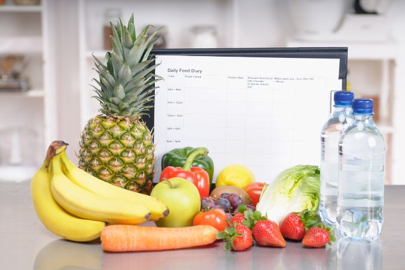

## What are the benefits of a food diary?

We often consume food unconsciously or eat a snack in a hurry. However, how our body processes food depends heavily on when and in what situations we eat it. We may tolerate a chocolate bar at our desk at lunchtime better than one we eat while rushing to the bus stop in the afternoon.

A food log is an effective way of **reflecting on your eating habits** and becoming aware of how your body reacts to food and drink. By regularly noting down what you eat and how much of it and when, you will not only be better able to recognize a possible **food intolerance**. You also get a clear overview of how much you consume and what influence the respective eating situation has on your well-being. This allows you to take targeted measures, e.g. to lose weight. The most important reasons for keeping a food log are

* Increase awareness of nutrition and eating habits

* Recognize food intolerances or allergies

* Reduce weight

## How do you keep a food diary properly?

How you keep your food diary ultimately depends to a certain extent on your personal goals. In any case, consistently enter every meal every day – preferably immediately after eating so that nothing is forgotten. Keep your food log as detailed as possible and also include **relevant additional information about the eating situation**. Your log is more than just a meal diary in which you record what you have eaten. The actual informative value comes from the combination of food, quantity and eating situation.

For example: you notice that you regularly experience discomfort after eating a banana. This could be an indication of histamine intolerance. However, if you also record the eating situation and notice that you always eat the banana quickly in the morning on the way to the bus, you should first test whether the symptoms also occur in other eating situations.

### Important questions in a food diary

**What do you eat?** Write down all the ingredients, including the spices, and how the food was prepared. This is the food diary part of your food log. So be as precise as possible here, even with ready-bought food.

**How much do you eat?** The portion size can provide information about your nutrient and calorie intake. If you are trying to lose weight, also record the calories and the amount of fat and carbohydrates in your food. If in doubt, feel free to estimate.

**How much liquid do you drink? And what do you drink?** People often forget to include drinks in a food diary. However, our physical well-being and digestion also depend on our fluid intake.

**When do you eat?** Write down the exact time. This will help you to identify unhealthy habits later on.

**How do you eat?** Is it a stressful day at work or are you relaxed? Can you eat in peace or are you pressed for time? Do you eat sitting down or walking?

**Where do you eat?** Whether you eat at home, in the canteen or in a restaurant can have an influence on your well-being.

**Do you experience discomfort after eating?** Usually our digestion starts 15 minutes after eating. If you experience discomfort then, make a note of the type and intensity.

**Are you taking medication?** Note the medication and the amount. If you suspect a connection between taking medication and discomfort after eating, contact a doctor as soon as possible.

**Tip:** If you keep a **food diary for children**, design it creatively and as playfully as possible; some entries can also be kept as pictures. You can also keep a diary for yourself and make it a regular routine to keep the logs together.

## Digital food diary vs. analog

Whether you keep a digital food diary or prefer to record your diet in traditional paper form is initially a matter of taste. The decisive factor is what you feel more comfortable with and which form is easier and more convenient for you. After all, in order to gain reliable insights, you need to stay on the ball and (want to) keep your diary for several days or weeks.

However, keeping your food diary online has advantages that will make your work easier afterwards. For example, a **digital food diary** is easier to filter for specific foods or contexts and **makes analysis** much easier. Another advantage of keeping your food diary online is that you can easily share it with other people, e.g. your doctor.

## How long should you keep a food diary?

You will only recognize meaningful patterns and eating habits if you maintain your food diary in a disciplined manner over several days. Therefore, think carefully in advance about what you want to achieve. It is best to log your eating habits for two to four weeks to get as detailed a picture as possible, **one week is the absolute minimum period** to record all days of the week and typical eating situations at least once.

The situation is different if a doctor has ordered you to keep a food diary. In this case, it is important to actually keep it for as long as prescribed.

## Analyze the food diary and break unhealthy eating patterns

Regardless of why and for how long you have kept your diary, the final step is to evaluate it. This is the only way to make positive changes for the future. Important: If a doctor or nutritionist has recommended a food diary, it is best to evaluate it together.

### Check existing assumptions

If your goal is to eat healthier or more consciously, then it is best to start your evaluation by reviewing your previous assumptions. For example, you may have thought you were drinking two liters a day or only eating sweets occasionally. Compare your assumptions with the protocol. In the next step, you can evaluate the correlations between food, eating habits and complaints. A digital food diary in which you can cluster your entries will make your work much easier. For example, cluster according to complaints that occur after eating. Are the complaints always the same and do you recognize a connection between complaints and certain foods or eating habits?

### Change your habits slowly

To check your results, you can then change your habits and keep a log of your diet for another week or two. **But don't make too many changes at once** – it's better to change just one or two things at a time to see results more quickly and stay motivated.

**Please note**: If you suspect a food intolerance based on your protocol, you should **see a doctor promptly**. This is because while some intolerances only cause discomfort or nausea, others can lead to further complications that require medical attention.

## Your food diary - template

SeaTable's free food diary template helps you identify food intolerances or allergies and change unhealthy behaviors. You keep your food diary online **in the cloud** and can access it at any time and from anywhere. Particularly practical: you can create new entries via a web form and evaluate your entries directly in the [Universal App](). The integrated, searchable overview of food intolerances provides you with an overview of which intolerances are associated with which foods and symptoms at a glance.





## Nutrition app - only partially useful?

There are plenty of nutrition apps available today. However, they are generally only of limited use as a fully-fledged food diary. This is because most apps only let you count calories and log your exercise, which is only of limited help if you want to lose weight, and at best only has an effect as a motivational aid. However, these apps are of no help at all in identifying unhealthy eating habits or intolerances. Other programs that offer these functions are usually no longer free of charge and often only offer limited evaluation options. **With the free food diary template from SeaTable, you get a fully-fledged food diary with all the advantages of an app**.

## Conclusion: Using a food diary successfully

A detailed, honest food diary is the ideal companion if you want to change your diet or eat more consciously. However, there are a few basic rules to follow to make this a success:

* be clear about your goals

* record every meal, the eating situation and your well-being honestly and in detail

* keep the diary for at least seven to 14 days

* evaluate the data and then review your findings

With SeaTable's digital food diary template, it's easy to create an intuitive, informative diary about your diet. Not only do you get an overview of your diet, but you also gain a clear picture of your eating habits and their impact on your well-being.

## FAQ - Nutrition diary


With a food diary, you can record your eating habits and easily recognize unhealthy eating habits or possible food allergies or intolerances.



A digital food diary is not only available at any time, but also makes your work easier. You can usually filter and search through your entries, which is not possible with analog diaries. Tools such as SeaTable also allow you to cluster your entries, making it easier to recognize correlations. Another advantage of a digital tool is that you can share it with doctors or therapists, for example, and work with them.



In principle, a food diary can be just as helpful for children as it is for adults. However, it can be helpful to approach the topic in a playful way. For example, you can make the diary colorful or work with pictures instead of text entries.
