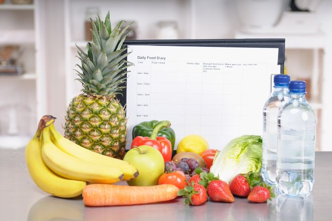
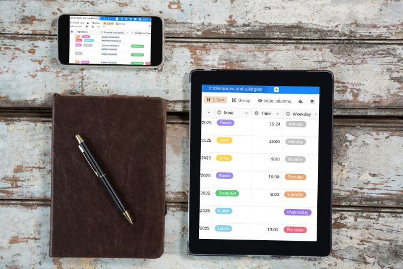

## Quais são os benefícios de um diário alimentar?

Muitas vezes consumimos alimentos inconscientemente ou comemos um lanche à pressa. No entanto, a forma como o nosso corpo processa os alimentos depende muito de quando e em que situações os ingerimos. Podemos tolerar melhor uma barra de chocolate na nossa secretária à hora do almoço do que uma que comemos enquanto corremos para a paragem do autocarro à tarde.

Um registo alimentar é uma forma eficaz de **refletir sobre os seus hábitos alimentares** e de tomar consciência da forma como o seu corpo reage à comida e à bebida. Ao anotar regularmente o que come, quanto come e quando come, não só estará mais apto a reconhecer uma possível **intolerância alimentar**. Terá também uma visão clara da quantidade que consome e da influência que a respectiva situação alimentar tem no seu bem-estar. Isto permite-lhe tomar medidas específicas, por exemplo, para perder peso. As razões mais importantes para manter um registo alimentar são

* Aumentar a consciencialização sobre a nutrição e os hábitos alimentares

* Reconhecer intolerâncias ou alergias alimentares

* Reduzir o peso

## Como é que mantém um diário alimentar corretamente?

A forma como mantém o seu diário alimentar depende, em última análise, dos seus objectivos pessoais. Em todo o caso, registe sistematicamente todas as refeições, todos os dias - de preferência imediatamente após comer, para que nada seja esquecido. Mantenha o seu registo alimentar o mais detalhado possível e inclua também **informações adicionais relevantes sobre a situação alimentar**. O seu registo é mais do que um simples diário de refeições, no qual regista o que comeu. O valor informativo real provém da combinação de alimentos, quantidade e situação alimentar.

Por exemplo: repara que sente regularmente desconforto depois de comer uma banana. Isto pode ser uma indicação de intolerância à histamina. No entanto, se também registar a situação alimentar e verificar que come sempre a banana rapidamente de manhã, a caminho do autocarro, deve primeiro testar se os sintomas também ocorrem noutras situações alimentares.

### Perguntas importantes num diário alimentar

**O que come?** Escreva todos os ingredientes, incluindo as especiarias, e a forma como a comida foi preparada. Esta é a parte do diário alimentar do seu registo alimentar. Por isso, seja o mais exato possível, mesmo quando se trata de alimentos já preparados.

**Quanto é que come?** O tamanho da porção pode fornecer informações sobre a sua ingestão de nutrientes e calorias. Se está a tentar perder peso, registe também as calorias e a quantidade de gorduras e hidratos de carbono da sua alimentação. Em caso de dúvida, sinta-se à vontade para fazer uma estimativa.

**Que quantidade de líquidos bebe? E o que é que bebe?** É frequente as pessoas esquecerem-se de incluir as bebidas num diário alimentar. No entanto, o nosso bem-estar físico e a nossa digestão também dependem da ingestão de líquidos.

**Quando come?** Anote a hora exacta. Isto ajudá-lo-á a identificar hábitos pouco saudáveis mais tarde.

**Como come?** É um dia stressante no trabalho ou está relaxado? Consegue comer em paz ou tem pouco tempo? Come sentado ou a andar?

**Onde come?** O facto de comer em casa, na cantina ou num restaurante pode ter influência no seu bem-estar.

**Sente desconforto depois de comer?** Normalmente, a nossa digestão começa 15 minutos depois de comer. Se sentir desconforto nessa altura, anote o tipo e a intensidade.

**Está a tomar medicamentos?** Anote os medicamentos e a quantidade. Se suspeitar de uma relação entre a toma de medicamentos e o desconforto depois de comer, contacte um médico o mais rapidamente possível.

**Dica:** Se tiver um **diário alimentar para crianças**, desenhe-o de forma criativa e o mais lúdica possível; algumas entradas também podem ser mantidas como imagens. Também pode manter um diário para si e fazer com que seja uma rotina regular manter os registos juntos.

## Diário alimentar digital vs. analógico

Se mantém um diário alimentar digital ou se prefere registar a sua dieta no formato tradicional em papel, é inicialmente uma questão de gosto. O fator decisivo é saber com o que se sente mais confortável e qual a forma mais fácil e conveniente para si. Afinal de contas, para obter informações fiáveis, tem de se manter atento e (querer) manter o seu diário durante vários dias ou semanas.

No entanto, manter o seu diário alimentar online tem vantagens que facilitarão o seu trabalho mais tarde. Por exemplo, um **diário alimentar digital** é mais fácil de filtrar por alimentos ou contextos específicos e **facilita muito a análise**. Outra vantagem de manter o seu diário alimentar online é que pode facilmente partilhá-lo com outras pessoas, por exemplo, com o seu médico.

## Durante quanto tempo deve manter um diário alimentar?

Só conseguirá reconhecer padrões e hábitos alimentares significativos se mantiver o seu diário alimentar de uma forma disciplinada durante vários dias. Por isso, pense cuidadosamente com antecedência sobre o que pretende alcançar. É melhor registar os seus hábitos alimentares durante duas a quatro semanas para obter uma imagem o mais detalhada possível, **uma semana é o período mínimo absoluto** para registar todos os dias da semana e situações alimentares típicas pelo menos uma vez.

A situação é diferente se um médico lhe tiver ordenado que mantenha um diário alimentar. Neste caso, é importante que o mantenha durante o tempo prescrito.

## Analise o diário alimentar e quebre os padrões alimentares pouco saudáveis

Independentemente da razão e do período de tempo durante o qual manteve o seu diário alimentar, o passo final é avaliá-lo. Esta é a única forma de fazer mudanças positivas para o futuro. Importante: Se um médico ou nutricionista lhe recomendou um diário alimentar, é melhor avaliá-lo em conjunto.

### Verifique os pressupostos existentes

Se o seu objetivo é comer de forma mais saudável ou mais consciente, então é melhor começar a sua avaliação revendo os seus pressupostos anteriores. Por exemplo, pode ter pensado que estava a beber dois litros por dia ou que só comia doces ocasionalmente. Compare os seus pressupostos com o protocolo. Na etapa seguinte, pode avaliar as correlações entre a alimentação, os hábitos alimentares e as queixas. Um diário alimentar digital, no qual pode agrupar as suas entradas, facilitará muito o seu trabalho. Por exemplo, agrupe de acordo com as queixas que ocorrem depois de comer. As queixas são sempre as mesmas e reconhece uma ligação entre as queixas e determinados alimentos ou hábitos alimentares?

### Mude os seus hábitos lentamente

Para verificar os seus resultados, pode então alterar os seus hábitos e manter um registo da sua dieta durante mais uma ou duas semanas. **Mas não faça muitas mudanças de uma só vez** - é melhor mudar apenas uma ou duas coisas de cada vez para ver os resultados mais rapidamente e manter-se motivado.

**Tenha em atenção**: Se suspeitar de uma intolerância alimentar com base no seu protocolo, deve **consultar um médico imediatamente**. Isto porque enquanto algumas intolerâncias apenas causam desconforto ou náuseas, outras podem levar a complicações adicionais que requerem atenção médica.

## O seu diário alimentar - modelo

O modelo de diário alimentar gratuito da SeaTable ajuda-o a identificar intolerâncias ou alergias alimentares e a alterar comportamentos pouco saudáveis. Mantém o seu diário alimentar online **na nuvem** e pode aceder-lhe a qualquer momento e em qualquer lugar. Particularmente prático: pode criar novas entradas através de um formulário web e avaliar as suas entradas diretamente na [Aplicação universal](). A visão geral integrada e pesquisável das intolerâncias alimentares fornece-lhe uma visão geral de quais intolerâncias estão associadas a quais alimentos e sintomas num piscar de olhos.





## Aplicação de nutrição - apenas parcialmente útil?

Existem muitas aplicações de nutrição disponíveis atualmente. No entanto, geralmente têm uma utilidade limitada como diário alimentar completo. Isto porque a maioria das aplicações apenas lhe permite contar calorias e registar o seu exercício físico, o que é de ajuda limitada se quiser perder peso e, na melhor das hipóteses, apenas tem um efeito como ajuda motivacional. No entanto, estas aplicações não ajudam em nada a identificar hábitos alimentares pouco saudáveis ou intolerâncias. Outros programas que oferecem estas funções já não são normalmente gratuitos e muitas vezes oferecem apenas opções de avaliação limitadas. **Com o modelo de diário alimentar gratuito da SeaTable, obtém um diário alimentar completo com todas as vantagens de uma aplicação**.

## Conclusão: Utilizar um diário alimentar com sucesso

Um diário alimentar detalhado e honesto é o companheiro ideal se quiser mudar a sua dieta ou comer de forma mais consciente. No entanto, existem algumas regras básicas a seguir para que seja um sucesso:

* Seja claro quanto aos seus objectivos

* Registe cada refeição, a situação alimentar e o seu bem-estar de forma honesta e detalhada

* mantenha o diário durante pelo menos sete a 14 dias

* avalie os dados e depois reveja as suas conclusões

Com o modelo de diário alimentar digital da SeaTable, é fácil criar um diário intuitivo e informativo sobre a sua dieta. Não só obtém uma visão geral da sua dieta, como também obtém uma imagem clara dos seus hábitos alimentares e do seu impacto no seu bem-estar.

## FAQ - Diário de nutrição


Com um diário alimentar, pode registar os seus hábitos alimentares e reconhecer facilmente hábitos alimentares pouco saudáveis ou possíveis alergias ou intolerâncias alimentares.



Um diário alimentar digital não só está disponível em qualquer altura, como também facilita o seu trabalho. Normalmente, pode filtrar e pesquisar os seus registos, o que não é possível com os diários analógicos. Ferramentas como o SeaTable também lhe permitem agrupar os seus registos, facilitando o reconhecimento de correlações. Outra vantagem de uma ferramenta digital é que pode partilhá-la com médicos ou terapeutas, por exemplo, e trabalhar com eles.



Em princípio, um diário alimentar pode ser tão útil para as crianças como para os adultos. No entanto, pode ser útil abordar o tema de uma forma lúdica. Por exemplo, pode tornar o diário colorido ou trabalhar com imagens em vez de entradas de texto.
