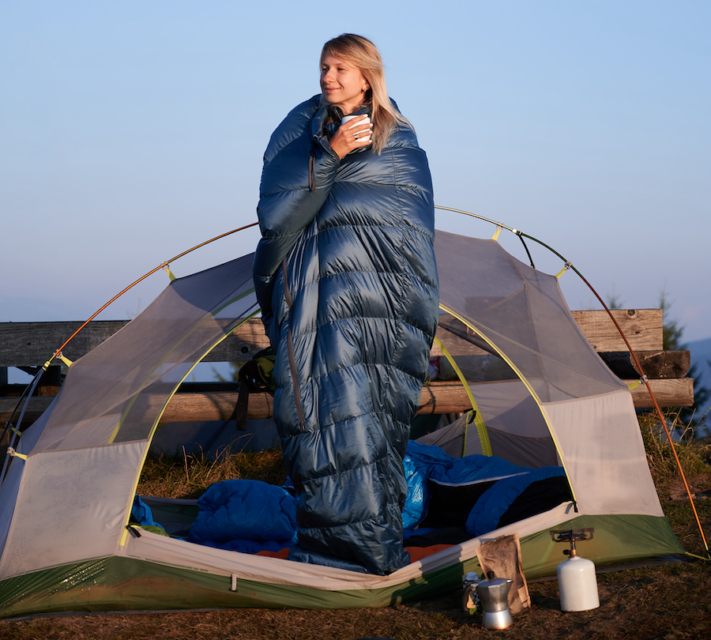

Wenn die Festivalsaison beginnt und die Vorfreude auf gute Musik und gemeinsame Erlebnisse mit Freunden steigt, ist es wieder an der Zeit, das Gepäck zu schnüren. Damit Ihr Festivalbesuch reibungslos verläuft und nicht von Problemen und Ärgernissen überschattet wird, ist eine **gründliche Vorbereitung** entscheidend.

Egal, ob Sie sich für das legendäre [Wacken](https://www.wacken.com/de/), das mitreißende [Rock am Ring](https://www.rock-am-ring.com) oder das energiegeladene [Hurricane](https://hurricane.de/de/) Festival rüsten – einige Must-haves sind auf jeder Festival Packliste Pflicht.

Festivals bringen Menschen zusammen und fördern das Gemeinschaftsgefühl.

## Die Festival Packliste

Damit Sie alles auf einen Blick finden, ist die Festival Packliste in sechs übersichtliche Kategorien gegliedert. Zunächst werden die Essentials aufgeführt, die keinesfalls fehlen dürfen. Anschließend folgen die Camping-Ausrüstung, Verpflegungsgegenstände, Kleidung, Hygieneartikel und Arzneimittel sowie weitere Artikel, welche keiner Kategorie zugeordnet werden konnten.

### Essentials

Festivals ermöglichen den Zugang zu einem vielfältigen Musikprogramm.

Das Wichtigste für ein Festival ist selbstverständlich das **Festivalticket**. Deshalb sollten Sie, insbesondere wenn Sie eine lange Anreise haben, unbedingt sicherstellen, dass das Ticket auch wirklich dabei ist. Ebenso sollten Sie immer Ihren **Ausweis**, Ihre **Krankenkarte** und **Bargeld** mit sich führen.

Dinge, auf die Sie verzichten können oder die besonders teuer sind, sollten Sie jedoch zuhause lassen, da sich unter der Masse an Unbekannten üblicherweise auch einige Diebe tummeln. Gute **Ohrstöpsel** sind ein Segen für Geräuschempfindliche oder Nachteulen, die morgens gerne lange und in absoluter Stille schlafen möchten.

Abstandshalter

- Festivalticket
- Bargeld
- Ausweis
- Krankenversicherungskarte
- Ohrstöpsel

Abstandshalter

- Handy und Ladekabel
- Powerbank
- Sonnenbrille
- Kopfbedeckung
- kleiner Rucksack oder Bauchtasche

### Camping

Inmitten der lauten Umgebung sind die Nächte oft kurz.

Wenn Sie zum ersten Mal ein Festival besuchen und Ihre Camping-Ausstattung neu anschaffen müssen, sollten Sie sicherstellen, dass Ihr Zelt **ausreichend Platz** bietet, um all Ihre Sachen unterzubringen. Falls Sie bereits ein Zelt besitzen, überprüfen Sie vor der Abfahrt unbedingt, ob **genug Heringe** vorhanden sind und das Zelt **vollständig** ist. Denn es wäre ärgerlich, wenn Ihnen vor Ort eine Zeltstange fehlen würde.

Ein weiterer wichtiger Punkt auf Ihrer Festival Packliste ist ein **Pavillon**, da Sie bei stundenlangem Sonnenschein ansonsten schnell einen Sonnenstich bekommen können. Ein Pavillon bietet nicht nur Schutz vor der Sonne, sondern auch vor unangenehmen Wetterbedingungen. Da Sie viel Zeit im Camping-Stuhl verbringen werden, ist es zudem wichtig, dass dieser **bequem** und von **guter Qualität** ist.

Abstandshalter

- Zelt
- Isomatte oder Luftmatratze
- Schlafsack
- Kissen
- Camping-Tisch

Abstandshalter

- Camping-Stuhl
- Pavillon
- Lampe oder Lichterkette
- Heringe
- (Gummi-)Hammer

### Verpflegung

Auf einem Festival benötigt man besonders viel Energie.

Manche Festivals bieten ihren Besuchern kleine **Supermärkte auf dem Gelände** an. Informieren Sie sich im Voraus darüber, denn so müssen Sie nicht alles an Essen und Getränken von Anfang an dabei haben.

Ansonsten ist der Klassiker auf jeder Festival Packliste wohl Essen in **Konservendosen**. Falls Ihnen das zu eintönig ist, können Sie auch auf **Selbstgekochtes**, **Brot** oder **frisches Obst** wie Bananen oder Äpfel zurückgreifen. Wichtig ist hierbei, nur Lebensmittel mitzunehmen, die Hitze und Sonneneinstrahlung standhalten können. Vor allem **vegane Brotaufstriche**, **Müsliriegel** und **Nüsse** bieten sich hier an.

Abstandshalter

- Campingkocher
- Plastikgeschirr
- Topf oder Pfanne
- Kühlbox
- Spülmittel und -schwamm

Abstandshalter

- Geschirrtuch
- Küchenrolle
- Dosen- und Flaschenöffner
- Essen
- Wasser und Getränke

### Kleidung

Die richtige Kleidung ist die, in der Sie sich wohlfühlen.

Obwohl sonniges **Wetter** vorhergesagt wurde, kann es plötzlich zu Regen kommen. Das Wetter ist nicht immer zuverlässig vorhersehbar, daher ist es wichtig, auf alle Eventualitäten vorbereitet zu sein. Stellen Sie sicher, dass sowohl Kleidung für sonnige und heiße Tage als auch für regnerische Tage auf Ihrer Festival Packliste steht.

Auf dem Festivalgelände kann es schnell **matschig** oder **staubig** werden, was auch Ihre Kleidung beeinträchtigen kann. Vermeiden Sie daher helle Schuhe oder Kleidungsstücke, wenn Sie sich nicht ständig umziehen möchten. Auffällige Kleidungsstücke wie **Kostüme**, **Kopfschmuck** und viel **Glitzer** sind auf Festivals oft sehr beliebt und gern gesehen.

Abstandshalter

- Kurze und lange Hosen
- T-Shirts
- Pullover oder Jacke
- Regenjacke oder -poncho
- Pyjama

Abstandshalter

- Socken und Unterwäsche
- Bequeme Schuhe
- Badeschlappen
- Gummistiefel
- Badesachen

### Hygiene & Arznei

Die Hygienesituation auf Festivals ist häufig nicht besonders komfortabel.

Für jegliche Hygieneartikel auf Ihrer Festival Packliste gilt grundsätzlich: **Reisegrößen** sind platzsparend und daher optimal. Eigenes **Toilettenpapier** mitzubringen erweist sich oft als lebensrettend, da es bei so vielen Festivalbesuchern in den Dixi-Toiletten oft Mangelware ist.

Hygiene auf dem Zeltplatz zu wahren, kann eine Herausforderung sein. Daher lohnt es sich immer, **Desinfektionsmittel** dabei zu haben, um die Hände ohne einen langen Marsch zu waschen.

Generell sind die Wege auf einem Festival vom Zelt bis zur Stage oft lang. Deshalb sind **Blasenpflaster** ein absolutes Must-have, um auch mehrere Tage Festivalerfahrung schmerzfrei genießen zu können.

Abstandshalter

- Haarbürste oder Kamm
- Deo, Shampoo und Duschgel
- Zahnpasta und -bürste
- Rasierer
- Handtuch
- Toilettenpapier, Taschen- und Feuchttücher

Abstandshalter

- Sonnen- und Insektenschutz
- Damen-Hygieneartikel
- Verhütungsmittel
- Elektrolyte und Schmerzmittel
- Desinfektionsmittel
- (Blasen-)Pflaster

### Sonstiges

Zum Zeitvertreib werden auf dem Zeltplatz Spiele gespielt.

**Müllsäcke** sind nicht nur nützlich, um Ihr Camp sauber zu halten, sondern auch um leere Pfandflaschen zu sammeln oder bei Regen als Schutz vor Nässe zu dienen. Ein oft auf Festivals genutzter Retter in der Not ist außerdem das **Panzertape**, das sich als nützlich erweist, wenn Reparaturen an Zelt, Kleidung oder anderen Gegenständen erforderlich sind.

Da die Wege vom Parkplatz bis zum Zeltplatz oft lang sind, ist es sinnvoll, im Voraus zu überlegen, wie man das gesamte Equipment am besten transportiert. Viele Festivalbesucher sind hier in ihren **Transportmitteln** besonders kreativ – von Bollerwagen über Schubkarren bis hin zu Mülltonnen ist alles möglich, was Zeit und Energie spart.

Abstandshalter

- Müllsäcke
- Panzertape
- Bluetooth-Lautsprecher
- Zubehör für Trinkspiele

Abstandshalter

- Transportmittel
- Aschenbecher für Raucher
- Abschleppseil bei Matschgefahr

## Weitere Festival Tipps

Bei der Vorbereitung auf ein Festival ist neben einer wohlüberlegten Festival Packliste auch die Berücksichtigung weiterer Tipps von großer Bedeutung. Es lohnt sich, frühzeitig am Veranstaltungsort anzukommen, um einen **guten Platz** für Ihr Zelt zu ergattern und lange Laufwege oder die Nähe zu geruchsintensiven Dixi-Toiletten zu vermeiden.

Zudem ist es sinnvoll, sich **mit Freunden abzusprechen**, um zu vermeiden, dass Sie bestimmte Dinge doppelt mitbringen. Vor allem sollten Sie im Voraus planen, welche Acts Sie sehen möchten, um nichts zu verpassen und alle Prioritäten zu berücksichtigen – oft nimmt man sich doch mehr vor, als man letztendlich schaffen kann.

Im Vorfeld ist es ratsam, die **Richtlinien der Veranstalter** genau zu lesen. In den meisten Fällen sind Gegenstände wie Glasflaschen oder Holzkohlegrills nicht erlaubt. Diese werden am Eingang überprüft und Ihnen gegebenenfalls abgenommen.

### Rechtliches

Neben den Regeln, die der Veranstalter für sein Privatgelände erlassen kann, gelten auf Festivals auch die allgemeinen Gesetze. Wer zum Beispiel ein Lagerfeuer entzündet, fremdes Eigentum beschädigt oder unter Drogeneinfluss Auto fährt, muss mit rechtlichen Konsequenzen rechnen. Damit Ihr Festivalbesuch nicht aus dem Ruder läuft und Sie mit Tausenden Menschen friedlich und sicher feiern können, sollten Sie sich an alle bestehenden Regeln halten.

Welche Gesetze auf Festivals in Deutschland gelten und welche Strafen bei Fehlverhalten drohen, können Sie detailliert im [Bußgeldkatalog](https://www.bussgeldkatalog.org/festival/) nachlesen.

## Der Festivalplaner von SeaTable

Mit dem kostenlosen [Festivalplaner](https://seatable.io/vorlage/qmbf6-o7t7u5lj8lns28ug/) von SeaTable können Sie alle Live-Acts übersichtlich nach Tagen und Uhrzeiten ordnen, damit Sie keinen Ihrer Lieblingskünstler verpassen. Egal, ob Sie auf der Suche nach Headlinern oder aufstrebenden Newcomern sind – mit der intuitiven Übersicht behalten Sie stets den Überblick über das gesamte **Festivalprogramm**. Sehen Sie auf einen Blick, welche Acts Ihre Freunde besuchen möchten, und schließen Sie sich zusammen, um gemeinsam die besten Auftritte zu erleben.

Mit der Möglichkeit, eine Festival Packliste mit Ihren Freunden zu teilen, können Sie sicherstellen, dass nichts unnötig doppelt mitgebracht wird und jeder genau weiß, wofür er zuständig ist. Durch die abhakbaren Checkboxen stellen Sie sicher, dass Sie nichts Wichtiges vergessen.

[Registrieren]() Sie sich kostenlos mit Ihrer E-Mail-Adresse und nutzen Sie die [Vorlage](https://seatable.io/vorlage/qmbf6-o7t7u5lj8lns28ug/) für Ihr nächstes Festival.
