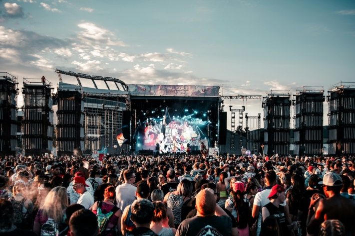
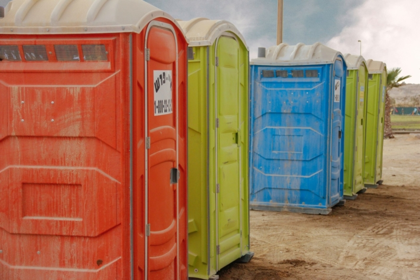

Lorsque la saison des festivals commence et que l'on se réjouit de pouvoir écouter de la bonne musique et de partager des moments avec des amis, il est temps de boucler ses bagages. Pour que votre visite au festival se déroule sans accroc et ne soit pas assombrie par des problèmes et des contrariétés, une **préparation minutieuse** est essentielle.

Que vous vous prépariez pour le légendaire [Wacken](https://www.wacken.com/de/), l'entraînant [Rock am Ring](https://www.rock-am-ring.com) ou l'énergique [Hurricane](https://hurricane.de/de/) Festival, certains must-have sont obligatoires sur toute liste de colisage de festival.

Les festivals rassemblent les gens et favorisent le sentiment de communauté.

## La liste de colisage du festival

Pour que vous puissiez tout trouver en un clin d'œil, la liste d'emballage du festival est divisée en six catégories claires. Tout d'abord, les essentiels, qui ne doivent en aucun cas manquer, sont mentionnés. Viennent ensuite le matériel de camping, les articles de restauration, les vêtements, les articles d'hygiène et les médicaments ainsi que d'autres articles qui n'ont pas pu être classés dans une catégorie.

### Essentiels

Les festivals permettent d'accéder à un programme musical varié.

Le plus important pour un festival est bien entendu le **billet d'entrée**. C'est pourquoi, surtout si vous avez un long voyage à faire, vous devez absolument vous assurer que vous avez bien votre billet avec vous. De même, vous devriez toujours avoir sur vous votre **carte d'identité**, votre **carte médicale** et de **l'argent liquide**.

Les objets dont vous pouvez vous passer ou qui sont particulièrement chers devraient toutefois être laissés à la maison, car parmi la masse d'inconnus, il y a généralement aussi quelques voleurs. De bons **bouchons d'oreille** sont une bénédiction pour les personnes sensibles au bruit ou les oiseaux de nuit qui souhaitent dormir longtemps le matin dans un silence absolu.

Entretoise

- Billet du festival
- Espèces
- Carte d'identité
- Carte d'assurance maladie
- Bouchons d'oreille

Entretoise

- Téléphone portable et câble de recharge
- Banque de puissance
- Lunettes de soleil
- Couvre-chef
- petit sac à dos ou sac ventral

### Camping

Au milieu de cet environnement bruyant, les nuits sont souvent courtes.

Si c'est la première fois que vous vous rendez à un festival et que vous devez acheter votre nouvel équipement de camping, assurez-vous que votre tente offre **suffisamment de place** pour accueillir toutes vos affaires. Si vous possédez déjà une tente, vérifiez impérativement avant le départ qu'il y a **suffisamment de piquets** et que la tente est **complète**. Il serait en effet fâcheux qu'il vous manque un piquet de tente une fois sur place.

Un autre point important sur votre liste de colisage pour le festival est un **pavillon**, sinon vous risquez rapidement une insolation si le soleil brille pendant des heures. Un pavillon n'offre pas seulement une protection contre le soleil, mais aussi contre les conditions météorologiques désagréables. Comme vous allez passer beaucoup de temps sur la chaise de camping, il est également important qu'elle soit **confortable** et de **bonne qualité**.

Entretoise

- Tente
- Matelas de sol ou matelas gonflable
- Sac de couchage
- Oreiller
- Table de camping

Entretoise

- Chaise de camping
- Pavillon
- Lampe ou guirlande lumineuse
- Piquets
- Marteau (en caoutchouc)

### Restauration

Lors d'un festival, on a particulièrement besoin d'énergie.

Certains festivals proposent à leurs visiteurs des petits **supermarchés sur le site**. Renseignez-vous à l'avance, cela vous évitera d'avoir tout à manger et à boire dès le début.

Sinon, le classique de toute liste de colisage de festival est sans doute la nourriture en **boîte de conserve**. Si vous trouvez cela trop monotone, vous pouvez aussi opter pour des **plats cuisinés maison**, **du pain** ou des **fruits frais** comme des bananes ou des pommes. Il est important de n'emporter que des aliments qui résistent à la chaleur et aux rayons du soleil. Les **pâtes à tartiner végétaliennes**, les **barres de céréales** et les **noix** sont particulièrement indiquées.

Entretoise

- Réchaud de camping
- Vaisselle en plastique
- Casserole ou poêle
- Glacière
- Produit et éponge à vaisselle

Entretoise

- Torchon à vaisselle
- Essuie-tout
- Ouvre-boîte et ouvre-bouteille
- Repas
- Eau et boissons

### Vêtements

Les bons vêtements sont ceux dans lesquels vous vous sentez bien.

Bien que **le temps** prévu soit ensoleillé, la pluie peut soudainement faire son apparition. Le temps n'est pas toujours prévisible de manière fiable, il est donc important de se préparer à toutes les éventualités. Assurez-vous que des vêtements pour les jours ensoleillés et chauds ainsi que pour les jours pluvieux figurent sur votre liste de colisage pour le festival.

Le terrain du festival peut rapidement devenir **boueux** ou **poussiéreux**, ce qui peut également affecter vos vêtements. Évitez donc de porter des chaussures ou des vêtements de couleur claire si vous ne souhaitez pas vous changer constamment. Les vêtements voyants comme **les costumes**, **les coiffures** et beaucoup de **paillettes** sont souvent très appréciés et bien vus dans les festivals.

Entretoise

- Pantalons courts et longs
- T-shirts
- Pull ou veste
- Veste ou poncho de pluie
- Pyjama

Entretoise

- Chaussettes et sous-vêtements
- Chaussures confortables
- Chaussures de bain
- Bottes en caoutchouc
- Maillots de bain

### Hygiène et médicaments

La situation en matière d'hygiène dans les festivals n'est souvent pas très confortable.

Pour tous les articles d'hygiène de votre liste de colisage de festival, la règle est la suivante : **les tailles de voyage** sont peu encombrantes et donc optimales. Apporter son propre **papier toilette** s'avère souvent salvateur, car avec le nombre de festivaliers, il y a souvent pénurie dans les toilettes de type Dixi.

Maintenir l'hygiène sur le terrain de camping peut être un défi. C'est pourquoi il vaut toujours la peine d'avoir **du désinfectant** sur soi pour se laver les mains sans devoir faire une longue marche.

De manière générale, les trajets sont souvent longs lors d'un festival, de la tente à la scène. C'est pourquoi les **pansements pour ampoules** sont un must absolu pour pouvoir profiter sans douleur de plusieurs jours d'expérience festivalière.

Entretoise

- Brosse à cheveux ou peigne
- Déodorant, shampooing et gel douche
- Dentifrice et brosse à dents
- Rasoir
- Serviette de bain
- Papier toilette, lingettes de poche et lingettes humides

Entretoise

- Protection contre le soleil et les insectes
- Articles d'hygiène féminine
- Contraceptifs
- Électrolytes et analgésiques
- Désinfectant
- Pansements (pour ampoules)

### Autres

Pour passer le temps, des jeux sont organisés sur le terrain de camping.

**Les sacs poubelles** ne sont pas seulement utiles pour garder votre camp propre, mais aussi pour récupérer les bouteilles vides consignées ou pour servir de protection contre l'humidité en cas de pluie. Le **scotch blindé**, souvent utilisé dans les festivals, est également un sauveur en cas de besoin. Il s'avère utile lorsque des réparations sont nécessaires sur la tente, les vêtements ou d'autres objets.

Comme les trajets entre le parking et le terrain de camping sont souvent longs, il est judicieux de réfléchir à l'avance à la meilleure façon de transporter tout le matériel. De nombreux festivaliers sont ici particulièrement créatifs dans leurs **moyens de transport** - des charrettes à bras aux brouettes en passant par les poubelles, tout est possible pour économiser du temps et de l'énergie.

Entretoise

- Sacs poubelle
- Ruban adhésif blindé
- Haut-parleur Bluetooth
- Accessoires pour jeux à boire

Entretoise

- Moyen de transport
- Cendrier pour fumeurs
- Câble de remorquage en cas de risque de boue

## Plus de conseils pour le festival

Lors de la préparation d'un festival, outre une liste de colisage bien réfléchie, il est également important de tenir compte d'autres conseils. Il vaut la peine d'arriver tôt sur le lieu de l'événement afin d'obtenir un **bon emplacement** pour votre tente et d'éviter les longues marches ou la proximité de toilettes Dixi malodorantes.

De plus, il est judicieux de **se mettre d'accord avec des amis** pour éviter d'apporter certains éléments en double. Surtout, planifiez à l'avance les spectacles que vous souhaitez voir afin de ne rien manquer et de tenir compte de toutes les priorités - on prévoit souvent plus que ce que l'on peut finalement faire.

Au préalable, il est conseillé de lire attentivement les **directives des organisateurs**. Dans la plupart des cas, les objets tels que les bouteilles en verre ou les barbecues au charbon de bois ne sont pas autorisés. Ceux-ci seront contrôlés à l'entrée et vous seront éventuellement retirés.

### Mentions légales

Outre les règles que l'organisateur peut édicter pour son terrain privé, les lois générales s'appliquent également aux festivals. Celui qui, par exemple, allume un feu de camp, endommage la propriété d'autrui ou conduit une voiture sous l'influence de drogues doit s'attendre à des conséquences juridiques. Pour que votre visite au festival ne dérape pas et que vous puissiez faire la fête avec des milliers de personnes de manière pacifique et en toute sécurité, vous devez respecter toutes les règles existantes.

Vous pouvez lire en détail dans le [catalogue des amendes](https://www.bussgeldkatalog.org/festival/) quelles sont les lois en vigueur dans les festivals en Allemagne et quelles sont les sanctions encourues en cas d'infraction.

## Le planificateur de festival de SeaTable

Le [planificateur de festival]() gratuit de SeaTable vous permet de classer clairement tous les concerts en direct par jour et par heure, afin de ne manquer aucun de vos artistes préférés. Que vous soyez à la recherche de têtes d'affiche ou de nouveaux venus, l'aperçu intuitif vous permet de toujours garder une vue d'ensemble sur l'ensemble du **programme du festival**. Voyez d'un seul coup d'œil les artistes que vos amis souhaitent voir et regroupez-vous pour profiter ensemble des meilleurs spectacles.

La possibilité de partager une liste d'emballage de festival avec vos amis vous permet de vous assurer que rien n'est apporté inutilement en double et que chacun sait exactement ce dont il est responsable. Grâce aux cases à cocher que l'on peut cocher, vous êtes sûr de ne rien oublier d'important.

[Inscrivez-vous]() gratuitement avec votre adresse e-mail et utilisez le [modèle]() pour votre prochain festival.
