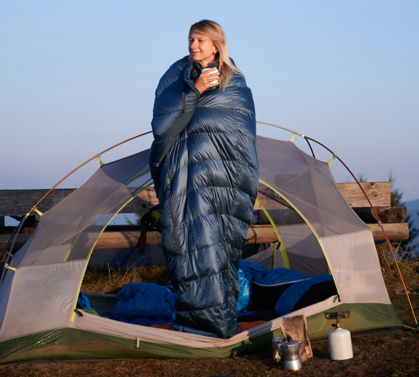
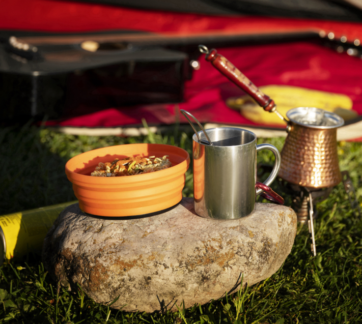
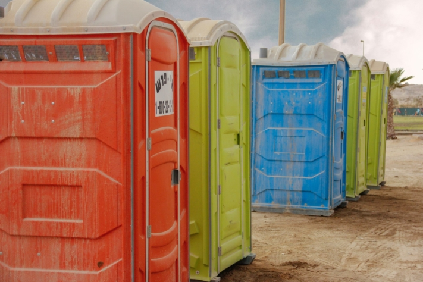

Quando a época dos festivais começa e a expetativa de boa música e de experiências partilhadas com amigos aumenta, é altura de voltar a fazer as malas. Para garantir que a sua visita ao festival corre bem e não é ensombrada por problemas e aborrecimentos, é crucial **uma preparação minuciosa**.

Quer se esteja a preparar para o lendário [Wacken](https://www.wacken.com/de/), para o emocionante [Rock am Ring](https://www.rock-am-ring.com) ou para o enérgico [Hurricane](https://hurricane.de/de/) Festival - há alguns itens indispensáveis em todas as listas de embalagem de festivais.

Os festivais reúnem as pessoas e promovem um sentido de comunidade.

## A lista de bagagem para o festival

Para o ajudar a encontrar tudo num ápice, a lista de embalagem do festival está dividida em seis categorias claramente organizadas. Em primeiro lugar, são enumerados os bens essenciais que não podem faltar. Segue-se o equipamento de campismo, a alimentação, o vestuário, os produtos de higiene pessoal e os medicamentos, bem como outros artigos que não podem ser classificados.

### Essenciais

Os festivais dão acesso a um programa musical diversificado.

A coisa mais importante para um festival é, obviamente, o **bilhete do festival**. Por isso, especialmente se tiveres uma viagem longa, deves certificar-te de que tens o teu bilhete contigo. Também deves ter sempre contigo o teu **BI**, o **cartão de saúde** e **dinheiro**.

No entanto, deve deixar em casa os objectos de que pode prescindir ou que são particularmente caros, uma vez que, normalmente, há alguns ladrões entre a multidão de estranhos. Bons **tampões para os ouvidos** são uma bênção para as pessoas sensíveis ao ruído ou para os noctívagos que gostam de dormir muito tempo de manhã em silêncio absoluto.

Espaçador

- Bilhete para o festival
- Dinheiro
- Bilhete de identidade
- Cartão de seguro de doença
- Tampões para os ouvidos

Espaçador

- Telemóvel e cabo de carregamento
- Banco de potência
- Óculos de sol
- Capacete
- mochila pequena ou saco de viagem

### Acampamento

As noites são muitas vezes curtas no meio do ambiente ruidoso.

Se vai participar num festival pela primeira vez e precisa de comprar novo equipamento de campismo, deve certificar-se de que a sua tenda tem **espaço suficiente** para acomodar todas as suas coisas. Se já tiveres uma tenda, certifica-te de que tens **estacas suficientes** e que a tenda está **completa** antes de partires. Afinal de contas, seria aborrecido se lhe faltasse uma vara da tenda no local.

Outro item importante na sua lista de embalagem para o festival é um **pavilhão**, pois de outra forma pode apanhar rapidamente uma insolação se o sol brilhar durante horas a fio. Um pavilhão não só oferece proteção contra o sol, mas também contra condições climatéricas desagradáveis. Como vais passar muito tempo na cadeira de campismo, também é importante que esta seja **confortável** e de **boa qualidade**.

Espaçador

- Tenda
- Colchão de dormir ou colchão de ar
- Saco-cama
- Almofada
- Mesa de campismo

Espaçador

- Cadeira de campismo
- Pavilhão
- Lâmpadas ou luzes de fadas
- Cavilhas
- Martelo (de borracha)

### Restauração

É preciso ter muita energia num festival.

Alguns festivais oferecem aos seus visitantes pequenos **supermercados no local**. Informe-se sobre isso com antecedência para não ter de trazer toda a comida e bebida desde o início.

Caso contrário, o clássico em todas as listas de embalagem de festivais é provavelmente comida **enlatada**. Se isto for demasiado monótono para si, também pode optar por comida **caseira**, **pão** ou **fruta fresca**, como bananas ou maçãs. É importante levar consigo apenas alimentos que resistam ao calor e à luz solar. Os produtos **veganos** para barrar, **as barras de muesli** e os frutos **secos** são particularmente adequados neste caso.

Espaçador

- Fogão de campismo
- Louça de plástico
- Panela ou frigideira
- Caixa de frio
- Detergente para a loiça e esponja

Espaçador

- Toalhete de chá
- Rolo de cozinha
- Abre-latas e abre-garrafas
- Alimentação
- Água e bebidas

### Vestuário

A roupa certa é aquela com que se sente confortável.

Embora se preveja **tempo** soalheiro, pode chover de repente. O tempo nem sempre é previsível de forma fiável, por isso é importante estar preparado para todas as eventualidades. Certifica-te de que a tua lista de roupa para o festival inclui roupa para os dias de sol e calor, bem como para os dias de chuva.

O local do festival pode ficar rapidamente **lamacento** ou **poeirento**, o que também pode afetar o seu vestuário. Por isso, evite sapatos ou roupas de cores claras se não quiser estar sempre a mudar de roupa. As peças de vestuário que chamam a atenção, como **fatos**, **toucados** e muito **brilho**, são frequentemente muito populares e bem-vindas nos festivais.

Espaçador

- Calções e calças compridas
- T-shirts
- Camisola ou casaco
- Casaco ou poncho para a chuva
- Pijama

Espaçador

- Meias e roupa interior
- Sapatos confortáveis
- Chinelos de banho
- Botas de borracha
- Fato de banho

### Higiene e medicina

A situação de higiene nos festivais não é, muitas vezes, particularmente confortável.

O que se segue aplica-se a todos os artigos de higiene pessoal da sua lista de embalagem para o festival: **os tamanhos de viagem** poupam espaço e são, por isso, ideais. Trazer o seu próprio **papel higiénico** revela-se muitas vezes um salva-vidas, uma vez que é frequentemente escasso nas casas de banho com tantos visitantes do festival.

Manter a higiene no parque de campismo pode ser um desafio. Por isso, vale sempre a pena ter consigo **um desinfetante** para lavar as mãos sem uma longa caminhada.

De um modo geral, num festival, as distâncias entre a tenda e o palco são muitas vezes longas. É por isso que **os pensos para bolhas** são absolutamente indispensáveis se quiser desfrutar de vários dias de festival sem dores.

Espaçador

- Escova ou pente para o cabelo
- Desodorizante, champô e gel de banho
- Pasta de dentes e escova de dentes
- Máquina de barbear
- Toalha
- Papel higiénico, lenços de papel e toalhetes húmidos

Espaçador

- Proteção contra o sol e os insectos
- Produtos de higiene feminina
- Contraceptivos
- Electrólitos e analgésicos
- Desinfetante
- Pensos (para bolhas)

### Diversos

Para passar o tempo, há jogos no parque de campismo.

**Os sacos do lixo** não são apenas úteis para manter o acampamento limpo, mas também para recolher garrafas retornáveis vazias ou como proteção contra a humidade quando chove. Outro salvador frequentemente utilizado nos festivais é a **fita ades**iva, que dá jeito quando é necessário reparar as tendas, o vestuário ou outros objectos.

Como as distâncias entre o parque de estacionamento e o parque de campismo são muitas vezes longas, faz sentido pensar antecipadamente na melhor forma de transportar todo o seu equipamento. Muitos visitantes do festival são particularmente criativos nos seus **meios de transporte** - desde carrinhos de mão e carrinhos de mão a caixotes do lixo, tudo é possível para poupar tempo e energia.

Espaçador

- Revestimentos para caixotes do lixo
- Fita de proteção
- Altifalante Bluetooth
- Acessórios para jogos de beber

Espaçador

- Meios de transporte
- Cinzeiro para fumadores
- Corda de reboque para condições lamacentas

## Mais dicas para festivais

Ao preparar-se para um festival, para além de uma lista de embalagem bem pensada, também é importante ter em conta outras dicas. Vale a pena chegar cedo ao local do festival para conseguir um **bom lugar** para a sua tenda e evitar longas caminhadas ou a proximidade de casas de banho com cheiro intenso.

É também uma boa ideia **consultar os amigos** para evitar trazer certas coisas duas vezes. Acima de tudo, deve planear antecipadamente os espectáculos que quer ver para não perder nada e ter em conta todas as prioridades - muitas vezes, acaba por ter de assumir mais do que consegue.

É aconselhável ler atentamente **as directrizes do organizador** antes da partida. Na maioria dos casos, não são permitidos objectos como garrafas de vidro ou grelhadores a carvão. Estes objectos serão controlados à entrada e, se necessário, ser-lhe-ão retirados.

### Legal

Para além das regras que o organizador pode estabelecer para os seus recintos privados, as leis gerais também se aplicam aos festivais. Por exemplo, quem acender uma fogueira, danificar bens alheios ou conduzir sob o efeito de drogas deve contar com consequências legais. Para garantir que a sua visita ao festival não se descontrola e que pode festejar pacificamente e em segurança com milhares de pessoas, deve respeitar todas as regras existentes.

Pode ler em pormenor quais as leis aplicáveis aos festivais na Alemanha e quais as sanções aplicáveis em caso de má conduta no [catálogo de multas](https://www.bussgeldkatalog.org/festival/).

## O planeador de festivais da SeaTable

Com o [planeador de festivais]() gratuito do SeaTable, pode organizar todos os espectáculos ao vivo de forma clara, por dia e hora, para que não perca nenhum dos seus artistas favoritos. Quer esteja à procura de cabeças de cartaz ou de novos artistas, a visão geral intuitiva permite-lhe acompanhar todo o **programa do festival**. Veja rapidamente quais as actuações que os seus amigos querem ver e junte forças para viverem juntos as melhores actuações.

Com a opção de partilhar uma lista de embalagem para o festival com os seus amigos, pode certificar-se de que nada é trazido duas vezes desnecessariamente e que todos sabem exatamente aquilo por que são responsáveis. As caixas de verificação assinaláveis garantem que não se esquece de nada importante.

[Registe-se]() gratuitamente com o seu endereço de correio eletrónico e utilize o [modelo]() para o seu próximo festival.
