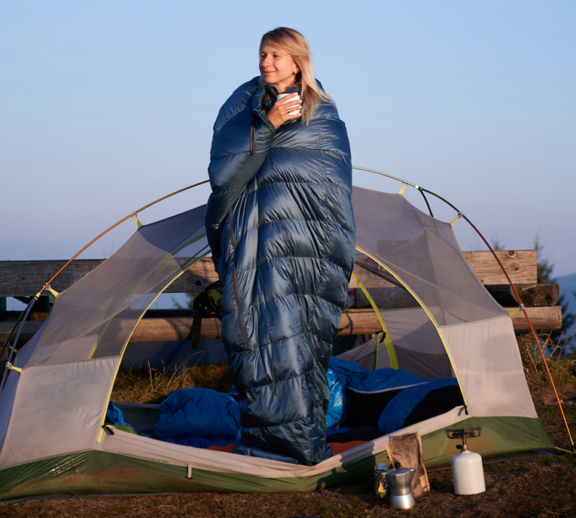
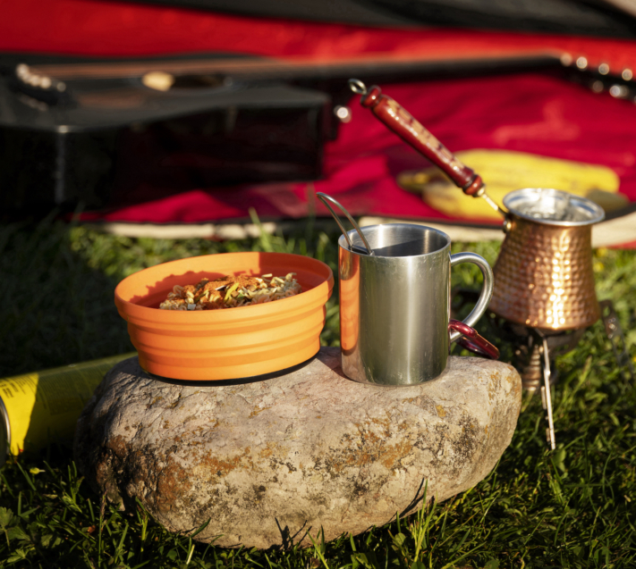

Когда начинается сезон фестивалей и усиливается предвкушение хорошей музыки и совместных впечатлений с друзьями, пора снова паковать чемоданы. Чтобы ваш визит на фестиваль прошел гладко и не был омрачен проблемами и раздражителями, крайне важна **тщательная подготовка**.

Готовитесь ли вы к легендарному [Wacken](https://www.wacken.com/de/), захватывающему [Rock am Ring](https://www.rock-am-ring.com) или энергичному [Hurricane](https://hurricane.de/de/) Festival - в списке необходимых вещей для любого фестиваля есть несколько обязательных пунктов.

Фестивали объединяют людей и способствуют развитию чувства общности.

## Список вещей для фестиваля

Чтобы помочь вам найти все с первого взгляда, список вещей для фестиваля разделен на шесть четко организованных категорий. Сначала перечислены предметы первой необходимости, которые не должны отсутствовать. Затем следуют снаряжение для кемпинга, еда, одежда, туалетные принадлежности и лекарства, а также другие предметы, которые невозможно разделить на категории.

### Essentials

Фестивали обеспечивают доступ к разнообразной музыкальной программе.

Самая важная вещь на фестивале - это, конечно, **фестивальный билет**. Поэтому, особенно если вам предстоит долгая дорога, вы должны быть уверены, что билет у вас с собой. Также при себе всегда должны быть **удостоверение личности**, **медицинская карта** и **наличные деньги**.

Однако вещи, без которых вы можете обойтись или которые особенно дороги, лучше оставить дома, так как среди толпы незнакомцев обычно найдется несколько воришек. Хорошие **беруши** - благословение для чувствительных к шуму людей или ночных сов, которые любят долго спать по утрам в абсолютной тишине.

Проставка

- Билет на фестиваль
- Наличные
- Удостоверение личности
- Карточка медицинского страхования
- Беруши

Проставка

- Мобильный телефон и кабель для зарядки
- Powerbank
- Солнцезащитные очки
- Головные уборы
- небольшой рюкзак или сумка для бомжей

### Кемпинг

В шумной обстановке ночи часто бывают короткими.

Если вы впервые участвуете в фестивале и вам нужно приобрести новое снаряжение для кемпинга, убедитесь, что в палатке **достаточно места** для размещения всех ваших вещей. Если у вас уже есть палатка, перед тем как отправиться в путь, убедитесь, что у вас **достаточно колышков** и что палатка **полностью у** комплектована. В конце концов, будет неприятно, если на месте палатки вам не хватит колышков.

Еще один важный пункт в списке вещей для фестиваля - **павильон**, поскольку в противном случае вы можете быстро получить солнечный удар, если солнце будет светить несколько часов подряд. Павильон не только защищает от солнца, но и от неприятных погодных условий. Поскольку вы будете проводить много времени в походном кресле, важно, чтобы оно было **удобным** и **качественным**.

Проставка

- Палатка
- Спальный коврик или надувной матрас
- Спальный мешок
- Подушка
- Стол для кемпинга

Проставка

- Кемпинговое кресло
- Павильон
- Лампы или сказочные светильники
- Прищепки
- (Резиновый) молоток

### Кейтеринг

На фестивале нужно много энергии.

Некоторые фестивали предлагают посетителям небольшие **супермаркеты на территории** фестиваля. Узнайте об этом заранее, чтобы не пришлось с самого начала брать с собой всю еду и напитки.

В остальном же классика всех фестивалей - **консервированные** продукты. Если это слишком однообразно для вас, вы также можете выбрать **домашнюю** еду, **хлеб** или **свежие фрукты**, такие как бананы или яблоки. Важно брать с собой только те продукты, которые могут выдержать жару и солнечный свет. Здесь особенно уместны **веганские спреды**, **батончики мюсли** и **орехи**.

Проставка

- Кемпинговая плита
- Пластиковая посуда
- Кастрюля или сковорода
- Крутая коробка
- Средство для мытья посуды и губка

Проставка

- Чайное полотенце
- Кухонный рулон
- Открывалка для консервов и бутылок
- Еда
- Вода и напитки

### Одежда

Правильная одежда - это та, в которой вы чувствуете себя комфортно.

Несмотря на прогнозируемую солнечную **погоду**, дождь может пойти внезапно. Погода не всегда надежно предсказуема, поэтому важно быть готовым ко всем случайностям. Убедитесь, что в вашем списке вещей для фестиваля есть одежда как для солнечных и жарких дней, так и для дождливых.

На территории фестиваля может быстро стать **грязно** или **пыльно**, что также может повлиять на вашу одежду. Поэтому избегайте обуви и одежды светлых тонов, если не хотите постоянно переодеваться. Бросающиеся в глаза предметы одежды, такие как **костюмы**, **головные уборы** и много **блеска**, часто очень популярны и приветствуются на фестивалях.

Проставка

- Шорты и длинные брюки
- Футболки
- Джемпер или жакет
- Дождевик или пончо
- Пижама

Проставка

- Носки и нижнее белье
- Удобная обувь
- Банные тапочки
- Резиновые сапоги
- Купальник

### Гигиена и медицина

Гигиеническая обстановка на фестивалях часто бывает не слишком комфортной.

Следующее относится ко всем туалетным принадлежностям в вашем списке упаковки для фестиваля: **дорожные размеры** занимают мало места и поэтому идеальны. Захватите с собой **туалетную бумагу** - она часто оказывается спасительной, так как в туалетах с большим количеством посетителей фестиваля ее не хватает.

Соблюдение гигиены в кемпинге может стать непростой задачей. Поэтому всегда стоит иметь с собой **дезинфицирующее средство**, чтобы вымыть руки без долгой ходьбы.

Как правило, расстояние от палатки до сцены на фестивале очень велико. Поэтому **пластыри от мозолей** - незаменимая вещь, если вы хотите провести несколько дней на фестивале без боли.

Проставка

- Щетка или расческа для волос
- Дезодорант, шампунь и гель для душа
- Зубная паста и зубная щетка
- Бритва
- Полотенце
- Туалетная бумага, салфетки и влажные салфетки

Проставка

- Защита от солнца и насекомых
- Средства гигиены для женщин
- Контрацептивы
- Электролиты и болеутоляющие средства
- Дезинфицирующее средство
- Пластыри (волдыри)

### Разное

Чтобы скоротать время, в кемпинге проводятся игры.

**Пакеты для мусора** пригодятся вам не только для поддержания чистоты в лагере, но и для сбора пустых бутылок или защиты от сырости во время дождя. Еще один часто используемый на фестивалях спаситель - **клейкая лента**, которая пригодится, когда нужно починить палатку, одежду или другие предметы.

Поскольку расстояние от парковки до кемпинга часто бывает большим, имеет смысл заранее подумать о том, как лучше всего перевезти все свое снаряжение. Многие посетители фестивалей подходят к выбору **средств передвижения** особенно творчески - от ручных тележек и тачек до мусорных баков - все это позволяет сэкономить время и силы.

Проставка

- Вкладыши для мусорных баков
- Бронелента
- Динамик Bluetooth
- Аксессуары для питейных игр

Проставка

- Средства передвижения
- Пепельница для курильщиков
- Буксировочный трос для грязных условий

## Другие советы по проведению фестивалей

При подготовке к фестивалю, помимо продуманного списка вещей, важно учесть и другие советы. Стоит приехать на место проведения фестиваля пораньше, чтобы занять **хорошее место** для палатки и избежать долгих прогулок или близости к туалетам с неприятным запахом.

Также стоит **посоветоваться с друзьями**, чтобы не приносить некоторые вещи дважды. Прежде всего, нужно заранее спланировать, какие спектакли вы хотите посмотреть, чтобы ничего не пропустить, и учесть все приоритеты - часто вы берете на себя больше, чем можете в итоге успеть.

Рекомендуется заранее внимательно ознакомиться с **инструкциями организаторов**. В большинстве случаев не разрешается брать с собой такие предметы, как стеклянные бутылки или угольные барбекю. Их проверят на входе и при необходимости заберут.

### Юридический

Помимо правил, которые организаторы могут установить для своей частной территории, на фестивалях действуют и общие законы. Например, любого, кто разжигает костер, наносит ущерб чужому имуществу или управляет автомобилем в состоянии наркотического опьянения, ожидают правовые последствия. Чтобы ваше посещение фестиваля не вышло из-под контроля и вы могли спокойно и безопасно праздновать вместе с тысячами людей, соблюдайте все существующие правила.

Подробно о том, какие законы действуют на фестивалях в Германии и какие наказания применяются за нарушения, вы можете прочитать в [каталоге штрафов](https://www.bussgeldkatalog.org/festival/).

## Планировщик фестивалей от SeaTable

С помощью бесплатного [планировщика фестивалей]() SeaTable вы можете четко распределить все концертные выступления по дням и времени, чтобы не пропустить ни одного из своих любимых артистов. Независимо от того, ищете ли вы хедлайнеров или начинающих музыкантов, интуитивно понятный обзор позволит вам следить за всей **программой фестиваля**. Узнайте с первого взгляда, какие выступления хотят увидеть ваши друзья, и объедините усилия, чтобы вместе увидеть лучшие выступления.

Если вы поделитесь с друзьями списком упаковки для фестиваля, то сможете быть уверены, что ничего не придется брать дважды без необходимости и что каждый точно знает, за что он отвечает. Отмечаемые галочками пункты помогут вам не забыть ничего важного.

[Зарегистрируйтесь]() бесплатно, указав свой адрес электронной почты, и используйте [шаблон]() для своего следующего фестиваля.
