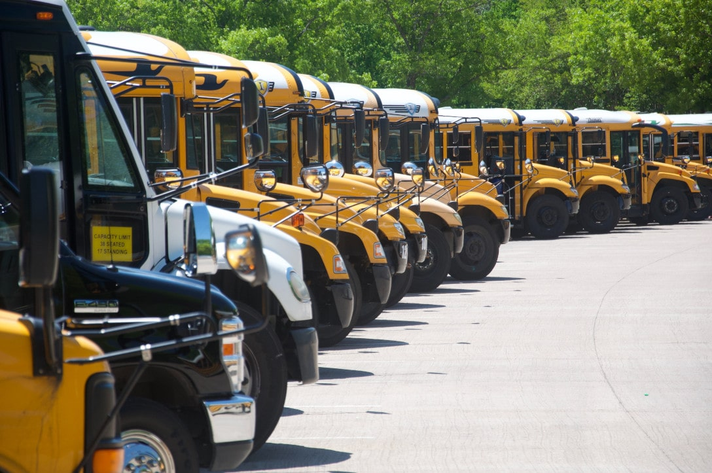
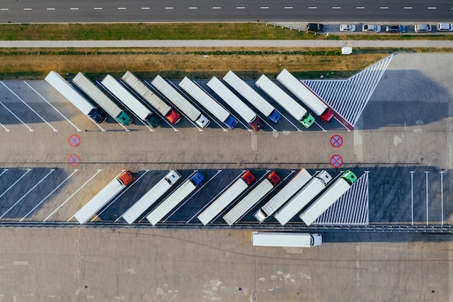

Quer se trate de camiões, autocarros ou automóveis clássicos da empresa: a gestão de uma frota de veículos é uma tarefa multifacetada para empresas de todas as dimensões, e há muito a considerar. O artigo que se segue destina-se, portanto, a ajudar a esclarecer todas as suas dúvidas sobre a **gestão de frotas**.

## O que é uma frota de veículos?

A **frota** de **veículos** da sua empresa inclui todos os veículos do seu [inventário](). Trata-se, na maior parte dos casos, de veículos clássicos **da empresa**. No entanto, também pode incluir veículos especializados: Autocarros e comboios, camiões, veículos de estaleiro, empilhadores, tractores ou outros veículos.

Existem dois tipos de veículos na gestão de frotas:

- Veículos colectivos que podem ser utilizados por várias pessoas
- Automóvel da empresa conduzido exatamente por uma pessoa

## O que é a gestão de frotas?

A gestão de frotas abrange a organização completa da sua [frota de veículos](https://de.wikipedia.org/wiki/Fuhrpark), desde a aquisição até à manutenção e eliminação. Uma boa gestão da frota assegura também a **rentabilidade** e **a manutenção da sua empresa**. Para o efeito, é necessário cuidar dos veículos existentes, mantê-los e mandá-los reparar, se necessário. Para minimizar o tempo de inatividade da sua frota de veículos, deve gerir a sua frota de forma eficiente e estabelecer processos fixos de gestão da frota.

Todas as empresas que possuem veículos da empresa devem ter um sistema de gestão de frotas eficiente. Não importa se os veículos são utilizados para **transportar mercadorias** ou como **veículos da empresa** para viagens de negócios. **Os veículos comerciais**, como ambulâncias, escavadoras e tractores, também estão entre os casos de utilização.

## Tarefas na gestão da frota

A quantidade de esforço necessário para a gestão da sua frota depende inteiramente da **dimensão** da sua frota e da utilização **que** dá aos veículos na sua empresa. As empresas de transportes que coordenam centenas de veículos todos os dias e dependem de um bom funcionamento para o seu sucesso comercial organizarão certamente a sua gestão de frotas de forma diferente das empresas que apenas necessitam da sua frota para as viagens de negócios dos seus empregados.

O objetivo da gestão de frotas (tanto no sector público como no privado) é organizar todos os processos que envolvem veículos da forma mais eficiente e económica possível. Isto aplica-se aos **custos de aquisição**, aos **custos de funcionamento**, mas também à **manutenção e** às **reparações**. Outra tarefa importante é a **atribuição e reserva** de veículos sem problemas e sem complicações. Pode utilizar sistemas de reserva digitais, por exemplo, para facilitar a entrega e documentá-la sem problemas.

### O que faz parte da gestão de frotas?

- Avaliação das necessidades, aquisição e financiamento de veículos
- Gestão dos documentos do veículo (documentos de registo do veículo, contratos de compra e venda, apólices de seguro, etc.)
- Reserva, atribuição e planeamento do itinerário, se necessário
- Devolver e reabastecer os veículos
- Colocação em funcionamento e acompanhamento das reparações e inspecções
- Cumprimento dos regulamentos legais (por exemplo, controlo da carta de condução)

Vamos agora analisar em pormenor vários aspectos e dicas de gestão de frotas.

## Aquisição e seleção de veículos

De **quantos veículos** necessita a sua empresa? Com a gestão de frotas, garante que um número suficiente de veículos está sempre disponível no sítio certo quando é necessário. Um bom indicador pode ser o número de **empregados autorizados a utilizar os veículos da empresa** ou o número de veículos comerciais que têm de ser utilizados em simultâneo para satisfazer determinadas encomendas.

Quando se trata de gestão de frotas, a **imagem** que se pretende projetar também é importante. Os carros de luxo, por exemplo para a direção, podem simbolizar um certo estatuto para o mundo exterior, mas podem parecer arrogantes para os seus próprios funcionários e clientes. Na maioria dos casos, o tamanho dos veículos também está associado a um elevado **consumo de combustível**: a utilização de veículos mais pequenos na sua frota, em vez de veículos que consomem muita gasolina, é, por conseguinte, um aspeto financeiro e estratégico tendo em vista a transição para a mobilidade.

**A mobilidade eléctrica** e **as emissões de CO₂** são questões que têm uma certa importância aos olhos do público devido ao discurso social e político e criam expectativas entre os funcionários e os clientes. Por conseguinte, deve ter em mente o ambiente e a sustentabilidade ao gerir a sua frota. Para viagens curtas, por exemplo, também pode utilizar veículos eléctricos mais pequenos para proteger o ambiente e conservar recursos.

## Financiamento do seu parque automóvel

Ao comprar um veículo, é claro que deve pensar no financiamento. Não existe uma resposta única para o facto de a melhor opção ser a **compra ou o leasing**. Uma das vantagens do leasing é o facto de ter menos capital imobilizado, enquanto que, após a compra, é proprietário do veículo.

A **carga administrativa** é geralmente menor com o leasing, uma vez que muitas empresas de aluguer de automóveis oferecem serviços personalizados nos seus contratos e tratam de certas tarefas de gestão da frota que, de outra forma, teria de fazer você mesmo. Dependendo da situação, a locação financeira pode, portanto, ser mais favorável do que, por exemplo, uma compra com financiamento a crédito.

**Os seguros** também estão associados a custos de funcionamento elevados na gestão de frotas. No entanto, não é necessário segurar cada um dos seus veículos individualmente. Pode beneficiar de contratos de grupo para apólices de seguro automóvel para apenas três veículos da empresa, o que pode reduzir os custos e o trabalho administrativo.

## Gestão de frotas e proteção de dados

Como provavelmente sabe, tem de cumprir o **Regulamento Geral sobre a Proteção de Dados (RGPD** ) sempre que recolhe e armazena dados pessoais. Na gestão de frotas, a proteção de dados entra em jogo em muitos pontos. Por conseguinte, é aconselhável obter uma **declaração de consentimento** do condutor antes da entrega do veículo. Informe todos os condutores sobre os dados que irá armazenar sobre eles, para que fins e durante quanto tempo.



Por razões fiscais, em particular, é necessário poder acompanhar a **utilização de veículos** específicos. Quando é que cada empregado utilizou cada viatura da empresa? E, muito importante: as deslocações foram feitas para fins profissionais ou privados? Um [diário de bordo digital](https://seatable.io/pt/digitales-fahrtenbuch-fuehren/) é uma boa forma de documentar estas informações cuidadosamente e em conformidade com o RGPD.

Além disso, é necessário controlar duas vezes por ano a carta de condução dos condutores, para garantir que estes possuem uma **carta de condução válida**. Pode não só inspecionar as cartas de condução, mas também digitalizá-las ou fotocopiá-las. Isto também mostra a quantidade de dados sensíveis envolvidos na gestão de frotas, que devem ser armazenados de forma responsável.

## Sistemas para a gestão da sua frota

Existem várias opções de escolha para gerir a sua frota de veículos. A solução de software deve satisfazer vários requisitos: Em primeiro lugar, deve ser **flexível** e, por conseguinte, aplicável aos seus cenários individuais. Deve também ser capaz de registar diferentes tipos de informação (por exemplo, ficheiros, imagens e dados GPS) e ser fácil **de utilizar**.

Os requisitos para este tipo de software variam consoante a dimensão da empresa. As grandes empresas, como as empresas de transportes ou de camionagem, podem recorrer a **soluções** especiais **para o sector**, mas estas são frequentemente dispendiosas. No entanto, as empresas mais pequenas, com uma frota gerível, não precisam de se sujeitar às despesas de um sistema de gestão de frotas dispendioso.

O software de base de dados **SeaTable** torna possível a gestão gratuita de frotas para pequenas empresas. A solução baseada na nuvem e compatível com o RGPD é ideal para gerir frotas de pequena e média dimensão, por exemplo, de empresas de artesanato ou outras empresas que têm funcionários no terreno.

## Gerir a sua frota com SeaTable

Mantenha o controlo de toda a sua frota! Com o nosso [software]() gratuito [de gestão de frotas](), pode catalogar os seus veículos e gerir todos os processos de gestão de frotas num instante. Registe de forma cómoda e simples as reservas, as devoluções, as reparações e as marcações dos seus veículos.

O SeaTable oferece-lhe uma gestão clara e intuitiva da sua frota e dos pedidos de reserva recebidos. Isto significa que tem sempre uma visão geral dos veículos disponíveis e do estado da sua frota.

[Registe-se gratuitamente]() e experimente hoje mesmo o SeaTable e o modelo flexível e personalizável para a gestão da sua frota!

## FAQ



Uma frota de veículos refere-se a todos os veículos que pertencem à sua empresa.




A gestão de frotas refere-se a todos os processos relacionados com a sua frota de veículos.




A gestão de frotas começa com **uma avaliação do** número de veículos **de que** a sua empresa **necessita** e, em seguida, esclarece o **financiamento, a compra ou a venda dos** veículos. Deve assegurar a **gestão** cuidadosa **dos documentos dos veículos** (documentos de registo dos veículos, contratos de compra e venda, apólices de seguro, etc.) e o **armazenamento, em conformidade com o RGPD, dos dados dos condutores** (por exemplo, dados de movimento, recibos de combustível, cartas de condução). A atividade diária envolve a **reserva, a entrega e o planeamento do itinerário**, bem como eventuais **reparações e inspecções**.




Esta questão depende da dimensão da sua frota de veículos e, por conseguinte, não pode ser respondida em termos gerais. No entanto, deve estar ciente de que terá de se encarregar pessoalmente de toda a gestão da frota se **comprar** veículos. Em caso de **locação financeira**, as empresas de aluguer de automóveis podem assumir serviços completos, como seguros e inspecções, se assim o desejar.


