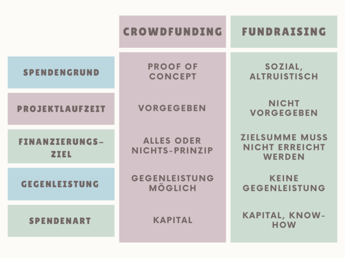

## Was heißt Fundraising? Bedeutung und Definition

Fundraising ist ein Begriff aus dem Englischen, der sich aus den Wörtern ***fund*** (Mittel) und ***raising*** (Beschaffung) zusammensetzt. Er steht für die organisierte und systematische Beschaffung von Ressourcen für bestimmte Zwecke oder Projekte. Dabei kann es sich um Sachzuwendungen, Geld sowie Dienstleistungen oder ehrenamtliche Mitarbeit handeln. Als Methode zur Kapitalbeschaffung können Sie es sowohl für **wohltätige** als auch für **unternehmerische** Zwecke nutzen.

Im Unternehmenskontext hat Fundraising Bedeutung als Alternative zu einem klassischen Bankkredit, um unternehmerische Projekte über Investoren oder Zuschüsse zu finanzieren. In der Regel wird der Begriff jedoch mit wohltätigen Zwecken in Verbindung gebracht, wo Spendengelder für **soziale Projekte** gesammelt werden. Dabei steht nicht die Erwartung einer direkten Gegenleistung seitens der Spender im Vordergrund, sondern vielmehr das Ziel, einen positiven Einfluss auf die Gesellschaft oder eine bestimmte Zielgruppe zu nehmen.

## Fundraising vs. Crowdfunding

**Crowdfunding** ist eine immer beliebtere Möglichkeit, online Spenden einzuwerben. Insbesondere im unternehmerischen Kontext – aber nicht nur – ist es inzwischen ein festes Instrument im Baukasten einer Online Fundraising Kampagne. Crowdfunding ist jedoch nicht mit Fundraising gleichzusetzen, sondern lediglich ein Teilaspekt davon. Bei ihren Fundraising Maßnahmen haben Organisationen die Flexibilität, Spenden unabhängig von einer bestimmten Plattform zu sammeln. Die Laufzeit wird flexibel gestaltet und eingeworbene Spenden kommen dem beworbenen Zweck zugute, auch wenn das eigentliche Ziel nicht erreicht wurde. Gegenleistungen für geleistete Spenden sind unüblich und werden außer in Form einer Spendenbescheinigung auch nicht erwartet.

Im Gegensatz dazu laufen Crowdfunding Kampagnen über einen festgelegten Zeitraum – typischerweise zwischen 30 und 60 Tagen – in dem das Spendenziel erreicht werden muss. Wird das Spendenziel verfehlt, gilt die ganze Kampagne als gescheitert und es werden überhaupt keine Spenden ausgezahlt. **Fundraising für Unternehmen** wird häufig als Crowdfunding konzipiert, bei dem die Spender teilweise eine Gegenleistung in Form eines kleinen Dankeschön-Geschenks erhalten.

## Welche Methoden und Kanäle werden im Fundraising genutzt?

Maßnahmen und Kanäle zur Spendengewinnung lassen sich in zwei Bereiche unterscheiden: Offline Fundraising und Online Fundraising.

### Was ist Online Fundraising?
Zum Online-Fundraising gehören alle Maßnahmen, die im Internet durchgeführt werden. Dazu zählen Social-Media-Kampagnen, Suchmaschinenmarketing sowie auch **Spendenplattformen** wie Betterplace oder GoFundMe, über die Projekte vorgestellt und Spenden gesammelt werden können. Im weitesten Sinn werden auch E-Mail-Marketing und Newsletter zu diesem Bereich gezählt. Durch Online-Aktionen erreichen Sie ein **breites Spektrum an Zielgruppen** und Altersgruppen zu geringeren Kosten und sprechen eine größere Anzahl potentieller Spender an.

### Was ist Offline Fundraising?

Vielleicht sind auch Sie schon dem traditionellen **Face-to-Face-Fundraising** in Fußgängerzonen begegnet? Obwohl viele Menschen unbeeindruckt an den Ständen vorbeigehen, zählt diese Methode noch immer zu den erfolgreichsten. Alternativ dazu können offline Spenden-Veranstaltungen wie **Charity-Events**, **Auktionen** und **Spendenläufe** eine effektive Möglichkeit sein, um Spenden zu sammeln und dabei die Community einzubeziehen. Auch **Fundraising bei Unternehmen** ist Bestandteil vieler Kampagnen und findet häufig offline statt.

## Wie finden und binden Sie Spender?

Durch die richtigen Methoden im Fundraising können Sie ein **Netzwerk von Spendern** aufbauen, die Ihrem Projekt oder Ihrer Organisation langfristig zur Verfügung stehen. Die **Spenderpyramide** ist hierbei ein nützliches Werkzeug, um darzustellen, wie ein Spender vom Interessenten zum Erstspender und später möglicherweise zum Dauer- oder Großspender wird.

### Die Spenderpyramide

Die Spenderpyramide gilt als eines der grundlegenden **Modelle im Fundraising**. Sie wurde 1991 von Joan Flanagan entwickelt und strukturiert die Spender nach der Höhe ihrer Zuwendungen. So lässt sich darstellen, wie sich das Engagement mit jeder Stufe erhöht, während sich die Anzahl der Spender verringert. Darüber hinaus bietet die Spenderpyramide Einblicke in den Zeitaufwand der Spendenakquise und die zu erwartenden **Erträge pro Spenderkategorie**.

Heutzutage wird die Spenderpyramide als Fundraising Modell aus verschiedenen Gründen kritisch betrachtet, da ihre hierarchische Struktur veraltet ist und nicht mehr das moderne Spendenverhalten widerspiegelt. Die Vielfalt neuer Spendenmöglichkeiten, von Online-Crowdfunding bis hin zu Peer-to-Peer-Fundraising, führt zu einer komplexeren Dynamik, welche sich mit der traditionellen Pyramide nicht abbilden lässt. Dennoch sind die Spenderkategorien immer noch hilfreich, um Spender besser zu segmentieren. Typischerweise werden dabei folgende Spendergruppen unterschieden:

- Interessenten
- Erstspender
- Mehrfach- und Dauerspender
- Großspender
- Erblasser

### Wie überzeugen Sie Spender?

Um erfolgreich Mittel einzuwerben und Menschen von Ihrem Projekt zu überzeugen, ist eine direkte und **persönliche Ansprache** von entscheidender Bedeutung. Potenziellen Spendern sollte klar werden, wer Sie sind und für welches Projekt Sie Spenden suchen. Dabei ist es wichtig, dass Sie detaillierte Informationen bereitstellen, einschließlich des spezifischen Betrags, den Sie für Ihren festgelegten Zweck benötigen. Nutzen Sie dabei eine **emotionale und anschauliche Sprache**, um möglichst viele Interessenten von Ihrer Idee zu begeistern. Es lohnt sich, wenn Sie Zeit und Ressourcen investieren, um langfristige Beziehungen zu Ihren Spendern aufzubauen und aufrechtzuerhalten.

So wichtig die persönliche, emotionale Ansprache auch ist: Den Grundstein für erfolgreiche Fundraising Kampagnen legen Sie mit einer sorgfältigen Planung. Es ist kein Zufall, dass ein gut gemachtes Fundraising Konzept als Beispiel für eine [Marketingkampagne]() dienen könnte. Denn letztlich ist es genau das und es gibt im Aufbau und den konzeptionellen Schritten keinen Unterschied:

- Ist-Analyse der eigenen Stärken und Ressourcen sowie des Umfelds
- Definition der Zielgruppe, der Kampagnenziele und der Kommunikationsziele
- Bestimmung der Maßnahmen und Kanäle
- Erstellen der Kampagne
- Controlling und Auswertung

### Spenderloyalitätszyklus

Zwischen der ersten und zweiten Spende verlieren viele Non-Profit-Organisationen einen Großteil ihrer Spender – laut einer Analyse von Beat Hunziker liegt der Schwund bei etwa 50 Prozent. Der **Spenderloyalitätszyklus** zeigt, wie aus Spenden-Interessierten engagierte Unterstützer werden können. Dieses Fundraising Modell umfasst verschiedene Phasen, darunter die Akquisition neuer Spender, die Umwandlung von Erstspendern in wiederkehrende Spender, die Pflege und Stärkung der Bindung sowie die Reaktivierung inaktiver Spender.

- Bei der **Akquisition** identifizieren Sie potenzielle Spender und machen sie mit geeigneten Maßnahmen auf Ihr Anliegen aufmerksam. Durch eine passende Ansprache können Sie die Interessenten zu einer ersten Spende bewegen.
- Daraufhin gilt es, die **Bindung** zu stärken und den Spender zu einem regelmäßigen Unterstützer zu entwickeln. Die Beziehungspflege ist ein fortlaufender Prozess, der darauf abzielt, das Engagement und die Loyalität des Spenders langfristig zu festigen.
- Schließlich ist die **Reaktivierung** inaktiver Spender von Bedeutung, um das Potenzial vergangener Unterstützer wieder zu nutzen. Durch gezielte Ansprache und Angebote können Sie inaktive Spender ermutigen, erneut zu spenden und sich wieder stärker mit Ihrer Organisation zu beschäftigen.

## Wie können Spenden effektiv verwaltet werden?

Zu jeder Fundraising Kampagne gehört auch Verwaltung: eingeworbene Mittel müssen erfasst, Spenderdaten verwaltet und **Spendenbescheinigungen** ausgestellt werden. Hierfür bietet sich die Nutzung einer speziellen Software an. **Fundraising Software** kombiniert Finanzverwaltung, **Spendermanagement**, [Eventplanung]() und Kampagnenplanung in einem System. Oft bieten solche Programme auch die Möglichkeit, direkt zu spenden und bieten dafür verschiedene Zahlungsarten. Die wichtigsten Vorteile sind:

- Effiziente Erfassung von Spenden und Spenderdaten
- Individuelle Spenderansprache durch Analyse der Spenderhistorie und Erfassung von Präferenzen
- Automatisierte Ausstellung von Spendenbescheinigungen
- Einfache Integration von Zahlungsdienstleistern
- Planung und Erstellung von Kampagnen
- Integrierte Analyse- und Reporting-Funktionen

## Spenden verwalten mit SeaTable

Mit der [kostenlosen Vorlage]() von SeaTable können Sie kinderleicht Fundraising betreiben und Ihre Spendenverwaltung so einfach wie möglich gestalten. Organisieren Sie mehrere Projekte an einem Ort und behalten Sie dabei die Orientierung. Da SeaTable als **No-Code-Lösung** vollkommen flexibel und skalierbar ist, können Sie die Vorlage mit wenig Aufwand speziell auf Ihre Bedürfnisse anpassen, statt eine Spezialsoftware von der Stange zu nutzen. Als **DSGVO-konforme Lösung**, die ausschließlich auf Servern in Deutschland gehostet wird, eignet sich SeaTable auch, um besonders sensible Daten wie z. B. Spenderinformationen zu verarbeiten.



In Ihrer Online-Datenbank können Sie nicht nur Spenden sammeln und verwalten, sondern sich auch automatisch die Differenz zwischen bereits getätigten Spenden und der Zielsumme berechnen lassen. **Integrieren Sie Ihren Zahlungsdienstleister**, erstellen Sie **mit einem Klick Spendenquittungen** und behalten Sie den Überblick über die Kontaktdaten und die Historie Ihrer Spender. Auf einem übersichtlichen Kanban-Board sehen Sie alle wichtigen Fakten und den Fortschritt Ihrer Projekte auf einen Blick. Ihre Mitarbeiter arbeiten **kollaborativ in Echtzeit** zusammen, so dass jederzeit volle Transparenz über die Daten besteht. Mit der **Universal App** können Sie kinderleicht ein eigenes Datenbank-Frontend bauen und Ihren Spendern Berichte und weitere Informationen zur Verfügung stellen.

## FAQs – Fundraising



Eine Spende ist eine freiwillige Sach- oder Geldzuwendung, für die keine Gegenleistung erwartet wird. Im Gegensatz dazu erhält der Sponsor für seine Zuwendung eine vorab vereinbarte Gegenleistung, in der Regel in Form von Werbung.





Corporate Funding ist ein Konzept, bei dem Unternehmen und gemeinnützige Organisationen eine Partnerschaft eingehen, um Mittel für die Zwecke der gemeinnützigen Organisation einzuwerben. Dabei kann es sich um Geld, ehrenamtliche Helfer oder materielle Unterstützung handeln. Organisationen profitieren von den Ressourcen des Partnerunternehmens, welches seinerseits seine Reputation und Markenbekanntheit verbessert.





Fundraising Software dient speziell dazu, bei der Planung und Verwaltung von Fundraising Kampagnen zu unterstützen. Neben Kampagnenmanagement und Spenderverwaltung gehören auch Analyse und Reporting sowie Veranstaltungsmanagement zu wichtigen Funktionen, die solch eine Software bieten sollte.





Fundraising stammt aus dem Englischen und hat sich seit Mitte des 20. Jahrhunderts zunehmend im Deutschen etabliert. Die häufig anzutreffende deutsche Übersetzung "Spendenwerbung" ist insofern irreführend, als das Fundraising keine rein kommunikative oder werbliche Aufgabe ist. Denn Fundraising bezeichnet den gesamten Prozess, von der Strategie, über den Fundraising Konzept Aufbau und die eigentlichen Aktivitäten bis zur Analyse und der Spenderverwaltung. Wörtlich und auch sinngemäß bedeutet Fundraising auf deutsch Mittelbeschaffung oder Spendensammeln.





Startups suchen häufig nach Finanzierungsmöglichkeiten abseits von klassischen Bankkrediten. Anders als herkömmliches Fundraising, funktioniert "Fundraising for startups" primär über Crowdfunding und spricht gezielt Investoren und Business Angels an. Grundlage des Prozesses ist ein ausgearbeiteter Businessplan. Aus Sicht der Geber handelt es sich um eine Geldanlage, an die eine Gewinnerwartung geknüpft ist. Sie sind also keine Spender, sondern Investoren.

