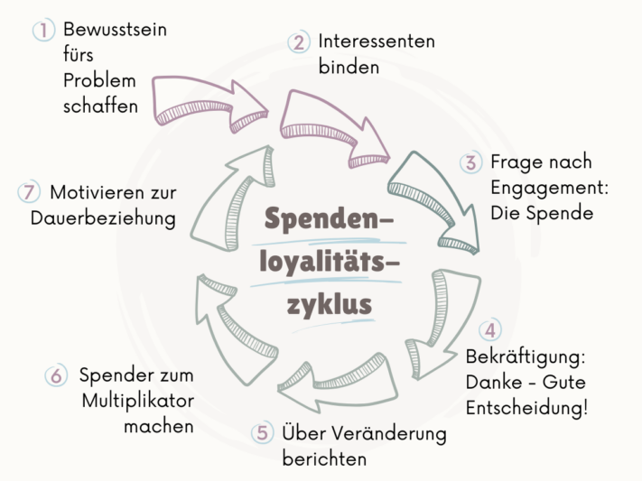

## What does fundraising mean? Meaning and definition

Fundraising stands for the organized and systematic procurement of resources for specific purposes or projects. This can involve contributions in kind, money, services or voluntary work. As a method of raising capital, you can use it for both **charitable** and **corporate** purposes.

In the corporate context, fundraising is used as an alternative to a traditional bank loan to finance entrepreneurial projects via investors or grants. However, the term is usually associated with charitable purposes, where donations are collected for **social projects**. The focus here is not on the expectation of a direct return service from the donor, but rather the aim of having a positive impact on society or a specific target group.

## Fundraising vs. crowdfunding

**Crowdfunding** is an increasingly popular way of raising donations online. Especially in the corporate context – but not only – it is now a permanent tool in the toolbox of an online fundraising campaign. However, crowdfunding is not the same as fundraising, but merely one aspect of it. In their fundraising activities, organizations have the flexibility to collect donations independently of a specific platform. The duration is flexible and donations raised benefit the advertised cause, even if the actual goal has not been achieved. It is unusual to receive anything in return for donations made and this is not expected except in the form of a donation receipt.

In contrast, crowdfunding campaigns run for a fixed period of time – typically between 30 and 60 days – during which the donation target must be reached. If the donation target is not reached, the entire campaign is considered a failure and no donations are paid out at all. **Fundraising for companies** is often designed as crowdfunding, where donors sometimes receive something in return in the form of a small thank-you gift.

## Which methods and channels are used in fundraising?

Measures and channels for fundraising can be divided into two areas: Offline fundraising and online fundraising.

### What is online fundraising?
Online fundraising includes all measures that are carried out on the Internet. This includes social media campaigns, search engine marketing and **donation platforms** such as Betterplace or GoFundMe, which can be used to present projects and collect donations. In the broadest sense, email marketing and newsletters are also included in this area. Online campaigns allow you to reach a **broad spectrum of target groups** and age groups at a lower cost and appeal to a larger number of potential donors.

### What is offline fundraising?

Perhaps you too have encountered traditional **face-to-face fundraising** in pedestrian zones? Although many people walk past the stands unimpressed, this method is still one of the most successful. Alternatively, offline fundraising events such as **charity events**, **auctions** and **donation runs** can be an effective way to collect donations and involve the community. **Fundraising with companies** is part of many campaigns and often takes place offline.

## How do you find and retain donors?

Using the right fundraising methods, you can build a **network of donors** who will be available to your project or organization in the long term. The **donor pyramid** is a useful tool here to illustrate how a donor goes from being a prospective donor to a first-time donor and later possibly to a permanent or major donor.

### The donor pyramid

The donor pyramid is considered one of the basic **models in fundraising**. It was developed by Joan Flanagan in 1991 and structures donors according to the amount of their donations. This makes it possible to show how the commitment increases with each level, while the number of donors decreases. In addition, the donor pyramid provides insights into the time required for fundraising and the expected **income per donor category**.

Nowadays, the donor pyramid as a fundraising model is viewed critically for various reasons, as its hierarchical structure is outdated and no longer reflects modern donation behavior. The variety of new donation opportunities, from online crowdfunding to peer-to-peer fundraising, leads to a more complex dynamic that cannot be represented by the traditional pyramid. Nevertheless, the donor categories are still helpful for better segmenting donors. Typically, the following donor groups are distinguished:

- Prospective donors
- First-time donors
- Multiple and permanent donors
- Major donors
- Decedent

### How do you convince donors?

In order to successfully raise funds and convince people of your project, a direct and **personal approach** is crucial. It should be clear to potential donors who you are and what project you are looking for donations for. It is important that you provide detailed information, including the specific amount you need for your defined purpose. Use **emotional and descriptive language** to get as many people as possible excited about your idea. It pays to invest time and resources to build and maintain long-term relationships with your donors.

As important as the personal, emotional approach is, you lay the foundation for successful fundraising campaigns with careful planning. It's no coincidence that a well-crafted fundraising concept could serve as an example of a [marketing campaign](). After all, that's exactly what it is and there is no difference in the structure and conceptual steps:

- As-is analysis of your own strengths and resources as well as the environment
- Definition of the target group, campaign objectives and communication goals
- Determination of measures and channels
- Creating the campaign
- Controlling and evaluation

### Donor loyalty cycle

Between the first and second donation, many non-profit organizations lose a large proportion of their donors - according to an analysis by Beat Hunziker, the loss is around 50 percent. The **Donor Loyalty Cycle** shows how interested donors can become committed supporters. This fundraising model comprises various phases, including the acquisition of new donors, the conversion of first-time donors into recurring donors, the cultivation and strengthening of loyalty and the reactivation of inactive donors.

- During **acquisition**, you identify potential donors and make them aware of your cause with suitable measures. You can use a suitable approach to persuade interested parties to make their first donation.
- It is then important to strengthen the **bond** and develop the donor into a regular supporter. Relationship management is an ongoing process that aims to consolidate the donor's commitment and loyalty in the long term.
- Finally, the **reactivation** of inactive donors is important in order to reuse the potential of past supporters. Through targeted outreach and offers, you can encourage inactive donors to donate again and re-engage with your organization.

## How can donations be managed effectively?

Every fundraising campaign also involves administration: funds raised must be recorded, donor data managed and **donation receipts** issued. Special software can be used for this purpose. **Fundraising software** combines financial management, **donor management**, [event planning]() and campaign planning in one system. Such programs often also offer the option to donate directly and offer various payment methods for this. The main advantages are:

- Efficient recording of donations and donor data
- Individual donor approach through analysis of donor history and recording of preferences
- Automated issuing of donation receipts
- Simple integration of payment service providers
- Planning and creation of campaigns
- Integrated analysis and reporting functions

## Manage donations with SeaTable

SeaTable's [free template]() makes fundraising child's play and makes your donation management as simple as possible. Organize multiple projects in one place and stay organized. As a **no-code solution**, SeaTable is completely flexible and scalable, allowing you to customize the template to your specific needs with little effort instead of using off-the-shelf specialist software. As a GDPR-compliant solution** that is hosted exclusively on servers in Germany, SeaTable is also suitable for processing particularly sensitive data such as donor information.



In your online database, you can not only collect and manage donations, but also automatically calculate the difference between donations already made and the target amount. **Integrate your payment service provider**, create donation receipts** with a single click and keep track of your donors' contact details and history. You can see all the important facts and the progress of your projects at a glance on a clear Kanban board. Your employees work together **collaboratively in real time** so that there is full transparency of the data at all times. With the **Universal App** you can easily build your own database frontend and provide your donors with reports and other information.

## FAQs - Fundraising



A donation is a voluntary contribution in kind or money for which no consideration is expected. In contrast, the sponsor receives a pre-agreed consideration for their donation, usually in the form of advertising.





Corporate funding is a concept in which companies and non-profit organizations enter into a partnership to raise funds for the purposes of the non-profit organization. This can be money, volunteers or material support. Organizations benefit from the resources of the partner company, which in turn improves its reputation and brand awareness.





Fundraising software is specifically designed to support the planning and management of fundraising campaigns. In addition to campaign management and donor management, analysis and reporting as well as event management are also important functions that such software should offer.





Startups are often looking for financing options other than traditional bank loans. Unlike conventional fundraising, "fundraising for startups" works primarily via crowdfunding and specifically addresses investors and business angels. The process is based on a well-developed business plan. From the donors' point of view, it is a financial investment with an expectation of profit. They are therefore not donors, but investors.

