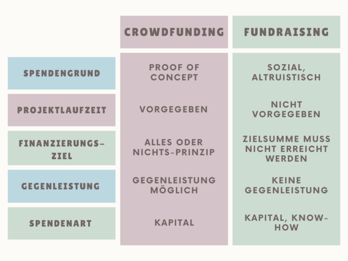
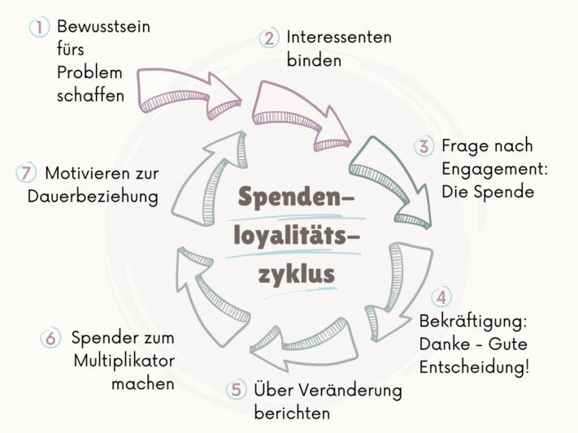

**La collecte de fonds** est plus qu'une simple stratégie de financement : c'est un moyen d'atteindre des objectifs communs. Du soutien **aux organisations d'utilité publique** au financement **de l'innovation entrepreneuriale** en passant par les **campagnes politiques**, il pénètre presque tous les domaines de la vie sociale. Il fait appel à une multitude de stratégies pour encourager l'engagement et la solidarité des personnes.

Dans cet article, nous jetons un regard approfondi sur le thème de la collecte de fonds et mettons en lumière différentes **méthodes** qui vous permettront d'enthousiasmer les gens pour vos idées et d'encourager les dons. Pour pouvoir poursuivre de manière conséquente votre objectif de don, collecter des dons et établir un certificat de don, vous avez enfin la chance d'essayer un **logiciel gratuit pour la gestion des dons**.

Une collecte de fonds bien planifiée peut aider une organisation à réaliser ses objectifs.

## Ce que signifie la collecte de fonds

La collecte de fonds est un terme anglais composé des mots _fund_ (fonds) et _raising_ (acquisition). Il désigne la collecte organisée et systématique de ressources pour des objectifs ou des projets spécifiques. En tant que méthode de levée de fonds, elle peut être utilisée à des fins **caritatives** ou **entrepreneuriales**.

Dans le contexte de l'entreprise, les investisseurs collectent des fonds pour financer les activités entrepreneuriales et permettre la croissance. D'autre part, la collecte de fonds est également utilisée à des fins caritatives, où des dons sont collectés pour **des projets sociaux**, que ce soit par de grandes organisations ou de plus petites associations. Dans ce cas, ce n'est pas l'attente d'une contrepartie directe de la part des donateurs qui est au premier plan, mais plutôt l'objectif d'exercer une influence positive sur la société ou sur un groupe cible particulier.

## Comment convaincre les donateurs

Pour réussir une collecte de fonds et convaincre les gens de votre projet, il est essentiel de **s'adresser** directement et **personnellement à eux**. Les donateurs potentiels doivent savoir clairement **qui vous êtes** et pour **quel projet** vous recherchez des dons.

Il est important de fournir des informations détaillées, y compris le **montant** spécifique dont vous avez besoin pour atteindre votre **objectif**. Utilisez un **langage émotionnel et descriptif** afin d'enthousiasmer le plus grand nombre possible de personnes intéressées par votre idée.



La collecte de fonds exige de la créativité pour attirer l'attention des gens.

## Collecte de fonds vs. crowdfunding

Lors de la **collecte de fonds**, les organisations ont la flexibilité de collecter des dons sans avoir à respecter un calendrier précis. Cela vous permet de planifier et de mener vos campagnes sur une plus longue période, ce qui peut être particulièrement avantageux lorsqu'il s'agit de collecter des sommes importantes ou de réaliser des projets complexes.

En revanche, dans le cas du **crowdfunding**, on fixe souvent une période déterminée, typiquement entre 30 et 60 jours, pendant laquelle l'objectif de don doit être atteint. Si l'objectif n'est pas atteint dans ce délai, les dons ne sont généralement pas versés et la campagne est considérée comme un échec.

Le graphique suivant donne un bref aperçu des principales différences.

La différence entre le fundraising et le crowdfunding

## Concepts et idées en matière de collecte de fonds

Dans le domaine de la collecte de fonds, il existe de nombreux concepts et idées que vous pouvez mettre en œuvre aussi bien hors ligne qu'en ligne. Peut-être avez-vous déjà rencontré la traditionnelle **collecte de fonds en face à face** dans les zones piétonnes ? Bien que de nombreuses personnes passent devant les stands sans être impressionnées, cette méthode compte parmi les plus efficaces. Alternativement, les événements de collecte de fonds hors ligne, tels que **les événements caritatifs**, les **ventes aux enchères** et les **courses à pied**, peuvent être un moyen efficace de collecter des fonds tout en impliquant la communauté.

Dans le monde numérique, de nombreuses possibilités s'offrent à vous pour collecter des dons. Les actions en ligne vous permettent d'atteindre un large éventail de **groupes cibles** et **de tranches d'âge**, ce qui vous donne la possibilité de toucher un plus grand nombre de donateurs potentiels.

**Hors ligne**

- Manifestations de collecte de fonds comme les ventes aux enchères ou les courses
- Lettres de don, flyers et affiches
- Conversations téléphoniques
- visites personnelles
- Discours dans la zone piétonne

**En ligne**

- e-mails et newsletters personnels
- Formulaires de dons
- Plateformes de collecte de fonds
- Offres actuelles
- Moteurs de recherche et marketing des médias sociaux

Les médias sociaux jouent un rôle de plus en plus important dans la collecte de fonds.

## La pyramide des donneurs

La pyramide des donateurs, développée par Joan Flanagan en 1991, est considérée comme l'un des **modèles** de base de la collecte de fonds. Elle structure les donateurs en fonction du montant de leurs contributions et montre comment l'**engagement** augmente à chaque étape, alors que le **nombre de donateurs** diminue. En outre, la pyramide des donateurs offre un aperçu du **temps nécessaire** à la collecte de fonds et des **revenus** escomptés par catégorie de donateurs.

De nos jours, la pyramide des donateurs est considérée de manière critique pour diverses raisons, car sa **structure hiérarchique** est dépassée et ne reflète plus le comportement moderne en matière de dons. La diversité des nouvelles possibilités de don, du crowdfunding en ligne au peer-to-peer fundraising, entraîne une dynamique plus complexe qui remet en question la pyramide traditionnelle.

Néanmoins, les **catégories de donneurs** peuvent toujours être utiles pour mieux segmenter les donneurs. Typiquement, on distingue ainsi les catégories de donneurs suivantes :

- Personnes intéressées
- Premier donneur
- Donneurs multiples et permanents
- Grand donateur
- Défunt

## Comment fonctionne la collecte de fonds

En utilisant les bonnes méthodes de collecte de fonds, vous pouvez créer un **réseau** de donateurs qui seront disponibles à **long terme** pour votre projet ou votre organisation. La pyramide des donateurs est à cet égard un outil utile pour illustrer comment un donateur passe du statut de personne intéressée à celui de premier donateur, puis éventuellement à celui de donateur permanent ou important.

Au fur et à mesure qu'un donateur s'implique dans votre projet, une **approche personnelle et individuelle** devient d'autant plus importante. Cela vaut la peine d'investir du temps et des ressources pour établir et maintenir des relations à long terme avec vos donateurs.

A l'inverse, la **prospection à froid** vous permet de contacter des donateurs potentiels qui n'ont pas eu de contact avec votre projet auparavant. Ici, l'accent est mis sur **la communication de masse**, puisque l'objectif est d'atteindre un large public. Cette méthode demande moins de temps, mais le rendement attendu par contact est plutôt faible.

## Trouver et fidéliser des donateurs

Entre le premier et le deuxième don, de nombreuses organisations à but non lucratif perdent une grande partie de leurs donateurs. Selon une [analyse](https://link.springer.com/book/10.1007/978-3-8349-6308-6) de Beat Hunziker, seule la moitié environ de tous les donateurs effectuent un deuxième don. Le **cycle de fidélisation des donateurs** est un modèle qui montre comment les personnes intéressées par un don peuvent devenir des soutiens engagés.

Cycle de fidélisation des donateurs

Ce cycle comprend différentes **phases**, dont l'acquisition de nouveaux donneurs, la conversion des premiers donneurs en donneurs récurrents, l'entretien et le renforcement des liens ainsi que la réactivation des donneurs inactifs.

Lors de la **prospection**, vous identifiez les donateurs potentiels et attirez leur attention sur votre cause par des mesures appropriées, que ce soit par des campagnes ciblées, des actions de relations publiques ou du marketing en ligne. Grâce à un discours adapté, vous pouvez inciter les personnes intéressées à faire un **premier don**.

Il s'agit ensuite de renforcer le **lien** et de faire en sorte que le donateur devienne un soutien régulier. Cela peut se faire par une communication personnalisée, des gestes de remerciement et une implication dans l'organisation. L'entretien des relations est un processus continu qui vise à consolider l'**engagement** et la **loyauté** du donateur à long terme. Cela implique des rapports réguliers sur le travail de l'organisation, la création de liens affectifs et la possibilité de participer à des événements ou des programmes.

Enfin, il est important de **réactiver les donateurs inactifs** afin d'exploiter à nouveau le potentiel des soutiens passés. En ciblant les donateurs inactifs et en leur proposant des offres, vous pouvez les encourager à faire de nouveau un don et à s'impliquer davantage dans votre organisation.

## Gérer les dons avec SeaTable

Avec le [modèle gratuit](https://seatable.io/fr/modele/nzqrkmzcsle8vkesd-lmpw/) de SeaTable, vous pourrez à l'avenir faire de la collecte de fonds un jeu d'enfant et rendre la gestion de vos dons aussi simple que possible. Organisez plusieurs projets en un seul endroit et gardez le cap.

Dans votre [base de données en ligne](https://seatable.io/fr/modele/nzqrkmzcsle8vkesd-lmpw/), vous pouvez non seulement **collecter et gérer les dons**, mais aussi calculer automatiquement la différence entre les dons déjà effectués et la somme cible. Créez **des reçus de dons** en un clic et gardez une vue d'ensemble des **coordonnées** de vos donateurs. Un tableau Kanban clair vous permet de voir d'un coup d'œil tous les faits importants et l'**avancement de vos projets**.

Pour les petites associations, les fonctions et les limites de stockage de SeaTable Free (version gratuite) devraient suffire. Si vous avez des projets plus importants, votre organisation à but non lucratif bénéficiera par défaut de [réductions](https://seatable.io/fr/docs/abo-abrechnung/rabatte-fuer-oeffentliche-non-profit-oder-bildungseinrichtungen/) sur les coûts de SeaTable Plus ou Enterprise.

[Inscrivez-vous](https://seatable.io/fr/enregistrement/) d'abord à l'abonnement gratuit et faites ensuite une demande correspondante via l'administration de l'équipe. Nous nous réjouissons de soutenir votre organisation à but non lucratif avec notre logiciel !
