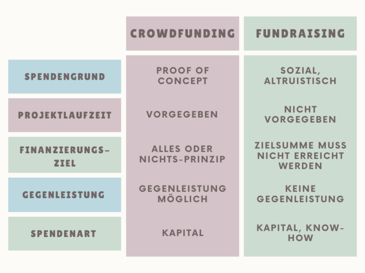
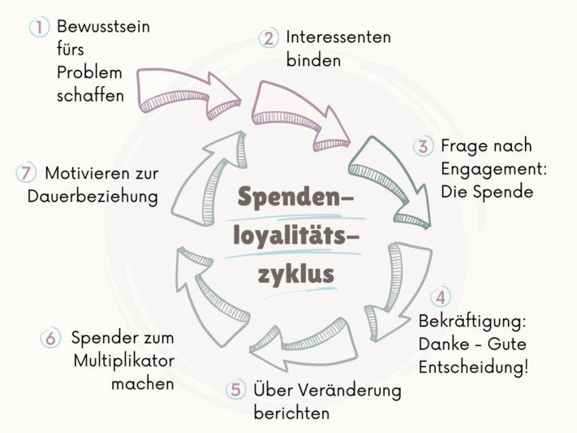

**Фандрайзинг** - это не просто стратегия финансирования: это способ совместного достижения целей. От поддержки **некоммерческих организаций** и **политических кампаний** до финансирования **предпринимательских инноваций** - он проникает практически во все сферы общественной жизни. Он опирается на различные стратегии, способствующие развитию приверженности и солидарности людей.

В этой статье мы подробно рассмотрим тему сбора средств и выделим различные **методы**, которые вы можете использовать, чтобы увлечь людей своими идеями и стимулировать пожертвования. Чтобы помочь вам последовательно добиваться своей цели по сбору средств, собирать пожертвования и выдавать квитанции о пожертвованиях, у вас наконец-то появится возможность попробовать **бесплатное программное обеспечение для управления пожертвованиями**.

Хорошо спланированный фандрайзинг может помочь организации достичь своих целей.

## Что означает сбор средств

Фандрайзинг - это английский термин, состоящий из слов _fund_ (средства) и _raising_ (закупки). Он означает организованное и систематическое привлечение ресурсов для конкретных целей или проектов. Как метод привлечения капитала, он может использоваться как в **благотворительных**, так и в **предпринимательских** целях.

В корпоративном контексте инвесторы привлекают деньги для финансирования предпринимательской деятельности и обеспечения роста. С другой стороны, фандрайзинг используется и в благотворительных целях, когда пожертвования собираются на **социальные проекты**, как крупными организациями, так и небольшими объединениями. В данном случае акцент делается не на ожидании прямой отдачи от донора, а на стремлении оказать положительное влияние на общество или конкретную целевую группу.

## Как убедить доноров

Для успешного сбора средств и убеждения людей в важности вашего проекта очень важен прямой и **личный подход**. Потенциальные доноры должны четко понимать, **кто вы** и для **какого проекта** ищете пожертвования.

Важно, чтобы вы предоставили подробную информацию, включая конкретную **сумму**, которая вам нужна для определенной **цели**. Используйте **эмоциональный и описательный язык**, чтобы вдохновить своей идеей как можно больше заинтересованных лиц.



Фандрайзинг требует креативности, чтобы привлечь внимание людей.

## Фандрайзинг против краудфандинга

**Фандрайзинг** дает организациям гибкость в сборе пожертвований без необходимости придерживаться определенных сроков. Это позволяет планировать и проводить кампании в течение длительного периода времени, что может быть особенно полезно, когда речь идет о сборе больших сумм или реализации сложных проектов.

В отличие от этого, в **краудфандинге** часто устанавливается определенный срок, обычно от 30 до 60 дней, в течение которого должна быть достигнута цель пожертвования. Если цель не достигнута в течение этого периода, пожертвования обычно не выплачиваются, а кампания считается провалившейся.

На следующей диаграмме представлен краткий обзор основных различий.

Разница между сбором средств и краудфандингом

## Концепции и идеи фандрайзинга

Существует множество различных концепций и идей по сбору средств, которые вы можете реализовать как в офлайне, так и в онлайне. Возможно, вы уже сталкивались с традиционным **сбором средств лицом к лицу** в пешеходных зонах? Хотя многие люди проходят мимо стендов, не впечатлившись, этот метод по-прежнему остается одним из самых успешных. Кроме того, эффективным способом сбора пожертвований и привлечения общественности могут стать офлайн-мероприятия, такие как **благотворительные акции**, **аукционы** и забеги по **сбору средств**.

В цифровом мире у вас есть множество возможностей для сбора пожертвований. Онлайн-кампании позволяют охватить широкий круг **целевых** и **возрастных** групп, что дает вам возможность обратиться к большему числу потенциальных доноров.

**Offline**

- Мероприятия по сбору средств, такие как аукционы или забеги
- Письма о пожертвованиях, листовки и плакаты
- Телефонные звонки
- Личные визиты
- Речь в пешеходной зоне

**Онлайн**

- Личные электронные письма и информационные бюллетени
- Формы для пожертвований
- Платформы для сбора средств
- Текущие предложения
- Поисковые системы и маркетинг в социальных сетях

Социальные сети играют все более важную роль в сборе средств.

## Пирамида доноров

Пирамида доноров, разработанная Джоан Фланаган в 1991 году, считается одной из основных **моделей** в фандрайзинге. Она структурирует доноров в зависимости от суммы их пожертвований и показывает, как с каждым уровнем растет **приверженность**, а **количество доноров** уменьшается. Кроме того, пирамида доноров дает представление о **времени**, необходимом для сбора средств, и ожидаемом **доходе** для каждой категории доноров.

В настоящее время пирамида доноров рассматривается критически по разным причинам, поскольку ее **иерархическая структура** устарела и больше не отражает современное поведение жертвователей. Разнообразие новых возможностей для пожертвований, от онлайн-краудфандинга до сбора средств с помощью равных, приводит к более сложной динамике, которая бросает вызов традиционной пирамиде.

Тем не менее, **категории доноров** могут быть полезны для более точной сегментации доноров. Как правило, выделяют следующие группы доноров:

- Заинтересованные стороны
- Первые доноры
- Многочисленные и постоянные доноры
- Основные доноры
- Завещатель

## Как происходит сбор средств

Используя правильные методы сбора средств, вы можете создать **сеть** доноров, которые будут доступны вашему проекту или организации **в долгосрочной перспекти** ве. Пирамида доноров - полезный инструмент, иллюстрирующий, как донор проходит путь от потенциального донора к первоначальному донору, а затем, возможно, к постоянному или крупному донору.

Чем больше донор участвует в вашем проекте, тем важнее становится **личный и индивидуальный подход**. Стоит потратить время и ресурсы на создание и поддержание долгосрочных отношений с донорами.

Это отличается от **"холодных звонков**", когда вы обращаетесь к потенциальным донорам, ранее не имевшим контактов с вашим проектом. Здесь акцент делается на **массовую коммуникацию**, поскольку цель - охватить широкую общественность. Этот метод требует меньше времени, но ожидаемая отдача от каждого контакта довольно низкая.

## Поиск и удержание доноров

Многие некоммерческие организации теряют значительную часть своих доноров между первым и вторым пожертвованием. Согласно [анализу](https://link.springer.com/book/10.1007/978-3-8349-6308-6), проведенному Беатом Хунцикером, только около половины всех доноров делают второе пожертвование. **Цикл лояльности донора** - это модель, которая показывает, как люди, заинтересованные в пожертвовании, могут стать преданными сторонниками.

Цикл лояльности доноров

Этот цикл включает в себя различные **этапы**, в том числе привлечение новых доноров, превращение первых доноров в постоянных, поддержание и укрепление лояльности и реактивация неактивных доноров.

В процессе **привлечения** вы выявляете потенциальных доноров и привлекаете их внимание к своему делу с помощью соответствующих мер, будь то целевые кампании, PR-акции или онлайн-маркетинг. Вы можете использовать подходящий подход, чтобы убедить заинтересованных лиц сделать **первоначальное пожертвование**.

Затем важно укрепить эту **связь** и превратить донора в постоянного сторонника. Этого можно достичь с помощью персонализированного общения, жестов благодарности и вовлечения в деятельность организации. Управление отношениями - это непрерывный процесс, направленный на закрепление **приверженности** и **лояльности** донора в долгосрочной перспективе. Это включает в себя регулярные отчеты о работе организации, создание эмоциональных связей и возможность участия в мероприятиях или программах.

Наконец, для реализации потенциала бывших сторонников важно **активизировать неактивных доноров**. С помощью целевых подходов и предложений вы можете побудить неактивных доноров снова жертвовать и активнее участвовать в жизни вашей организации.

## Управляйте пожертвованиями с помощью SeaTable

С помощью [бесплатного шаблона]() SeaTable вы сможете легко организовать сбор средств и сделать управление пожертвованиями максимально простым. Организуйте несколько проектов в одном месте и оставайтесь организованными.

В своей [онлайн-базе данных]() вы можете не только **собирать и управлять пожертвованиями**, но и автоматически подсчитывать разницу между уже сделанными пожертвованиями и целевой суммой. Создавайте **квитанции о пожертвованиях** одним щелчком мыши и отслеживайте **контактные** данные ваших доноров. На четко организованной доске Kanban можно сразу увидеть все важные факты и **ход выполнения проектов**.

Для небольших организаций должно быть достаточно функций и лимитов хранения SeaTable Free (бесплатная версия). Если у вас более крупные планы, ваша некоммерческая организация получит стандартные [скидки]() на стоимость SeaTable Plus или Enterprise.

Сначала [зарегистрируйтесь]() для получения бесплатной подписки, а затем отправьте соответствующий запрос через администрацию команды. Мы будем рады поддержать вашу некоммерческую организацию с помощью нашего программного обеспечения!
