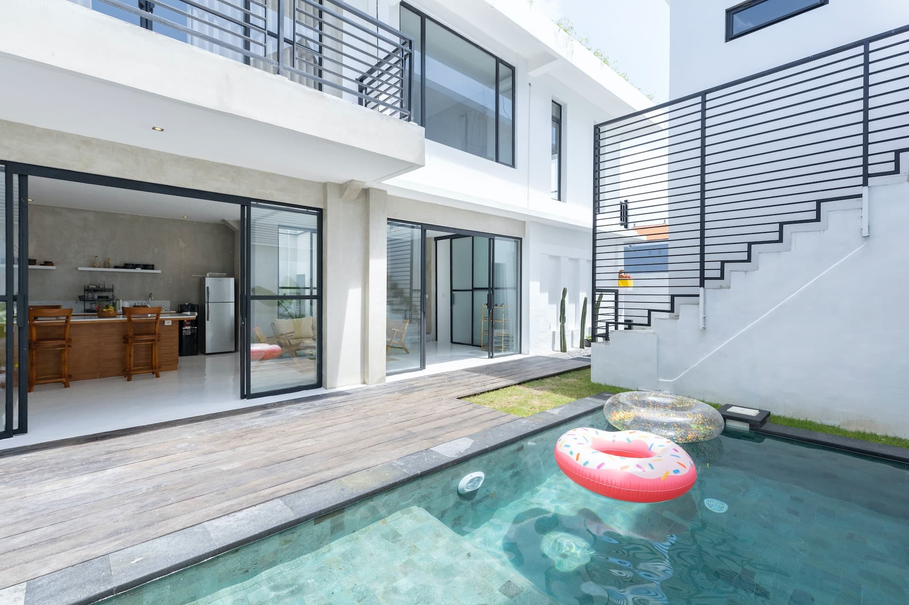
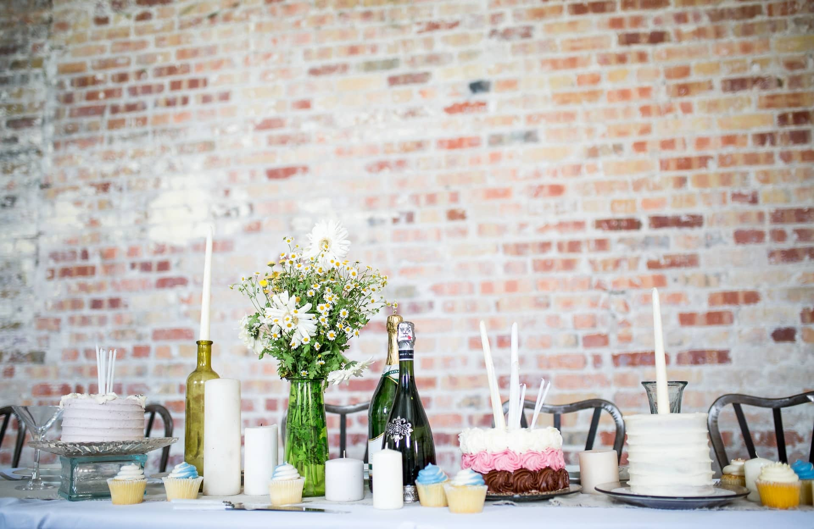

Sie feiern demnächst Ihren Geburtstag oder wollen für Ihre Liebsten eine Geburtstagsfeier planen? Damit Ihre Party einzigartig wird und bei Ihren Gästen noch lange in Erinnerung bleibt, ist eine detaillierte Planung unerlässlich. Von der Auswahl einer traumhaften Location bis hin zu Verpflegung und Musik – die frühzeitige Organisation aller wichtigen Aspekte Ihrer Party schafft die perfekten Voraussetzungen für eine gelungene Feier. Egal, ob runder Geburtstag, Mottoparty oder Kindergeburtstag: Mit unserer Anleitung können Sie jede Party organisieren und verwirklichen.

## Schritt 1: Die Rahmenbedingungen Ihrer Geburtstagsfeier

Die ersten Schritte für eine Geburtstagsfeier planen Sie am besten etwa **acht Wochen** im Voraus. Dabei geht es zunächst darum, die grundlegenden Eckpunkte festzulegen.

## Termin für eine Geburtstagsfeier planen

Bevor Sie damit beginnen, die Einzelheiten Ihrer Party zu planen, müssen Sie zunächst ein Datum für Ihre Geburtstagsfeier finden. Legen Sie sich dabei nicht auf Ihr genaues Geburtsdatum fest, sondern berücksichtigen Sie die Verfügbarkeit Ihrer Gäste. Wenn Sie mit vielen berufstätigen Erwachsenen feiern, entscheiden Sie sich idealerweise für einen Termin am **Wochenende** (Freitag oder Samstag). So können Ihre Gäste die Feier in vollen Zügen genießen können und am nächsten Tag bleibt noch genug Zeit zur Regeneration und zum Aufräumen. Durch eine Feier am Wochenende ermöglichen Sie auch Gästen, die etwas weiter entfernt wohnen, eine bequeme An- und Abreise.

Wenn Sie einen **Kindergeburtstag** planen, eignet sich ebenso ein Nachmittag unter der Woche für die Party. Ist das Geburtstagskind und der Großteil der Gäste erwachsen, kann die Feier abends stattfinden und bis in die Nacht gehen. Beachten Sie bei der Auswahl eines geeigneten Termins darüber hinaus die gesetzlichen Feiertage und fragen Sie frühzeitig die Verfügbarkeit Ihrer engsten Freunde und Verwandten ab.

## Gästeliste für Ihre Geburtstagsfeier erstellen

Steht der Termin für Ihre Geburtstagsfeier fest, sollten Sie sich frühzeitig an die Erstellung einer Gästeliste machen. Entscheiden Sie sich dafür zunächst, ob Sie Ihren Geburtstag lieber im kleinen Kreis mit Ihren engsten Freunden und Verwandten oder doch lieber in größerem Rahmen feiern möchten. Bei der Zusammenstellung Ihrer Gästeliste kann oftmals eine **bunte Mischung aus Verwandten, Freunden, Arbeitskollegen und anderen Wegbegleitern** vorteilhaft sein. Zudem sollten Sie sicherstellen, dass die Chemie unter Ihren eingeladenen Gästen stimmt und kein Konfliktpotenzial vorprogrammiert ist. Egal, für welche Gäste Sie sich letztendlich entscheiden: Eine frühzeitig erstellte Gästeliste schafft klare Verhältnisse und erleichtert Ihnen weitere Planungsschritte wie die Auswahl einer Location oder die Kalkulation von Essen und Getränken.

## Motto und Dresscode

Sowohl **Motto** als auch **Dresscode** sind keinesfalls verpflichtend, können Ihrer Party jedoch einen einzigartigen Charakter verleihen. Ein spannendes und einfallsreiches Motto gibt Ihrer Geburtstagsfeier einen Rahmen, an den Sie die weitere Planung, z. B. die Auswahl der Location und des Menüs, anpassen können. Ein dazugehöriger Dresscode kann Ihren Gästen eine Stilrichtung vorgeben. So stellen Sie sicher, dass keiner Ihrer Gäste over- oder underdressed auf Ihrer Party erscheint und sich aufgrund seines Outfits unwohl fühlt. Ein Dresscode kann somit für eine aufgelockerte Stimmung sorgen, die sich positiv auf den Verlauf Ihrer Party auswirkt.

Falls Sie auf der Suche nach einem passenden Motto samt Dresscode für Ihre Party sind, haben wir hier einige Inspirationen für Sie:

- **Maskenball** – geheimnisvolles Ambiente wie im alten Venedig
- **Hollywood-Stars** – rollen Sie Ihren Gästen den roten Teppich aus
- **90er-Party** – schräge Outfits und krasse Beats
- **Film- oder Serienmotto** – von Disney bis “Haus des Geldes”
- **Zirkus** – Artisten, Tiger und Dompteure zu Gast
- **Karneval** – rheinische Jecken oder Samba aus Brasilien
- **Superhelden** – laden Sie die Helden von Marvel und DC ein

## Location für Ihre Geburtstagsfeier auswählen und buchen

Einer der wichtigsten Punkte Ihrer Party ist die Location, an der Sie es mit Ihren Liebsten krachen lassen. Denn ein passender Veranstaltungsort ist es, der Ihre Feier unvergesslich macht!

Die Auswahl einer passenden Location stellt sich oftmals als herausfordernd heraus, da Ihnen zu Beginn scheinbar unendliche Möglichkeiten offenstehen. Berücksichtigen Sie dabei jedoch, dass die Location nicht nur zu Ihren Gästen, sondern auch zu den Wetterbedingungen der **Jahreszeit** und ggf. zum Motto Ihrer Party passen sollte. Stellen Sie daher zunächst eine Liste mit Kriterien auf, die der potenzielle Veranstaltungsort erfüllen muss. Denken Sie auch darüber nach, die Party in den eigenen vier Wänden, im Freien oder an einem öffentlichen Ort steigen zu lassen. So sparen Sie sich die **Miete** einer Location und können Ihr Budget anderweitig verteilen. Falls Sie sich dennoch für einen externen Veranstaltungsort entscheiden, können Sie die Auswahl anhand Ihrer aufgestellten Kriterien erheblich einschränken.

Außergewöhnliche Location für eine Geburtstagsfeier: ein Ferienhaus für eine Poolparty mieten.

Für eine Geburtstagsparty bieten sich beispielsweise **Restaurants, Bars oder Clubs**, aber auch günstigere **Vereinsheime, Grillhütten und Veranstaltungsräume** an. Für einen runden Geburtstag wären zudem außergewöhnliche Locations wie ein **Weingut**, **Schloss** oder **Ferienhaus** eine Überlegung wert. In diesem Fall müssten Sie sich aber auch Gedanken zur Anreise und Unterbringung Ihrer Gäste machen. Bei der finalen Entscheidung für Ihre Location sollten Sie stets Faktoren wie die Anzahl Ihrer Gäste und die Wetteraussichten im Hinterkopf haben. Darüber hinaus sollte Ihre Location genug Platz für Ihre Gäste und ggf. eine Tanzfläche für ausgelassene Stimmung bieten. Grundsätzlich gilt es, die **Buchung** des Veranstaltungsorts so früh wie möglich anzugehen, denn beliebte Locations sind oftmals Wochen, wenn nicht sogar Monate im Voraus ausgebucht.

## Einladungen verschicken

Nachdem Sie sich um den Termin, die Gästeliste und die Location für Ihre Geburtstagsfeier gekümmert haben, sind die grundlegenden Eckpunkte Ihrer Feier geklärt. Zeit also, sich an die Einladungen zu Ihrer unvergesslichen Party zu machen! Dank Ihrer frühzeitig erstellten Gästeliste haben Sie alle einzuladenden Gäste auf einen Blick.

**Tipp: Save the Date**  
Bei größeren Geburtstagsfeiern ist es sinnvoll, schon Monate im Voraus eine Save-the-Date-Einladung mit dem Termin an die Gäste zu schicken. So erhöhen Sie die Chance, dass möglichst viele Gäste Ihre Einladung annehmen, die Party einplanen und sich rechtzeitig freinehmen können.

Liebevolle Einladungskarten bieten Ihnen eine tolle Möglichkeit, nicht nur den Termin und die Location Ihrer Geburtstagsparty, sondern ggf. auch das Motto im Vorhinein anzukündigen. Gestalten Sie Ihre Einladungen, wenn Sie mögen, für jeden Gast individuell. Dies macht einen persönlichen Eindruck, steigert die Vorfreude auf Ihre Party und kann die Anzahl an Zusagen erhöhen. Denken Sie daran, Ihren Gästen alle wichtigen und bereits feststehenden Informationen in der Einladung mitzuteilen, und legen Sie eine Deadline für Rückmeldungen fest. So haben Sie Planungssicherheit und können frühzeitig auf Absagen reagieren. Sinnvoll ist es auch, bei der Einladung Allergien und Essgewohnheiten abzufragen und zu klären, ob die Gäste mit Partner und evtl. Kindern teilnehmen.

## Schritt 2: Die Einzelheiten Ihrer Party

Sobald die Eckpunkte Ihrer Geburtstagsfeier geklärt sind, ist es Zeit, sich um die konkreten Einzelheiten Ihrer Party zu kümmern. Eine rechtzeitige Planung zahlt sich in diesem Schritt besonders aus. Daher sollten Sie sich spätestens einen Monat vor Ihrer Party um grundlegende Dinge wie Verpflegung und Musik kümmern.

## Verpflegung für eine Geburtstagsfeier planen

Der wohl wichtigste Teil jeder Party ist die Verpflegung Ihrer Gäste. Denn egal, wie gut die Party war: Keiner wird sich gerne an eine Geburtstagsfeier erinnern, die er durstig und mit leerem Magen wieder verlassen hat. Wenn Sie Ihren Geburtstag beispielsweise in einem **Restaurant** feiern, ist die Planung ein Kinderspiel. Sie brauchen nichts weiter tun, als das Menü und die Getränke zusammen mit dem Restaurant abzusprechen.

Steigt Ihre Geburtstagsparty jedoch bei Ihnen zu Hause oder an einem anderen Ort, liegt die Verantwortung für die Verpflegung in Ihren Händen. Damit auf Ihrer Feier für ausreichend Essen und Trinken gesorgt ist, gilt es zunächst die Anzahl der Gäste im Blick zu haben. Je nachdem bietet es sich entweder an, selbst zu kochen, einen Catering-Dienst zu engagieren oder Speisen und Getränke von den Gästen mitbringen zu lassen.

### Die Verpflegung Ihrer Gäste selbst in die Hand nehmen

Die Entscheidung, die Verpflegung Ihrer Gäste selbst zu übernehmen, ist mit viel Aufwand und einer oftmals nicht ganz einfachen Kalkulation von Speise- und Getränkemengen verbunden. Bei größeren Feiern sollten Sie daher schon ein bis zwei Tage im Voraus einkaufen, Kuchen backen und haltbare Gerichte zubereiten. Zusätzlich müssen Sie Essgewohnheiten, Unverträglichkeiten und Wünsche Ihrer Gäste bei der Auswahl des Speisenangebots berücksichtigen.

Wenn Sie keine Helfer damit beauftragen, werden Sie auf der Geburtstagsparty selbst das Essen auftischen und die Getränke ausschenken müssen. Dabei sind Sie es, die bei Ihrer Geburtstagsfeier im Mittelpunkt stehen sollen. Bei Feiern mit mehr als 10 Personen empfiehlt sich deshalb: Amüsieren Sie sich, lassen Sie sich feiern und verbringen Sie unvergessliche Stunden im Beisein Ihrer Liebsten, anstatt die Zeit an diesem besonderen Tag in der Küche zu verbringen.

### Einen Catering-Service beauftragen

Vor allem bei Feiern im größeren Kreis erspart es Ihnen viel Zeit und Stress, für die Bewirtung Ihrer Gäste einen Catering-Service zu beauftragen. Teilen Sie dem Caterer einfach die Anzahl Ihrer Gäste mit und dieser erstellt ein passendes Verpflegungsangebot nach Ihren Wünschen. Falls die Beauftragung eines Catering-Services nicht in Ihr Budget passt, besteht auch die kostengünstigere Möglichkeit, einen Foodtruck zu organisieren. Dieser versorgt Ihre Gäste direkt vor Ort mit leckeren Speisen. Behalten Sie bei Ihrer Entscheidung auf jeden Fall den Rahmen und ggf. auch das Motto Ihrer Geburtstagsparty im Blick und sorgen Sie dafür, dass für alle Gäste etwas dabei ist. Nachfolgend finden Sie einige leckere Vorschläge:

- Sektempfang mit kleinen Häppchen
- Fingerfood und Salate
- Grillbuffet
- Burger und Pommes
- Pizza und Pasta
- Kuchen und Desserts

### Ihre Gäste um Hilfe bitten

Eine ebenso bequeme, aber günstigere Lösung ist es, Ihre Gäste um das Mitbringen von Speisen und Getränken zu bitten. Auf diesem Wege kommt schnell ein großzügiges Buffet an Salaten, Snacks, Kuchen und anderen Köstlichkeiten zusammen. Noch dazu ersparen Sie Ihren Gästen damit die verzweifelte Suche nach Geschenken.

Dennoch müssen Sie natürlich den Teil der Verpflegung selbst planen, der für einzelne Gäste zu viel verlangt wäre. Dazu zählen Getränkekisten und warme, frisch zubereitete Speisen. Vor dem Einkauf für Ihre Party kann es sinnvoll sein, Vorlieben und Wünsche Ihrer Gäste abzufragen. Falls Sie ein Motto für Ihre Geburtstagsfeier festgelegt haben, richten Sie das Angebot an Essen und Getränken nach diesem Thema aus.

## Stimmungsvolle Musik und abwechslungsreiches Rahmenprogramm

Nachdem Sie sich um die Verpflegung gekümmert haben, sollten Sie sich zeitnah auch mit der Unterhaltung auf Ihrer Party auseinandersetzen. Stimmungsvolle Musik und ein abwechslungsreiches Rahmenprogramm sind für eine ausgelassene Stimmung auf jeder Party unerlässlich. Denn wer möchte schon eine Geburtstagsparty, die von bedrückender Stille und langweiligen Gesprächen geprägt ist?

Wenn Ihre Location über klangvolle Lautsprecher verfügt, können Sie ganz einfach selbst mit einer passenden Playlist für Partylaune sorgen. Für ein unvergessliches Erlebnis können Sie aber auch eine Live-Band oder einen DJ beauftragen, der die Stimmung anheizt und Ihre Gäste zum Tanzen animiert. Vielleicht haben Sie ja auch einen Musiker oder einen DJ im Freundeskreis und können sich die Kosten für das Engagieren einer externen Person sparen.

Eine Live-Band ist ein Highlight für jede große Geburtstagsfeier.

Neben guter Musik können Sie mit einem abwechslungsreichen Rahmenprogramm auf Ihrer Party punkten. Beliebte Programmpunkte sind beispielsweise:

- Party-Spiele oder ein Quiz
- kurze Ansprachen und Reden
- eine Diashow mit lustigen Bildern des Geburtstagskindes
- gemeinsam singen oder ein Karaoke-Wettbewerb
- Fotobox oder Fotowand, um Erinnerungen an Ihre Party festzuhalten

Abhängig von Ihrem Budget stehen Ihnen zahlreiche Möglichkeiten zur Verfügung. Seien Sie kreativ und sorgen Sie mit einem bunten Mix aus Musik und Unterhaltungsprogramm für unvergessliche Momente mit Ihren Liebsten.

## Dekoration und Ausstattung Ihrer Partylocation

Damit Ihre Party-Location auch optisch etwas hermacht, ist es wichtig, sich Gedanken um Dekoration und Ausstattung zu machen. Egal, ob Sie bei sich zuhause oder an einem externen Veranstaltungsort eine Geburtstagsfeier planen: Stilvoll ausgestattete Räumlichkeiten kommen immer gut an und sorgen dafür, dass Ihre Gäste sich wohlfühlen. Denken Sie dabei vor allem an Tischdekoration, festliche Beleuchtung, Blumen, Gestecke oder Girlanden, die Sie natürlich allesamt an ein Partymotto anpassen können.

Neben der Dekoration sollten Sie bei einer Feier, die nicht in einer Gaststätte stattfindet, auch an eine ausreichende Ausstattung denken. Bei einer Gartenparty können Sie beispielsweise Bierzelte, Tischgarnituren oder andere Sitz- und Stehgelegenheiten bei einem Party-Verleih mieten. Zählen Sie bei einer selbst organisierten Geburtstagsfeier auch das Geschirr, also ob Sie genug Gläser, Besteck und Teller haben. Ferner sollte Ihre Location über eine ausreichende Anzahl an Toiletten für Ihre Gäste verfügen.

## Schritt 3: Die letzten Vorbereitungen für Ihre Geburtstagsfeier

Ihre Geburtstagsfeier rückt immer näher und Sie haben bereits alle Details geklärt? Dann ist es etwa eine Woche vor Ihrer Party höchste Zeit, mit den finalen Vorbereitungen für Ihren unvergesslichen Tag zu beginnen.

### Abschließende Vorbereitungen und Besorgungen

Während der große Tag immer näher rückt, sollten Sie die verbleibende Zeit für die finalen Vorbereitungen und Besorgungen nutzen. Bei einer Party in einer angemieteten Location setzen Sie sich dazu mit dem Veranstalter in Verbindung und sprechen die Vorbereitungen vor Ort durch. Wenn Sie Ihre Geburtstagsfeier selbst organisieren, fangen Sie an die Party-Location herzurichten, holen Sie gemietete Ausstattung ab und erledigen Sie die letzten noch ausstehenden Besorgungen. Bleiben Sie dazu stets in engem Kontakt mit Ihren Gästen, vor allem wenn Sie diese in die Planung einbezogen haben. Bitten Sie diese ggf. um Hilfe und teilen Sie diesen unerwartete Änderungen frühzeitig mit.

### Finaler Check

Sobald Ihre Feier nur noch wenige Tage entfernt ist, ist es Zeit für einen finalen Check. Haben Sie an alles gedacht? Ist die Verpflegung bestellt oder eingekauft? Ist die Location vorbereitet? Arbeiten Sie sich Schritt für Schritt durch jeden Punkt Ihrer [Checkliste](https://de.wikihow.com/Eine-Geburtstagsparty-planen) und überprüfen Sie, ob Ihre Party vollständig geplant ist.

Haben Sie in bestimmten Bereichen noch Nachholbedarf? Kein Problem! Viele Dinge lassen sich auch noch wenige Tage vor Ihrer Party regeln. Sie sind alle Punkte durchgegangen und haben keine ausstehenden To-dos mehr gefunden? Dann ist für Ihre Party alles bestens vorbereitet und uns bleibt nichts anderes übrig, als Ihnen eine unvergessliche Geburtstagsfeier zu wünschen!

## Fazit

Eine Geburtstagsfeier planen und organisieren – was für viele nach einem Kinderspiel klingt, stellt sich aus eigener Erfahrung oftmals als langwieriger und mühevoller Prozess heraus. Denn wer eine einzigartige und unvergessliche Party veranstalten möchte, muss sich möglichst früh um alle wichtigen Vorbereitungen kümmern. Bei all dem Stress kann es schnell passieren, dass man eine wichtige Person bei der Planung vergisst, zu wenig Speisen und Getränke bestellt oder sein zur Verfügung stehendes Budget aus den Augen verliert.

Damit Ihnen all diese Missgeschicke erspart bleiben und Sie voller Vorfreude Ihrer kommenden Feier entgegenblicken können, haben wir von SeaTable einen [Party-Planer]() entwickelt, mit dem Sie Ihre Party übersichtlich und strukturiert vorbereiten können und dabei stets Ihre Gäste im Blick behalten. Probieren Sie es gerne aus, indem Sie sich kostenlos [registrieren]().
