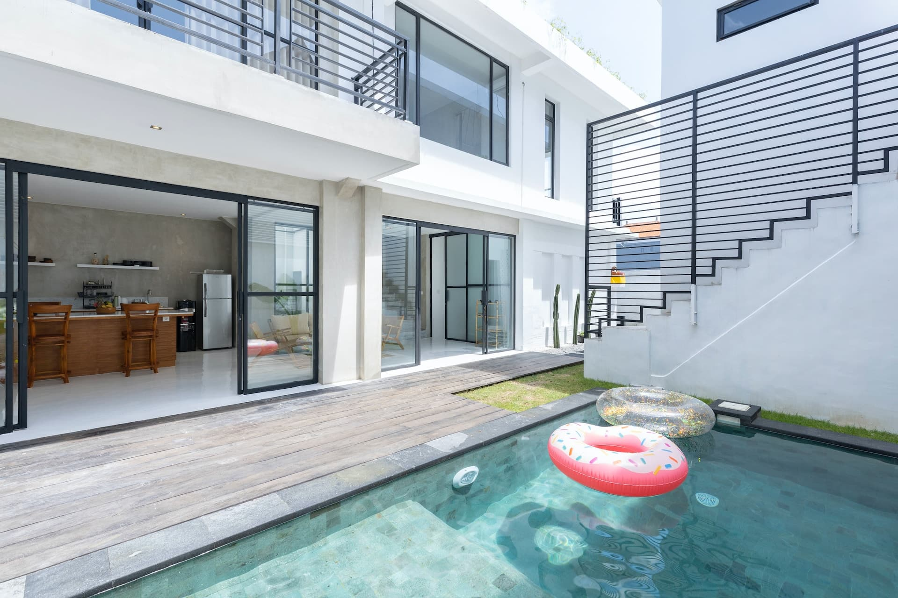

¿Celebra pronto su cumpleaños o quiere organizar una fiesta de cumpleaños para sus seres queridos? Una planificación detallada es esencial para garantizar que su fiesta sea única y sus invitados la recuerden durante mucho tiempo. Desde la elección de un lugar de ensueño hasta el catering y la música, la organización anticipada de todos los aspectos importantes de tu fiesta crea las condiciones perfectas para que la celebración sea un éxito. Ya sea un cumpleaños redondo, una fiesta temática o una fiesta de cumpleaños infantil: con nuestra ayuda, podrá organizar y realizar cualquier fiesta.

## Paso 1: El marco de tu fiesta de cumpleaños

Los primeros pasos para una fiesta de cumpleaños se planifican mejor con unas **ocho semanas** de antelación. Lo primero que hay que hacer es establecer los pilares básicos.

## Planificar una fecha para una fiesta de cumpleaños

Antes de empezar a planificar los detalles de tu fiesta, primero tienes que encontrar una fecha para tu fiesta de cumpleaños. No te comprometas con la fecha exacta de tu nacimiento, pero ten en cuenta la disponibilidad de tus invitados. Si vas a celebrarlo con muchos adultos que trabajan, lo ideal es optar por una fecha de **fin de semana** (viernes o sábado). De este modo, tus invitados podrán disfrutar al máximo de la celebración y aún habrá tiempo suficiente para regenerarse y limpiar al día siguiente. Celebrar la fiesta en fin de semana también permite a los invitados que viven un poco más lejos llegar y marcharse cómodamente.

Si está planeando una fiesta de **cumpleaños infantil**, una tarde entre semana es igualmente adecuada para la fiesta. Si el cumpleañero y la mayoría de los invitados son adultos, la fiesta puede celebrarse por la tarde y prolongarse hasta la noche. A la hora de elegir una fecha adecuada, ten en cuenta también los días festivos y comprueba con antelación la disponibilidad de tus amigos y familiares más cercanos.

## Crea una lista de invitados para tu fiesta de cumpleaños

Una vez fijada la fecha de tu fiesta de cumpleaños, deberías empezar a elaborar pronto la lista de invitados. Decida primero si prefiere celebrar su cumpleaños en un círculo reducido con sus amigos y parientes más cercanos o a mayor escala. A la hora de confeccionar la lista de invitados, suele ser beneficioso contar con una **mezcla variada de parientes, amigos, compañeros de trabajo y otros acompañantes**. También debes asegurarte de que la química entre los invitados sea la adecuada y no haya posibilidad de conflictos. Independientemente de los invitados por los que finalmente se decida: Una lista de invitados elaborada con antelación crea unas condiciones claras y facilita los pasos posteriores de la planificación, como la elección del lugar o el cálculo de la comida y la bebida.

## Lema y código de vestimenta

Tanto el **lema** como el **código de vestimenta** no son en absoluto obligatorios, pero pueden dar a tu fiesta un carácter único. Un tema emocionante e imaginativo da a tu fiesta de cumpleaños un marco en el que puedes adaptar la planificación posterior, por ejemplo, la elección del lugar y el menú. Un código de vestimenta puede orientar el estilo de tus invitados. Así te asegurarás de que ninguno de tus invitados vaya demasiado o demasiado mal vestido a la fiesta y se sienta incómodo por su atuendo. Un código de vestimenta puede crear un ambiente relajado que repercuta positivamente en el desarrollo de la fiesta.

Si estás buscando un lema adecuado, incluido el código de vestimenta, para tu fiesta, aquí tenemos algo de inspiración para ti:

- **Baile de máscaras** - ambiente misterioso como en la antigua Venecia
- **Estrellas de Hollywood**: extienda la alfombra roja para sus invitados
- **Fiesta de los 90**: trajes raros y ritmos asesinos
- **Lema de películas o series**: de Disney a "House of Money".
- **Circo**: artistas, tigres y domadores como invitados
- **Carnaval**: juerguistas renanos o samba brasileña
- **Superhéroes**: invita a los héroes de Marvel y DC

## Seleccione y reserve un lugar para su fiesta de cumpleaños

Uno de los puntos más importantes de tu fiesta es el lugar donde te desahogas con tus seres queridos. Al fin y al cabo, un lugar adecuado es lo que hace que tu celebración sea inolvidable.

Elegir un lugar adecuado suele ser todo un reto, ya que, para empezar, las opciones parecen infinitas. Sin embargo, tenga en cuenta que el lugar no sólo debe adaptarse a sus invitados, sino también a las condiciones meteorológicas de la **temporada** y, si procede, al tema de su fiesta. Por lo tanto, primero haz una lista de los criterios que debe cumplir el posible lugar de celebración. Piensa también en celebrar la fiesta en tus propias cuatro paredes, al aire libre o en un lugar público. Esto le ahorrará el coste de **alquilar** un local y le permitirá destinar su presupuesto a otros fines. Si aun así te decides por un local externo, puedes reducir considerablemente la elección en función de los criterios que hayas establecido.

Lugar excepcional para una fiesta de cumpleaños: alquile una casa de vacaciones para una fiesta en la piscina.

Los **restaurantes, bares o discotecas**, por ejemplo, pero también las casas club más baratas **, las cabañas para barbacoas y los salones de actos** son adecuados para una fiesta de cumpleaños. Para un cumpleaños redondo, también merece la pena pensar en lugares insólitos, como **una bodega**, un **castillo** o una **casa de vacaciones**. En este caso, sin embargo, también habría que pensar en el viaje y el alojamiento de los invitados. A la hora de tomar la decisión final sobre el lugar, siempre hay que tener en cuenta factores como el número de invitados y la previsión meteorológica. Además, el lugar debe ofrecer espacio suficiente para los invitados y, si es necesario, una pista de baile para animar el ambiente. Por regla general, debe empezar a **reservar** el lugar lo antes posible, ya que los lugares más populares suelen estar reservados con semanas, si no meses, de antelación.

## Enviar invitaciones

Una vez que te hayas ocupado de la fecha, la lista de invitados y el lugar de celebración de tu fiesta de cumpleaños, los pilares básicos de tu celebración están asentados. Así que es hora de ponerse manos a la obra con las invitaciones para tu inolvidable fiesta. Gracias a tu lista de invitados anticipada, tendrás todos los invitados de un vistazo.

**Consejo: Reserve la fecha**  
Para las fiestas de cumpleaños más grandes, tiene sentido enviar a los invitados una invitación con la fecha reservada con meses de antelación. Así aumentan las posibilidades de que el mayor número posible de invitados acepte la invitación, planifique la fiesta y se tome vacaciones con tiempo.

Unas bonitas tarjetas de invitación son una forma estupenda de anunciar por adelantado no sólo la fecha y el lugar de tu fiesta de cumpleaños, sino también el tema, si procede. Si quieres, diseña tus invitaciones individualmente para cada invitado. Esto causa una impresión personal, aumenta la expectación por tu fiesta y puede incrementar el número de aceptaciones. Acuérdate de comunicar a tus invitados toda la información importante y ya fijada en la invitación y establece un plazo para que te envíen sus comentarios. Esto le da seguridad en la planificación y le permite reaccionar a tiempo ante las cancelaciones. También tiene sentido preguntar en la invitación sobre alergias y hábitos alimenticios y aclarar si los invitados asistirán con su pareja y eventuales hijos.

## Paso 2: Los detalles de tu fiesta

Una vez aclarados los puntos clave de tu fiesta de cumpleaños, es hora de ocuparse de los detalles concretos de la misma. Una planificación a tiempo merece la pena sobre todo en este paso. Por lo tanto, debes ocuparte de cosas básicas como el catering y la música al menos un mes antes de la fiesta.

## Planificar el catering de una fiesta de cumpleaños

Probablemente la parte más importante de cualquier fiesta sea el catering para los invitados. Porque por muy buena que haya sido la fiesta, nadie recordará con cariño un cumpleaños si se ha ido con sed y el estómago vacío. Si celebras tu cumpleaños en un **restaurante**, por ejemplo, la planificación es un juego de niños. Lo único que tienes que hacer es acordar el menú y las bebidas con el restaurante.

Sin embargo, si tu fiesta de cumpleaños es en tu casa o en otro lugar, la responsabilidad del catering está en tus manos. Para asegurarte de que hay suficiente comida y bebida en tu fiesta, lo primero que debes tener en cuenta es el número de invitados. Dependiendo del número de invitados, puedes cocinar tú mismo, contratar un servicio de catering o hacer que los invitados traigan su propia comida y bebida.

### Tome en sus manos el catering de sus invitados

La decisión de servir tú mismo el catering a tus invitados implica mucho esfuerzo y, a menudo, un cálculo no tan fácil de las cantidades de comida y bebida. Por eso, para las celebraciones más grandes, debes hacer la compra, hornear pasteles y preparar platos duraderos con uno o dos días de antelación. Además, debes tener en cuenta los hábitos alimentarios, las intolerancias y los deseos de tus invitados a la hora de elegir la comida.

Si no contratas ayudantes, tendrás que servir tú mismo la comida y servir las bebidas en la fiesta de cumpleaños. Sin embargo, eres tú quien debe ser el centro de atención en tu fiesta de cumpleaños. Por eso, para fiestas de más de 10 personas, se recomienda que disfrutes, te dejes festejar y pases horas inolvidables en presencia de tus seres queridos en lugar de pasar el tiempo en la cocina en este día tan especial.

### Contratar un servicio de catering

Especialmente para las fiestas más grandes, le ahorrará mucho tiempo y estrés contratar un servicio de catering para sus invitados. Sólo tiene que informar al servicio de catering del número de invitados y éste preparará una oferta de catering adecuada a sus deseos. Si contratar un servicio de catering no se ajusta a tu presupuesto, también existe la opción más económica de organizar un food truck. De este modo, tus invitados disfrutarán de deliciosa comida directamente in situ. A la hora de tomar una decisión, ten en cuenta el entorno y, si procede, el tema de tu fiesta de cumpleaños, y asegúrate de que haya algo para todos los invitados. A continuación encontrarás algunas deliciosas sugerencias:

- Recepción con champán y aperitivos
- Finger food y ensaladas
- Buffet barbacoa
- Hamburguesas y patatas fritas
- Pizza y pasta
- Tartas y postres

### Pide ayuda a tus invitados

Una solución igualmente cómoda pero más barata es pedir a tus invitados que traigan comida y bebida. Así podrás crear rápidamente un generoso bufé de ensaladas, aperitivos, pasteles y otras delicias. Además, ahorrará a sus invitados la búsqueda desesperada de regalos.

No obstante, por supuesto debes planificar tú mismo la parte del catering que resultaría excesiva para los invitados individuales. Esto incluye cajas de bebidas y comida caliente recién preparada. Antes de hacer las compras para tu fiesta, puede ser útil preguntar por las preferencias y deseos de tus invitados. Si has fijado un tema para tu fiesta de cumpleaños, basa en él la comida y las bebidas.

## Música ambiental y variado programa de apoyo

Después de ocuparte del catering, también debes ocuparte rápidamente del entretenimiento de tu fiesta. Una música ambiental y un programa de acompañamiento variado son esenciales para crear un ambiente exuberante en cualquier fiesta. Después de todo, ¿quién quiere una fiesta de cumpleaños caracterizada por un silencio opresivo y conversaciones aburridas?

Si tu local dispone de altavoces de gran sonido, puedes crear tú mismo el ambiente de la fiesta con una lista de reproducción adecuada. Para que la experiencia sea inolvidable, también puedes contratar a un grupo de música en directo o a un DJ para caldear el ambiente y poner a bailar a tus invitados. Tal vez tengas un músico o DJ en tu círculo de amigos y puedas ahorrarte los costes de contratar a una persona externa.

Una banda de música en directo es el plato fuerte de cualquier gran fiesta de cumpleaños.

Además de buena música, puedes ganar puntos en tu fiesta con un programa de apoyo variado. Los temas más populares del programa son, por ejemplo:

- Juegos de fiesta o concurso
- Discursos y alocuciones breves
- una presentación de diapositivas con fotos divertidas del cumpleañero
- Cantar juntos o un concurso de karaoke
- Caja de fotos o pared de fotos para capturar los recuerdos de tu fiesta

Dependiendo de su presupuesto, hay numerosas opciones disponibles. Sea creativo y cree momentos inolvidables con sus seres queridos con una colorida mezcla de música y entretenimiento.

## Decoración y equipamiento del lugar de la fiesta

Para que el lugar de la fiesta también tenga buen aspecto, es importante pensar en la decoración y el mobiliario. Tanto si planeas una fiesta de cumpleaños en casa como en un local externo, los salones decorados con estilo siempre quedan bien y hacen que tus invitados se sientan como en casa. Piensa especialmente en la decoración de las mesas, la iluminación festiva, las flores, los arreglos florales o las guirnaldas, todo lo cual puedes adaptar, por supuesto, al tema de la fiesta.

Además de la decoración, también debes pensar en el equipamiento suficiente para una fiesta que no se celebre en un restaurante. Para una fiesta en el jardín, por ejemplo, puedes alquilar carpas de cerveza, juegos de mesas u otras zonas para sentarse y estar de pie en una empresa de alquiler de fiestas. Para una fiesta de cumpleaños autoorganizada, cuenta también la vajilla, es decir, si tienes suficientes vasos, cubiertos y platos. Además, tu local debe tener un número suficiente de aseos para tus invitados.

## Paso 3: Los últimos preparativos para tu fiesta de cumpleaños

¿Tu fiesta de cumpleaños está cada vez más cerca y ya has organizado todos los detalles? Entonces, aproximadamente una semana antes de la fiesta, ya es hora de empezar con los últimos preparativos para un día inolvidable.

### Últimos preparativos y recados

A medida que se acerque el gran día, aprovecha el tiempo restante para los últimos preparativos y recados. Si vas a celebrar la fiesta en un local alquilado, ponte en contacto con el organizador y habla de los preparativos in situ. Si organizas tú mismo la fiesta de cumpleaños, empieza a preparar el lugar de la fiesta, recoge el material alquilado y encárgate de los últimos recados. Mantente siempre en estrecho contacto con tus invitados, sobre todo si los has involucrado en la planificación. Si es necesario, pídeles ayuda e infórmales a tiempo de cualquier cambio inesperado.

### Comprobación final

Cuando faltan pocos días para su celebración, es el momento de hacer una última comprobación. ¿Ha pensado en todo? ¿Se ha encargado o comprado el catering? ¿Está preparado el lugar? Repasa paso a paso cada uno de los puntos de tu [lista de control](https://de.wikihow.com/Eine-Geburtstagsparty-planen) y comprueba que tu fiesta está totalmente planificada.

¿Todavía necesita ponerse al día en ciertas áreas? No hay problema. Muchas cosas pueden solucionarse incluso unos días antes de la fiesta. ¿Has repasado todos los puntos y no has encontrado más cosas pendientes? Entonces todo está perfectamente preparado para tu fiesta y no nos queda más remedio que desearte una celebración de cumpleaños inolvidable.

## Conclusión:

Planificar y organizar una fiesta de cumpleaños -lo que a muchos les parece un juego de niños, a menudo resulta ser un proceso largo y laborioso por experiencia propia. Al fin y al cabo, si quieres organizar una fiesta única e inolvidable, tienes que ocuparte de todos los preparativos importantes lo antes posible. Con todo el estrés, puede ocurrir rápidamente que olvide a una persona importante durante la planificación, pida muy poca comida y bebida o pierda de vista el presupuesto disponible.

Para evitarle todos estos contratiempos y para que pueda esperar su próxima fiesta con ilusión, en SeaTable hemos desarrollado un [planificador de fiestas]() con el que podrá preparar su fiesta de forma clara y estructurada sin perder de vista a sus invitados. No dude en probarlo [registrándose]() gratuitamente.
